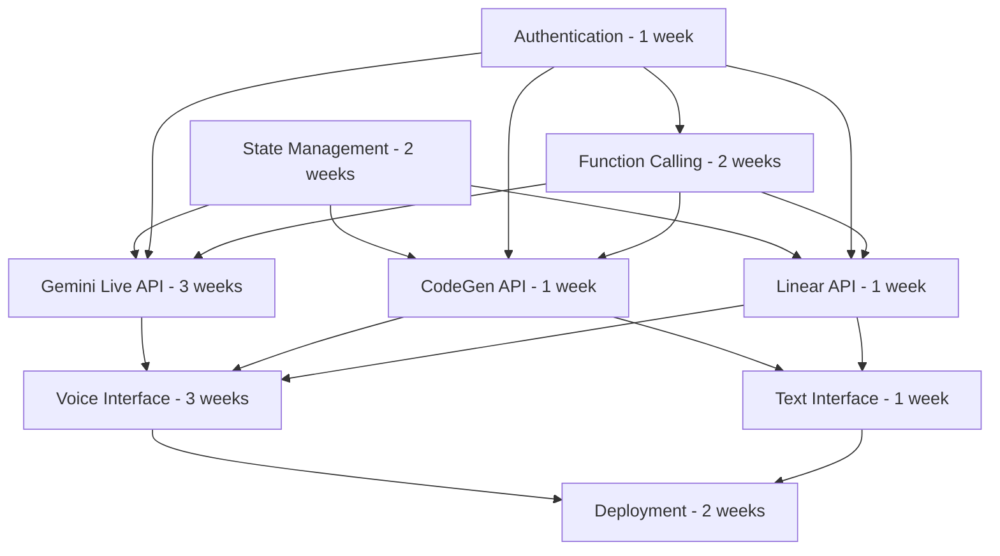

# 🔬 TECHNICAL DEEP DIVE ANALYSIS: PR #63 Workplans

## Overview
This document provides a detailed technical analysis of each workplan, focusing on implementation feasibility, technical accuracy, and critical gaps that could impact the 24-hour delivery timeline.

---

## 🏗️ WORKPLAN 01: STATE MANAGEMENT WITH DURABLE OBJECTS

### Critical Technical Issues

#### 1. **Durable Objects Memory Limitations**
**Issue**: The workplan doesn't address the 128MB memory limit per Durable Object instance.

**Impact**: With conversation history, project context, and voice state, memory usage could easily exceed limits.

**Missing Implementation**:
```typescript
interface MemoryOptimizedState {
  // Hot data (frequently accessed)
  activeConversation: ConversationMessage[];
  currentSession: UserSession;
  
  // Cold data (archived to external storage)
  conversationHistory: ExternalStorageRef;
  projectArchive: ExternalStorageRef;
  
  // Memory management
  memoryUsage: number;
  compressionEnabled: boolean;
  archivalThreshold: number;
}
```

#### 2. **Hibernation Handling for Voice Sessions**
**Issue**: No strategy for handling Durable Object hibernation during active voice conversations.

**Impact**: Voice sessions could be interrupted by hibernation, breaking user experience.

**Required Implementation**:
```typescript
interface VoiceSessionManager {
  preventHibernation(): void;
  handleWakeup(lastState: SerializedState): Promise<void>;
  gracefulHibernation(): Promise<SerializedState>;
  heartbeatInterval: number;
}
```

#### 3. **Cross-Object Coordination**
**Issue**: No patterns for coordinating state across multiple Durable Objects.

**Impact**: User sessions spanning multiple projects could have consistency issues.

**Missing Patterns**:
- Distributed locking mechanisms
- Event sourcing for state synchronization
- Conflict resolution strategies

### Performance Analysis
- **Read Latency**: Claimed < 10ms is optimistic for complex state objects
- **Write Latency**: < 50ms achievable but requires optimization
- **Memory Efficiency**: No compression or archival strategy specified

---

## 🔐 WORKPLAN 02: AUTHENTICATION & SECURITY

### Strengths
- Comprehensive OAuth 2.0 implementation
- Good API key rotation strategy
- Proper security event logging

### Minor Technical Gaps

#### 1. **Rate Limiting Implementation**
**Issue**: Rate limiting strategy lacks technical details.

**Required Specification**:
```typescript
interface RateLimitConfig {
  windowSize: number; // seconds
  maxRequests: number;
  burstAllowance: number;
  backoffStrategy: 'exponential' | 'linear';
  whitelistPatterns: string[];
}
```

#### 2. **Session Management in Durable Objects**
**Issue**: No clear strategy for session state in distributed environment.

**Required Implementation**:
- Session replication across edge locations
- Session invalidation propagation
- Concurrent session handling

### Security Assessment: ✅ **GOOD**

---

## ⚙️ WORKPLAN 03: FUNCTION CALLING FRAMEWORK

### Critical Technical Issues

#### 1. **Circuit Breaker Implementation**
**Issue**: Circuit breaker pattern mentioned but not implemented.

**Impact**: API failures could cascade without proper isolation.

**Required Implementation**:
```typescript
class CircuitBreaker {
  private state: 'closed' | 'open' | 'half-open' = 'closed';
  private failureCount = 0;
  private lastFailureTime?: Date;
  private successCount = 0;
  
  async execute<T>(operation: () => Promise<T>): Promise<T> {
    if (this.state === 'open') {
      if (this.shouldAttemptReset()) {
        this.state = 'half-open';
      } else {
        throw new Error('Circuit breaker is open');
      }
    }
    
    try {
      const result = await operation();
      this.onSuccess();
      return result;
    } catch (error) {
      this.onFailure();
      throw error;
    }
  }
  
  private shouldAttemptReset(): boolean {
    return this.lastFailureTime && 
           Date.now() - this.lastFailureTime.getTime() > this.resetTimeout;
  }
}
```

#### 2. **Response Aggregation Complexity**
**Issue**: Multi-API response aggregation underspecified.

**Impact**: Complex workflows involving multiple APIs could fail or produce inconsistent results.

**Missing Specifications**:
- Partial failure handling
- Response timeout coordination
- Data consistency across APIs

#### 3. **Function Metadata Caching**
**Issue**: No caching strategy for function registry.

**Impact**: Function discovery could become a bottleneck.

**Required Implementation**:
```typescript
interface FunctionCache {
  ttl: number;
  maxSize: number;
  evictionPolicy: 'lru' | 'lfu' | 'ttl';
  warmupStrategy: 'eager' | 'lazy';
}
```

### Performance Analysis
- **Function Call Latency**: < 200ms achievable with caching
- **Orchestration Latency**: < 2s challenging for complex workflows
- **Error Recovery**: < 500ms requires optimized circuit breaker

---

## 🤖 WORKPLAN 04: CODEGEN API INTEGRATION

### Technical Assessment: ⚠️ **MODERATE**

#### Strengths
- Good API client architecture
- Comprehensive error handling
- Well-defined TypeScript interfaces

#### Technical Gaps

#### 1. **Rate Limiting Coordination**
**Issue**: No strategy for coordinating rate limits across multiple users.

**Required Implementation**:
```typescript
interface RateLimitCoordinator {
  getUserQuota(userId: string): Promise<QuotaInfo>;
  reserveQuota(userId: string, cost: number): Promise<boolean>;
  releaseQuota(userId: string, cost: number): void;
  getGlobalQuota(): Promise<QuotaInfo>;
}
```

#### 2. **WebSocket Integration**
**Issue**: Real-time updates mentioned but not implemented.

**Impact**: Users won't get live progress updates during code generation.

### Effort Estimate
- **Claimed**: 3-4 days
- **Realistic**: 1-2 weeks (including WebSocket implementation)

---

## 📋 WORKPLAN 05: LINEAR API INTEGRATION

### Technical Assessment: ✅ **GOOD**

#### Strengths
- Excellent GraphQL client design
- Good query optimization strategy
- Comprehensive error handling
- Well-structured caching approach

#### Minor Issues
- Subscription management could be more detailed
- Offline handling strategy missing

### Effort Estimate
- **Claimed**: 3-4 days
- **Realistic**: 1 week (most accurate estimate in all workplans)

---

## 🎙️ WORKPLAN 06: GEMINI LIVE API INTEGRATION

### Critical Technical Issues

#### 1. **WebSocket Connection Management**
**Issue**: No detailed WebSocket lifecycle management.

**Impact**: Audio streaming could be unreliable with connection drops.

**Required Implementation**:
```typescript
class AudioWebSocketManager {
  private connection?: WebSocket;
  private reconnectAttempts = 0;
  private maxReconnectAttempts = 5;
  private reconnectDelay = 1000;
  
  async connect(): Promise<void> {
    this.connection = new WebSocket(this.endpoint);
    this.setupEventHandlers();
    await this.waitForConnection();
  }
  
  private setupEventHandlers(): void {
    this.connection!.onopen = this.handleOpen.bind(this);
    this.connection!.onmessage = this.handleMessage.bind(this);
    this.connection!.onclose = this.handleClose.bind(this);
    this.connection!.onerror = this.handleError.bind(this);
  }
  
  private async handleClose(event: CloseEvent): Promise<void> {
    if (this.shouldReconnect(event)) {
      await this.reconnect();
    }
  }
  
  private shouldReconnect(event: CloseEvent): boolean {
    return event.code !== 1000 && // Normal closure
           this.reconnectAttempts < this.maxReconnectAttempts;
  }
}
```

#### 2. **Audio Buffer Management**
**Issue**: No audio buffering strategy for real-time processing.

**Impact**: Audio could be choppy or have significant latency.

**Required Implementation**:
```typescript
interface AudioBufferManager {
  bufferSize: number;
  sampleRate: number;
  channels: number;
  
  addAudioChunk(chunk: ArrayBuffer): void;
  getProcessedAudio(): ArrayBuffer | null;
  clearBuffer(): void;
  getBufferLevel(): number;
}
```

#### 3. **Latency Optimization**
**Issue**: No strategy for minimizing audio processing latency.

**Required Specifications**:
- Audio chunk size optimization
- Predictive buffering
- Quality adaptation based on latency

### Performance Analysis
- **WebSocket Latency**: Highly dependent on implementation quality
- **Audio Processing**: Requires specialized optimization
- **Error Recovery**: Critical for user experience

### Effort Estimate
- **Claimed**: 4-5 days
- **Realistic**: 2-3 weeks (most complex workplan)

---

## 🎤 WORKPLAN 07: VOICE INTERFACE

### Critical Technical Issues

#### 1. **Audio Processing Pipeline**
**Issue**: No detailed audio processing workflow.

**Impact**: Poor audio quality and user experience.

**Required Implementation**:
```typescript
interface AudioProcessingPipeline {
  // Input processing
  noiseReduction: NoiseReductionConfig;
  echoCancellation: EchoCancellationConfig;
  gainControl: AutomaticGainControl;
  
  // Voice Activity Detection
  vadThreshold: number;
  vadSensitivity: number;
  
  // Output processing
  speechSynthesis: SpeechSynthesisConfig;
  audioEnhancement: AudioEnhancementConfig;
}
```

#### 2. **Voice Activity Detection (VAD)**
**Issue**: VAD implementation not specified.

**Impact**: System won't know when user is speaking vs. silent.

**Required Implementation**:
```typescript
class VoiceActivityDetector {
  private threshold: number;
  private windowSize: number;
  private smoothingFactor: number;
  
  detectActivity(audioBuffer: Float32Array): boolean {
    const energy = this.calculateEnergy(audioBuffer);
    const smoothedEnergy = this.smoothEnergy(energy);
    return smoothedEnergy > this.threshold;
  }
  
  private calculateEnergy(buffer: Float32Array): number {
    return buffer.reduce((sum, sample) => sum + sample * sample, 0) / buffer.length;
  }
}
```

#### 3. **Echo Cancellation**
**Issue**: No acoustic echo cancellation strategy.

**Impact**: Audio feedback loops in voice conversations.

### Performance Analysis
- **Audio Latency**: Critical for real-time interaction
- **Processing Overhead**: Could impact overall system performance
- **Quality Adaptation**: Essential for varying network conditions

### Effort Estimate
- **Claimed**: 4-5 days
- **Realistic**: 2-3 weeks (requires audio processing expertise)

---

## 💬 WORKPLAN 08: TEXT INTERFACE

### Technical Assessment: ✅ **GOOD**

#### Strengths
- Well-defined scope and requirements
- Good integration patterns
- Realistic implementation approach

#### Minor Issues
- Rich text formatting could be more detailed
- Offline message handling strategy missing

### Effort Estimate
- **Claimed**: 2-3 days
- **Realistic**: 1 week (reasonable estimate)

---

## ☁️ WORKPLAN 09: CLOUDFLARE DEPLOYMENT

### Technical Issues

#### 1. **DevOps Complexity Underestimated**
**Issue**: CI/CD pipeline implementation underspecified.

**Required Implementation**:
```typescript
interface DeploymentPipeline {
  stages: DeploymentStage[];
  rollbackStrategy: RollbackConfig;
  healthChecks: HealthCheckConfig[];
  monitoringIntegration: MonitoringConfig;
}
```

#### 2. **Performance Monitoring**
**Issue**: Observability strategy lacks detail.

**Required Specifications**:
- Custom metrics collection
- Distributed tracing
- Error aggregation
- Performance alerting

### Effort Estimate
- **Claimed**: 3-4 days
- **Realistic**: 1-2 weeks (including proper DevOps setup)

---

## 🎯 CRITICAL PATH ANALYSIS

### Implementation Dependencies


### Critical Path: **12 weeks minimum**
1. State Management + Authentication (parallel): 2 weeks
2. Function Calling Framework: 2 weeks
3. Gemini Live API + Voice Interface: 6 weeks
4. Integration + Deployment: 2 weeks

---

## 📊 RISK ASSESSMENT

### High-Risk Components
1. **Gemini Live API Integration** (🔴 High Risk)
   - WebSocket complexity
   - Audio processing requirements
   - Real-time performance needs

2. **Voice Interface** (🔴 High Risk)
   - Audio pipeline complexity
   - Browser compatibility issues
   - Latency optimization challenges

3. **State Management** (🟡 Medium Risk)
   - Durable Objects learning curve
   - Memory management complexity
   - Cross-object coordination

### Mitigation Strategies
1. **Prototype Critical Components First**
   - Build WebSocket audio streaming proof-of-concept
   - Test Durable Objects performance characteristics
   - Validate voice processing pipeline

2. **Incremental Implementation**
   - Start with text-only interface
   - Add voice features incrementally
   - Implement fallback mechanisms

3. **Expert Consultation**
   - Engage Cloudflare Workers specialists
   - Consult WebRTC/audio processing experts
   - Review architecture with experienced teams

---

## 🏁 CONCLUSION

The workplans provide **excellent documentation structure** but suffer from **significant technical depth gaps** and **unrealistic timeline estimates**. The most critical issues are:

1. **Timeline**: 24 hours → 12+ weeks realistic
2. **Technical Depth**: Missing critical implementation details
3. **Risk Assessment**: High-risk components underestimated
4. **Resource Requirements**: Specialized skills needed

**Recommendation**: **Major revision required** before implementation begins.

