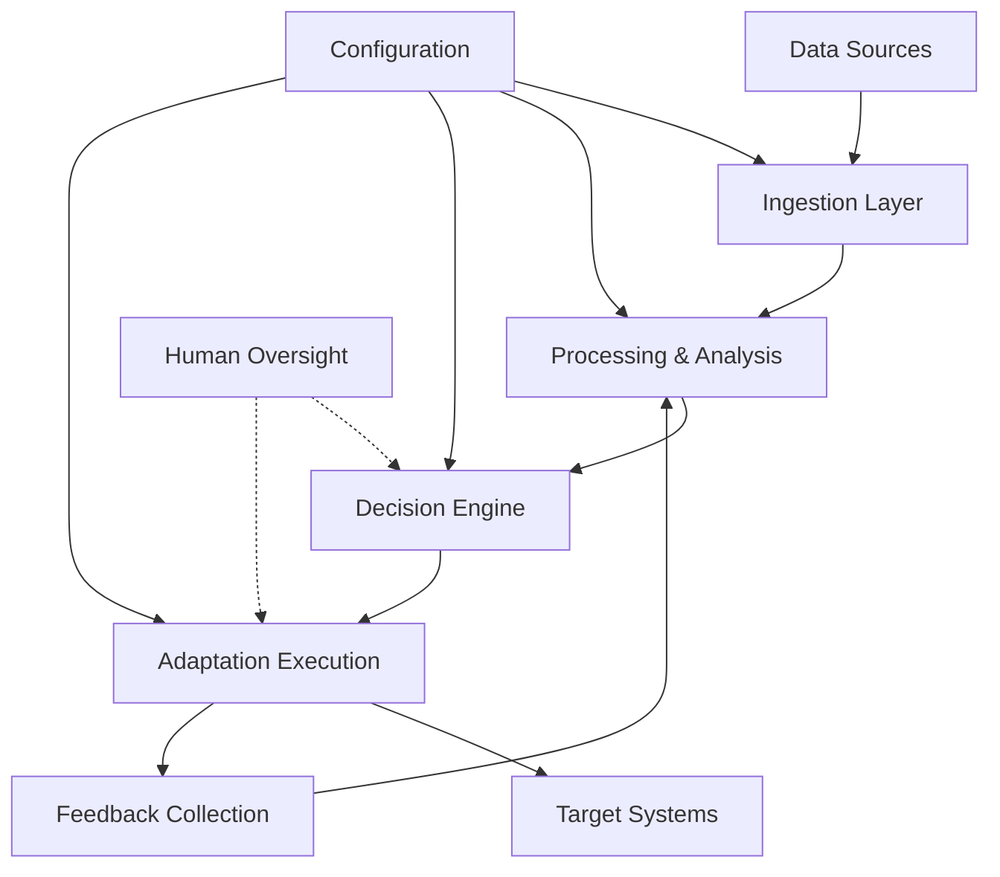

# System Architecture

## Overview

The Autonomous AI Innovation Monitoring & Adaptation System is designed as a multi-layered, event-driven architecture that can operate with minimal human intervention while maintaining high reliability and adaptability.

## Architectural Principles

1. **Autonomy First**: Every component must be capable of self-operation and graceful degradation
2. **Event-Driven**: Loose coupling through event streams enables scalability and fault tolerance
3. **Layered Responsibility**: Clear separation of concerns across monitoring, analysis, and adaptation layers
4. **Adaptive Meta-Architecture**: The system can modify its own monitoring and adaptation strategies

## Core Architecture Layers

### 1. Data Ingestion Layer

**Purpose**: Collect information from diverse AI innovation sources

**Components**:
- **Source Adapters**: Standardized interfaces for different data sources
- **Rate Limiting**: Respect API limits and avoid overwhelming sources
- **Data Normalization**: Convert diverse formats into unified schema
- **Quality Filtering**: Remove noise and validate data integrity

**Data Sources**:
- Research Papers (ArXiv, Google Scholar, PubMed)
- Industry News (TechCrunch, VentureBeat, Wired)
- Code Repositories (GitHub, GitLab trending)
- Patent Databases (USPTO, WIPO)
- Economic Indicators (Federal Reserve, World Bank)
- Social Media (Twitter, Reddit, LinkedIn)
- Conference Proceedings (NeurIPS, ICML, ICLR)
- Regulatory Updates (SEC, EU AI Act)

### 2. Processing & Analysis Layer

**Purpose**: Transform raw data into actionable intelligence

**Components**:
- **Trend Detection Engine**: Identify emerging patterns and anomalies
- **Impact Assessment Module**: Evaluate potential effects on existing systems
- **Threat Classification**: Categorize innovations by risk level and urgency
- **Correlation Analysis**: Find relationships between different innovation signals

**Algorithms**:
- Time series analysis for trend detection
- Natural language processing for content analysis
- Graph neural networks for relationship mapping
- Anomaly detection for identifying breakthrough innovations

### 3. Decision Engine Layer

**Purpose**: Determine appropriate responses to detected innovations

**Components**:
- **Rule Engine**: Codified decision logic for common scenarios
- **Machine Learning Models**: Adaptive decision making for complex cases
- **Risk Assessment**: Evaluate potential consequences of actions/inactions
- **Priority Queue**: Manage multiple concurrent adaptation needs

**Decision Criteria**:
- Innovation significance score
- System impact assessment
- Implementation complexity
- Resource requirements
- Risk tolerance thresholds

### 4. Adaptation Execution Layer

**Purpose**: Implement system changes based on decisions

**Components**:
- **Change Orchestrator**: Coordinate multi-system adaptations
- **Rollback Manager**: Safely revert changes if needed
- **Testing Framework**: Validate adaptations before full deployment
- **Monitoring Integration**: Track adaptation effectiveness

**Adaptation Types**:
- Infrastructure scaling and optimization
- Security policy updates
- API version management
- Dependency updates
- Performance tuning
- Cost optimization
- Compliance adjustments

### 5. Feedback & Learning Layer

**Purpose**: Continuously improve system performance

**Components**:
- **Outcome Tracking**: Monitor results of adaptations
- **Model Retraining**: Update ML models based on new data
- **Strategy Evolution**: Refine decision rules and thresholds
- **Performance Analytics**: Measure system effectiveness

## Data Flow Architecture

## Event-Driven Communication

### Event Types

1. **Innovation Events**: New AI developments detected
2. **Threat Events**: Potential risks identified
3. **Adaptation Events**: System changes initiated/completed
4. **Alert Events**: Human intervention required
5. **Metric Events**: Performance and health data

### Event Bus Architecture

- **Apache Kafka**: Primary event streaming platform
- **Event Schemas**: Standardized event formats using Avro
- **Dead Letter Queues**: Handle failed event processing
- **Event Replay**: Reprocess events for debugging/recovery

## Scalability Design

### Horizontal Scaling

- **Microservices**: Independent scaling of components
- **Container Orchestration**: Kubernetes for deployment management
- **Load Balancing**: Distribute processing across instances
- **Auto-scaling**: Dynamic resource allocation based on load

### Data Scaling

- **Partitioned Storage**: Distribute data across multiple nodes
- **Caching Layers**: Redis for frequently accessed data
- **Data Archival**: Move old data to cold storage
- **Compression**: Reduce storage requirements

## Security Architecture

### Data Protection

- **Encryption**: At rest and in transit
- **Access Controls**: Role-based permissions
- **API Security**: Rate limiting and authentication
- **Audit Logging**: Track all system access and changes

### System Security

- **Network Isolation**: Separate environments for different components
- **Secrets Management**: Secure storage of API keys and credentials
- **Vulnerability Scanning**: Regular security assessments
- **Incident Response**: Automated threat detection and response

## Reliability & Fault Tolerance

### High Availability

- **Redundancy**: Multiple instances of critical components
- **Health Checks**: Continuous monitoring of component status
- **Circuit Breakers**: Prevent cascade failures
- **Graceful Degradation**: Maintain core functionality during partial failures

### Data Consistency

- **Event Sourcing**: Maintain complete audit trail
- **CQRS**: Separate read and write models for optimization
- **Eventual Consistency**: Accept temporary inconsistencies for availability
- **Conflict Resolution**: Handle concurrent updates gracefully

## Monitoring & Observability

### System Metrics

- **Performance**: Latency, throughput, resource utilization
- **Reliability**: Error rates, availability, recovery times
- **Business**: Innovation detection rate, adaptation success rate
- **Cost**: Resource consumption, operational expenses

### Logging & Tracing

- **Structured Logging**: Consistent log format across components
- **Distributed Tracing**: Track requests across service boundaries
- **Log Aggregation**: Centralized log collection and analysis
- **Alerting**: Proactive notification of issues

## Configuration Management

### Environment Configuration

- **Infrastructure as Code**: Terraform for resource provisioning
- **Configuration as Code**: Version-controlled configuration files
- **Environment Promotion**: Consistent deployment across environments
- **Feature Flags**: Dynamic feature enablement without deployment

### Adaptive Configuration

- **Dynamic Thresholds**: Automatically adjust based on system performance
- **A/B Testing**: Compare different configuration strategies
- **Rollback Capability**: Quickly revert problematic configurations
- **Configuration Validation**: Prevent invalid configurations from being deployed

## Integration Points

### External Systems

- **APIs**: RESTful and GraphQL interfaces for external integration
- **Webhooks**: Real-time notifications to external systems
- **Message Queues**: Asynchronous communication with other systems
- **Database Connectors**: Direct integration with existing databases

### Human Interfaces

- **Dashboard**: Real-time visualization of system status
- **Alert System**: Notifications for critical events
- **Configuration UI**: Web interface for system configuration
- **Reporting**: Automated generation of status reports

This architecture provides the foundation for an autonomous system that can continuously monitor AI innovations and adapt existing systems with minimal human intervention while maintaining high reliability and performance.

