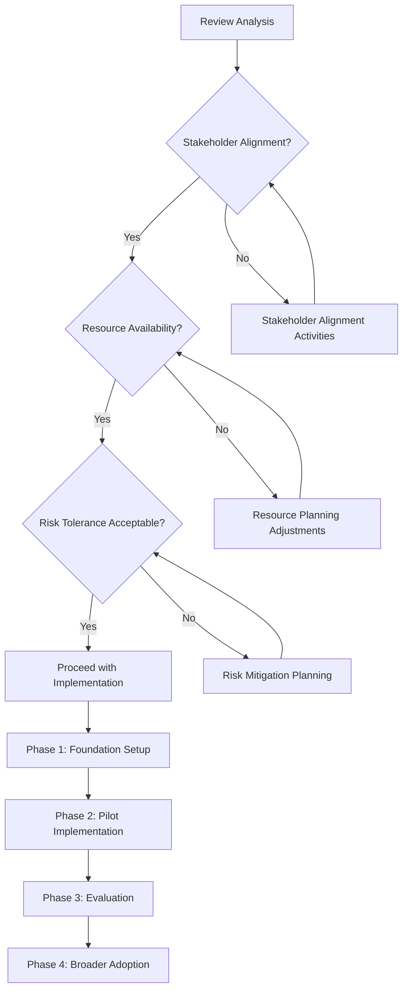

# RedwoodSDK Workplan Impact Analysis

## Overview

This directory contains a comprehensive analysis of the impact of RedwoodSDK adoption on the current Helaix workplan and development strategy. The analysis provides detailed recommendations for implementing RedwoodSDK while minimizing disruption to existing projects and maximizing long-term benefits.

## Analysis Components

### 📋 [Workplan Impact Analysis](./workplan-impact-analysis.md)
The main analysis document providing:
- Current project portfolio assessment
- RedwoodSDK implementation impact evaluation
- Strategic implementation options comparison
- Recommended approach with detailed justification
- Risk assessment and mitigation strategies
- Success metrics and monitoring framework

### 🗺️ [Implementation Roadmap](./implementation-roadmap.md)
Detailed timeline and milestone structure including:
- Phase-by-phase implementation plan
- Resource allocation by phase
- Success criteria and deliverables
- Gantt chart visualization
- Risk mitigation timelines

### 💰 [Resource Allocation Analysis](./resource-allocation-analysis.md)
Comprehensive resource and cost analysis covering:
- Current resource baseline assessment
- Detailed resource requirements by phase
- ROI analysis and payback calculations
- Alternative implementation scenarios
- Resource optimization strategies

### ⚠️ [Risk Assessment and Mitigation](./risk-assessment-mitigation.md)
Thorough risk management framework including:
- Detailed risk identification and scoring
- Mitigation strategies for each risk category
- Contingency planning and response protocols
- Monitoring and escalation procedures
- Success metrics for risk management

### 📝 [Workplan Impact Template](./workplan-impact-template.md)
Reusable template for future workplan impact analyses

## Key Findings and Recommendations

### Executive Summary

**Recommended Strategy**: **Incremental Parallel Adoption** with Sparkflow as the primary pilot project

**Key Benefits**:
- 20-30% improvement in development velocity
- Enhanced scalability through Cloudflare edge computing
- Modern React Server Components architecture
- Reduced infrastructure costs
- Improved developer experience

**Investment Required**: $297,000 over 32 weeks
**Expected ROI**: 142-212% over 3 years
**Payback Period**: 11.5-14.9 months

### Strategic Approach

1. **Phase 1 (Weeks 1-4)**: Foundation and team training
2. **Phase 2 (Weeks 5-12)**: Pilot implementation with Sparkflow
3. **Phase 3 (Weeks 13-16)**: Evaluation and expansion planning
4. **Phase 4 (Weeks 17-32)**: Broader adoption across suitable projects

### Project Prioritization

| Priority | Project | RedwoodSDK Fit | Implementation Timeline |
|----------|---------|----------------|------------------------|
| **High** | Sparkflow | Excellent | Weeks 5-12 (Pilot) |
| **Medium** | Livestore | Excellent | Weeks 17-20 |
| **Low** | DSTyS | Good | Future consideration |
| **Evaluate** | Fathom Downloader | Moderate | Post-completion assessment |

### Risk Management

**Key Risks Identified**:
- Learning curve steeper than expected (Medium risk)
- React Server Components integration complexity (Medium risk)
- Resource allocation conflicts (Medium risk)
- Timeline delays (Medium risk)

**Mitigation Strategies**:
- Extended training programs with mentorship
- Incremental implementation approach
- Resource buffers and flexible planning
- Proactive monitoring and early warning systems

## Implementation Guidelines

### Getting Started

1. **Review the main analysis**: Start with [workplan-impact-analysis.md](./workplan-impact-analysis.md)
2. **Understand the timeline**: Review [implementation-roadmap.md](./implementation-roadmap.md)
3. **Assess resource requirements**: Examine [resource-allocation-analysis.md](./resource-allocation-analysis.md)
4. **Plan risk management**: Study [risk-assessment-mitigation.md](./risk-assessment-mitigation.md)

### Decision Framework

Use this framework to evaluate the recommendations:

### Success Criteria

The implementation will be considered successful if:

- [ ] Pilot implementation completed within timeline and budget
- [ ] 20% improvement in development velocity achieved
- [ ] Team satisfaction scores >80%
- [ ] No critical delays to existing projects
- [ ] ROI targets met or exceeded
- [ ] Risk mitigation strategies prove effective

## Integration with Other Research

This analysis integrates with and builds upon:

- **Pattern Analysis (HNTSMN-749)**: Understanding of RedwoodSDK capabilities and requirements
- **Application Assessment (HNTSMN-750)**: Specific implementation complexity and benefits for each application
- **Parent Issue (HLX-1725)**: Overall strategy for leveraging RedwoodSDK examples in applications

## Next Steps

### Immediate Actions (Next 7 days)
1. Review and approve the analysis recommendations
2. Secure stakeholder alignment and resource commitments
3. Identify and assign pilot team members
4. Begin environment setup and initial planning

### Short-term Actions (Next 30 days)
1. Complete team training and skill development
2. Begin pilot implementation with Sparkflow
3. Establish monitoring and reporting processes
4. Create detailed project plans for subsequent phases

### Long-term Actions (Next 90 days)
1. Complete pilot evaluation and lessons learned
2. Plan and begin broader adoption across suitable projects
3. Establish RedwoodSDK as standard development framework
4. Measure and report on ROI and success metrics

## Document Maintenance

- **Created**: May 23, 2025
- **Last Updated**: May 23, 2025
- **Next Review**: June 23, 2025
- **Owner**: Development Team Lead
- **Stakeholders**: Engineering Management, Product Team, Executive Leadership

## Questions and Support

For questions about this analysis or implementation support:

1. **Technical Questions**: Contact the RedwoodSDK pilot team
2. **Resource Questions**: Contact Development Manager
3. **Strategic Questions**: Contact Engineering Leadership
4. **Risk Concerns**: Contact Project Management Office

---

*This analysis represents a comprehensive evaluation of RedwoodSDK adoption impact and provides a roadmap for successful implementation while maintaining current project momentum and maximizing long-term value.*

