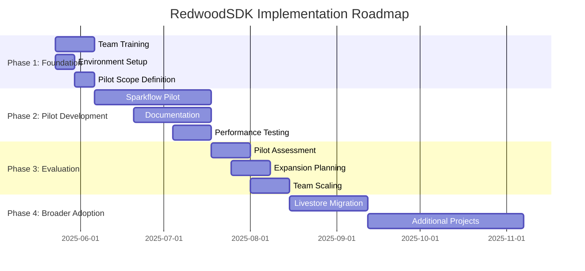

# RedwoodSDK Implementation Roadmap

## Overview
This roadmap provides a detailed timeline and milestone structure for implementing RedwoodSDK across the Helaix project portfolio, based on the Parallel Pilot Implementation strategy.

## Timeline Overview

## Phase 1: Foundation and Setup (Weeks 1-4)

### Week 1: Environment and Team Setup
**Objectives**: Establish foundation for RedwoodSDK development

**Key Activities**:
- [ ] **Day 1-2**: Team selection and role assignment
  - Assign 2 senior developers to RedwoodSDK pilot team
  - Define responsibilities and communication channels
  - Set up project tracking and reporting structure

- [ ] **Day 3-5**: Development environment setup
  - Install RedwoodSDK development tools
  - Configure Cloudflare Workers development environment
  - Set up local development with Miniflare
  - Establish CI/CD pipeline for RedwoodSDK projects

**Deliverables**:
- Configured development environments
- Team assignments and communication plan
- Initial project structure

### Week 2: Training Foundation
**Objectives**: Build core RedwoodSDK knowledge

**Key Activities**:
- [ ] **RedwoodSDK Fundamentals Training** (16 hours)
  - Framework architecture and philosophy
  - Request/response paradigm
  - File-based routing system
  - Server functions and middleware

- [ ] **React Server Components Deep Dive** (12 hours)
  - Server vs. client components
  - Streaming and suspense
  - Data fetching patterns
  - Performance optimization

**Deliverables**:
- Trained pilot team
- Training materials and documentation
- Knowledge assessment results

### Week 3: Cloudflare Platform Training
**Objectives**: Master Cloudflare integration capabilities

**Key Activities**:
- [ ] **Cloudflare Workers Advanced Training** (8 hours)
  - Workers runtime and limitations
  - Durable Objects for state management
  - Edge computing patterns

- [ ] **Cloudflare Services Integration** (8 hours)
  - D1 database integration
  - R2 storage patterns
  - Queues and AI services
  - KV storage optimization

**Deliverables**:
- Cloudflare expertise certification
- Integration pattern documentation
- Performance benchmarking setup

### Week 4: Pilot Project Planning
**Objectives**: Define and scope the Sparkflow pilot implementation

**Key Activities**:
- [ ] **Sparkflow Analysis** (2 days)
  - Current architecture assessment
  - Component identification for migration
  - Dependency mapping
  - Performance baseline establishment

- [ ] **Pilot Scope Definition** (2 days)
  - Select specific Sparkflow features for RedwoodSDK implementation
  - Define success criteria and metrics
  - Create detailed implementation plan
  - Establish testing and validation approach

- [ ] **Risk Assessment and Mitigation** (1 day)
  - Identify potential technical challenges
  - Plan fallback strategies
  - Define escalation procedures

**Deliverables**:
- Detailed pilot implementation plan
- Success criteria and metrics definition
- Risk mitigation strategies
- Technical architecture design

## Phase 2: Pilot Development and Learning (Weeks 5-12)

### Weeks 5-6: Initial Implementation
**Objectives**: Begin RedwoodSDK implementation in Sparkflow

**Key Activities**:
- [ ] **Core Framework Setup**
  - Initialize RedwoodSDK project structure
  - Configure routing and middleware
  - Set up database connections (D1)
  - Implement basic authentication patterns

- [ ] **First Component Migration**
  - Select low-risk Sparkflow component
  - Implement using RedwoodSDK patterns
  - Add comprehensive testing
  - Document implementation decisions

**Deliverables**:
- Working RedwoodSDK foundation
- First migrated component
- Initial performance metrics
- Implementation documentation

### Weeks 7-8: Feature Development
**Objectives**: Implement core Sparkflow features using RedwoodSDK

**Key Activities**:
- [ ] **Server Components Implementation**
  - Convert existing React components to Server Components
  - Implement data fetching with server functions
  - Optimize for streaming and performance
  - Add error boundaries and loading states

- [ ] **API Integration**
  - Migrate existing API endpoints to server functions
  - Implement middleware for authentication and validation
  - Add rate limiting and security measures
  - Optimize for edge computing

**Deliverables**:
- Core feature implementations
- API migration completion
- Security and performance optimizations
- Updated documentation

### Weeks 9-10: Advanced Features and Optimization
**Objectives**: Implement advanced RedwoodSDK features and optimize performance

**Key Activities**:
- [ ] **Real-time Features**
  - Implement WebSocket connections
  - Add real-time data streaming
  - Optimize for edge computing
  - Test scalability and performance

- [ ] **Storage and Caching**
  - Implement R2 storage integration
  - Add intelligent caching strategies
  - Optimize asset delivery
  - Implement offline capabilities

**Deliverables**:
- Advanced feature implementations
- Performance optimization results
- Scalability testing reports
- Best practices documentation

### Weeks 11-12: Testing and Refinement
**Objectives**: Comprehensive testing and refinement of pilot implementation

**Key Activities**:
- [ ] **Comprehensive Testing**
  - Unit and integration testing
  - Performance and load testing
  - Security testing and validation
  - User acceptance testing

- [ ] **Documentation and Knowledge Transfer**
  - Complete implementation documentation
  - Create developer guides and tutorials
  - Document lessons learned and best practices
  - Prepare knowledge transfer materials

**Deliverables**:
- Fully tested pilot implementation
- Comprehensive documentation
- Performance benchmarks
- Knowledge transfer materials

## Phase 3: Evaluation and Expansion Planning (Weeks 13-16)

### Week 13: Pilot Evaluation
**Objectives**: Comprehensive assessment of pilot success

**Key Activities**:
- [ ] **Performance Analysis**
  - Compare performance metrics with baseline
  - Analyze development velocity improvements
  - Assess resource utilization efficiency
  - Evaluate user experience improvements

- [ ] **Technical Assessment**
  - Code quality and maintainability review
  - Architecture and scalability assessment
  - Security and compliance validation
  - Integration complexity evaluation

**Deliverables**:
- Pilot evaluation report
- Performance comparison analysis
- Technical assessment results
- Recommendations for improvement

### Week 14: Team and Process Evaluation
**Objectives**: Assess team adaptation and process effectiveness

**Key Activities**:
- [ ] **Team Feedback Collection**
  - Developer experience surveys
  - Productivity and satisfaction assessment
  - Learning curve analysis
  - Tool and process evaluation

- [ ] **Process Optimization**
  - Development workflow refinement
  - CI/CD pipeline optimization
  - Documentation and training improvements
  - Communication and collaboration enhancement

**Deliverables**:
- Team feedback analysis
- Process optimization recommendations
- Updated development workflows
- Training program refinements

### Week 15: Expansion Strategy Development
**Objectives**: Plan broader RedwoodSDK adoption across projects

**Key Activities**:
- [ ] **Project Prioritization**
  - Assess remaining projects for RedwoodSDK fit
  - Prioritize based on business value and technical feasibility
  - Define migration strategies for each project
  - Estimate resource requirements and timelines

- [ ] **Resource Planning**
  - Plan team scaling and training
  - Define skill development requirements
  - Allocate resources for expansion phases
  - Identify external support needs

**Deliverables**:
- Expansion strategy document
- Project prioritization matrix
- Resource allocation plan
- Timeline for broader adoption

### Week 16: Implementation Planning
**Objectives**: Finalize plans for broader RedwoodSDK adoption

**Key Activities**:
- [ ] **Detailed Implementation Plans**
  - Create specific plans for each project
  - Define milestones and success criteria
  - Plan resource allocation and timelines
  - Identify dependencies and risks

- [ ] **Stakeholder Alignment**
  - Present expansion plans to management
  - Align with business objectives and priorities
  - Secure resource commitments
  - Establish governance and oversight

**Deliverables**:
- Detailed implementation plans
- Stakeholder approval and commitment
- Resource allocation agreements
- Governance framework

## Phase 4: Broader Adoption (Weeks 17-32)

### Weeks 17-20: Livestore Migration
**Objectives**: Implement RedwoodSDK in Livestore project

**Key Activities**:
- [ ] **Architecture Design**
  - Design RedwoodSDK architecture for Livestore
  - Plan data migration and integration
  - Define API and service interfaces
  - Establish testing and validation approach

- [ ] **Implementation**
  - Implement core Livestore features using RedwoodSDK
  - Migrate existing functionality
  - Add new features leveraging RedwoodSDK capabilities
  - Comprehensive testing and validation

**Deliverables**:
- Livestore RedwoodSDK implementation
- Migration completion
- Performance validation
- Documentation updates

### Weeks 21-24: Additional Project Migrations
**Objectives**: Extend RedwoodSDK adoption to other suitable projects

**Key Activities**:
- [ ] **Project-Specific Implementations**
  - Assess and plan migrations for remaining projects
  - Implement RedwoodSDK solutions
  - Optimize for each project's specific requirements
  - Validate performance and functionality

- [ ] **Knowledge Scaling**
  - Train additional team members
  - Expand RedwoodSDK expertise across the team
  - Establish centers of excellence
  - Create mentorship and support systems

**Deliverables**:
- Additional project implementations
- Expanded team expertise
- Knowledge sharing systems
- Support and mentorship programs

### Weeks 25-28: Optimization and Standardization
**Objectives**: Optimize implementations and establish standards

**Key Activities**:
- [ ] **Performance Optimization**
  - Optimize all RedwoodSDK implementations
  - Establish performance monitoring
  - Implement automated optimization
  - Create performance benchmarking

- [ ] **Standardization**
  - Establish RedwoodSDK development standards
  - Create reusable components and patterns
  - Implement automated quality checks
  - Document best practices and guidelines

**Deliverables**:
- Optimized implementations
- Development standards and guidelines
- Reusable component library
- Quality assurance framework

### Weeks 29-32: Consolidation and Future Planning
**Objectives**: Consolidate gains and plan future evolution

**Key Activities**:
- [ ] **Consolidation**
  - Consolidate learnings and best practices
  - Optimize resource allocation
  - Establish long-term maintenance plans
  - Create sustainability frameworks

- [ ] **Future Planning**
  - Plan for RedwoodSDK ecosystem evolution
  - Identify opportunities for innovation
  - Establish continuous improvement processes
  - Plan for technology roadmap alignment

**Deliverables**:
- Consolidated implementation
- Long-term maintenance plans
- Future evolution roadmap
- Continuous improvement framework

## Success Metrics and Milestones

### Phase 1 Success Criteria
- [ ] 100% team training completion
- [ ] Functional development environment
- [ ] Approved pilot implementation plan
- [ ] Risk mitigation strategies in place

### Phase 2 Success Criteria
- [ ] Working RedwoodSDK pilot implementation
- [ ] 20% improvement in development velocity
- [ ] Performance benchmarks met or exceeded
- [ ] Comprehensive documentation completed

### Phase 3 Success Criteria
- [ ] Positive pilot evaluation results
- [ ] Team satisfaction scores >80%
- [ ] Approved expansion strategy
- [ ] Resource commitments secured

### Phase 4 Success Criteria
- [ ] Successful migration of target projects
- [ ] Team-wide RedwoodSDK proficiency
- [ ] Established development standards
- [ ] Sustainable long-term framework

## Risk Mitigation and Contingency Plans

### Technical Risks
- **Mitigation**: Maintain fallback options for critical functionality
- **Contingency**: Gradual rollback procedures if issues arise

### Resource Risks
- **Mitigation**: Cross-training and knowledge sharing
- **Contingency**: External consultant support if needed

### Timeline Risks
- **Mitigation**: Buffer time in all phases
- **Contingency**: Scope adjustment and priority rebalancing

## Communication and Reporting

### Weekly Reports
- Progress against milestones
- Resource utilization
- Risk and issue status
- Next week priorities

### Monthly Reviews
- Comprehensive progress assessment
- Stakeholder updates
- Strategy adjustments
- Resource reallocation decisions

### Quarterly Assessments
- Strategic alignment review
- Long-term planning updates
- Technology roadmap alignment
- Investment and ROI analysis

