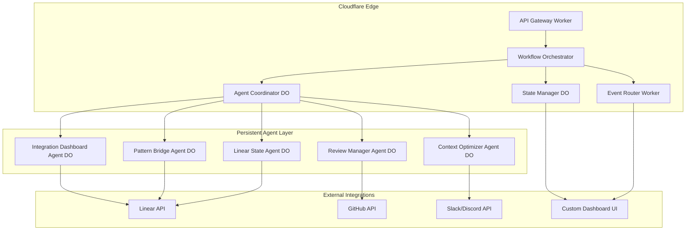

# Enhanced Multi-Agent Workflow System

A sophisticated multi-agent coordination platform built on Cloudflare Workers and Durable Objects, designed to automate and optimize complex workflows with intelligent agent collaboration.

## 🏗️ Architecture Overview



## 🚀 Features

### Phase 2: Persistent Agent Infrastructure ✅
- **Base Agent Framework**: Durable Object foundation with state persistence
- **Agent Lifecycle Management**: Spawn, pause, resume, terminate operations
- **Inter-Agent Communication**: Message-based coordination protocol
- **Workflow Orchestration**: Central coordination with dynamic task distribution
- **Event-Driven Architecture**: Real-time webhook processing and routing

### Phase 3: Advanced Automation (In Progress)
- **Intelligent Review Management**: Automated assignment and SLA enforcement
- **Context Switching Optimization**: AI-powered productivity enhancement
- **Pattern Application Engine**: ML-based workflow optimization

### Phase 4: Advanced Intelligence (Planned)
- **Predictive Analytics**: Real-time bottleneck identification
- **Self-Optimizing Workflows**: Continuous improvement automation
- **Advanced Integration Ecosystem**: Multi-platform coordination

## 🛠️ Technology Stack

- **Runtime**: Cloudflare Workers (V8 Isolates)
- **State Management**: Durable Objects
- **Storage**: KV (config), R2 (logs), Analytics Engine (metrics)
- **Language**: TypeScript
- **Build Tool**: Wrangler CLI

## 📦 Project Structure

```
cloudflare-workers/
├── src/
│   ├── agents/
│   │   ├── base-agent.ts           # Base agent Durable Object
│   │   ├── agent-coordinator.ts    # Central coordination logic
│   │   ├── integration-dashboard.ts # Dashboard agent
│   │   ├── review-manager.ts       # Review automation
│   │   ├── context-optimizer.ts    # Context switching optimization
│   │   ├── pattern-bridge.ts       # Pattern application
│   │   └── linear-state.ts         # Linear integration
│   ├── workers/
│   │   ├── api-gateway.ts          # Request routing
│   │   └── event-router.ts         # Event processing
│   ├── utils/
│   │   ├── crypto.ts               # Signature validation
│   │   ├── metrics.ts              # Analytics helpers
│   │   └── storage.ts              # Storage utilities
│   ├── types/
│   │   └── index.ts                # TypeScript definitions
│   └── index.ts                    # Main worker entry point
├── wrangler.toml                   # Cloudflare configuration
├── package.json                    # Dependencies
└── tsconfig.json                   # TypeScript config
```

## 🚀 Quick Start

### Prerequisites
- Node.js 18+
- Cloudflare account
- Wrangler CLI installed

### Installation

```bash
cd cloudflare-workers
npm install
```

### Development

```bash
# Start local development server
npm run dev

# Deploy to staging
wrangler deploy --env staging

# Deploy to production
wrangler deploy --env production
```

### Configuration

1. **Environment Variables**: Set in `wrangler.toml` or via Wrangler CLI
   ```bash
   wrangler secret put LINEAR_API_KEY
   wrangler secret put GITHUB_TOKEN
   wrangler secret put SLACK_TOKEN
   ```

2. **KV Namespaces**: Create and bind storage namespaces
   ```bash
   wrangler kv:namespace create "CONFIG_KV"
   wrangler kv:namespace create "CONFIG_KV" --preview
   ```

3. **R2 Buckets**: Create storage for logs and analytics
   ```bash
   wrangler r2 bucket create workflow-logs
   ```

## 📡 API Reference

### Workflow Management

#### Create Workflow
```http
POST /api/workflows/create
Content-Type: application/json

{
  "name": "Code Review Workflow",
  "description": "Automated code review process",
  "priority": "high",
  "context": {
    "userId": "user123",
    "githubRepoId": "repo456",
    "tags": ["code-review", "automation"]
  }
}
```

#### Get Workflow Status
```http
GET /api/workflows/status/{workflowId}
```

#### Terminate Workflow
```http
POST /api/workflows/terminate/{workflowId}
```

### Agent Management

#### Spawn Agent
```http
POST /api/agents/spawn
Content-Type: application/json

{
  "type": "review-manager",
  "workflowId": "workflow123",
  "config": {
    "maxConcurrentTasks": 5,
    "timeoutMs": 300000
  }
}
```

#### Get Agent Status
```http
GET /api/agents/status/{agentId}
```

#### Get Agent Health
```http
GET /api/agents/health/{agentId}
```

### Webhooks

#### GitHub Webhook
```http
POST /api/webhooks/github
X-Hub-Signature-256: sha256=...
Content-Type: application/json

{
  "action": "opened",
  "pull_request": { ... }
}
```

#### Linear Webhook
```http
POST /api/webhooks/linear
Content-Type: application/json

{
  "action": "create",
  "data": { ... }
}
```

### System Health

#### Health Check
```http
GET /api/health
```

Response:
```json
{
  "status": "healthy",
  "timestamp": 1640995200000,
  "version": "1.0.0",
  "environment": "production",
  "components": {
    "coordinator": "healthy",
    "agents": "healthy",
    "storage": "healthy"
  }
}
```

## 🤖 Agent Types

### Integration Dashboard Agent
- **Purpose**: Centralized workflow monitoring and coordination
- **Capabilities**: Status aggregation, progress tracking, bottleneck detection
- **Triggers**: Workflow events, status updates, manual requests

### Review Manager Agent
- **Purpose**: Automated code review management
- **Capabilities**: Reviewer assignment, SLA enforcement, quality analysis
- **Triggers**: PR events, review timeouts, escalation conditions

### Context Optimizer Agent
- **Purpose**: Minimize context switching and optimize productivity
- **Capabilities**: Task clustering, time-blocking, context preservation
- **Triggers**: Task assignments, schedule changes, productivity patterns

### Pattern Bridge Agent
- **Purpose**: Apply and evolve workflow patterns
- **Capabilities**: Pattern matching, effectiveness tracking, adaptation
- **Triggers**: Workflow completion, pattern opportunities, performance data

### Linear State Agent
- **Purpose**: Synchronize with Linear project management
- **Capabilities**: Issue tracking, status updates, progress reporting
- **Triggers**: Linear webhooks, workflow events, status changes

## 📊 Monitoring & Analytics

### Metrics Collection
- **Execution Time**: Task and workflow duration tracking
- **Error Rates**: Failure analysis and retry patterns
- **Agent Utilization**: Resource usage and load balancing
- **Throughput**: Task completion rates and bottlenecks

### Logging
- **Structured Logs**: JSON format with correlation IDs
- **Log Levels**: Error, warn, info, debug
- **Storage**: R2 bucket with automatic rotation
- **Retention**: 30 days for debug, 90 days for errors

### Alerting
- **Health Checks**: Automated monitoring of agent health
- **Performance Thresholds**: SLA violation detection
- **Error Patterns**: Anomaly detection and escalation
- **Resource Limits**: Usage monitoring and scaling alerts

## 🔒 Security

### Authentication
- **API Keys**: Service-to-service authentication
- **Webhook Signatures**: HMAC validation for external events
- **CORS**: Configurable cross-origin policies

### Authorization
- **Role-Based Access**: Agent capability restrictions
- **Resource Isolation**: Workflow and tenant separation
- **Audit Logging**: Complete action tracking

### Data Protection
- **Encryption**: At-rest and in-transit encryption
- **PII Handling**: Minimal data collection and retention
- **Compliance**: GDPR and SOC2 considerations

## 🚀 Deployment

### Infrastructure Requirements
- **Cloudflare Workers**: 10-20 worker scripts
- **Durable Objects**: 5-10 DO classes with auto-scaling
- **KV Storage**: Configuration and caching (10GB)
- **R2 Storage**: Logs and analytics (100GB)
- **Analytics Engine**: Performance metrics (unlimited)

### Scaling Considerations
- **Geographic Distribution**: Edge deployment for low latency
- **Auto-scaling**: Dynamic resource allocation based on load
- **Fault Tolerance**: Multi-region redundancy and recovery
- **Performance**: Sub-100ms response times globally

### Cost Estimation
- **Workers**: ~$50-100/month (10M requests)
- **Durable Objects**: ~$100-200/month (1M requests, 10GB storage)
- **Storage & Analytics**: ~$50-100/month (100GB R2, metrics)
- **Total**: ~$200-400/month for production workload

## 🧪 Testing

### Unit Tests
```bash
npm test
```

### Integration Tests
```bash
npm run test:integration
```

### Load Testing
```bash
npm run test:load
```

## 📚 Documentation

- [Architecture Decision Records](./docs/adr/)
- [Agent Development Guide](./docs/agents.md)
- [Deployment Guide](./docs/deployment.md)
- [API Documentation](./docs/api.md)
- [Troubleshooting Guide](./docs/troubleshooting.md)

## 🤝 Contributing

1. Fork the repository
2. Create a feature branch
3. Make your changes
4. Add tests
5. Submit a pull request

## 📄 License

MIT License - see [LICENSE](LICENSE) file for details.

## 🆘 Support

- **Issues**: GitHub Issues for bug reports and feature requests
- **Discussions**: GitHub Discussions for questions and ideas
- **Documentation**: Comprehensive guides and API reference
- **Community**: Discord server for real-time support

---

**Status**: 🚧 Phase 2 Implementation in Progress
**Version**: 1.0.0-alpha
**Last Updated**: 2024-01-01

