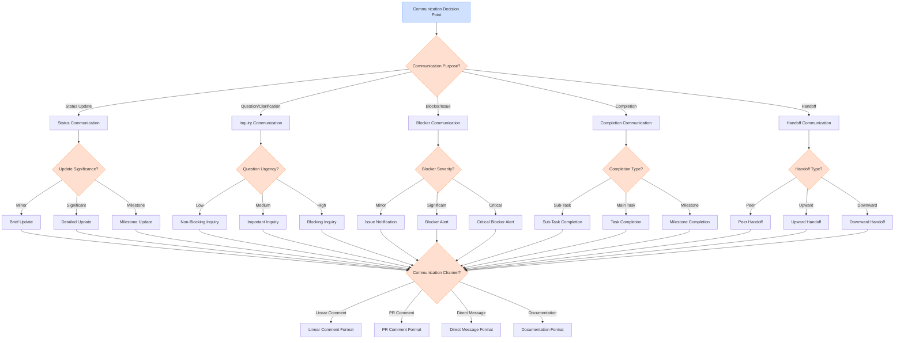

# Communication Decision Tree

## Overview

This document provides a structured decision tree for effective communication strategies within Linear workflows. Communication is a critical component of successful task execution, and this decision tree guides agents through key decision points in the communication process. It offers clear criteria for determining when, how, and what to communicate during different phases of a Linear workflow.

## Visual Representation



## Decision Criteria

### Communication Purpose Determination

The first decision point is determining the primary purpose of the communication:

| Criteria | Status Update | Question/Clarification | Blocker/Issue | Completion | Handoff |
|----------|--------------|------------------------|--------------|-----------|---------|
| Timing | Regular intervals or progress points | When information is needed | When obstacles arise | When work is completed | When transferring responsibility |
| Intent | Inform about progress | Obtain information or guidance | Alert about obstacles | Report completion | Transfer ownership |
| Expected Response | Acknowledgment | Answer or clarification | Assistance or guidance | Approval or feedback | Acceptance |
| Urgency | Usually low to medium | Varies based on impact | Medium to high | Low to medium | Medium |

**Example Decision Process:**

For a situation where you've made significant progress but encountered an unexpected behavior:
1. The primary purpose is to seek guidance on the unexpected behavior
2. You need information to proceed
3. You're expecting a specific answer or direction
4. Decision: This is an Inquiry Communication (Question/Clarification)

### Status Update Significance

When providing a status update, determine its significance:

| Criteria | Brief Update | Detailed Update | Milestone Update |
|----------|-------------|----------------|------------------|
| Progress | Minor progress or routine work | Significant progress or completed components | Major milestone achieved |
| Impact | Minimal impact on timeline | Notable impact on timeline | Substantial impact on timeline |
| Audience Interest | Low, informational only | Medium, shows meaningful progress | High, represents key achievement |
| Frequency | More frequent, routine | Less frequent, substantial | Infrequent, major points only |
| Detail Level | Minimal details | Moderate details with specifics | Comprehensive details with implications |

**Example Decision Process:**

For an update where you've completed the core functionality of a feature:
1. This represents significant progress
2. It has a notable impact on the timeline
3. It's of medium interest to stakeholders
4. Decision: This is a Detailed Update

### Question/Clarification Urgency

When asking questions or seeking clarification, determine the urgency:

| Criteria | Non-Blocking Inquiry | Important Inquiry | Blocking Inquiry |
|----------|---------------------|-------------------|------------------|
| Impact on Progress | Can continue working while waiting | Slows progress but not stopped | Cannot proceed without answer |
| Timeline Effect | Minimal delay | Moderate delay | Significant delay |
| Decision Importance | Minor decision or preference | Important decision | Critical decision |
| Alternatives | Multiple viable alternatives exist | Limited alternatives exist | No viable alternatives without guidance |
| Response Timeframe | Within days is acceptable | Within hours is preferred | Immediate response needed |

**Example Decision Process:**

For a question about which authentication method to implement:
1. This affects a core component of the system
2. You cannot proceed with implementation without this decision
3. There are multiple options but no clear default
4. Decision: This is a Blocking Inquiry

### Blocker/Issue Severity

When communicating about blockers or issues, determine the severity:

| Criteria | Issue Notification | Blocker Alert | Critical Blocker Alert |
|----------|-------------------|--------------|------------------------|
| Impact on Progress | Slows progress | Stops specific components | Halts entire task |
| Workaround Availability | Viable workarounds exist | Limited workarounds exist | No workarounds available |
| Timeline Impact | Minor delay | Moderate delay | Major delay |
| Resolution Complexity | Simple resolution likely | Moderate resolution complexity | Complex resolution required |
| Stakeholder Concern | Low stakeholder concern | Medium stakeholder concern | High stakeholder concern |

**Example Decision Process:**

For a situation where an external API is down and preventing testing:
1. This stops a specific component (testing)
2. There are no immediate workarounds
3. It will cause a moderate delay
4. Decision: This is a Blocker Alert

### Completion Type

When communicating about completed work, determine the completion type:

| Criteria | Sub-Task Completion | Task Completion | Milestone Completion |
|----------|---------------------|----------------|----------------------|
| Scope | Individual component or sub-task | Complete task or feature | Major project phase or deliverable |
| Next Steps | Continues to next sub-task | Moves to new task | Transitions to new project phase |
| Stakeholder Interest | Limited to immediate team | Team and direct stakeholders | Broad stakeholder interest |
| Celebration Level | Minimal acknowledgment | Moderate recognition | Significant achievement |
| Documentation Needs | Basic documentation | Complete documentation | Comprehensive documentation with summary |

**Example Decision Process:**

For completing the implementation of a new feature:
1. This represents a complete task or feature
2. It will move work to a new task
3. It's of interest to the team and direct stakeholders
4. Decision: This is a Task Completion

### Handoff Type

When transferring responsibility, determine the handoff type:

| Criteria | Peer Handoff | Upward Handoff | Downward Handoff |
|----------|-------------|---------------|------------------|
| Direction | Between peers at same level | From sub-agent to parent agent | From parent agent to sub-agent |
| Authority Change | Lateral transfer | Returning authority | Delegating authority |
| Context Needed | Detailed context for continuation | Summary context with key decisions | Comprehensive context for execution |
| Expectations | Continuation of work | Review and integration | Implementation of specifications |
| Follow-up | Collaborative follow-up | Approval or feedback | Progress updates |

**Example Decision Process:**

For transferring completed research to a parent agent:
1. This is moving from a sub-agent to a parent agent
2. It's returning authority after completing assigned work
3. It requires summary context with key findings
4. Decision: This is an Upward Handoff

### Communication Channel Selection

After determining the purpose and specifics, select the appropriate channel:

| Criteria | Linear Comment | PR Comment | Direct Message | Documentation |
|----------|---------------|------------|----------------|---------------|
| Visibility | Task-specific visibility | Code-specific visibility | Private communication | Persistent reference |
| Formality | Semi-formal | Technical focus | Informal | Formal |
| Persistence | Medium persistence | Tied to code changes | Low persistence | High persistence |
| Audience | Task stakeholders | Code reviewers | Specific individuals | All stakeholders |
| Content Type | Task updates and discussions | Code-specific feedback | Quick questions and coordination | Comprehensive information |

**Example Decision Process:**

For communicating the completion of a feature implementation:
1. This should be visible to all task stakeholders
2. It's related to the overall task, not just code
3. It should be persisted with the task
4. Decision: Use a Linear Comment

## Detailed Explanation of Decision Criteria

### Status Update Communication

#### Brief Update

Use brief updates when:
- Making routine progress that follows the expected plan
- Completing minor tasks or sub-tasks
- Following up on previous communications
- Providing regular check-ins without significant news

Brief updates should be concise, focusing only on what has been done and what's next. They maintain communication flow without requiring significant attention.

**Format Example:**
```
Quick update: Completed the input validation functions and started work on the error handling. No issues encountered so far. Will continue with error handling tomorrow.
```

#### Detailed Update

Use detailed updates when:
- Completing significant components or features
- Making progress that affects the timeline or approach
- Encountering interesting (but not blocking) challenges
- Reaching decision points that stakeholders should be aware of

Detailed updates should provide specific information about what was accomplished, how it was done, any challenges encountered, and implications for the overall task.

**Format Example:**
```
Progress Update: Completed the user authentication system implementation.

Key accomplishments:
- Implemented JWT-based authentication
- Added password hashing with bcrypt
- Created login/logout endpoints
- Added session management

Challenges addressed:
- Resolved token expiration edge case
- Optimized database queries for session validation

Next steps:
- Implement role-based authorization
- Add multi-factor authentication support
```

#### Milestone Update

Use milestone updates when:
- Completing major project phases or deliverables
- Reaching significant project milestones
- Achieving results that substantially impact the project
- Completing work that enables other critical paths

Milestone updates should be comprehensive, summarizing the achievement, its significance, and its implications for the project. They often include metrics, demonstrations, or evidence of completion.

**Format Example:**
```
🎉 MILESTONE ACHIEVED: Backend API Complete 🎉

I'm pleased to report that the entire backend API has been completed, tested, and documented. This represents the completion of Phase 1 of the project.

Key deliverables:
1. 15 API endpoints implemented and tested
2. Authentication and authorization system
3. Database integration with optimization
4. Comprehensive API documentation
5. 95% test coverage achieved

Impact:
- Frontend development can now proceed with a stable API
- Performance metrics exceed requirements by 20%
- All critical path features are implemented

Next phase:
- Frontend implementation will begin tomorrow
- API monitoring will be set up by end of week
- Performance testing will continue in parallel

Demo: [Link to API demonstration]
Documentation: [Link to API docs]
```

### Question/Clarification Communication

#### Non-Blocking Inquiry

Use non-blocking inquiries when:
- Seeking preferences or minor decisions
- Asking about future considerations while working on current tasks
- Gathering information that will be needed later
- Clarifying non-critical aspects of the task

Non-blocking inquiries should be clear about their low urgency and should explicitly state that work is continuing while waiting for a response.

**Format Example:**
```
Non-blocking question: For the user profile page, would you prefer to include the user's activity history directly on the profile or in a separate tab? I'm currently working on the core profile information and can implement either approach when I get to that component.
```

#### Important Inquiry

Use important inquiries when:
- Needing information to make significant decisions
- Facing a choice between different implementation approaches
- Requiring clarification that will substantially affect the work
- Seeking guidance that will impact quality or performance

Important inquiries should clearly explain the options being considered, the implications of each, and any recommendation you might have.

**Format Example:**
```
Important question: I need guidance on the data storage approach for user preferences.

Options:
1. Store in database (pros: persistent, consistent; cons: slower access, more complex)
2. Store in local storage (pros: faster access, simpler; cons: device-specific, less secure)
3. Hybrid approach (critical preferences in DB, UI preferences in local storage)

My recommendation is option 3 for the best balance of performance and consistency, but I wanted to confirm before proceeding. This will affect how I structure the preferences management system I'm currently working on.
```

#### Blocking Inquiry

Use blocking inquiries when:
- Unable to proceed without specific information
- Facing a critical decision with significant implications
- Encountering requirements that appear contradictory
- Needing authorization for a major change in approach

Blocking inquiries should clearly communicate the blocker, why it's preventing progress, the options available (if any), and the requested decision or information.

**Format Example:**
```
🚫 BLOCKING QUESTION - Cannot proceed without clarification 🚫

The requirement to "support all modern browsers" conflicts with the requirement to "use WebGPU for rendering." WebGPU is currently only supported in Chrome and Edge, not in Firefox or Safari.

Options:
1. Limit browser support to Chrome and Edge only
2. Create a fallback rendering system for Firefox and Safari (adds ~1 week to timeline)
3. Postpone WebGPU implementation until broader browser support exists

I cannot proceed with the rendering system implementation until this decision is made, as it fundamentally affects the architecture. Please advise on the preferred approach.
```

### Blocker/Issue Communication

#### Issue Notification

Use issue notifications when:
- Encountering minor problems that slow progress
- Identifying potential risks that need monitoring
- Discovering inconsistencies that need attention
- Facing challenges that you can work around

Issue notifications should describe the problem, its current impact, the workaround being used, and any potential future implications.

**Format Example:**
```
Issue Note: The third-party API we're using for geocoding is responding slowly (3-5 second response times vs. expected 1 second). I've implemented caching to mitigate the impact, but we should monitor this as it could affect user experience if it persists. Work is continuing with the caching solution in place.
```

#### Blocker Alert

Use blocker alerts when:
- Encountering significant problems that stop specific components
- Facing issues that require external assistance to resolve
- Discovering problems that will cause moderate delays
- Identifying issues that require stakeholder decisions

Blocker alerts should clearly describe the problem, its impact, attempted solutions, and the assistance or decisions needed to proceed.

**Format Example:**
```
🚧 BLOCKER ALERT: Database Migration Issue 🚧

Issue: The database migration script fails when running against the staging database due to unexpected data formats in legacy records.

Impact:
- Cannot complete the data migration task
- Blocking deployment to staging environment
- Estimated delay: 1-2 days

Attempted solutions:
- Modified migration script to handle common format variations
- Attempted manual cleanup of problematic records
- Consulted database logs for error patterns

Assistance needed:
- Need access to database backup from before the last schema change
- Require guidance on handling legacy data formats
- Decision on whether to skip problematic records or implement full conversion

I'll continue investigating alternative approaches while waiting for assistance.
```

#### Critical Blocker Alert

Use critical blocker alerts when:
- Encountering severe problems that halt the entire task
- Discovering issues that threaten project success
- Facing blockers with major timeline implications
- Identifying problems requiring immediate stakeholder intervention

Critical blocker alerts should comprehensively describe the problem, its severe impact, all attempted solutions, and the specific intervention needed, with clear urgency indicators.

**Format Example:**
```
🔴 CRITICAL BLOCKER - IMMEDIATE ATTENTION REQUIRED 🔴

Critical Issue: Production API authentication service is rejecting our development credentials, preventing any testing or integration work.

Severe Impact:
- All development and testing completely halted
- Cannot proceed with any aspect of the implementation
- Project timeline at risk (each day blocked adds a day to delivery)
- Team of 3 developers currently blocked

Attempted Solutions:
- Verified credentials are correct and properly configured
- Attempted to generate new development credentials
- Contacted API provider through standard support channels (no response after 4 hours)
- Tried alternative authentication methods (all rejected)

Urgent Assistance Required:
- Need emergency contact with API provider's technical team
- Require alternative testing environment or credentials
- Decision on whether to mock the API temporarily (would reduce test fidelity)

This is the critical path for the project and requires immediate resolution to avoid significant delays.
```

## Examples Illustrating the Decision Process

### Example 1: Feature Implementation Progress

**Scenario:** You've completed the core functionality of a user management system but encountered an issue with role permissions.

**Communication Decision Process:**
1. **Purpose:**
   - You're providing an update on progress
   - You've completed significant work
   - You've encountered an issue
   - Decision: This is both a Status Update and Issue Notification

2. **Status Significance:**
   - Completing core functionality is significant progress
   - It impacts the timeline positively
   - Stakeholders would be interested
   - Decision: This is a Detailed Update

3. **Issue Severity:**
   - The permissions issue slows but doesn't stop progress
   - You can work around it temporarily
   - It may cause minor delays
   - Decision: This is an Issue Notification

4. **Channel Selection:**
   - This update is relevant to all task stakeholders
   - It should be associated with the task record
   - Decision: Use a Linear Comment

5. **Final Communication:**
```
Progress Update: Completed core user management functionality

Key accomplishments:
- Implemented user creation, editing, and deletion
- Added user profile management
- Created user listing with filtering and sorting
- Implemented basic permission checks

Issue encountered: Role-based permissions are not correctly applying to nested resources. Users can access child resources even when parent resource access is restricted. I've implemented a temporary workaround by explicitly checking parent permissions, but we'll need a more robust solution.

Next steps:
- Implement proper hierarchical permission checking
- Add user groups functionality
- Complete audit logging for user actions

Timeline impact: On track for completion by Friday, assuming permission issue resolution within 2 days.
```

### Example 2: Critical Dependency Blocker

**Scenario:** An external authentication service required for your implementation is down with no ETA for restoration.

**Communication Decision Process:**
1. **Purpose:**
   - You're reporting an obstacle preventing progress
   - You need assistance or guidance
   - Decision: This is a Blocker Communication

2. **Blocker Severity:**
   - This completely prevents authentication implementation
   - No workarounds are available
   - It will cause significant delays
   - Decision: This is a Critical Blocker Alert

3. **Channel Selection:**
   - This requires immediate attention from stakeholders
   - It should be formally documented with the task
   - Decision: Use a Linear Comment with follow-up Direct Messages

4. **Final Communication:**
```
🔴 CRITICAL BLOCKER: Authentication Service Outage 🔴

Critical Issue: The external authentication service (Auth0) is experiencing a complete outage with no estimated restoration time provided.

Severe Impact:
- Cannot implement or test any authentication-related features
- Blocking all user management functionality development
- Project timeline at risk (authentication is on critical path)

Attempted Solutions:
- Confirmed outage on Auth0 status page and support channels
- Explored alternative authentication providers (require account setup and approval)
- Investigated temporary mock authentication (feasible but would require significant rework later)

Urgent Decisions Required:
1. Should we wait for Auth0 restoration if it extends beyond 24 hours?
2. Should we implement a temporary mock authentication system?
3. Should we explore emergency setup with an alternative provider?

Please advise on preferred approach. I'll continue exploring the mock authentication option while awaiting guidance.
```

## Recommendations for Different Scenarios

### For Regular Progress Communication

1. **When making steady progress:**
   - Provide brief updates at regular intervals
   - Focus on completed items and next steps
   - Keep a consistent format for easy tracking
   - Example: "Daily update: Completed 3 of 5 planned API endpoints. All tests passing. On track to finish remaining endpoints tomorrow."

2. **When reaching significant milestones:**
   - Use milestone updates with visual indicators (emojis, formatting)
   - Highlight the achievement and its significance
   - Include metrics or evidence of completion
   - Example: "🎉 MILESTONE: Frontend MVP Complete! All core user flows implemented and tested. Demo available at [link]. Ready for initial user testing."

### For Question and Clarification Requests

1. **When facing design decisions:**
   - Clearly present options with pros and cons
   - Indicate your recommendation if you have one
   - Specify the impact on timeline and quality
   - Example: "Design decision needed: For the dashboard layout, we can use either (1) a card-based design or (2) a tabular layout. Option 1 is more visual but shows less data, while Option 2 shows more data but is less visually appealing. I recommend Option 1 for better user experience, but wanted to confirm."

2. **When requirements are unclear:**
   - Specifically identify the ambiguous requirements
   - Propose interpretations and ask for confirmation
   - Explain why clarity is needed
   - Example: "Clarification needed: The requirement states 'implement reasonable rate limiting,' but doesn't specify limits. I propose 100 requests per minute per user. Is this aligned with expectations?"

### For Blocker and Issue Reporting

1. **When facing technical obstacles:**
   - Clearly describe the technical issue
   - Explain attempted solutions
   - Specify what assistance is needed
   - Example: "Technical blocker: The payment gateway integration is failing with error code 403. I've verified API keys and permissions, and consulted documentation. Need assistance from someone with previous experience with this gateway."

2. **When discovering requirement conflicts:**
   - Identify the specific conflicting requirements
   - Explain why they cannot both be satisfied
   - Propose potential resolutions
   - Example: "Requirement conflict: The requirement for 'real-time updates' conflicts with 'minimal network usage.' Real-time updates require frequent network calls. Proposed solutions: (1) Use WebSockets instead of polling, (2) Allow user to toggle update frequency, or (3) Prioritize one requirement over the other."

### For Completion Reporting

1. **When completing a task:**
   - Summarize what was accomplished
   - Link to relevant artifacts (PRs, documentation)
   - Highlight any notable aspects or learnings
   - Example: "✅ Task Complete: Implemented user authentication system. PR #123 contains all changes with comprehensive tests. Documentation updated in the wiki. Note: Found and fixed a related security issue in the session management system."

2. **When completing a delegated sub-task:**
   - Summarize the completed work
   - Explicitly state that it's ready for integration
   - Provide context for the parent task
   - Example: "Sub-task completed: Finished the data visualization component as requested. The component accepts the data format specified and renders all required chart types. Ready for integration into the main dashboard."

## Integration with Existing Documentation

This decision tree complements the existing documentation in the following ways:

- **Linear Workflows Reference Guide**: Provides context on the overall workflow in which communication occurs
- **Communication and Delegation SOPs**: Offers detailed guidance on communication protocols referenced in this decision tree
- **Task Analysis Decision Tree**: Helps determine the complexity and requirements that inform communication needs
- **Implementation Decision Tree**: Guides the implementation approach that will require specific communication strategies

## References

- [Linear Workflows Reference Guide](../reference/linear_workflows_reference.md)
- [Communication and Delegation SOPs](../reference/communication_delegation_sops.md)
- [Task Analysis Decision Tree](./task_analysis_decision_tree.md)
- [Implementation Decision Tree](./implementation_decision_tree.md)

