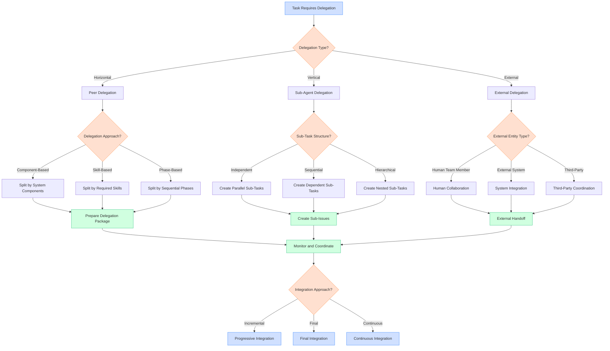

# Delegation Decision Tree

## Overview

This document provides a structured decision tree for effective task delegation within Linear workflows. Delegation is a critical skill for managing complex tasks, and this decision tree guides agents through key decision points in the delegation process. It offers clear criteria for determining when and how to delegate, how to structure sub-tasks, and how to manage the delegation process effectively.

## Visual Representation

## Decision Criteria

### Delegation Type Determination

The first decision point is determining the appropriate type of delegation:

| Criteria | Horizontal (Peer) | Vertical (Sub-Agent) | External |
|----------|------------------|---------------------|----------|
| Relationship | Delegation to peers at same level | Delegation to sub-agents | Delegation outside the agent system |
| Authority | Shared authority and responsibility | Parent-child authority structure | External authority boundaries |
| Communication | Direct peer-to-peer communication | Parent-child communication channels | Cross-boundary communication |
| Integration | Collaborative integration | Parent manages integration | Interface-based integration |
| Typical Use Case | Complex tasks requiring diverse skills | Breaking down large tasks into manageable pieces | Tasks requiring human input or external systems |

**Example Decision Process:**

For a task like "Implement a new authentication system":
1. The task is complex and requires breaking down into smaller pieces
2. The work can be managed within the agent system
3. A hierarchical structure would be beneficial for coordination
4. Decision: Use Vertical (Sub-Agent) Delegation

### Delegation Approach for Peer Delegation

When using horizontal (peer) delegation, determine the most appropriate approach:

| Criteria | Component-Based | Skill-Based | Phase-Based |
|----------|----------------|------------|------------|
| Primary Division | System components or modules | Required skills or expertise | Sequential phases of work |
| Interfaces | Clear component interfaces | Skill domain boundaries | Handoff points between phases |
| Dependencies | Minimal cross-component dependencies | Cross-skill collaboration needed | Strong sequential dependencies |
| Parallelization | High potential for parallel work | Moderate parallelization | Limited parallelization |
| Integration Complexity | Integration at component boundaries | Integration across skill domains | Integration at phase transitions |

**Example Decision Process:**

For a task like "Develop a new reporting dashboard":
1. The task involves distinct components (backend data processing, API, frontend visualization)
2. Each component requires different skills
3. Components have clear interfaces between them
4. Decision: Use Component-Based delegation approach

### Sub-Task Structure for Sub-Agent Delegation

When using vertical (sub-agent) delegation, determine the appropriate sub-task structure:

| Criteria | Independent | Sequential | Hierarchical |
|----------|------------|------------|--------------|
| Dependencies | Minimal dependencies between sub-tasks | Strong sequential dependencies | Complex nested dependencies |
| Parallelization | High potential for parallel execution | Limited parallelization | Mixed parallelization |
| Coordination Needs | Low coordination overhead | Coordination at handoff points | Ongoing coordination required |
| Integration Approach | Independent integration of components | Progressive integration as phases complete | Layered integration of nested components |
| Risk Distribution | Distributed risk across sub-tasks | Concentrated risk at critical path points | Hierarchical risk distribution |

**Example Decision Process:**

For a task like "Implement multi-factor authentication":
1. The task has several components with dependencies between them
2. Some components must be completed before others can start
3. There's a logical sequence to the implementation
4. Decision: Use Sequential sub-task structure

### Integration Approach Determination

After delegation, determine the most appropriate approach for integrating the work:

| Criteria | Progressive Integration | Final Integration | Continuous Integration |
|----------|------------------------|------------------|------------------------|
| Timing | Integration at key milestones | Integration after all sub-tasks complete | Ongoing integration throughout |
| Frequency | Periodic integration points | Single integration event | Frequent, regular integration |
| Risk Management | Early detection of integration issues | Comprehensive but delayed validation | Immediate feedback on integration issues |
| Overhead | Moderate integration overhead | High final integration effort | Distributed integration effort |
| Suitable For | Sequential dependencies | Independent components | Complex interdependencies |

**Example Decision Process:**

For a delegated task with multiple interdependent components:
1. The components have complex interactions
2. Early detection of integration issues is critical
3. Continuous feedback would benefit the development process
4. Decision: Use Continuous Integration approach

## Detailed Explanation of Decision Criteria

### Delegation Type Selection

#### Horizontal (Peer) Delegation

Use peer delegation when:
- The task requires diverse skills or perspectives
- Authority and responsibility can be shared equally
- Direct collaboration between delegates is beneficial
- The task can be divided into relatively independent parts

Peer delegation works best for complex tasks where different aspects can be handled by specialists working collaboratively, such as cross-functional feature development.

#### Vertical (Sub-Agent) Delegation

Use sub-agent delegation when:
- The task is large and needs to be broken down into manageable pieces
- A clear hierarchy of responsibility is beneficial
- The parent agent needs to maintain oversight and coordination
- The task fits within a parent-child relationship model

Vertical delegation is ideal for complex projects requiring structured coordination and clear lines of responsibility, such as developing a new system with multiple components.

#### External Delegation

Use external delegation when:
- The task requires human judgment or expertise
- Integration with external systems is needed
- The task falls outside the capabilities of the agent system
- Cross-boundary collaboration is necessary

External delegation is appropriate when tasks involve stakeholders outside the agent system or require capabilities not available within it.

### Delegation Approach Selection

#### Component-Based Delegation

Use component-based delegation when:
- The system has clear, distinct components
- Components have well-defined interfaces
- Different components require different expertise
- Components can be developed relatively independently

This approach works well for systems with modular architecture, such as full-stack applications with separate frontend, backend, and database components.

#### Skill-Based Delegation

Use skill-based delegation when:
- The task requires diverse specialized skills
- Skill domains are the natural division points
- Expertise is more important than component boundaries
- Cross-component work within skill domains is needed

This approach is effective for tasks requiring specialized expertise across components, such as security implementation or performance optimization.

#### Phase-Based Delegation

Use phase-based delegation when:
- The task has distinct sequential phases
- Each phase builds upon the previous one
- Different phases require different approaches
- Clear handoff points exist between phases

This approach works well for tasks with a natural progression, such as research → design → implementation → testing.

### Sub-Task Structure Selection

#### Independent Sub-Tasks

Use independent sub-tasks when:
- Sub-tasks can be completed in parallel
- Minimal dependencies exist between sub-tasks
- Each sub-task produces a distinct deliverable
- Integration happens primarily at the end

This structure maximizes parallelization and is ideal for tasks like implementing multiple independent features.

#### Sequential Sub-Tasks

Use sequential sub-tasks when:
- Strong dependencies exist between sub-tasks
- Each sub-task builds on the previous one
- A clear critical path exists
- Progressive validation is important

This structure is appropriate for tasks with inherent sequential dependencies, such as database schema changes followed by API updates followed by frontend implementation.

#### Hierarchical Sub-Tasks

Use hierarchical sub-tasks when:
- The task has complex nested components
- Some sub-tasks can be further broken down
- Multiple levels of coordination are needed
- Both parallel and sequential work is required

This structure works well for complex systems with nested components, such as implementing a feature that affects multiple layers of the application.

## Examples Illustrating the Decision Process

### Example 1: Full-Stack Feature Implementation

**Task:** "Implement user profile management system"

**Delegation Decision Process:**
1. **Delegation Type:**
   - Complex task requiring breaking down into smaller pieces
   - Benefits from hierarchical structure
   - Decision: Vertical (Sub-Agent) Delegation

2. **Sub-Task Structure:**
   - Natural component boundaries (database, API, frontend)
   - Some sequential dependencies (database before API)
   - Decision: Component-based with some sequential dependencies

3. **Sub-Tasks Created:**
   - Database schema design and implementation
   - API endpoint development
   - Frontend UI implementation
   - Integration and testing

4. **Integration Approach:**
   - Components have dependencies
   - Early feedback on integration is valuable
   - Decision: Progressive Integration at key milestones

### Example 2: Research and Documentation Project

**Task:** "Research and document best practices for Linear workflows"

**Delegation Decision Process:**
1. **Delegation Type:**
   - Task requires different research skills and perspectives
   - Equal authority and collaboration beneficial
   - Decision: Horizontal (Peer) Delegation

2. **Delegation Approach:**
   - Natural division by research phases
   - Each phase builds on previous findings
   - Decision: Phase-Based Delegation

3. **Phases Defined:**
   - Initial research and data gathering
   - Analysis and pattern identification
   - Best practices formulation
   - Documentation creation

4. **Integration Approach:**
   - Each phase produces outputs for the next
   - Comprehensive final document needed
   - Decision: Progressive Integration with Final Synthesis

## Recommendations for Different Scenarios

### For Complex Technical Implementations

1. **When the system has clear component boundaries:**
   - Use component-based delegation
   - Define clear interfaces between components
   - Establish integration points and protocols
   - Example: "For the e-commerce platform, delegate by components: product catalog, shopping cart, checkout, user accounts"

2. **When sequential development is necessary:**
   - Use phase-based delegation with sequential sub-tasks
   - Define clear completion criteria for each phase
   - Plan for progressive integration
   - Example: "For the authentication system, sequence the work: core authentication service → integration with user service → frontend implementation"

### For Research and Analysis Tasks

1. **When exploring multiple aspects of a topic:**
   - Use skill-based or component-based delegation
   - Assign different research areas to different agents
   - Plan for collaborative synthesis
   - Example: "For market research, delegate by segments: competitor analysis, user needs, technology trends, regulatory considerations"

2. **When building on existing knowledge:**
   - Use phase-based delegation
   - Structure research to build progressively
   - Incorporate feedback loops
   - Example: "For enhancing documentation, sequence the work: gap analysis → content creation → review and refinement → integration"

### For Cross-Functional Projects

1. **When working with human team members:**
   - Use external delegation with clear handoff points
   - Establish communication protocols
   - Define expectations and deliverables
   - Example: "For the design system implementation, coordinate with the design team for assets and specifications before implementation"

2. **When integrating with external systems:**
   - Use external delegation with interface definitions
   - Establish testing and validation procedures
   - Plan for contingencies
   - Example: "For the payment gateway integration, coordinate with the payment provider for API access and testing environments"

## Integration with Existing Documentation

This decision tree complements the existing documentation in the following ways:

- **Linear Workflows Reference Guide**: Provides context on the overall workflow in which delegation occurs
- **Communication and Delegation SOPs**: Offers detailed guidance on implementing the delegation approaches outlined in this decision tree
- **Task Analysis Decision Tree**: Helps determine when delegation is appropriate based on task analysis
- **Implementation Decision Tree**: Guides the implementation approach after delegation decisions are made

## References

- [Linear Workflows Reference Guide](../reference/linear_workflows_reference.md)
- [Communication and Delegation SOPs](../reference/communication_delegation_sops.md)
- [Task Analysis Decision Tree](./task_analysis_decision_tree.md)
- [Implementation Decision Tree](./implementation_decision_tree.md)

