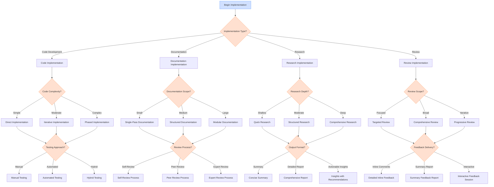

# Implementation Decision Tree

## Overview

This document provides a structured decision tree for selecting the most appropriate implementation approach when working on Linear issues. The implementation phase is where the actual work gets done, and choosing the right approach is critical for efficiency and quality. This decision tree guides agents through key decision points in the implementation process and provides criteria for making optimal choices.

## Visual Representation

## Decision Criteria

### Implementation Type Determination

The first decision point is determining the primary type of implementation required:

| Criteria | Code Development | Documentation | Research | Review |
|----------|-----------------|--------------|---------|--------|
| Primary Output | Functional code | Written documentation | Information and insights | Evaluation and feedback |
| Skills Required | Programming, testing | Writing, organization | Analysis, synthesis | Critical evaluation |
| Success Metrics | Functionality, performance | Clarity, completeness | Accuracy, relevance | Thoroughness, helpfulness |
| Tools Used | IDEs, version control | Markdown, documentation tools | Search tools, analysis frameworks | Code review tools, checklists |

**Example Decision Process:**

For a task like "Implement user authentication":
1. The primary output is functional code
2. Programming skills are required
3. Success is measured by functionality and security
4. Decision: This is a Code Implementation task

### Code Implementation Approach

For code implementation tasks, determine the appropriate approach based on complexity:

| Criteria | Direct Implementation | Iterative Implementation | Phased Implementation |
|----------|----------------------|--------------------------|----------------------|
| Complexity | Simple, straightforward | Moderate, some unknowns | Complex, many unknowns |
| Size | Small, focused changes | Medium-sized features | Large features or systems |
| Risk Level | Low risk | Moderate risk | High risk |
| Timeline | Short (hours) | Medium (days) | Long (weeks) |
| Feedback Needs | Minimal feedback needed | Regular feedback beneficial | Frequent feedback essential |

**Example Decision Process:**

For a task like "Implement user profile page":
1. Complexity: Moderate with some UI complexities
2. Size: Medium-sized feature affecting multiple components
3. Risk: Moderate with potential UX implications
4. Timeline: Expected to take a few days
5. Decision: Use Iterative Implementation approach

### Documentation Implementation Approach

For documentation tasks, determine the appropriate approach based on scope:

| Criteria | Single-Pass Documentation | Structured Documentation | Modular Documentation |
|----------|--------------------------|--------------------------|----------------------|
| Scope | Small, focused documents | Medium-sized documentation | Large documentation sets |
| Structure | Simple, linear structure | Organized with sections | Complex with multiple modules |
| Dependencies | Few or no dependencies | Some internal references | Many cross-references |
| Audience | Single audience | Primary audience with variations | Multiple distinct audiences |
| Maintenance | Low maintenance needs | Moderate maintenance needs | High maintenance needs |

**Example Decision Process:**

For a task like "Create API documentation":
1. Scope: Medium-sized documentation covering multiple endpoints
2. Structure: Organized with sections for each endpoint group
3. Dependencies: Some internal references between endpoints
4. Audience: Primarily developers with some variations
5. Decision: Use Structured Documentation approach

### Research Implementation Approach

For research tasks, determine the appropriate approach based on depth:

| Criteria | Quick Research | Structured Research | Comprehensive Research |
|----------|---------------|---------------------|------------------------|
| Depth | Surface-level information | Moderate depth | Deep, thorough investigation |
| Breadth | Narrow focus | Focused with context | Broad coverage |
| Time Investment | Hours | Days | Weeks |
| Sources | Few, readily available | Multiple, varied sources | Extensive, diverse sources |
| Analysis | Basic analysis | Moderate analysis | In-depth analysis |

**Example Decision Process:**

For a task like "Research authentication best practices":
1. Depth: Moderate depth needed to understand best practices
2. Breadth: Focused on authentication with security context
3. Time Investment: Expected to take a few days
4. Sources: Multiple sources needed for validation
5. Decision: Use Structured Research approach

### Review Implementation Approach

For review tasks, determine the appropriate approach based on scope:

| Criteria | Targeted Review | Comprehensive Review | Progressive Review |
|----------|----------------|----------------------|---------------------|
| Scope | Specific aspects or components | Entire system or document | Evolving implementation |
| Focus | Depth in specific areas | Breadth across all aspects | Both depth and breadth over time |
| Time Investment | Short, focused effort | Substantial time investment | Ongoing investment |
| Feedback Cycle | Single feedback cycle | Comprehensive feedback | Multiple feedback cycles |
| Context Needed | Minimal context | Extensive context | Growing context |

**Example Decision Process:**

For a task like "Review authentication implementation":
1. Scope: Focused on the authentication component
2. Focus: Deep review of security aspects
3. Time Investment: Short, focused effort
4. Feedback Cycle: Single detailed feedback
5. Decision: Use Targeted Review approach

## Detailed Explanation of Decision Criteria

### Code Implementation Approaches

#### Direct Implementation

Use direct implementation when:
- The task is simple and well-defined
- Requirements are clear and stable
- The implementation path is straightforward
- Few unknowns or risks exist

This approach involves implementing the solution in a single pass, with minimal iterations. It's suitable for small bug fixes, simple feature additions, or straightforward enhancements.

**Process:**
1. Understand requirements
2. Implement solution
3. Test implementation
4. Submit for review

#### Iterative Implementation

Use iterative implementation when:
- The task has moderate complexity
- Some aspects may need refinement
- Feedback would improve the solution
- Multiple components are involved

This approach involves implementing the solution in iterations, with feedback and refinement between iterations. It's suitable for medium-sized features or enhancements with some unknowns.

**Process:**
1. Plan initial implementation
2. Implement core functionality
3. Seek feedback
4. Refine implementation
5. Repeat steps 3-4 as needed
6. Finalize and submit

#### Phased Implementation

Use phased implementation when:
- The task is complex with many components
- Significant unknowns or risks exist
- The solution will evolve over time
- Dependencies between components are complex

This approach involves breaking the implementation into distinct phases, with clear milestones and deliverables for each phase. It's suitable for large features or systems with complex requirements.

**Process:**
1. Define implementation phases
2. Implement Phase 1 (foundation)
3. Test and validate Phase 1
4. Implement Phase 2 (building on foundation)
5. Test and validate Phase 2
6. Continue through all phases
7. Integrate and finalize

### Testing Approaches

#### Manual Testing

Use manual testing when:
- The changes are simple or visual
- Setting up automated tests would be excessive
- Human judgment is needed for evaluation
- The feature is unlikely to change frequently

Manual testing involves manually verifying that the implementation meets requirements through direct interaction with the system.

#### Automated Testing

Use automated testing when:
- The changes affect critical functionality
- The feature will likely change or expand
- Regression testing is important
- The behavior can be programmatically verified

Automated testing involves writing test code that verifies the implementation behaves as expected, allowing for repeated validation as the code evolves.

#### Hybrid Testing

Use hybrid testing when:
- Some aspects are easily automated while others require human judgment
- Both functional correctness and user experience matter
- The implementation has both critical and non-critical components
- Different types of testing provide complementary value

Hybrid testing combines automated tests for verifiable functionality with manual testing for aspects requiring human evaluation.

## Examples Illustrating the Decision Process

### Example 1: Feature Implementation

**Task:** "Implement user registration form with validation"

**Implementation Decision Process:**
1. **Implementation Type:**
   - Primary output is functional code
   - Requires programming skills
   - Decision: Code Implementation

2. **Code Complexity:**
   - Moderate complexity with form validation logic
   - Multiple components (form UI, validation, API integration)
   - Some UX considerations that may need refinement
   - Decision: Iterative Implementation

3. **Testing Approach:**
   - Form validation logic can be automated
   - UI appearance and behavior needs manual verification
   - Decision: Hybrid Testing

4. **Implementation Plan:**
   - Iteration 1: Basic form structure and UI
   - Iteration 2: Client-side validation logic
   - Iteration 3: API integration and submission handling
   - Testing: Automated tests for validation rules, manual testing for UX

### Example 2: Documentation Task

**Task:** "Create comprehensive API documentation for the payment system"

**Implementation Decision Process:**
1. **Implementation Type:**
   - Primary output is written documentation
   - Requires writing and organization skills
   - Decision: Documentation Implementation

2. **Documentation Scope:**
   - Large documentation covering multiple API endpoints
   - Complex structure with authentication, resources, and error handling
   - Multiple audience needs (developers, integrators, support)
   - Decision: Modular Documentation

3. **Review Process:**
   - Technical accuracy is critical
   - Multiple stakeholders should review
   - Decision: Expert Review Process

4. **Implementation Plan:**
   - Module 1: Authentication and authorization
   - Module 2: Payment processing endpoints
   - Module 3: Reporting and analytics endpoints
   - Module 4: Error handling and troubleshooting
   - Review: Technical review by API developers, usability review by integration team

## Recommendations for Different Scenarios

### For Code Implementation

1. **When implementing critical functionality:**
   - Use phased implementation with clear milestones
   - Implement comprehensive automated testing
   - Include security and performance considerations from the start
   - Example: "For the payment processing system, use a phased approach starting with the core transaction engine, then adding validation, then integration with payment providers."

2. **When implementing UI components:**
   - Use iterative implementation with frequent feedback
   - Focus on user experience and accessibility
   - Include both automated and manual testing
   - Example: "For the dashboard redesign, implement iteratively with stakeholder feedback after each major component is completed."

3. **When fixing bugs:**
   - Use direct implementation for isolated bugs
   - Use iterative implementation for complex bugs
   - Ensure regression testing is thorough
   - Example: "For this isolated UI bug, use direct implementation with focused testing on the affected component."

### For Documentation Implementation

1. **When creating technical documentation:**
   - Use structured or modular documentation based on size
   - Include code examples and use cases
   - Ensure technical accuracy through expert review
   - Example: "For the API documentation, use modular documentation with separate sections for each endpoint group, including request/response examples."

2. **When creating user-facing documentation:**
   - Focus on clarity and accessibility
   - Use visual aids and examples
   - Test with representative users
   - Example: "For the user guide, use structured documentation with screenshots and step-by-step instructions for common tasks."

3. **When updating existing documentation:**
   - Maintain consistency with existing style
   - Clearly mark updated sections
   - Review changes in context of the full document
   - Example: "When updating the deployment guide, ensure new instructions follow the same format and style as existing sections."

### For Research Implementation

1. **When researching technical solutions:**
   - Use structured research with clear evaluation criteria
   - Compare alternatives systematically
   - Provide actionable recommendations
   - Example: "For researching authentication providers, use structured research with a comparison matrix of features, pricing, and integration complexity."

2. **When conducting exploratory research:**
   - Use comprehensive research with broad initial scope
   - Narrow focus as patterns emerge
   - Document both findings and process
   - Example: "For exploring emerging trends in AI, use comprehensive research starting broadly and then focusing on the most relevant applications to our domain."

## Integration with Existing Documentation

This decision tree complements the existing documentation in the following ways:

- **Linear Workflows Reference Guide**: Provides context on the overall workflow in which implementation occurs
- **Task Analysis Decision Tree**: Helps determine the complexity and requirements that inform implementation decisions
- **Delegation Decision Tree**: Guides how implementation tasks should be structured when delegation is involved
- **Communication Decision Tree**: Offers guidance on how to communicate during the implementation process

## References

- [Linear Workflows Reference Guide](../reference/linear_workflows_reference.md)
- [Task Analysis Decision Tree](./task_analysis_decision_tree.md)
- [Delegation Decision Tree](./delegation_decision_tree.md)
- [Communication Decision Tree](./communication_decision_tree.md)

