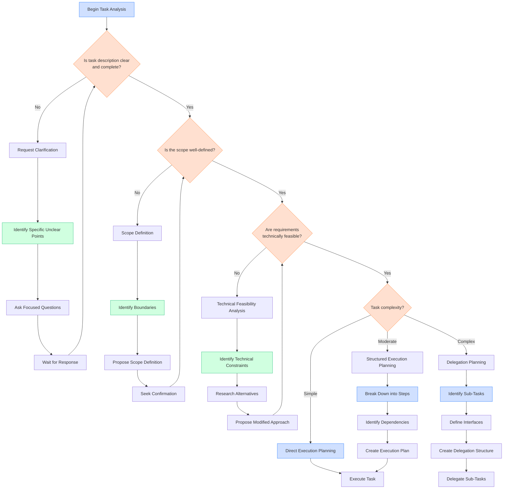

# Task Analysis Decision Tree

## Overview

This document provides a structured decision tree for the task analysis phase of Linear workflows. Effective task analysis is critical for understanding requirements, planning the approach, and determining the appropriate execution strategy. This decision tree guides agents through key decision points in the analysis process and provides criteria for making optimal choices.

## Visual Representation

## Decision Criteria

### Task Clarity Assessment

The first decision point is determining whether the task description provides sufficient clarity:

| Criteria | Clear Description | Unclear Description |
|----------|------------------|---------------------|
| Requirements | Specific, measurable requirements | Vague or ambiguous requirements |
| Deliverables | Clearly defined outputs or artifacts | Undefined or ambiguous deliverables |
| Constraints | Explicit constraints and limitations | Missing or unclear constraints |
| Context | Sufficient background information | Limited or missing context |
| Acceptance Criteria | Defined criteria for success | Unclear success metrics |

**Example Decision Process:**

For a task like "Implement user authentication":
1. Requirements: Unclear what authentication methods are required
2. Deliverables: Not specified which pages/components need authentication
3. Constraints: No mention of security requirements or standards
4. Decision: The task description is unclear, request clarification

### Scope Definition Assessment

Once clarity is established, assess whether the scope is well-defined:

| Criteria | Well-Defined Scope | Poorly Defined Scope |
|----------|-------------------|---------------------|
| Boundaries | Clear inclusion/exclusion criteria | Ambiguous boundaries |
| Size | Reasonable and estimable size | Unbounded or too large |
| Dependencies | Identified external dependencies | Unknown or unspecified dependencies |
| Timeline | Realistic timeline for completion | Missing or unrealistic timeline |
| Resources | Specified resources and tools | Unspecified resource requirements |

**Example Decision Process:**

For a task like "Improve website performance":
1. Boundaries: Unclear which aspects of performance to focus on
2. Size: No indication of how much improvement is expected
3. Dependencies: Unknown which systems affect performance
4. Decision: The scope is poorly defined, needs scope definition

### Technical Feasibility Assessment

Evaluate whether the requirements are technically feasible:

| Criteria | Feasible | Potentially Infeasible |
|----------|----------|------------------------|
| Technical Constraints | Within known technical capabilities | Pushes beyond known capabilities |
| Resource Requirements | Resources available and sufficient | Requires unavailable resources |
| Timeline Constraints | Can be completed within timeline | Timeline too short for requirements |
| Dependencies | Dependencies can be managed | Critical dependencies outside control |
| Risk Level | Acceptable level of risk | High risk of failure |

**Example Decision Process:**

For a task like "Implement real-time collaboration":
1. Technical Constraints: Requires WebSocket expertise we may not have
2. Resource Requirements: May need additional infrastructure
3. Timeline: May be challenging within the given timeline
4. Decision: Potentially infeasible, needs technical feasibility analysis

### Task Complexity Assessment

Determine the complexity level of the task:

| Criteria | Simple | Moderate | Complex |
|----------|--------|----------|---------|
| Scope | Narrow, well-contained | Multiple components but related | Broad, system-wide impact |
| Technical Difficulty | Straightforward implementation | Some challenging aspects | Multiple challenging aspects |
| Dependencies | Few or no dependencies | Several manageable dependencies | Many interdependent components |
| Risk | Low risk, isolated impact | Moderate risk, contained impact | High risk, broad impact |
| Estimated Time | Hours (1-4) | Days (1-3) | Days to weeks (3+) |

**Example Decision Process:**

For a task like "Add pagination to user list":
1. Scope: Focused on a single component
2. Technical Difficulty: Standard pagination implementation
3. Dependencies: Minimal, just the existing user list component
4. Risk: Low, isolated to one feature
5. Estimated Time: A few hours
6. Decision: Simple task, use direct execution planning

## Detailed Explanation of Decision Criteria

### Requesting Clarification

When a task description lacks clarity, follow these steps:

1. **Identify Specific Unclear Points**

   - List each ambiguous requirement or missing information

   - Prioritize blockers that prevent any progress

2. **Ask Focused Questions**

   - Frame questions to elicit specific, actionable responses

   - Provide options when possible to facilitate decision-making

   - Example: "The task mentions 'improve authentication'. Should this focus on (a) security enhancements, (b) user experience improvements, or (c) both?"

3. **Wait for Response**

   - Block further analysis until critical clarifications are received

   - For non-blocking clarifications, proceed with assumptions but document them clearly

### Scope Definition

When scope boundaries are unclear:

1. **Identify Boundaries**

   - Determine what is explicitly included and excluded

   - Identify ambiguous areas that need definition

2. **Propose Scope Definition**

   - Suggest clear boundaries based on context and priorities

   - Include rationale for proposed scope

   - Example: "Based on the performance issues mentioned, I propose focusing on (1) frontend rendering optimization and (2) API response time improvements, excluding database optimization which would require a separate effort."

3. **Seek Confirmation**

   - Request explicit approval of the proposed scope

   - Document the agreed scope for reference

### Technical Feasibility Analysis

When requirements may not be technically feasible:

1. **Identify Technical Constraints**

   - Pinpoint specific requirements that pose challenges

   - Assess available skills, tools, and infrastructure

2. **Research Alternatives**

   - Explore alternative approaches or technologies

   - Evaluate tradeoffs between different solutions

3. **Propose Modified Approach**

   - Suggest feasible alternatives that meet core requirements

   - Clearly explain tradeoffs and limitations

   - Example: "Full real-time collaboration may not be feasible within the timeline. I propose implementing a simpler version using periodic auto-save and conflict resolution, which achieves 80% of the functionality with significantly less complexity."

## Examples Illustrating the Decision Process

### Example 1: Documentation Enhancement Task

**Task:** "Enhance the API documentation with more examples"

**Analysis Process:**
1. **Clarity Assessment:**

   - Requirements: Somewhat clear, but "more examples" is non-specific

   - Deliverables: Not specified which API endpoints need examples

   - Decision: Request clarification on which endpoints to prioritize and how many examples are needed

2. **After Clarification:**

   - Scope is now defined: "Add 2-3 examples for each of the 5 core endpoints"

   - Technical feasibility: Completely feasible

   - Complexity: Simple to moderate

   - Decision: Use structured execution planning with clear steps for each endpoint

### Example 2: Complex Feature Implementation

**Task:** "Implement multi-factor authentication system"

**Analysis Process:**
1. **Clarity Assessment:**

   - Requirements: Clear need for MFA, but specific methods not specified

   - Deliverables: Integration points not fully defined

   - Decision: Request clarification on supported MFA methods and integration points

2. **After Clarification:**

   - Scope is defined: "Implement SMS and authenticator app MFA for web and mobile apps"

   - Technical feasibility: Feasible but challenging

   - Complexity: Complex (multiple components, security implications)

   - Decision: Use delegation planning to break down into sub-tasks:

     - Authentication backend enhancements

     - SMS integration service

     - Authenticator app integration

     - Web UI implementation

     - Mobile UI implementation

     - Security testing and validation

## Recommendations for Different Scenarios

### For Unclear Tasks

1. **When the task lacks context:**

   - Request background information and related documentation

   - Ask about the problem being solved, not just the requested solution

   - Example: "Could you provide context on why this feature is needed and how users will interact with it?"

2. **When requirements are ambiguous:**

   - Propose specific interpretations and ask for confirmation

   - Use examples to clarify understanding

   - Example: "I understand 'improve performance' to mean reducing page load time to under 2 seconds. Is this correct, or are there other performance aspects to address?"

### For Scope Definition

1. **When the scope is too broad:**

   - Propose breaking it into phases or separate tasks

   - Suggest prioritization criteria

   - Example: "This appears to be a large initiative. I suggest we focus on Phase 1 (user-facing features) first, followed by Phase 2 (admin features) in a separate task."

2. **When boundaries are unclear:**

   - Define explicit inclusion and exclusion criteria

   - Seek agreement on specific components affected

   - Example: "To clarify scope, this task will include updating the login, registration, and password reset flows, but exclude account management and user profile features. Is this understanding correct?"

### For Technical Feasibility

1. **When requirements exceed current capabilities:**

   - Propose a proof-of-concept or research spike

   - Suggest alternative approaches that achieve similar goals

   - Example: "Implementing this from scratch would be challenging. I recommend evaluating these three existing libraries that provide similar functionality."

2. **When timeline constraints are tight:**

   - Suggest a minimum viable implementation with future enhancements

   - Identify which requirements could be deferred

   - Example: "To meet the timeline, I recommend implementing the core functionality first, with these additional features planned for a follow-up task."

## Integration with Existing Documentation

This decision tree complements the existing documentation in the following ways:

- **Linear Workflows Reference Guide**: Provides context on the overall workflow in which task analysis occurs

- **Communication and Delegation SOPs**: Offers guidance on how to communicate clarification requests and delegation decisions

- **Workflow Selection Tree**: Helps determine the appropriate workflow after task analysis is complete

## References

- [Linear Workflows Reference Guide](../reference/linear_workflows_reference.md)

- [Communication and Delegation SOPs](../reference/communication_delegation_sops.md)

- [Workflow Selection Tree](./workflow_selection_tree.md)

## Related Resources

- [Workflow Selection Decision Tree](workflow_selection_tree.md)
- [Delegation Decision Tree](delegation_decision_tree.md)
- [Common Linear Workflow Scenarios and Examples](../examples/linear_workflow_scenarios.md)
