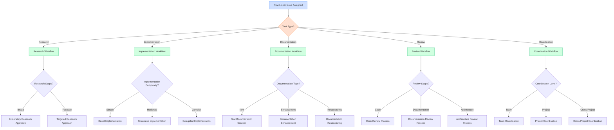

# Workflow Selection Decision Tree

## Overview

This document provides a comprehensive decision tree to help agents select the most appropriate workflow when working with Linear issues. The decision tree guides agents through key decision points and provides clear criteria for selecting optimal approaches based on the task requirements, complexity, and context.

## Visual Representation

## Decision Criteria

### Task Type Determination

The first and most critical decision point is determining the primary type of the assigned task:

| Task Type | Characteristics | Examples |
|-----------|-----------------|----------|
| Research | Focuses on gathering information, analyzing data, or exploring solutions | "Research best practices for API security", "Analyze performance bottlenecks" |
| Implementation | Involves writing code, developing features, or fixing bugs | "Implement user authentication", "Fix login page bug" |
| Documentation | Creating or updating documentation, guides, or references | "Create API documentation", "Update user guide" |
| Review | Evaluating and providing feedback on work | "Review PR #123", "Evaluate architecture proposal" |
| Coordination | Managing and coordinating work across multiple agents or teams | "Coordinate release activities", "Manage cross-team dependencies" |

### Research Workflow Selection

When the task is primarily research-oriented, consider the following criteria:

| Criteria | Exploratory Research | Targeted Research |
|----------|---------------------|-------------------|
| Scope | Broad, open-ended questions | Specific, well-defined questions |
| Prior Knowledge | Limited existing knowledge | Substantial existing knowledge |
| Output Format | Comprehensive reports with multiple sections | Focused findings addressing specific questions |
| Time Allocation | Longer timeframes with discovery phases | Shorter timeframes with direct investigation |
| Delegation Approach | Multiple sub-agents exploring different areas | Single agent or focused sub-tasks |

**Example Decision Process:**

For a task like "Research decision points in Linear workflows":
1. This is primarily a research task
2. The scope is relatively focused (specific to Linear workflows)
3. There is existing documentation to build upon
4. The output needs to be structured and comprehensive
5. Decision: Use a Targeted Research approach with structured sub-tasks

### Implementation Workflow Selection

For implementation tasks, consider the complexity and scope:

| Criteria | Direct Implementation | Structured Implementation | Delegated Implementation |
|----------|----------------------|--------------------------|--------------------------|
| Complexity | Simple, straightforward tasks | Moderate complexity with clear components | Complex tasks with multiple interdependent parts |
| Estimated Time | Hours (1-4) | Days (1-3) | Days to weeks (3+) |
| Dependencies | Few or no dependencies | Some dependencies, manageable by one agent | Multiple dependencies requiring coordination |
| Technical Scope | Single component or feature | Multiple related components | System-wide changes or multiple features |
| Risk Level | Low risk, isolated changes | Moderate risk, contained impact | High risk, broad impact |

**Example Decision Process:**

For a task like "Implement user authentication flow":
1. This is primarily an implementation task
2. The complexity is moderate (involves multiple components)
3. It has dependencies on existing systems
4. It affects multiple parts of the application
5. Decision: Use a Structured Implementation approach with clear phases

### Documentation Workflow Selection

For documentation tasks, consider the type and scope:

| Criteria | New Documentation | Documentation Enhancement | Documentation Restructuring |
|----------|------------------|--------------------------|----------------------------|
| Starting Point | No existing documentation | Existing documentation to build upon | Existing documentation to reorganize |
| Scope | Creating complete new documents | Adding sections or improving existing content | Reorganizing or reformatting existing content |
| Research Needed | Substantial research required | Moderate research to fill gaps | Minimal research, focus on organization |
| Audience Focus | Defining the audience and purpose | Refining for the established audience | Improving accessibility for the audience |

**Example Decision Process:**

For a task like "Create decision trees for workflow selection":
1. This is primarily a documentation task
2. It builds upon existing documentation
3. It requires adding new content and structure
4. Decision: Use a Documentation Enhancement approach with research integration

## Recommendations for Different Scenarios

### For Research Tasks

1. **When to use Exploratory Research:**

   - The topic is new or has limited existing documentation

   - The requirements are open-ended or discovery-oriented

   - Multiple approaches or solutions need to be evaluated

   - Example: "Research emerging trends in AI agent collaboration"

2. **When to use Targeted Research:**

   - Specific questions need to be answered

   - There is substantial existing knowledge to build upon

   - The output needs to directly inform a decision or implementation

   - Example: "Research specific performance optimization techniques for React components"

### For Implementation Tasks

1. **When to use Direct Implementation:**

   - Simple, well-defined tasks with clear requirements

   - Tasks that can be completed in a few hours

   - Minimal dependencies on other components

   - Example: "Fix typo in login error message"

2. **When to use Structured Implementation:**

   - Moderate complexity tasks requiring planning

   - Tasks that span multiple files or components

   - Some dependencies that need to be managed

   - Example: "Implement form validation for user registration"

3. **When to use Delegated Implementation:**

   - Complex tasks requiring multiple specialized skills

   - Tasks that affect multiple systems or components

   - High-risk changes requiring careful coordination

   - Example: "Implement new authentication system across all services"

### For Documentation Tasks

1. **When to use New Documentation Creation:**

   - No existing documentation on the topic

   - New features or processes that need to be documented

   - Example: "Create documentation for the new API endpoints"

2. **When to use Documentation Enhancement:**

   - Existing documentation needs expansion

   - Adding examples, diagrams, or clarifications

   - Example: "Add troubleshooting section to the deployment guide"

3. **When to use Documentation Restructuring:**

   - Existing documentation is disorganized or inconsistent

   - Improving navigation or accessibility

   - Example: "Reorganize the developer documentation for better discoverability"

## Integration with Existing Documentation

This decision tree complements the existing documentation in the following ways:

- **Linear Workflows Reference Guide**: Provides detailed information on Linear components and processes referenced in this decision tree

- **Communication and Delegation SOPs**: Offers guidance on how to implement the delegation approaches mentioned in this decision tree

- **Agent Collaboration Workflow**: Details the specific steps for implementing delegated tasks once the appropriate workflow is selected

## References

- [Linear Workflows Reference Guide](../reference/linear_workflows_reference.md)

- [Linear Workflow Decision Diagram](../reference/linear_workflow_diagram.md)

- [Communication and Delegation SOPs](../reference/communication_delegation_sops.md)

- [Agent Collaboration Workflow](../src/content/docs/reference/agent_collaboration_workflow.md)

## Related Resources

- [Task Analysis Decision Tree](task_analysis_decision_tree.md)
- [Delegation Decision Tree](delegation_decision_tree.md)
- [Implementation Decision Tree](implementation_decision_tree.md)
- [Communication Decision Tree](communication_decision_tree.md)
- [Linear Workflows Reference Guide](../reference/linear_workflows_reference.md)
