# Communication Standards Router

## Quick Start - Select Your Communication Need

```mermaid
graph TD
    A[Communication Task] --> B{Communication Type?}
    B -->|Status Updates| C[📊 Status Reporting]
    B -->|Agent Coordination| D[🤝 Agent Communication]
    B -->|Task Delegation| E[📋 Delegation SOPs]
    B -->|Tactical Standards| F[⚡ Tactical Guidelines]
    
    C --> G[Follow: Status Reporting Standards]
    D --> H[Follow: Agent Communication Guide]
    E --> I[Follow: Delegation Communication SOPs]
    F --> J[Follow: Tactical Communication Standards]
    
    style A fill:#d0e0ff
    style C fill:#ffe0d0
    style D fill:#d0ffe0
    style E fill:#ffd0e0
    style F fill:#e0d0ff
```



## Essential Resources

### 📊 Status & Reporting
- **[Status Reporting Standards](communication/status_reporting_standards.md)** - Accurate status communication protocols
- **[Verification Protocols](communication/verification_protocols.md)** - Mandatory verification before status claims

### 🤝 Agent Coordination
- **[Agent Communication Guidelines](communication/agent_communication_guidelines.md)** - Inter-agent communication standards
- **[Delegation Communication SOPs](communication/delegation_communication_sops.md)** - Task delegation and coordination

### ⚡ Tactical Standards
- **[Tactical Communication Standards](communication/tactical_communication_standards.md)** - Mission-critical communication requirements
- **[Emergency Communication Protocols](communication/emergency_protocols.md)** - Crisis communication procedures

## Critical Requirements

**🚨 MANDATORY STATUS VERIFICATION**: Never claim deployment/merge status without verification:
```bash
# ALWAYS verify before claiming status
git status
git branch -r
git log --oneline -5
```

**✅ APPROVED STATUS LANGUAGE**:
- "Working in sandbox/feature branch"
- "Changes ready for PR creation"
- "PR created and awaiting review"
- "Changes merged to main branch"
- "Deployed to production"

**❌ PROHIBITED STATUS LANGUAGE**:
- "Deployed" (when only in sandbox)
- "Live" (when only in PR)
- "Complete" (when only committed locally)

## Quick Decision Guide

**Reporting status?** → Use Status Reporting Standards  
**Coordinating with agents?** → Use Agent Communication Guidelines  
**Delegating tasks?** → Use Delegation Communication SOPs  
**Mission-critical communication?** → Use Tactical Standards  
**Emergency situation?** → Use Emergency Protocols  

## Communication Templates

### Status Update Template
```markdown
**Status Update**: [Task/Issue ID]
**Current State**: [Specific, verified status]
**Progress**: [What was accomplished]
**Next Steps**: [Planned actions]
**Blockers**: [Any impediments]
**ETA**: [Realistic timeline]
```

### Agent Coordination Template
```markdown
**Agent Communication**: [Purpose]
**Context**: [Background information]
**Request/Information**: [Specific need]
**Timeline**: [When response needed]
**Dependencies**: [Related work or blockers]
```

### Delegation Template
```markdown
**Task Delegation**: [Task name]
**Objective**: [Clear goal statement]
**Context**: [Background and reasoning]
**Deliverables**: [Specific outputs expected]
**Timeline**: [Deadline and milestones]
**Resources**: [Available tools and information]
```

## Emergency Protocols

- **Critical Error?** → Immediate status report with impact assessment
- **Communication Breakdown?** → Escalate through proper channels
- **Conflicting Instructions?** → Request clarification before proceeding
- **Status Verification Failure?** → Do not proceed with status claims

---
*For detailed communication protocols, templates, and standards, follow the links above. This router ensures you use the right communication approach for your specific situation.*

