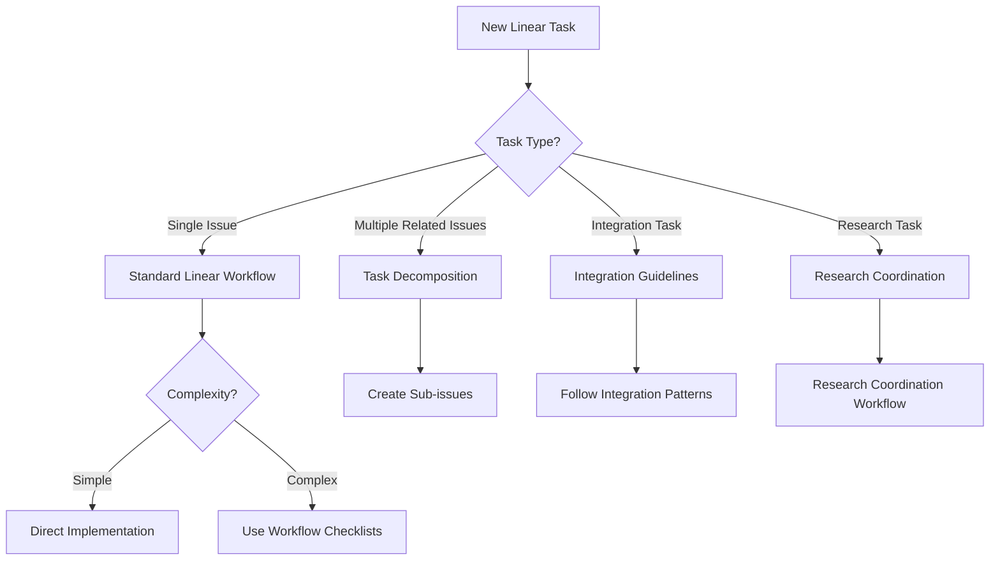
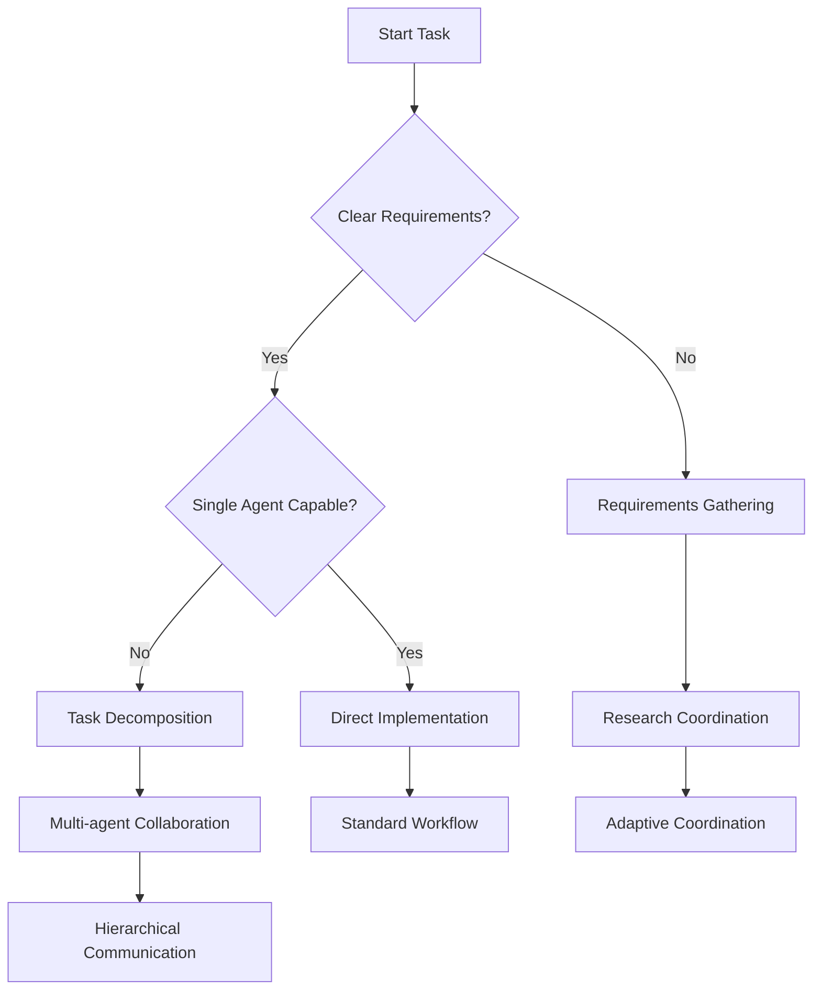

# Decision Trees and Workflow Selection

## Overview

This directory contains visual decision trees and selection criteria for choosing the appropriate workflow patterns for your tasks. These decision trees help agents quickly identify the most suitable approach based on task characteristics, complexity, and requirements.

## Quick Decision Guide

### Task Type Assessment

1. **Research Task** → Use Research Coordination Workflow
2. **Complex Implementation** → Use Task Decomposition Meta-Workflow  
3. **Evolving Requirements** → Use Adaptive Coordination Meta-Meta-Workflow
4. **Linear Issue Management** → Use Linear Workflows Reference
5. **Integration Setup** → Use Integration Guidelines

### Complexity Assessment

- **Simple Task** (< 2 hours): Direct implementation
- **Medium Task** (2-8 hours): Use workflow checklists
- **Complex Task** (> 8 hours): Consider task decomposition
- **Multi-agent Task**: Use collaboration workflows

## Decision Trees

### Linear Workflow Selection Tree

### Workflow Pattern Selection

## Selection Criteria

### When to Use Each Pattern

| Pattern | Use When | Indicators |
|---------|----------|------------|
| **Standard Linear Workflow** | Simple, well-defined tasks | Clear requirements, single agent, < 4 hours |
| **Task Decomposition** | Complex tasks with clear boundaries | Multiple components, parallel work possible |
| **Research Coordination** | Information gathering needed | Unknown requirements, multiple sources |
| **Adaptive Coordination** | Uncertain or evolving requirements | High uncertainty, long-term project |
| **Integration Guidelines** | Linear-GitHub workflow setup | Branch naming, PR linking, automation |

## Implementation Guidelines

### Step 1: Assess Your Task
1. Read the task description carefully
2. Identify the primary objective
3. Estimate complexity and time requirements
4. Determine if multiple agents are needed

### Step 2: Select Workflow Pattern
1. Use the decision trees above
2. Match task characteristics to patterns
3. Consider available resources and constraints
4. Choose the most appropriate pattern

### Step 3: Follow Implementation Guide
1. Navigate to the specific workflow documentation
2. Follow the step-by-step checklists
3. Use the provided templates and examples
4. Monitor progress and adapt as needed

## Quick Reference

### Common Scenarios

- **New Linear Issue**: Start with Linear Workflows Reference
- **GitHub Integration**: Use Integration Guidelines
- **Research Task**: Research Coordination Workflow
- **Large Project**: Task Decomposition Meta-Workflow
- **Uncertain Requirements**: Adaptive Coordination
- **Team Communication**: Hierarchical Communication Workflow

### Emergency Protocols

- **Blocked by Dependencies**: Escalate to parent agent
- **Unclear Requirements**: Switch to Research Coordination
- **Resource Constraints**: Consider task decomposition
- **Timeline Pressure**: Use Quick References and Tools

## Related Documentation

- [Workflow Checklists](../workflow_checklists/README.md)
- [Linear Workflows Reference](../linear_workflows_reference.md)
- [Integration Guidelines](../integration_guidelines/README.md)
- [Quick References](../quick_reference/README.md)

