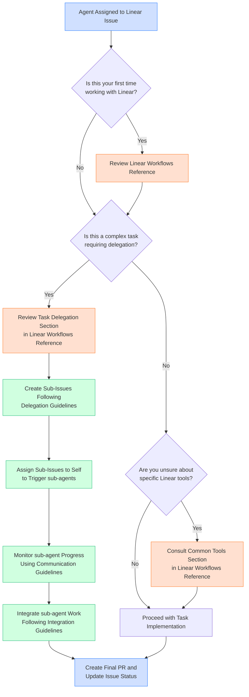

# Linear Workflow Decision Diagram

## When to Utilize the Linear Workflows Reference

## Key Reference Points

| Scenario | Reference Section | Key Information |
|----------|-------------------|----------------|
| First-time Linear user | [Overview of Linear Workflows](./linear_workflows_reference.md#overview-of-linear-workflows) | Basic concepts and components |
| Task delegation | [Task Delegation and Communication](./linear_workflows_reference.md#task-delegation-and-communication) | Creating sub-issues, sub-agent delegation |
| Linear tool usage | [Common Tools and Patterns](./linear_workflows_reference.md#common-tools-and-patterns) | API examples, common patterns |
| Communication protocols | [Communication Best Practices](./linear_workflows_reference.md#communication-best-practices) | Formatting, updates, interrupts |
| Troubleshooting | [Troubleshooting](./linear_workflows_reference.md#troubleshooting) | Common issues and solutions |

## Integration with Agent Collaboration Workflow

When working on complex tasks that require multi-agent collaboration, combine the Linear Workflows Reference with the [Agent Collaboration Workflow](../src/content/docs/reference/agent_collaboration_workflow.md) for optimal results:

1. Use Linear Workflows Reference for Linear-specific tools and processes
2. Use Agent Collaboration Workflow for hierarchical delegation and code management
3. Follow Communication SOPs from both documents for consistent messaging

## Related Resources

- [Linear Workflows Reference Guide](linear_workflows_reference.md)
- [Workflow Selection Decision Tree](../decision_trees/workflow_selection_tree.md)
