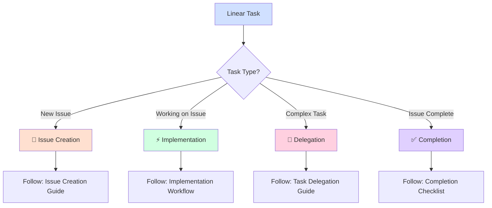

# Linear Workflows Router

## Quick Start - Select Your Path



## Essential Resources

### 🚀 Getting Started
- **📝 [Issue Creation & Standards](linear_workflows/issue_creation_standards.md)** - Required formats and best practices
- **⚡ [Implementation Workflow](linear_workflows/implementation_workflow.md)** - Step-by-step execution guide

### 🔄 Advanced Workflows
- **🤝 [Task Delegation & Communication](linear_workflows/delegation_communication.md)** - Sub-agent coordination
- **✅ [Completion & Review Process](linear_workflows/completion_process.md)** - Finishing tasks properly

### 🛠️ Tools & Troubleshooting
- **🔧 [Common Tools & Patterns](linear_workflows/tools_patterns.md)** - Essential Linear tools
- **🚨 [Troubleshooting Guide](linear_workflows/troubleshooting.md)** - Common issues and solutions

## Critical Requirements

**🚨 MANDATORY**: Use full URL format for all Linear references:
```
✅ CORRECT: https://linear.app/helaix/issue/HLX-1234
❌ WRONG: HLX-1234, #1234, or partial URLs
```

## Quick Decision Guide

**Creating new issue?** → Use Issue Creation Standards  
**Working on assigned issue?** → Use Implementation Workflow  
**Need to delegate?** → Use Task Delegation Guide  
**Task complete?** → Use Completion Process  
**Stuck or error?** → Use Troubleshooting Guide  

## Emergency Protocols

- **Blocked?** → Comment on Linear issue with specific blocker details
- **Error?** → Document in [Error Tracking System](../self_improvement/error_tracking/)
- **Unclear requirements?** → Request clarification before proceeding
- **Communication issues?** → Follow [Tactical Communication Standards](tactical_communication_standards.md)

---
*For detailed workflows, examples, and implementation guides, follow the links above. This router ensures you start with the right Linear workflow for your specific task type.*

