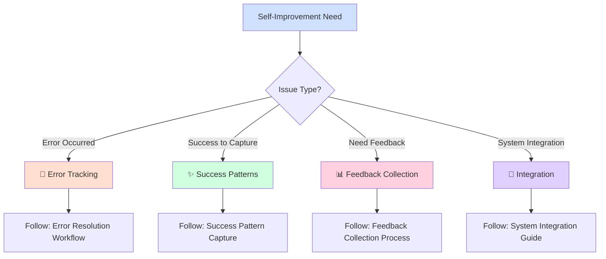

# Self-Improvement System Router

## Quick Start - Select Your Path

## Essential Resources

### 🚨 Error Management
- **[Error Tracking Workflow](error_tracking_workflow.md)** - Complete error resolution process
- **[Error Prevention Guide](error_prevention_guide.md)** - Proactive error avoidance

### ✨ Success Optimization  
- **[Success Pattern Capture](success_pattern_capture.md)** - Document and replicate wins
- **[Performance Optimization](performance_optimization.md)** - Systematic improvement methods

### 📊 Feedback Systems
- **[Feedback Collection Process](feedback_collection_process.md)** - Structured feedback gathering
- **[Impact Measurement](impact_measurement.md)** - Measure improvement effectiveness

### 🔧 System Integration
- **[Integration Guide](integration_guide.md)** - Unified improvement framework
- **[Implementation Templates](implementation_templates.md)** - Ready-to-use templates

## Quick Decision Guide

**Error occurred?** → Use Error Tracking Workflow  
**Success to document?** → Use Success Pattern Capture  
**Need user feedback?** → Use Feedback Collection Process  
**Setting up system?** → Use Integration Guide  
**Measuring impact?** → Use Impact Measurement  

## Critical Workflows

### Error Response (Immediate)
1. **Document** → Log error details immediately
2. **Categorize** → Identify error type and impact
3. **Resolve** → Implement fix and test
4. **Prevent** → Update processes to avoid recurrence

### Success Capture (Ongoing)
1. **Identify** → Recognize successful patterns
2. **Document** → Record what worked and why
3. **Analyze** → Extract reusable principles
4. **Replicate** → Apply patterns to new situations

### Feedback Integration (Regular)
1. **Collect** → Gather feedback systematically
2. **Analyze** → Identify improvement opportunities
3. **Implement** → Make targeted improvements
4. **Measure** → Track effectiveness of changes

## Emergency Protocols

- **Critical Error?** → Follow Error Tracking Workflow immediately
- **System Failure?** → Use Integration Guide for recovery
- **Performance Issues?** → Apply Performance Optimization methods
- **Feedback Overload?** → Use Feedback Collection Process for prioritization

---
*For detailed processes, templates, and implementation guides, follow the links above. This router ensures you start with the right self-improvement approach for your specific need.*

