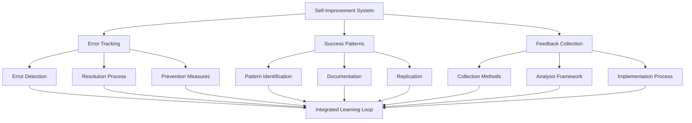

# Self-Improvement System Integration Guide

## Unified Framework Overview

### System Architecture


### Integration Principles
1. **Unified Data Flow**: All components share common data structures
2. **Cross-Component Learning**: Insights from one area inform others
3. **Consistent Processes**: Standardized workflows across all components
4. **Holistic Measurement**: Integrated metrics and reporting

## Component Integration Strategies

### Error Tracking ↔ Success Patterns
**Error-to-Success Conversion**:
- Document successful error resolution approaches as patterns
- Transform debugging techniques into reusable methodologies
- Convert prevention measures into proactive success strategies

**Success-Informed Error Prevention**:
- Use successful patterns to prevent common errors
- Apply proven approaches to error-prone situations
- Leverage success factors to strengthen weak processes

### Error Tracking ↔ Feedback Collection
**Feedback-Driven Error Resolution**:
- Collect stakeholder feedback on error impact and resolution
- Use feedback to prioritize error fixes
- Gather input on error communication effectiveness

**Error-Informed Feedback Requests**:
- Request specific feedback after error resolution
- Use error patterns to identify feedback collection opportunities
- Validate error prevention measures through stakeholder input

### Success Patterns ↔ Feedback Collection
**Feedback-Validated Success Patterns**:
- Use stakeholder feedback to confirm pattern effectiveness
- Gather input on pattern applicability and adaptation
- Collect suggestions for pattern improvements

**Pattern-Informed Feedback Collection**:
- Use successful feedback collection patterns
- Apply proven engagement strategies
- Leverage effective communication patterns for feedback requests

## Implementation Roadmap

### Phase 1: Foundation Setup (Week 1-2)
**Infrastructure Preparation**:
- Set up data collection systems
- Establish common data formats
- Create shared storage and access mechanisms
- Implement basic reporting capabilities

**Process Documentation**:
- Document current error handling processes
- Identify existing success patterns
- Map current feedback collection methods
- Establish baseline metrics

### Phase 2: Component Integration (Week 3-4)
**Cross-Component Data Sharing**:
- Implement data exchange between components
- Create unified dashboards and reporting
- Establish cross-referencing mechanisms
- Enable component-to-component learning

**Workflow Integration**:
- Integrate error tracking with success pattern capture
- Connect feedback collection to error resolution
- Link success patterns to feedback validation
- Create unified improvement workflows

### Phase 3: Advanced Integration (Week 5-6)
**Automated Learning Loops**:
- Implement automated pattern recognition
- Create intelligent feedback routing
- Establish predictive error prevention
- Enable self-optimizing processes

**Advanced Analytics**:
- Cross-component trend analysis
- Predictive modeling for improvements
- Impact correlation analysis
- ROI measurement for improvement efforts

## Data Integration Framework

### Common Data Structures
```json
{
  "event_id": "unique_identifier",
  "timestamp": "ISO_8601_datetime",
  "event_type": "error|success|feedback",
  "context": {
    "task_type": "string",
    "stakeholders": ["list"],
    "environment": "string",
    "complexity": "low|medium|high"
  },
  "details": {
    "description": "string",
    "impact": "critical|high|medium|low",
    "resolution": "string",
    "lessons_learned": ["list"]
  },
  "relationships": {
    "related_events": ["event_ids"],
    "patterns": ["pattern_ids"],
    "feedback": ["feedback_ids"]
  }
}
```

### Data Flow Management
**Collection Points**:
- Automated system monitoring
- Manual event logging
- Stakeholder feedback submissions
- Performance metric tracking

**Processing Pipeline**:
- Data validation and cleaning
- Event categorization and tagging
- Relationship identification
- Pattern recognition and matching

**Storage and Retrieval**:
- Centralized data repository
- Efficient querying capabilities
- Historical data preservation
- Real-time access for active processes

## Workflow Integration Patterns

### Unified Improvement Workflow
1. **Event Detection**: Identify errors, successes, or feedback
2. **Immediate Response**: Apply appropriate component workflow
3. **Cross-Component Analysis**: Check for related events and patterns
4. **Integrated Learning**: Extract insights across all components
5. **Unified Implementation**: Apply improvements holistically
6. **Comprehensive Measurement**: Track impact across all areas

### Escalation and Routing
**Automatic Routing Rules**:
- Critical errors → Immediate error tracking workflow
- Significant successes → Success pattern capture process
- Stakeholder feedback → Feedback analysis and implementation
- Cross-component patterns → Integrated analysis workflow

**Manual Escalation Paths**:
- Complex issues requiring multiple component expertise
- Strategic decisions affecting multiple areas
- Resource allocation for improvement initiatives
- Conflict resolution between component recommendations

## Measurement and Analytics

### Integrated Metrics Dashboard
**Component-Specific Metrics**:
- Error rates and resolution times
- Success pattern adoption rates
- Feedback response rates and satisfaction scores
- Individual component effectiveness measures

**Cross-Component Metrics**:
- Overall improvement velocity
- Learning transfer effectiveness
- Stakeholder satisfaction trends
- ROI of integrated improvement efforts

**Predictive Analytics**:
- Error probability forecasting
- Success pattern applicability prediction
- Feedback sentiment trending
- Improvement impact modeling

### Reporting Framework
**Real-Time Dashboards**:
- Current system health status
- Active improvement initiatives
- Recent successes and learnings
- Immediate action items

**Periodic Reports**:
- Weekly improvement summaries
- Monthly trend analysis
- Quarterly strategic reviews
- Annual system effectiveness assessment

## Quality Assurance and Governance

### Integration Quality Standards
**Data Quality**:
- Consistency across components
- Completeness of cross-references
- Accuracy of relationship mapping
- Timeliness of data updates

**Process Quality**:
- Workflow efficiency and effectiveness
- Decision-making transparency
- Stakeholder communication quality
- Improvement implementation success

### Governance Framework
**Oversight Structure**:
- Integration steering committee
- Component coordinators
- Quality assurance team
- Stakeholder representatives

**Decision-Making Processes**:
- Priority setting for improvements
- Resource allocation decisions
- Conflict resolution procedures
- Strategic direction setting

## Continuous Optimization

### System Evolution Strategy
**Regular Assessment**:
- Monthly integration effectiveness reviews
- Quarterly process optimization sessions
- Annual strategic planning cycles
- Continuous stakeholder feedback collection

**Adaptive Improvements**:
- Component workflow refinements
- Integration process enhancements
- Technology platform upgrades
- Organizational capability development

### Innovation and Experimentation
**Pilot Programs**:
- New integration approaches
- Advanced analytics techniques
- Emerging technology adoption
- Novel improvement methodologies

**Learning and Adaptation**:
- Experiment result analysis
- Best practice identification
- Failure learning and recovery
- Knowledge sharing and transfer

## Success Metrics and KPIs

### Integration Effectiveness
- **Cross-Component Learning Rate**: How often insights transfer between components
- **Unified Resolution Time**: Speed of integrated problem-solving
- **Stakeholder Satisfaction**: Overall satisfaction with integrated approach
- **System Reliability**: Consistency and dependability of integrated processes

### Business Impact
- **Improvement Velocity**: Rate of meaningful improvements implemented
- **Error Reduction**: Decrease in overall error rates
- **Success Amplification**: Increase in successful outcome replication
- **Stakeholder Engagement**: Level of participation in improvement processes

### Strategic Alignment
- **Goal Achievement**: Progress toward strategic improvement objectives
- **Resource Efficiency**: Optimal use of improvement resources
- **Innovation Rate**: Frequency of breakthrough improvements
- **Competitive Advantage**: Unique capabilities developed through integration

