# Adaptive Coordination System Meta-Meta-Workflow

## Pattern Overview
A high-level, self-adjusting coordination framework that dynamically selects and adapts coordination strategies based on task characteristics, progress patterns, and emerging challenges.

## Components

1. **Coordination Strategy Library**
   * Collection of proven coordination patterns and workflows
   * Documentation of when each pattern is most effective
   * Templates and implementation guidelines for each pattern
   * Examples of successful applications

2. **Task Analysis and Strategy Selection**
   * Analyze task complexity, scope, and characteristics
   * Identify potential coordination challenges
   * Select initial coordination strategy from the library
   * Customize the strategy for the specific context

3. **Progress Monitoring Mechanisms**
   * Implement multi-level progress tracking
   * Collect both quantitative and qualitative progress data
   * Identify patterns, bottlenecks, and emerging issues
   * Compare actual progress against expected patterns

4. **Strategy Adjustment Triggers**
   * Define conditions that indicate strategy ineffectiveness
   * Establish thresholds for intervention
   * Create early warning indicators for potential issues
   * Implement regular strategy review checkpoints

5. **Dynamic Adaptation Process**
   * Evaluate effectiveness of current coordination approach
   * Identify specific aspects that need adjustment
   * Select alternative strategies from the library
   * Implement changes with minimal disruption

6. **Learning and Refinement**
   * Document coordination challenges and solutions
   * Update the strategy library with new patterns
   * Refine existing strategies based on outcomes
   * Share learnings across the organization

## Implementation Guidelines

1. **Preparation Phase**
   * Build or access a coordination strategy library
   * Train coordinators in multiple coordination approaches
   * Establish monitoring and adaptation mechanisms
   * Create communication channels for strategy adjustments

2. **Initialization Phase**
   * Analyze the task and select initial coordination strategy
   * Communicate the strategy to all participants
   * Establish baseline expectations and metrics
   * Implement monitoring mechanisms

3. **Execution and Adaptation Phase**
   * Monitor progress and effectiveness of coordination
   * Identify triggers for strategy adjustment
   * Implement changes as needed
   * Communicate adjustments to all participants

4. **Reflection Phase**
   * Document the coordination journey
   * Identify successful and unsuccessful strategies
   * Extract generalizable patterns
   * Update the coordination strategy library

## Applicability
This meta-meta-workflow is particularly effective for:
* Complex projects with high uncertainty
* Long-running initiatives that evolve over time
* Multi-team efforts with diverse coordination needs
* Projects in rapidly changing environments
* Initiatives that span multiple domains or disciplines

## Example Implementation
The Remotion Media Parser research coordination implemented aspects of this pattern by:
1. Starting with a structured research coordination approach
2. Monitoring progress across five parallel research streams
3. Adapting communication and synthesis strategies based on progress
4. Adjusting the integration approach when individual PRs were completed
5. Documenting the coordination process for future improvement

## Relationship to Other Workflows
This meta-meta-workflow encompasses and coordinates several meta-workflows:
* Task Decomposition and Recomposition
* Hierarchical Progress Tracking
* Quality Assurance Pipeline

It can work alongside other meta-meta-workflows such as:
* Knowledge Transfer Framework

## Implementation Checklist

### Coordination Strategy Library
- [ ] Collect proven coordination patterns and workflows
- [ ] Document when each pattern is most effective
- [ ] Create templates and implementation guidelines
- [ ] Compile examples of successful applications
- [ ] Organize patterns by complexity and applicability

### Task Analysis and Strategy Selection
- [ ] Analyze task complexity, scope, and characteristics
- [ ] Identify potential coordination challenges
- [ ] Select initial coordination strategy from the library
- [ ] Customize the strategy for the specific context
- [ ] Document strategy selection rationale

### Progress Monitoring Mechanisms
- [ ] Implement multi-level progress tracking
- [ ] Collect both quantitative and qualitative progress data
- [ ] Identify patterns, bottlenecks, and emerging issues
- [ ] Compare actual progress against expected patterns
- [ ] Create early warning indicators for potential problems

### Strategy Adjustment Triggers
- [ ] Define conditions that indicate strategy ineffectiveness
- [ ] Establish thresholds for intervention
- [ ] Create early warning indicators for potential issues
- [ ] Implement regular strategy review checkpoints
- [ ] Document trigger criteria and responses

### Dynamic Adaptation Process
- [ ] Evaluate effectiveness of current coordination approach
- [ ] Identify specific aspects that need adjustment
- [ ] Select alternative strategies from the library
- [ ] Implement changes with minimal disruption
- [ ] Communicate adjustments to all participants

### Learning and Refinement
- [ ] Document coordination challenges and solutions
- [ ] Update the strategy library with new patterns
- [ ] Refine existing strategies based on outcomes
- [ ] Share learnings across the organization
- [ ] Create case studies of successful adaptations

## Logic State Chart

```mermaid
stateDiagram-v2
    [*] --> Preparation
    
    state Preparation {
        [*] --> LibraryAccess
        LibraryAccess --> CoordinatorTraining
        CoordinatorTraining --> MonitoringSetup
        MonitoringSetup --> ChannelCreation
        ChannelCreation --> [*]
    }
    
    Preparation --> Initialization: Preparation complete
    
    state Initialization {
        [*] --> TaskAnalysis
        TaskAnalysis --> StrategySelection
        StrategySelection --> Communication
        Communication --> BaselineEstablishment
        BaselineEstablishment --> [*]
    }
    
    Initialization --> Execution: Strategy selected
    
    state Execution {
        [*] --> ActiveCoordination
        
        state ActiveCoordination {
            [*] --> Monitoring
            Monitoring --> TriggerEvaluation
            TriggerEvaluation --> Strategy1: No change needed
            TriggerEvaluation --> AdaptationNeeded: Threshold reached
            
            state AdaptationNeeded {
                [*] --> EvaluateEffectiveness
                EvaluateEffectiveness --> IdentifyIssues
                IdentifyIssues --> SelectAlternative
                SelectAlternative --> ImplementChange
                ImplementChange --> CommunicateChange
                CommunicateChange --> [*]
            }
            
            AdaptationNeeded --> Strategy2: Adaptation complete
            Strategy1 --> Monitoring: Continue
            Strategy2 --> Monitoring: Continue with new strategy
        }
        
        ActiveCoordination --> [*]: Task complete
    }
    
    Execution --> Reflection: Execution complete
    
    state Reflection {
        [*] --> JourneyDocumentation
        JourneyDocumentation --> StrategyEvaluation
        StrategyEvaluation --> PatternExtraction
        PatternExtraction --> LibraryUpdate
        LibraryUpdate --> [*]
    }
    
    Reflection --> [*]: Reflection complete
```

## When to Use This Meta-Meta-Workflow

Use the Adaptive Coordination System Meta-Meta-Workflow when:

1. **High Uncertainty**: The project has significant unknowns or evolving requirements
2. **Complex Coordination**: Multiple coordination strategies might be needed at different stages
3. **Long Duration**: The initiative will run for an extended period with changing conditions
4. **Multiple Teams**: Diverse teams with different working styles need to collaborate
5. **Evolving Environment**: External factors may require adaptation of coordination approaches
6. **Learning Focus**: The organization values continuous improvement of coordination methods

