# Task Decomposition and Recomposition Meta-Workflow

## Pattern Overview
A higher-order workflow pattern for breaking complex tasks into manageable components, distributing them for parallel execution, and then reassembling the results into a cohesive whole.

## Components

1. **Task Analysis**
   * Identify the overall objective and success criteria
   * Map the problem space to understand scope and boundaries
   * Identify natural divisions and potential parallel work streams
   * Analyze dependencies between components

2. **Decomposition Strategy**
   * Define clear boundaries between components
   * Establish interfaces and communication protocols
   * Create consistent templates and documentation standards
   * Develop clear success criteria for each component

3. **Component Distribution**
   * Assign components based on expertise and availability
   * Provide context and background for each component
   * Establish timelines and checkpoints
   * Create communication channels for cross-component issues

4. **Progress Synchronization**
   * Implement regular status updates and check-ins
   * Track dependencies and blockers
   * Adjust timelines and priorities as needed
   * Facilitate cross-component communication

5. **Recomposition Strategy**
   * Define the integration approach before completion
   * Establish quality gates for component acceptance
   * Create a unified structure for the final deliverable
   * Identify gaps and overlaps between components

6. **Synthesis and Validation**
   * Integrate components according to the recomposition strategy
   * Resolve conflicts and inconsistencies
   * Validate the integrated result against original objectives
   * Refine and polish the final deliverable

## Implementation Guidelines

1. **Planning Phase**
   * Analyze the task to identify natural divisions
   * Create a decomposition plan with clear boundaries
   * Establish integration points and dependencies
   * Define success criteria for both components and the whole

2. **Execution Phase**
   * Launch parallel work streams with clear guidelines
   * Maintain awareness of cross-cutting concerns
   * Conduct regular synchronization meetings
   * Address integration challenges proactively

3. **Integration Phase**
   * Bring together all components according to plan
   * Conduct gap analysis to identify missing elements
   * Resolve conflicts and inconsistencies
   * Validate the integrated result against objectives

## Applicability
This meta-workflow is particularly effective for:
* Complex software development projects
* Multi-disciplinary research initiatives
* Content creation for large publications
* Product development across multiple teams
* Strategic planning across business units

## Example Implementation
The Remotion Media Parser research for Sparkflow implemented this pattern by:
1. Breaking down research into five distinct capabilities
2. Creating detailed guidelines for each research component
3. Monitoring progress and addressing cross-cutting concerns
4. Merging findings from individual PRs into a comprehensive report
5. Synthesizing actionable recommendations that leveraged insights across all components

## Relationship to Other Workflows
This meta-workflow encompasses and coordinates several lower-level workflows:
* Research Coordination Workflow
* Documentation Synthesis Workflow
* Feedback Loop Workflow

It can also be part of higher-level meta-meta-workflows such as:
* Adaptive Coordination System
* Knowledge Transfer Framework

## Implementation Checklist

### Task Analysis
- [ ] Identify the overall objective and success criteria
- [ ] Map the problem space to understand scope and boundaries
- [ ] Identify natural divisions and potential parallel work streams
- [ ] Analyze dependencies between components
- [ ] Create a high-level timeline with key milestones

### Decomposition Strategy
- [ ] Define clear boundaries between components
- [ ] Establish interfaces and communication protocols
- [ ] Create consistent templates and documentation standards
- [ ] Develop clear success criteria for each component
- [ ] Document the decomposition rationale

### Component Distribution
- [ ] Assign components based on expertise and availability
- [ ] Provide context and background for each component
- [ ] Establish timelines and checkpoints
- [ ] Create communication channels for cross-component issues
- [ ] Ensure all agents understand their responsibilities

### Progress Synchronization
- [ ] Implement regular status updates and check-ins
- [ ] Track dependencies and blockers
- [ ] Adjust timelines and priorities as needed
- [ ] Facilitate cross-component communication
- [ ] Address integration challenges proactively

### Recomposition Strategy
- [ ] Define the integration approach before completion
- [ ] Establish quality gates for component acceptance
- [ ] Create a unified structure for the final deliverable
- [ ] Identify gaps and overlaps between components
- [ ] Plan for sequential vs. parallel integration

### Synthesis and Validation
- [ ] Integrate components according to the recomposition strategy
- [ ] Resolve conflicts and inconsistencies
- [ ] Validate the integrated result against original objectives
- [ ] Refine and polish the final deliverable
- [ ] Document integration decisions and rationales

## Logic State Chart

```mermaid
stateDiagram-v2
    [*] --> Analysis
    
    state Analysis {
        [*] --> ObjectiveDefinition
        ObjectiveDefinition --> ScopeMapping
        ScopeMapping --> DivisionIdentification
        DivisionIdentification --> DependencyAnalysis
        DependencyAnalysis --> [*]
    }
    
    Analysis --> Decomposition: Analysis complete
    
    state Decomposition {
        [*] --> BoundaryDefinition
        BoundaryDefinition --> InterfaceEstablishment
        InterfaceEstablishment --> TemplateCreation
        TemplateCreation --> CriteriaDefinition
        CriteriaDefinition --> [*]
    }
    
    Decomposition --> Distribution: Decomposition strategy defined
    
    state Distribution {
        [*] --> ComponentAssignment
        ComponentAssignment --> ContextProvision
        ContextProvision --> TimelineEstablishment
        TimelineEstablishment --> ChannelCreation
        ChannelCreation --> [*]
    }
    
    Distribution --> Execution: Components distributed
    
    state Execution {
        [*] --> ParallelWork
        
        state ParallelWork {
            [*] --> Component1
            [*] --> Component2
            [*] --> ComponentN
            
            Component1 --> [*]: Complete
            Component2 --> [*]: Complete
            ComponentN --> [*]: Complete
        }
        
        ParallelWork --> Synchronization
        Synchronization --> ParallelWork: Continue work
        Synchronization --> [*]: All components complete
    }
    
    Execution --> Recomposition: Execution complete
    
    state Recomposition {
        [*] --> IntegrationPlanning
        IntegrationPlanning --> QualityGates
        QualityGates --> StructureDefinition
        StructureDefinition --> GapAnalysis
        GapAnalysis --> [*]
    }
    
    Recomposition --> Synthesis: Recomposition strategy defined
    
    state Synthesis {
        [*] --> ComponentIntegration
        ComponentIntegration --> ConflictResolution
        ConflictResolution --> ResultValidation
        ResultValidation --> Refinement
        Refinement --> [*]
    }
    
    Synthesis --> [*]: Final deliverable complete
```

## When to Use This Meta-Workflow

Use the Task Decomposition and Recomposition Meta-Workflow when:

1. **Complex Task**: The task is too large or complex for a single agent to handle efficiently
2. **Parallel Work Possible**: Components can be worked on simultaneously by different agents
3. **Clear Interfaces**: Boundaries between components can be clearly defined
4. **Integration Required**: The final solution requires bringing together multiple components
5. **Specialized Expertise**: Different components require different types of expertise
6. **Time Constraints**: Parallel execution can significantly reduce overall completion time

