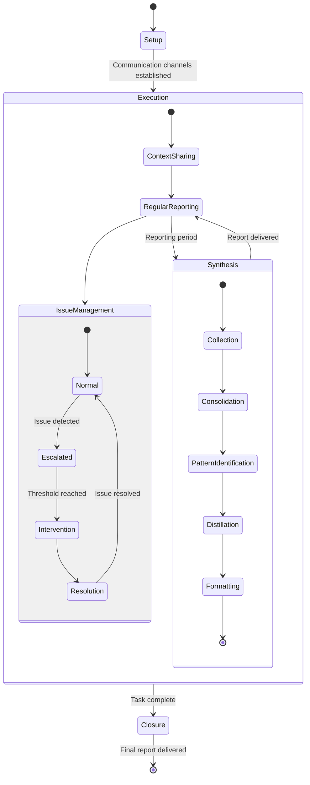

# Hierarchical Communication and Reporting Workflow

## Pattern Overview
A structured approach to managing communication and reporting across multiple levels of a task hierarchy, ensuring appropriate information flow between parent and child tasks, maintaining context, and providing timely updates to stakeholders.

## Components

1. **Communication Channel Establishment**
   * Define appropriate channels for different types of communication
   * Establish protocols for parent-child task communication
   * Create mechanisms for cross-task coordination
   * Set up stakeholder reporting channels

2. **Context Preservation**
   * Ensure child tasks have sufficient context from parent tasks
   * Maintain connection to overall objectives and requirements
   * Provide access to relevant background information
   * Create mechanisms for context clarification

3. **Progress Reporting**
   * Implement regular status updates from child to parent tasks
   * Standardize reporting format and frequency
   * Include both progress metrics and qualitative insights
   * Highlight dependencies, blockers, and risks

4. **Synthesis and Aggregation**
   * Consolidate information from multiple child tasks
   * Identify patterns, dependencies, and cross-cutting concerns
   * Create integrated progress views for stakeholders
   * Distill key insights for higher-level reporting

5. **Escalation and Intervention**
   * Establish clear criteria for issue escalation
   * Create pathways for rapid intervention when needed
   * Implement mechanisms for resource reallocation
   * Provide support for resolving cross-task conflicts

## Implementation Guidelines

1. **Planning Phase**
   * Define communication needs across the task hierarchy
   * Establish reporting templates and schedules
   * Create escalation criteria and pathways
   * Set up communication channels and tools

2. **Execution Phase**
   * Maintain regular communication cadence
   * Ensure bidirectional information flow
   * Monitor for communication gaps or overload
   * Adjust communication approach as needed

3. **Synthesis Phase**
   * Aggregate information from multiple sources
   * Create integrated views of progress and challenges
   * Identify patterns and cross-cutting concerns
   * Provide appropriate level of detail for different audiences

## Applicability
This workflow is particularly effective for:
* Projects with multiple nested levels of tasks
* Initiatives involving multiple teams or agents
* Complex projects with many interdependencies
* Work requiring coordination across specialized domains
* Projects with diverse stakeholder information needs

## Example Implementation
The Remotion Media Parser research coordination implemented this pattern by:
1. Establishing clear communication channels between the coordinator and sub-issue agents
2. Providing detailed context in each sub-issue description
3. Requesting and synthesizing updates from all agents
4. Reporting consolidated progress to stakeholders
5. Tagging appropriate parties in communications (@codegen, @ryan)
6. Creating appropriate levels of detail for different audiences

## Relationship to Other Workflows
This workflow complements and enhances:
* Research Coordination Workflow
* Task Decomposition and Recomposition
* Structured Feedback and Recognition

It can be integrated with:
* Adaptive Coordination System
* Knowledge Transfer Framework

## Implementation Checklist

### Communication Channel Establishment
- [ ] Define appropriate channels for different types of communication
- [ ] Establish protocols for parent-child task communication
- [ ] Create mechanisms for cross-task coordination
- [ ] Set up stakeholder reporting channels
- [ ] Document communication expectations

### Context Preservation
- [ ] Ensure child tasks have sufficient context from parent tasks
- [ ] Maintain connection to overall objectives and requirements
- [ ] Provide access to relevant background information
- [ ] Create mechanisms for context clarification
- [ ] Document key decisions and rationales

### Progress Reporting
- [ ] Implement regular status updates from child to parent tasks
- [ ] Standardize reporting format and frequency
- [ ] Include both progress metrics and qualitative insights
- [ ] Highlight dependencies, blockers, and risks
- [ ] Ensure appropriate visibility to stakeholders

### Synthesis and Aggregation
- [ ] Consolidate information from multiple child tasks
- [ ] Identify patterns, dependencies, and cross-cutting concerns
- [ ] Create integrated progress views for stakeholders
- [ ] Distill key insights for higher-level reporting
- [ ] Maintain traceability between detailed and summary information

### Escalation and Intervention
- [ ] Establish clear criteria for issue escalation
- [ ] Create pathways for rapid intervention when needed
- [ ] Implement mechanisms for resource reallocation
- [ ] Provide support for resolving cross-task conflicts
- [ ] Document escalation decisions and outcomes

## Logic State Chart

## When to Use This Workflow

Use the Hierarchical Communication and Reporting Workflow when:

1. **Complex Task Hierarchy**: The project involves multiple levels of nested tasks
2. **Multiple Contributors**: Several agents or teams are working on different components
3. **Diverse Stakeholders**: Different audiences need different levels of information detail
4. **Interdependent Components**: Work streams have significant dependencies between them
5. **Coordination Challenges**: Specialized domains need effective cross-communication
6. **Risk Management**: Early detection of issues requires structured information flow

