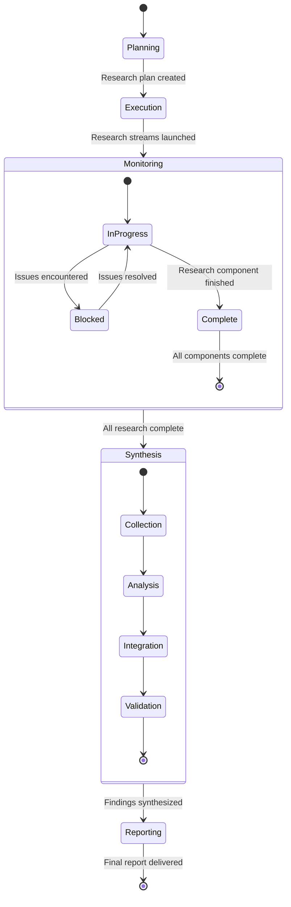

# Research Coordination Workflow

## Pattern Overview
A systematic approach to coordinating distributed research tasks across multiple domains or capabilities, ensuring comprehensive coverage while maintaining consistency and quality.

## Components

1. **Initial Scaffold Creation**
   * Create a standardized directory structure for research findings
   * Establish templates for documentation, code examples, and recommendations
   * Define common terminology and evaluation criteria

2. **Sub-task Definition**
   * Break down research into discrete, focused components
   * Create detailed guidelines for each research area
   * Specify clear deliverables and evaluation criteria
   * Provide relevant resources and starting points

3. **Progress Monitoring**
   * Implement regular check-ins and status updates
   * Track completion of research milestones
   * Identify and address blockers or challenges
   * Adjust timelines and priorities as needed

4. **Findings Synthesis**
   * Collect and organize individual research components
   * Identify common themes, patterns, and insights
   * Resolve contradictions or inconsistencies
   * Create unified documentation structure

5. **Comprehensive Reporting**
   * Distill key insights and recommendations
   * Provide executive summary for stakeholders
   * Include detailed technical documentation
   * Outline implementation roadmap and next steps

## Implementation Guidelines

1. **Planning Phase**
   * Analyze the research domain to identify natural divisions
   * Create a research plan with clear boundaries between components
   * Establish communication channels and reporting mechanisms
   * Define success criteria for each research component

2. **Execution Phase**
   * Launch parallel research streams with clear guidelines
   * Conduct regular synchronization meetings
   * Maintain centralized documentation repository
   * Address cross-cutting concerns and dependencies

3. **Synthesis Phase**
   * Bring together all research findings
   * Conduct gap analysis to identify missing information
   * Create unified narrative and recommendations
   * Validate findings with subject matter experts

## Applicability
This workflow is particularly effective for:
* Technology evaluation and selection
* Market research across multiple segments
* Scientific research with multiple hypotheses
* Feature exploration for complex products
* Competitive analysis across multiple competitors

## Example Implementation
The Remotion Media Parser research for Sparkflow implemented this pattern by:
1. Creating a research scaffold with directories for each capability
2. Defining five distinct research sub-issues with specific guidelines
3. Monitoring progress and requesting updates from agents
4. Merging findings from individual PRs into a comprehensive report
5. Synthesizing actionable recommendations for implementation

## Implementation Checklist

### Initial Scaffold Creation
- [ ] Create standardized directory structure for research findings
- [ ] Establish templates for documentation, code examples, and recommendations
- [ ] Define common terminology and evaluation criteria
- [ ] Set up central repository for findings

### Sub-task Definition
- [ ] Break down research into discrete, focused components
- [ ] Create detailed guidelines for each research area
- [ ] Specify clear deliverables and evaluation criteria
- [ ] Provide relevant resources and starting points
- [ ] Establish boundaries between research areas

### Progress Monitoring
- [ ] Implement regular check-ins and status updates
- [ ] Track completion of research milestones
- [ ] Identify and address blockers or challenges
- [ ] Adjust timelines and priorities as needed
- [ ] Facilitate cross-component communication

### Findings Synthesis
- [ ] Collect and organize individual research components
- [ ] Identify common themes, patterns, and insights
- [ ] Resolve contradictions or inconsistencies
- [ ] Create unified documentation structure
- [ ] Validate findings against original objectives

### Comprehensive Reporting
- [ ] Distill key insights and recommendations
- [ ] Provide executive summary for stakeholders
- [ ] Include detailed technical documentation
- [ ] Outline implementation roadmap and next steps
- [ ] Link to supporting evidence and examples

## Logic State Chart

## When to Use This Workflow

Use the Research Coordination Workflow when:

1. **Multiple Research Areas**: The research task involves multiple distinct but related areas
2. **Parallel Investigation**: Different aspects can be researched simultaneously
3. **Synthesis Required**: Findings need to be combined into a cohesive whole
4. **Structured Output**: A comprehensive, well-organized report is needed
5. **Collaborative Research**: Multiple agents or teams are involved in the research effort

