# Structured Feedback and Recognition Workflow

## Pattern Overview
A systematic approach to providing specific, constructive feedback and recognition to contributors, reinforcing effective practices and acknowledging quality work in a way that enhances motivation and performance.

## Components

1. **Performance Analysis**
   * Review completed work against defined criteria
   * Identify specific strengths and notable achievements
   * Recognize technical quality and innovation
   * Note areas of exceptional contribution

2. **Feedback Structuring**
   * Organize feedback into specific categories
   * Prioritize positive recognition before constructive criticism
   * Ensure feedback is specific and actionable
   * Connect feedback to broader goals and objectives

3. **Personalized Delivery**
   * Tailor feedback to the recipient's role and contribution
   * Use appropriate communication channels
   * Time feedback delivery for maximum impact
   * Ensure visibility to relevant stakeholders

4. **Recognition Amplification**
   * Highlight exceptional contributions to wider audience
   * Connect individual achievements to team or organizational success
   * Document notable contributions for future reference
   * Create opportunities for peer recognition

5. **Feedback Integration**
   * Incorporate feedback into ongoing work processes
   * Use feedback patterns to inform future task assignments
   * Identify opportunities for skill development
   * Create feedback loops for continuous improvement

## Implementation Guidelines

1. **Preparation Phase**
   * Review completed work thoroughly
   * Identify specific strengths and achievements
   * Prepare structured feedback with concrete examples
   * Consider appropriate timing and channel for delivery

2. **Delivery Phase**
   * Provide specific, detailed recognition
   * Connect feedback to broader context and impact
   * Ensure appropriate visibility to stakeholders
   * Create opportunities for dialogue

3. **Follow-up Phase**
   * Document feedback and recognition
   * Monitor impact on motivation and performance
   * Identify opportunities for skill development
   * Incorporate insights into future task assignments

## Applicability
This workflow is particularly effective for:
* Team-based projects with multiple contributors
* Complex tasks requiring specialized expertise
* Environments where continuous improvement is valued
* Organizations seeking to build a culture of recognition
* Projects with learning and development objectives

## Example Implementation
The Remotion Media Parser research coordination implemented this pattern by:
1. Providing detailed, specific feedback to each sub-issue agent
2. Highlighting particular strengths in their research components
3. Acknowledging technical quality and thoroughness
4. Connecting individual contributions to the overall project success
5. Ensuring feedback was visible to all stakeholders

## Relationship to Other Workflows
This workflow complements and enhances:
* Research Coordination Workflow
* Task Decomposition and Recomposition
* Quality Assurance Pipeline

It can be integrated with:
* Postmortem and Self-Analysis Workflow
* Knowledge Transfer Framework

## Implementation Checklist

### Performance Analysis
- [ ] Review completed work against defined criteria
- [ ] Identify specific strengths and notable achievements
- [ ] Recognize technical quality and innovation
- [ ] Note areas of exceptional contribution
- [ ] Identify opportunities for improvement

### Feedback Structuring
- [ ] Organize feedback into specific categories
- [ ] Prioritize positive recognition before constructive criticism
- [ ] Ensure feedback is specific and actionable
- [ ] Connect feedback to broader goals and objectives
- [ ] Use concrete examples to illustrate points

### Personalized Delivery
- [ ] Tailor feedback to the recipient's role and contribution
- [ ] Use appropriate communication channels
- [ ] Time feedback delivery for maximum impact
- [ ] Ensure visibility to relevant stakeholders
- [ ] Create opportunities for dialogue

### Recognition Amplification
- [ ] Highlight exceptional contributions to wider audience
- [ ] Connect individual achievements to team or organizational success
- [ ] Document notable contributions for future reference
- [ ] Create opportunities for peer recognition
- [ ] Acknowledge specific technical accomplishments

### Feedback Integration
- [ ] Incorporate feedback into ongoing work processes
- [ ] Use feedback patterns to inform future task assignments
- [ ] Identify opportunities for skill development
- [ ] Create feedback loops for continuous improvement
- [ ] Document how feedback influenced subsequent work

## Logic State Chart

```mermaid
stateDiagram-v2
    [*] --> WorkCompletion
    
    WorkCompletion --> Analysis: Work submitted
    
    state Analysis {
        [*] --> CriteriaReview
        CriteriaReview --> StrengthIdentification
        StrengthIdentification --> QualityAssessment
        QualityAssessment --> ContributionEvaluation
        ContributionEvaluation --> [*]
    }
    
    Analysis --> Structuring: Analysis complete
    
    state Structuring {
        [*] --> CategoryOrganization
        CategoryOrganization --> PositiveEmphasis
        PositiveEmphasis --> ActionableFormulation
        ActionableFormulation --> GoalAlignment
        GoalAlignment --> [*]
    }
    
    Structuring --> Delivery: Feedback structured
    
    state Delivery {
        [*] --> ChannelSelection
        ChannelSelection --> TimingOptimization
        TimingOptimization --> StakeholderVisibility
        StakeholderVisibility --> DialogueOpportunity
        DialogueOpportunity --> [*]
    }
    
    Delivery --> Amplification: Feedback delivered
    
    state Amplification {
        [*] --> WiderSharing
        WiderSharing --> TeamContextualization
        TeamContextualization --> Documentation
        Documentation --> PeerEngagement
        PeerEngagement --> [*]
    }
    
    Amplification --> Integration: Recognition amplified
    Integration --> [*]: Feedback integrated
```

## When to Use This Workflow

Use the Structured Feedback and Recognition Workflow when:

1. **Task Completion**: A significant task or project phase has been completed
2. **Quality Work Delivered**: High-quality work deserves recognition and reinforcement
3. **Learning Opportunity**: There are valuable lessons to be shared from the work
4. **Team Motivation**: Recognition would enhance motivation and engagement
5. **Skill Development**: Feedback could contribute to skill development
6. **Culture Building**: You want to reinforce a culture of quality and continuous improvement

