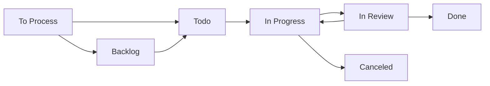

# Linear Workflow Quick Reference Guide

## 🚀 Quick Start

### Creating Issues

| Issue Type | Template | Required Fields | Auto-Labels |
|------------|----------|----------------|-------------|
| **Bug** | Bug Report | Description, Steps, Expected/Actual | `Bug` |
| **Feature** | Feature Request | Description, Acceptance Criteria | `Feature` |
| **Epic** | Epic | Objectives, Success Criteria, Breakdown | `Epic` |
| **Docs** | Documentation | Scope, Audience, Deliverables | `Documentation` |

### Priority Keywords

| Priority | Keywords | Auto-Assignment |
|----------|----------|----------------|
| **Urgent** | urgent, critical, blocking, emergency, asap | 🔴 Priority 1 |
| **High** | important, high-impact, priority, needed | 🟠 Priority 2 |
| **Medium** | (default for new issues) | 🟡 Priority 3 |

### Project Auto-Assignment

| Keywords | Project |
|----------|---------|
| `voice`, `assistant`, `hello-operator` | Hello Operator Voice Assistant |
| `analytics`, `tracking`, `metrics` | Cracked Analytics & Tracking |
| `outreach`, `b2b`, `sales` | B2B Personalized Outreach |
| `seo`, `content`, `marketing` | Agentic SEO Agency |
| `agent`, `workflow`, `automation` | AGENT\|COMMAND\|WORKFLOWS |
| `meta`, `dx`, `developer` | Meta/DX |

## 🔄 Workflow States



### State Transitions

| Action | From | To | Trigger |
|--------|------|----|---------| 
| **Assign Issue** | To Process | In Progress | Auto |
| **Link PR** | Any | In Review | Auto |
| **Merge PR** | In Review | Done | Auto |
| **Quality Check** | To Process | Backlog | Manual |

## 🏷️ Labels & Components

### Type Labels (Auto-Applied)
- `Bug` - Defects, errors, fixes
- `Feature` - New functionality
- `Improvement` - Enhancements, optimizations
- `Documentation` - Docs, guides, wikis
- `Epic` - Large initiatives

### Component Labels (Auto-Applied)
- `component:frontend` - UI, React, CSS, HTML
- `component:backend` - API, server, database
- `component:infrastructure` - Deploy, CI/CD, Docker
- `component:mobile` - iOS, Android, React Native
- `component:design` - UX, Figma, wireframes

## 📊 Triage Schedule

| Frequency | When | Duration | Focus |
|-----------|------|----------|-------|
| **Daily** | 9:00 AM | 15-30 min | "To Process" queue |
| **Weekly** | Monday 10:00 AM | 30-45 min | Priority validation |
| **Monthly** | 1st Monday 2:00 PM | 1-2 hours | Workflow review |
| **Quarterly** | 1st week | Half day | Complete assessment |

## 🎯 Quality Standards

### Feature Requests Must Have:
- [ ] Clear description
- [ ] User story format
- [ ] Acceptance criteria
- [ ] Technical requirements

### Bug Reports Must Have:
- [ ] Reproduction steps
- [ ] Expected behavior
- [ ] Actual behavior
- [ ] Environment details

### Epics Must Have:
- [ ] Business objectives
- [ ] Success criteria
- [ ] Sub-issue breakdown
- [ ] Timeline estimate

## 📈 Key Metrics

### Health Score Targets
- **90-100**: Excellent ✅
- **70-89**: Good 🟡
- **50-69**: Fair 🟠
- **0-49**: Poor ❌

### Performance Targets
| Metric | Target | Current |
|--------|--------|---------|
| Processing Time | < 24 hours | Monitor |
| Label Consistency | > 90% | Monitor |
| Completion Rate | > 80% | Monitor |
| Stale Issues | < 10 | Monitor |

## 🤖 Automation Rules

### What's Automated
✅ Priority assignment based on keywords  
✅ Type labeling based on content  
✅ Project assignment based on keywords  
✅ Component labeling based on tech stack  
✅ State transitions on assignment/PR  
✅ Quality validation and feedback  

### What's Manual
❌ Final priority validation  
❌ Complex project assignments  
❌ Epic breakdown  
❌ Effort estimation  
❌ Assignee selection  

## 🚨 Common Issues & Solutions

### Issue Not Auto-Labeled
**Problem**: New issue missing type label  
**Solution**: Add keywords like "bug", "feature", "improve"  

### Wrong Project Assignment
**Problem**: Issue assigned to wrong project  
**Solution**: Use project keywords or manually reassign  

### Stuck in "To Process"
**Problem**: Issue not moving from initial state  
**Solution**: Add missing info, assign priority, or assign to team member  

### Quality Feedback Comments
**Problem**: Bot commenting about missing info  
**Solution**: Follow template requirements, add acceptance criteria/repro steps  

## 📞 Getting Help

### Escalation Path
1. **Check this guide** for common solutions
2. **Review issue templates** for requirements
3. **Comment on issue** with specific questions
4. **Mention team leads** for complex issues
5. **Create Meta/DX issue** for workflow problems

### Useful Commands
```bash
# Run daily triage
node triage-manager.js

# Collect metrics
node metrics-collector.js

# Test automation
node automation-engine.js
```

## 💡 Pro Tips

### Writing Better Issues
- Use descriptive titles with action words
- Include context and background
- Add links to related issues/PRs
- Use checklists for acceptance criteria

### Leveraging Automation
- Use priority keywords for urgent issues
- Include component keywords for auto-labeling
- Mention project names for auto-assignment
- Link PRs to trigger state transitions

### Staying Organized
- Review "To Process" queue daily
- Update issue progress regularly
- Close completed issues promptly
- Archive or cancel stale issues

---

**Last Updated**: Phase 2.3 Implementation  
**Version**: 1.0.0  
**Team**: Helaix (HLX)

