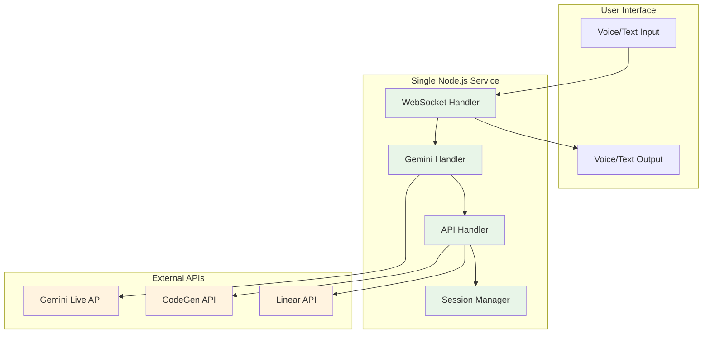
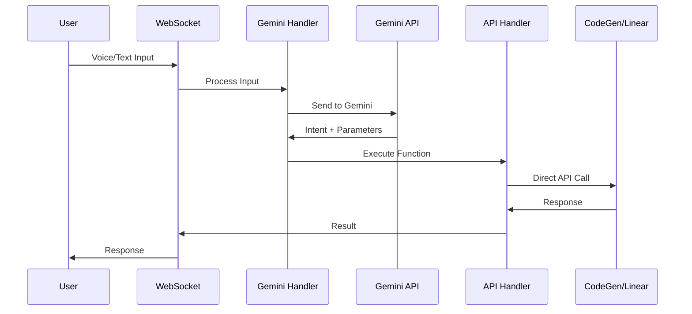

# Architecture Document: Gemini Live Interface to CodeGen (24-Hour MVP)

## Executive Summary

This document defines a **simplified, realistic architecture** for the Gemini Live Interface to CodeGen project that can be implemented within a **24-hour timeline**. Based on critical feedback from architectural review, this design prioritizes **working software over architectural sophistication**.

## 🚨 Key Constraints & Lessons Learned

**Timeline Reality Check**: The original 714-line enterprise architecture was completely unrealistic for a 24-hour implementation. This revised architecture focuses on:
- ✅ **Simple, proven technologies**
- ✅ **Direct API integrations** 
- ✅ **Minimal complexity**
- ✅ **Working prototype first**

## 1. Simplified Technology Stack

### 1.1 Core Technologies (24-Hour Focused)

| Component | Technology | Justification |
|-----------|------------|---------------|
| **Runtime** | Node.js + Express | Familiar, fast to implement, extensive ecosystem |
| **State Management** | In-memory sessions | Simple, no persistence complexity for MVP |
| **Voice Processing** | Gemini Live API | Direct integration, no additional abstraction |
| **API Integration** | Direct HTTP clients | Simple, debuggable, no orchestration complexity |
| **Communication** | WebSocket | Real-time communication without complex infrastructure |

### 1.2 Removed Complexity

**What We're NOT Using (and why):**
- ❌ **Effect TS** - Steep learning curve, overkill for API calls
- ❌ **Cloudflare Workers** - Vendor lock-in, debugging complexity
- ❌ **Durable Objects** - Over-engineered for conversation state
- ❌ **Complex state management** - In-memory sessions sufficient for MVP
- ❌ **Microservices** - Monolith is faster to implement and debug

## 2. Simplified System Architecture

### 2.1 High-Level Architecture (MVP)



### 2.2 Core Components (Simplified)

#### 2.2.1 Single Express Application
```typescript
interface SimpleGeminiApp {
  // Main Express app
  app: Express
  
  // WebSocket for real-time communication
  wss: WebSocketServer
  
  // Simple session storage
  sessions: Map<string, ConversationSession>
  
  // Direct API clients
  geminiClient: GeminiClient
  codegenClient: CodeGenClient
  linearClient: LinearClient
}
```

#### 2.2.2 Session Management (In-Memory)
```typescript
interface ConversationSession {
  id: string
  userId: string
  messages: Message[]
  lastActivity: Date
  context: {
    activeProject?: string
    activeIssue?: string
  }
}
```

### 2.3 Communication Flow (Simplified)



## 3. API Design (Direct Integration)

### 3.1 Simple Function Registry
```typescript
interface SimpleFunctionRegistry {
  functions: Map<string, SimpleFunction>
}

interface SimpleFunction {
  name: string
  description: string
  execute: (params: any) => Promise<any>
}

// Example functions
const functions = new Map([
  ['getProjects', {
    name: 'getProjects',
    description: 'Get all CodeGen projects',
    execute: async () => codegenClient.get('/projects')
  }],
  ['createIssue', {
    name: 'createIssue', 
    description: 'Create a Linear issue',
    execute: async (params) => linearClient.post('/issues', params)
  }]
])
```

### 3.2 Direct API Integration
```typescript
// Simple HTTP clients - no abstraction layers
class CodeGenClient {
  constructor(private apiKey: string, private baseUrl: string) {}
  
  async get(path: string) {
    return fetch(`${this.baseUrl}${path}`, {
      headers: { 'Authorization': `Bearer ${this.apiKey}` }
    })
  }
  
  async post(path: string, data: any) {
    return fetch(`${this.baseUrl}${path}`, {
      method: 'POST',
      headers: { 
        'Authorization': `Bearer ${this.apiKey}`,
        'Content-Type': 'application/json'
      },
      body: JSON.stringify(data)
    })
  }
}
```

## 4. Data Model (Minimal)

### 4.1 Core Data Structures
```typescript
interface Message {
  id: string
  type: 'user' | 'assistant'
  content: string
  timestamp: Date
}

interface ConversationSession {
  id: string
  userId: string
  messages: Message[]
  lastActivity: Date
  context: {
    activeProject?: string
    activeIssue?: string
  }
}

// No complex state management - just in-memory storage
const sessions = new Map<string, ConversationSession>()
```

## 5. Implementation Plan (24-Hour Timeline)

### 5.1 Hour-by-Hour Breakdown

#### Hours 1-4: Basic Setup
- ✅ Initialize Node.js + Express project
- ✅ Set up WebSocket server
- ✅ Create basic HTML interface for testing
- ✅ Implement session management

#### Hours 5-8: Gemini Integration
- ✅ Integrate Gemini Live API
- ✅ Implement voice-to-text processing
- ✅ Add basic intent recognition
- ✅ Test voice input/output

#### Hours 9-16: API Integrations
- ✅ Implement CodeGen API client
- ✅ Implement Linear API client
- ✅ Create function registry
- ✅ Test API calls

#### Hours 17-20: Integration & Testing
- ✅ Connect all components
- ✅ End-to-end testing
- ✅ Bug fixes and refinements
- ✅ Basic error handling

#### Hours 21-24: Polish & Deploy
- ✅ Add basic authentication
- ✅ Improve error messages
- ✅ Deploy to simple hosting
- ✅ Documentation

### 5.2 MVP Feature Set

**Core Features (Must Have):**
- ✅ Voice input processing via Gemini
- ✅ Text-based responses (skip voice generation for MVP)
- ✅ Basic CodeGen API integration (get projects, create issues)
- ✅ Basic Linear API integration (get issues, add comments)
- ✅ Simple conversation memory

**Nice-to-Have (If Time Permits):**
- 🔄 Voice response generation
- 🔄 Better error handling
- 🔄 User authentication
- 🔄 Conversation persistence

## 6. Risk Mitigation (Realistic)

### 6.1 Technical Risks & Mitigation
- **API Rate Limits**: Implement simple retry logic
- **Voice Processing Latency**: Fall back to text input
- **API Integration Issues**: Use direct HTTP calls, avoid abstractions
- **Session Management**: Use simple in-memory storage, add persistence later

### 6.2 Implementation Risks & Mitigation
- **Scope Creep**: Stick to MVP feature set religiously
- **Technology Learning Curve**: Use only familiar technologies
- **Integration Complexity**: Test each API integration separately
- **Time Management**: Set hard deadlines for each phase

## 7. Testing Strategy (Minimal)

### 7.1 Manual Testing Focus
- ✅ **Manual API testing** with Postman/curl
- ✅ **Browser testing** for WebSocket communication
- ✅ **Voice input testing** with real audio
- ✅ **End-to-end user journey** testing

### 7.2 No Automated Testing (MVP)
- ❌ **No unit tests** - Time constraint priority
- ❌ **No integration tests** - Manual testing sufficient
- ❌ **No E2E automation** - Manual verification only
- ❌ **No performance testing** - Premature optimization

## 8. Deployment (Simple)

### 8.1 MVP Deployment Strategy
- **Platform**: Simple VPS or Heroku
- **Database**: None (in-memory sessions)
- **Monitoring**: Basic console logging
- **Scaling**: Single instance only

### 8.2 Environment Variables
```bash
# Simple configuration
GEMINI_API_KEY=your_key_here
CODEGEN_API_URL=https://api.codegen.com
CODEGEN_API_KEY=your_key_here
LINEAR_API_KEY=your_key_here
PORT=3000
```

## 9. File Structure (Simple)

```
gemini-live-interface/
├── src/
│   ├── index.ts              # Main Express app
│   ├── websocket.ts          # WebSocket handler
│   ├── gemini.ts             # Gemini API client
│   ├── codegen.ts            # CodeGen API client
│   ├── linear.ts             # Linear API client
│   ├── functions.ts          # Function registry
│   └── sessions.ts           # Session management
├── public/
│   ├── index.html            # Simple test interface
│   └── app.js                # Frontend JavaScript
├── package.json
├── tsconfig.json
└── README.md
```

## 10. Success Criteria (Realistic)

### 10.1 MVP Success Metrics
- ✅ **Voice input works** - User can speak and get text response
- ✅ **API integration works** - Can call CodeGen and Linear APIs
- ✅ **Basic conversation** - System remembers context within session
- ✅ **Error handling** - Graceful failures with helpful messages
- ✅ **Deployable** - Can be deployed and accessed remotely

### 10.2 What Success Looks Like
```
User: "What are my current projects?"
System: "You have 3 active projects: Project A (5 issues), Project B (2 issues), Project C (8 issues)"

User: "Create an issue for fixing the login bug in Project A"
System: "I've created issue #123 'Fix login bug' in Project A and assigned it to the backlog"
```

## 11. Future Enhancements (Post-MVP)

### 11.1 Phase 2 Improvements
- 🔄 **Voice response generation**
- 🔄 **Persistent conversation storage**
- 🔄 **User authentication and multi-tenancy**
- 🔄 **Better error handling and retry logic**

### 11.2 Phase 3 Sophistication
- 🔄 **Advanced state management**
- 🔄 **Performance optimization**
- 🔄 **Comprehensive testing**
- 🔄 **Monitoring and observability**

## 12. Conclusion

This simplified architecture prioritizes **working software over architectural elegance**. The goal is to build a functional prototype in 24 hours that demonstrates the core concept, not to create a production-ready enterprise system.

**Key Principles:**
- ✅ **Simple is better than complex**
- ✅ **Working is better than perfect**
- ✅ **Direct is better than abstracted**
- ✅ **Familiar is better than trendy**

This architecture can be implemented, tested, and deployed within the 24-hour constraint while providing a solid foundation for future enhancements.

**The best architecture is the one that actually gets built and works.**

