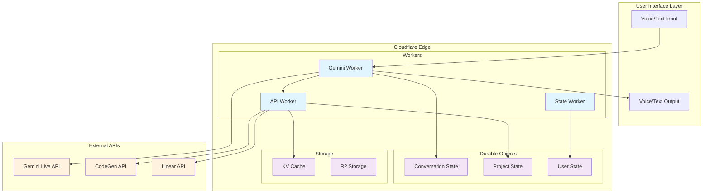
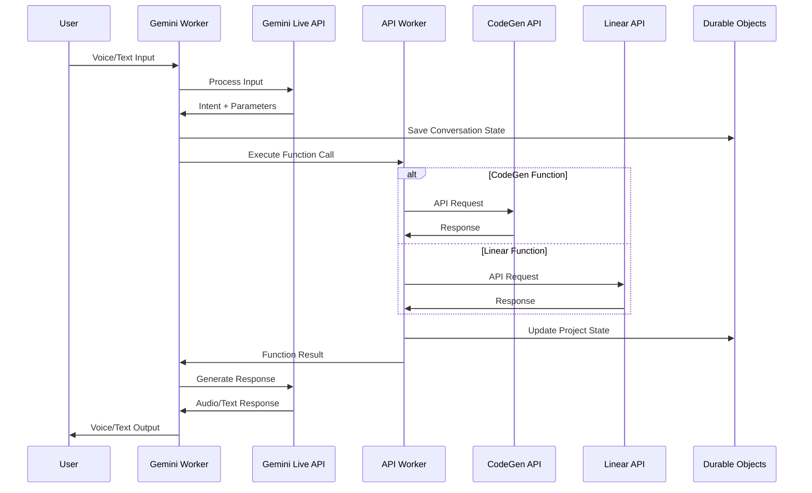
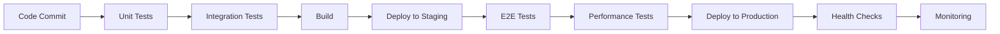

# Architecture Document: Gemini Live Interface to CodeGen

## Executive Summary

This document defines the comprehensive architecture for the Gemini Live Interface to CodeGen project, a voice and text-enabled interface that enables natural language interaction with CodeGen's project management and development capabilities through Google's Gemini Live API.

## 1. Technology Stack Selection

### 1.1 Core Technologies

| Component | Technology | Justification |
|-----------|------------|---------------|
| **Primary Language** | TypeScript with Effect TS | Strongly typed functional programming paradigm ensures type safety, composability, and robust error handling essential for API orchestration |
| **Runtime Environment** | Cloudflare Workers | Edge computing for low latency, global distribution, and serverless scalability |
| **State Management** | Cloudflare Durable Objects | Persistent, consistent state management for conversation context and project tracking |
| **Voice Processing** | Gemini Live API | Google's state-of-the-art real-time voice processing with natural language understanding |
| **API Integration** | CodeGen API, Linear API | Direct integration with existing project management and development workflows |

### 1.2 Supporting Technologies

- **Authentication**: Cloudflare Access + JWT tokens
- **Caching**: Cloudflare KV for API response caching
- **Monitoring**: Cloudflare Analytics + Custom metrics
- **Testing**: Vitest for unit testing, Playwright for E2E testing
- **Build System**: Wrangler CLI for Cloudflare deployment

### 1.3 Technology Rationale

**Effect TS Selection**: Chosen for its functional programming paradigm that provides:
- Composable error handling through Effect types
- Type-safe async operations
- Built-in retry and timeout mechanisms
- Excellent testing capabilities

**Cloudflare Platform**: Selected for:
- Global edge distribution (sub-100ms latency worldwide)
- Durable Objects for consistent state management
- Built-in security and DDoS protection
- Cost-effective serverless model

## 2. System Architecture

### 2.1 High-Level Architecture



### 2.2 Component Architecture

#### 2.2.1 Gemini Worker (Voice Processing)
```typescript
interface GeminiWorker {
  // Real-time voice processing
  processVoiceInput(audioStream: ReadableStream): Promise<Intent>
  generateVoiceResponse(text: string): Promise<AudioBuffer>
  
  // Text processing fallback
  processTextInput(text: string): Promise<Intent>
  
  // Intent classification
  classifyIntent(input: string): Promise<IntentType>
}
```

#### 2.2.2 API Worker (Function Calling)
```typescript
interface APIWorker {
  // CodeGen API integration
  executeCodeGenFunction(func: CodeGenFunction): Promise<Result>
  getProjectStatus(projectId: string): Promise<ProjectStatus>
  createIssue(issue: IssueRequest): Promise<Issue>
  
  // Linear API integration
  executeLinearFunction(func: LinearFunction): Promise<Result>
  updateIssueStatus(issueId: string, status: Status): Promise<void>
  addComment(issueId: string, comment: string): Promise<void>
}
```

#### 2.2.3 State Worker (State Management)
```typescript
interface StateWorker {
  // Conversation management
  saveConversationState(state: ConversationState): Promise<void>
  getConversationHistory(userId: string): Promise<ConversationState[]>
  
  // Project tracking
  updateProjectState(projectId: string, state: ProjectState): Promise<void>
  getActiveProjects(userId: string): Promise<ProjectState[]>
}
```

### 2.3 Communication Flow



## 3. API Design

### 3.1 Function Calling Framework

#### 3.1.1 Function Registry
```typescript
interface FunctionRegistry {
  codegenFunctions: Map<string, CodeGenFunction>
  linearFunctions: Map<string, LinearFunction>
  systemFunctions: Map<string, SystemFunction>
}

interface Function {
  name: string
  description: string
  parameters: JSONSchema
  execute: (params: any) => Promise<Result>
}
```

#### 3.1.2 CodeGen API Integration
```typescript
interface CodeGenAPI {
  // Project Management
  getProjects(): Promise<Project[]>
  getProjectStatus(projectId: string): Promise<ProjectStatus>
  createProject(project: ProjectRequest): Promise<Project>
  
  // Agent Coordination
  getAgents(): Promise<Agent[]>
  assignTask(agentId: string, task: Task): Promise<Assignment>
  getTaskStatus(taskId: string): Promise<TaskStatus>
  
  // Issue Management
  createIssue(issue: IssueRequest): Promise<Issue>
  updateIssue(issueId: string, update: IssueUpdate): Promise<Issue>
  getIssues(filter: IssueFilter): Promise<Issue[]>
}
```

#### 3.1.3 Linear API Integration
```typescript
interface LinearAPI {
  // Issue Operations
  getIssues(teamId: string): Promise<Issue[]>
  createIssue(issue: IssueInput): Promise<Issue>
  updateIssue(issueId: string, input: IssueUpdateInput): Promise<Issue>
  
  // Project Operations
  getProjects(): Promise<Project[]>
  updateProject(projectId: string, input: ProjectUpdateInput): Promise<Project>
  
  // Comment Operations
  addComment(issueId: string, body: string): Promise<Comment>
  getComments(issueId: string): Promise<Comment[]>
}
```

### 3.2 Authentication & Security

#### 3.2.1 API Key Management
```typescript
interface SecurityManager {
  // Secure key storage in Cloudflare environment variables
  getAPIKey(service: 'gemini' | 'codegen' | 'linear'): Promise<string>
  
  // User authentication
  authenticateUser(token: string): Promise<User>
  generateSessionToken(userId: string): Promise<string>
  
  // Request validation
  validateRequest(request: Request): Promise<boolean>
}
```

#### 3.2.2 Rate Limiting
```typescript
interface RateLimiter {
  checkLimit(userId: string, endpoint: string): Promise<boolean>
  incrementUsage(userId: string, endpoint: string): Promise<void>
  getRemainingQuota(userId: string): Promise<Quota>
}
```

## 4. Data Model

### 4.1 Core Data Structures

#### 4.1.1 Conversation State
```typescript
interface ConversationState {
  id: string
  userId: string
  sessionId: string
  messages: Message[]
  context: ConversationContext
  createdAt: Date
  updatedAt: Date
}

interface Message {
  id: string
  type: 'user' | 'assistant'
  content: string
  audioUrl?: string
  timestamp: Date
  intent?: Intent
}

interface ConversationContext {
  activeProject?: string
  activeIssue?: string
  lastAction?: string
  userPreferences: UserPreferences
}
```

#### 4.1.2 Project State
```typescript
interface ProjectState {
  id: string
  name: string
  status: ProjectStatus
  issues: IssueState[]
  agents: AgentState[]
  lastUpdate: Date
  metrics: ProjectMetrics
}

interface IssueState {
  id: string
  title: string
  status: IssueStatus
  assignee?: string
  priority: Priority
  labels: string[]
  comments: Comment[]
}

interface AgentState {
  id: string
  name: string
  status: AgentStatus
  currentTask?: string
  lastActivity: Date
}
```

#### 4.1.3 User Preferences
```typescript
interface UserPreferences {
  communicationMode: 'voice' | 'text' | 'both'
  voiceSettings: VoiceSettings
  notificationSettings: NotificationSettings
  defaultProject?: string
  timezone: string
}

interface VoiceSettings {
  language: string
  voice: string
  speed: number
  pitch: number
}

interface NotificationSettings {
  projectUpdates: boolean
  issueAssignments: boolean
  agentCompletions: boolean
  urgentOnly: boolean
}
```

### 4.2 Data Storage Strategy

#### 4.2.1 Durable Objects Storage
- **Conversation State**: Stored in Conversation Durable Objects
- **Project State**: Stored in Project Durable Objects  
- **User State**: Stored in User Durable Objects

#### 4.2.2 KV Storage
- **API Response Cache**: Temporary caching of API responses
- **User Sessions**: Session tokens and temporary data
- **Configuration**: Application configuration and feature flags

#### 4.2.3 R2 Storage
- **Audio Files**: Voice recordings and generated audio responses
- **Logs**: Application logs and audit trails
- **Backups**: Periodic backups of critical state data

## 5. Non-Functional Requirements Implementation

### 5.1 Performance Requirements

#### 5.1.1 Response Time Targets
- **Voice Processing**: < 500ms for intent recognition
- **API Calls**: < 1000ms for CodeGen/Linear API responses
- **Voice Generation**: < 800ms for audio response generation
- **Overall Response**: < 2000ms end-to-end for simple queries

#### 5.1.2 Performance Optimization Strategies
```typescript
interface PerformanceOptimizer {
  // Caching strategies
  cacheAPIResponse(key: string, response: any, ttl: number): Promise<void>
  getCachedResponse(key: string): Promise<any | null>
  
  // Request batching
  batchAPIRequests(requests: APIRequest[]): Promise<APIResponse[]>
  
  // Parallel processing
  executeParallel<T>(tasks: Promise<T>[]): Promise<T[]>
}
```

### 5.2 Reliability Requirements

#### 5.2.1 Error Handling Strategy
```typescript
interface ErrorHandler {
  // Retry mechanisms
  retryWithBackoff<T>(operation: () => Promise<T>, maxRetries: number): Promise<T>
  
  // Circuit breaker pattern
  executeWithCircuitBreaker<T>(operation: () => Promise<T>): Promise<T>
  
  // Graceful degradation
  fallbackToTextMode(): Promise<void>
  fallbackToCache(): Promise<any>
}
```

#### 5.2.2 Health Monitoring
```typescript
interface HealthMonitor {
  checkAPIHealth(service: string): Promise<HealthStatus>
  recordMetric(metric: string, value: number): Promise<void>
  getSystemHealth(): Promise<SystemHealth>
}
```

### 5.3 Security Requirements

#### 5.3.1 Data Protection
- **Encryption**: All data encrypted at rest and in transit
- **API Keys**: Stored in Cloudflare environment variables
- **User Data**: GDPR compliant data handling
- **Audit Logging**: Complete audit trail of all actions

#### 5.3.2 Access Control
```typescript
interface AccessControl {
  validateUserAccess(userId: string, resource: string): Promise<boolean>
  checkAPIPermissions(userId: string, apiEndpoint: string): Promise<boolean>
  logAccess(userId: string, action: string, resource: string): Promise<void>
}
```

### 5.4 Scalability Requirements

#### 5.4.1 Horizontal Scaling
- **Cloudflare Workers**: Automatic scaling based on demand
- **Durable Objects**: Distributed state management
- **Global Distribution**: Edge deployment for worldwide access

#### 5.4.2 Resource Management
```typescript
interface ResourceManager {
  allocateWorker(workload: Workload): Promise<Worker>
  scaleResources(demand: Demand): Promise<void>
  optimizeResourceUsage(): Promise<OptimizationResult>
}
```

## 6. Testing Strategy

### 6.1 Testing Pyramid

#### 6.1.1 Unit Testing (70%)
```typescript
// Example unit test structure
describe('GeminiWorker', () => {
  describe('processVoiceInput', () => {
    it('should classify intent correctly', async () => {
      const worker = new GeminiWorker()
      const intent = await worker.classifyIntent('Create a new issue')
      expect(intent.type).toBe('CREATE_ISSUE')
    })
  })
})
```

#### 6.1.2 Integration Testing (20%)
```typescript
// Example integration test
describe('API Integration', () => {
  it('should create issue in Linear via API worker', async () => {
    const apiWorker = new APIWorker()
    const result = await apiWorker.executeLinearFunction({
      name: 'createIssue',
      parameters: { title: 'Test Issue', teamId: 'team-123' }
    })
    expect(result.success).toBe(true)
  })
})
```

#### 6.1.3 End-to-End Testing (10%)
```typescript
// Example E2E test with Playwright
test('voice command creates issue', async ({ page }) => {
  await page.goto('/voice-interface')
  await page.click('[data-testid="voice-input"]')
  // Simulate voice input
  await page.evaluate(() => {
    window.simulateVoiceInput('Create an issue for fixing the login bug')
  })
  await expect(page.locator('[data-testid="response"]')).toContainText('Issue created')
})
```

### 6.2 Testing Infrastructure

#### 6.2.1 Mock Services
```typescript
interface MockServices {
  mockGeminiAPI: MockGeminiAPI
  mockCodeGenAPI: MockCodeGenAPI
  mockLinearAPI: MockLinearAPI
}

class MockGeminiAPI implements GeminiAPI {
  async processVoice(audio: AudioBuffer): Promise<Intent> {
    return { type: 'CREATE_ISSUE', parameters: { title: 'Test Issue' } }
  }
}
```

#### 6.2.2 Test Data Management
```typescript
interface TestDataManager {
  createTestUser(): Promise<User>
  createTestProject(): Promise<Project>
  createTestConversation(): Promise<ConversationState>
  cleanupTestData(): Promise<void>
}
```

### 6.3 Performance Testing

#### 6.3.1 Load Testing
```typescript
interface LoadTester {
  simulateConcurrentUsers(count: number): Promise<LoadTestResult>
  testAPIEndpoints(endpoints: string[]): Promise<PerformanceMetrics>
  measureResponseTimes(): Promise<ResponseTimeMetrics>
}
```

#### 6.3.2 Voice Processing Testing
```typescript
interface VoiceTestSuite {
  testVoiceRecognitionAccuracy(): Promise<AccuracyMetrics>
  testAudioQuality(): Promise<QualityMetrics>
  testLatencyMeasurements(): Promise<LatencyMetrics>
}
```

## 7. Deployment Architecture

### 7.1 Environment Strategy

#### 7.1.1 Environment Configuration
```typescript
interface EnvironmentConfig {
  development: {
    geminiAPIKey: string
    codegenAPIEndpoint: string
    linearAPIKey: string
    logLevel: 'debug'
  }
  staging: {
    geminiAPIKey: string
    codegenAPIEndpoint: string
    linearAPIKey: string
    logLevel: 'info'
  }
  production: {
    geminiAPIKey: string
    codegenAPIEndpoint: string
    linearAPIKey: string
    logLevel: 'error'
  }
}
```

#### 7.1.2 Deployment Pipeline


### 7.2 Monitoring and Observability

#### 7.2.1 Metrics Collection
```typescript
interface MetricsCollector {
  recordAPILatency(endpoint: string, latency: number): void
  recordErrorRate(service: string, errorCount: number): void
  recordUserActivity(userId: string, action: string): void
  recordResourceUsage(resource: string, usage: number): void
}
```

#### 7.2.2 Alerting Strategy
```typescript
interface AlertManager {
  setupAlerts(): Promise<void>
  triggerAlert(severity: AlertSeverity, message: string): Promise<void>
  escalateAlert(alertId: string): Promise<void>
}

enum AlertSeverity {
  INFO = 'info',
  WARNING = 'warning',
  ERROR = 'error',
  CRITICAL = 'critical'
}
```

## 8. Migration and Rollout Strategy

### 8.1 Phased Rollout

#### Phase 1: Core Infrastructure (Weeks 1-2)
- Set up Cloudflare Workers and Durable Objects
- Implement basic API integration framework
- Create authentication and security layer

#### Phase 2: Voice Processing (Weeks 3-4)
- Integrate Gemini Live API
- Implement voice input/output processing
- Add intent classification system

#### Phase 3: Function Calling (Weeks 5-6)
- Implement CodeGen API integration
- Add Linear API integration
- Create function calling orchestration

#### Phase 4: State Management (Weeks 7-8)
- Implement conversation state management
- Add project state tracking
- Create user preference system

#### Phase 5: Testing and Optimization (Weeks 9-10)
- Comprehensive testing suite
- Performance optimization
- Security audit and hardening

### 8.2 Risk Mitigation

#### 8.2.1 Technical Risks
- **API Rate Limits**: Implement intelligent caching and request batching
- **Voice Processing Latency**: Add fallback to text mode
- **State Consistency**: Use Durable Objects for strong consistency
- **Security Vulnerabilities**: Regular security audits and penetration testing

#### 8.2.2 Operational Risks
- **Service Dependencies**: Implement circuit breakers and fallback mechanisms
- **Data Loss**: Regular backups and disaster recovery procedures
- **Performance Degradation**: Continuous monitoring and auto-scaling
- **User Adoption**: Comprehensive documentation and training materials

## 9. Future Considerations

### 9.1 Extensibility

#### 9.1.1 Plugin Architecture
```typescript
interface PluginSystem {
  registerPlugin(plugin: Plugin): Promise<void>
  executePlugin(pluginId: string, params: any): Promise<any>
  listPlugins(): Promise<Plugin[]>
}

interface Plugin {
  id: string
  name: string
  version: string
  execute: (params: any) => Promise<any>
}
```

#### 9.1.2 Multi-tenant Support
```typescript
interface TenantManager {
  createTenant(tenant: TenantConfig): Promise<Tenant>
  getTenantConfig(tenantId: string): Promise<TenantConfig>
  isolateTenantData(tenantId: string): Promise<void>
}
```

### 9.2 Advanced Features

#### 9.2.1 AI-Powered Insights
- Predictive project completion times
- Automated issue prioritization
- Intelligent resource allocation
- Pattern recognition in development workflows

#### 9.2.2 Enhanced Collaboration
- Multi-user voice conferences
- Real-time collaborative editing
- Team-wide notification systems
- Integration with additional project management tools

## 10. Conclusion

This architecture provides a robust, scalable foundation for the Gemini Live Interface to CodeGen project. The combination of TypeScript with Effect TS, Cloudflare's edge computing platform, and comprehensive API integration creates a system that can deliver sub-second response times while maintaining high reliability and security standards.

The modular design allows for incremental development and testing, while the comprehensive monitoring and observability strategy ensures operational excellence. The architecture is designed to scale from personal use to team-wide deployment, with clear extension points for future enhancements.

Key architectural decisions prioritize:
- **Type Safety**: Through TypeScript and Effect TS
- **Performance**: Through edge computing and intelligent caching
- **Reliability**: Through comprehensive error handling and fallback mechanisms
- **Security**: Through encrypted communications and secure API key management
- **Scalability**: Through serverless architecture and global distribution

This foundation will enable the development of a world-class voice interface that seamlessly integrates with existing development workflows while providing an intuitive, natural language interface for project management and development tasks.

