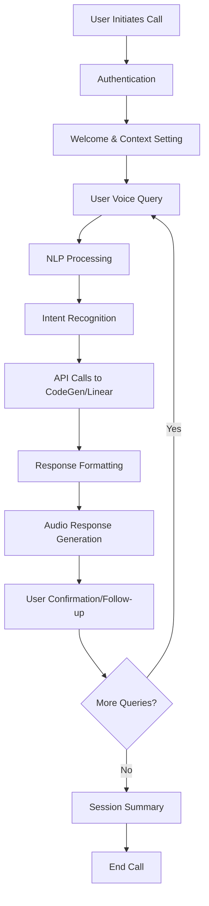
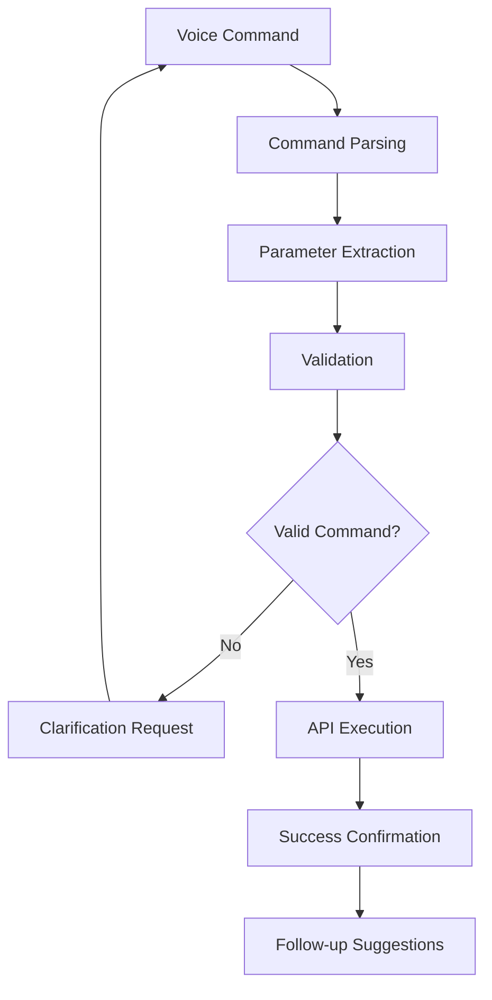
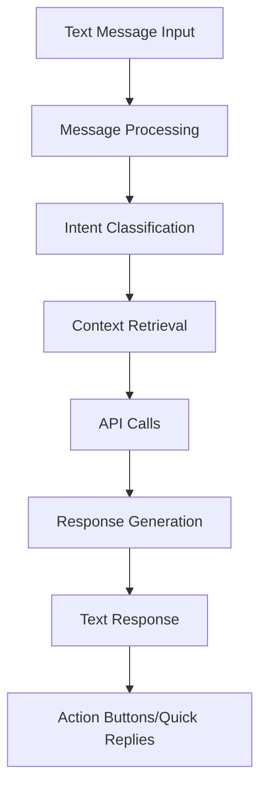
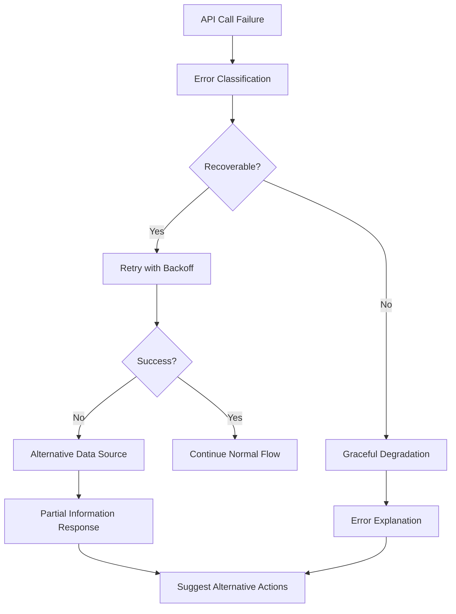
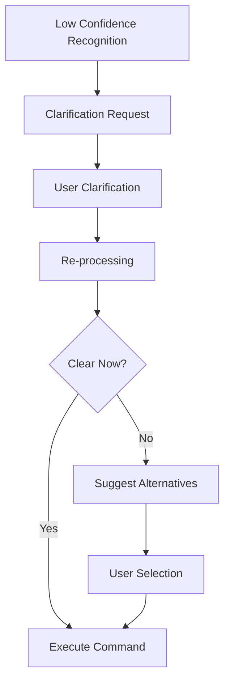

# UX/UI Plan: Gemini Live Interface to CodeGen

## Executive Summary

This document outlines the comprehensive UX/UI plan for the Gemini Live Interface to CodeGen project. The interface enables seamless voice and text interaction with CodeGen through Gemini, supporting the vision of "pick up the phone and get an audio report" for project oversight and management.

## Table of Contents

1. [User Personas and Journeys](#user-personas-and-journeys)
2. [Information Architecture](#information-architecture)
3. [User Flows](#user-flows)
4. [Screen Inventory](#screen-inventory)
5. [Component Patterns](#component-patterns)
6. [Visual Design Guidelines](#visual-design-guidelines)
7. [Accessibility Considerations](#accessibility-considerations)
8. [Technical Implementation Notes](#technical-implementation-notes)

---

## User Personas and Journeys

### Primary Persona: The Project Manager

**Profile**: Alex Chen, Senior Engineering Manager
- **Role**: Manages 3-5 AI agents and multiple CodeGen projects simultaneously
- **Context**: Often mobile, commuting, or in meetings
- **Pain Points**: 
  - Needs quick project status without opening multiple tools
  - Limited time for detailed dashboard reviews
  - Requires immediate awareness of blockers or urgent issues
- **Goals**: 
  - Efficient project oversight
  - Quick decision-making capabilities
  - Seamless multitasking

### Core User Journeys

#### Journey 1: Morning Commute Status Check
```
Trigger: Alex starts commute, wants project overview
1. Initiates voice call to Gemini Live Interface
2. "What's the status of my projects?"
3. Receives structured audio summary of all active projects
4. Asks follow-up: "What's blocking the authentication project?"
5. Gets detailed blocker information with suggested actions
6. "Move the database migration task to in-progress"
7. Receives confirmation of status update
```

#### Journey 2: Emergency Project Intervention
```
Trigger: Critical issue notification while away from computer
1. Calls Gemini Live Interface
2. "What's the urgent issue with Project Alpha?"
3. Receives detailed problem description
4. "Assign the bug fix to Agent Beta and set priority to high"
5. Gets confirmation and next steps
6. "Send me a text summary to review later"
7. Receives follow-up text message with action items
```

#### Journey 3: End-of-Day Progress Review
```
Trigger: Wants to review day's progress before leaving office
1. Opens text interface on mobile
2. Types: "Summary of today's progress"
3. Reviews structured progress report
4. Identifies items needing attention tomorrow
5. Sets reminders: "Remind me to check deployment status tomorrow at 9 AM"
6. Receives confirmation of scheduled reminder
```

#### Journey 4: Quick Task Management
```
Trigger: Remembers task while multitasking
1. Quick voice command: "Add task: Review API documentation for Project Gamma"
2. System confirms task creation and suggests assignment
3. "Assign to Agent Delta, due Friday"
4. Receives confirmation and calendar integration
```

---

## Information Architecture

### Hierarchical Structure

```
Organization Level
├── Projects
│   ├── Project Status (Active, Paused, Completed)
│   ├── Issues
│   │   ├── Issue Status (Open, In Progress, Blocked, Done)
│   │   ├── Priority Level (Low, Medium, High, Critical)
│   │   └── Assignee Information
│   └── Tasks
│       ├── Task Status
│       ├── Dependencies
│       └── Deadlines
├── Agents
│   ├── Agent Status (Active, Idle, Offline)
│   ├── Current Assignments
│   ├── Performance Metrics
│   └── Availability
└── System Status
    ├── API Health
    ├── Integration Status
    └── Recent Activities
```

### Context Awareness Framework

**Session Context**:
- User identity and permissions
- Recent conversation history
- Current project focus
- Time-sensitive items

**Project Context**:
- Active projects and their priorities
- Recent changes and updates
- Pending decisions
- Blocker identification

**Agent Context**:
- Agent availability and workload
- Skill matching for task assignment
- Performance history
- Current task progress

### Natural Language Processing Intent Categories

**Status Queries**:
- Project status requests
- Agent availability checks
- Issue and task status
- System health inquiries

**Action Commands**:
- Task creation and assignment
- Status updates and transitions
- Priority adjustments
- Deadline modifications

**Reporting Requests**:
- Progress summaries
- Performance reports
- Blocker analysis
- Timeline projections

---

## User Flows

### Voice Interaction Flows

#### Primary Voice Flow: Status Query


#### Voice Command Flow: Task Management


### Text Interaction Flows

#### Asynchronous Text Flow


### Error Handling Flows

#### API Failure Recovery


#### Misunderstood Command Flow


---

## Screen Inventory

### Voice Interface Components

#### Audio Processing Components
- **Voice Input Processor**
  - Real-time speech recognition
  - Noise cancellation
  - Speaker identification
  - Confidence scoring

- **Audio Output Generator**
  - Text-to-speech synthesis
  - Voice modulation for emphasis
  - Pause and pacing control
  - Background audio management

#### Visual Feedback Components (When Screen Available)
- **Conversation State Indicator**
  - Listening state (animated microphone)
  - Processing state (thinking animation)
  - Speaking state (audio waveform)
  - Error state (warning indicators)

- **Command Recognition Display**
  - Real-time transcription
  - Confidence indicators
  - Command parsing visualization
  - Correction interface

### Text Interface Components

#### Chat Interface
- **Message Input Area**
  - Text input field with auto-complete
  - Voice-to-text toggle
  - Quick action buttons
  - Attachment support

- **Conversation Display**
  - Message bubbles with timestamps
  - User/system message differentiation
  - Rich content support (links, buttons)
  - Message status indicators

#### Dashboard Components
- **Project Overview Cards**
  - Project name and status
  - Progress indicators
  - Key metrics display
  - Quick action buttons

- **Agent Status Panel**
  - Agent availability indicators
  - Current task assignments
  - Performance metrics
  - Communication options

#### Navigation and Controls
- **Quick Access Menu**
  - Favorite commands
  - Recent projects
  - Saved queries
  - Settings access

- **Command History**
  - Recent command list
  - Favorite commands
  - Command templates
  - Search functionality

---

## Component Patterns

### Voice Command Patterns

#### Status Query Patterns
```
Primary Patterns:
- "What's the status of [project/issue/agent]?"
- "How is [project name] progressing?"
- "Show me [project/agent] status"
- "What's the current state of [item]?"

Variations:
- "Give me an update on..."
- "Tell me about..."
- "What's happening with..."
- "How are we doing on..."
```

#### Action Command Patterns
```
Task Management:
- "Create a task: [description]"
- "Assign [task] to [agent]"
- "Move [item] to [status]"
- "Set priority of [item] to [level]"

Status Updates:
- "Mark [item] as [status]"
- "Update [item] status to [new status]"
- "Change [item] from [old status] to [new status]"

Scheduling:
- "Schedule [task] for [date/time]"
- "Set deadline for [item] to [date]"
- "Remind me about [item] [when]"
```

#### Information Request Patterns
```
Reporting:
- "Give me a summary of [timeframe]"
- "What's blocking [project]?"
- "Show me today's progress"
- "What needs my attention?"

Analysis:
- "Why is [item] delayed?"
- "What are the risks for [project]?"
- "How can we speed up [process]?"
- "What's the timeline for [deliverable]?"
```

### Response Formatting Patterns

#### Structured Audio Responses
```
Status Response Format:
1. Acknowledgment: "Here's the status of Project Alpha"
2. High-level summary: "Overall, the project is 70% complete and on track"
3. Key details: "3 tasks completed this week, 2 in progress, 1 blocked"
4. Action items: "The blocked task needs your approval for the API change"
5. Next steps: "Would you like me to provide more details or take any actions?"
```

#### Confirmation Patterns
```
Command Confirmation:
1. Action acknowledgment: "I've moved the authentication task to in-progress"
2. Impact summary: "This affects 2 dependent tasks"
3. Next steps: "Agent Beta has been notified and will begin work"
4. Follow-up offer: "Is there anything else you'd like me to update?"
```

### Interactive Elements

#### Quick Reply Buttons (Text Interface)
- "Show Details"
- "Take Action"
- "Assign Task"
- "Set Reminder"
- "Get Summary"
- "Contact Agent"

#### Voice Response Prompts
- "Say 'details' for more information"
- "Say 'yes' to confirm or 'no' to cancel"
- "You can ask about other projects or say 'done' to finish"

---

## Visual Design Guidelines

### Design Principles

#### Voice-First Philosophy
- **Minimal Visual Dependency**: Interface functions completely through audio
- **Visual Enhancement**: Screen elements support but don't replace voice interaction
- **Progressive Disclosure**: Visual details appear only when beneficial
- **Contextual Relevance**: Visual elements adapt to conversation state

#### Mobile-First Approach
- **Touch-Friendly**: All interactive elements sized for finger navigation
- **One-Handed Operation**: Critical functions accessible with thumb
- **Landscape Compatibility**: Interface adapts to device orientation
- **Offline Graceful**: Core functions work without internet connection

### Visual Hierarchy

#### Typography Scale
```
H1 - Project Names: 24px, Bold
H2 - Section Headers: 20px, Semi-bold
H3 - Subsection Headers: 18px, Medium
Body - Main Content: 16px, Regular
Caption - Metadata: 14px, Regular
Small - Timestamps: 12px, Light
```

#### Color System
```
Primary Colors:
- Voice Active: #00C851 (Green)
- Processing: #FF8800 (Orange)
- Error: #FF4444 (Red)
- Success: #00C851 (Green)

Secondary Colors:
- Background: #F8F9FA (Light Gray)
- Surface: #FFFFFF (White)
- Text Primary: #212529 (Dark Gray)
- Text Secondary: #6C757D (Medium Gray)

Status Colors:
- In Progress: #007BFF (Blue)
- Completed: #28A745 (Green)
- Blocked: #DC3545 (Red)
- Pending: #FFC107 (Yellow)
```

#### Spacing System
```
Base Unit: 8px
- XS: 4px (0.5 units)
- S: 8px (1 unit)
- M: 16px (2 units)
- L: 24px (3 units)
- XL: 32px (4 units)
- XXL: 48px (6 units)
```

### Component Specifications

#### Voice State Indicator
```
Listening State:
- Animated microphone icon
- Pulsing green ring
- "Listening..." text
- Audio level visualization

Processing State:
- Spinning loader
- Orange accent color
- "Processing..." text
- Estimated time remaining

Speaking State:
- Audio waveform animation
- Blue accent color
- Transcript display
- Pause/stop controls
```

#### Status Cards
```
Project Status Card:
- Header: Project name + status badge
- Body: Progress bar + key metrics
- Footer: Last updated + quick actions
- Dimensions: Full width, 120px height
- Border radius: 8px
- Shadow: 0 2px 4px rgba(0,0,0,0.1)
```

#### Message Bubbles
```
User Messages:
- Background: #007BFF
- Text color: White
- Alignment: Right
- Border radius: 18px 18px 4px 18px

System Messages:
- Background: #F8F9FA
- Text color: #212529
- Alignment: Left
- Border radius: 18px 18px 18px 4px
```

---

## Accessibility Considerations

### Voice Accessibility

#### Speech Recognition Optimization
- **Multi-accent Support**: Recognition trained on diverse speech patterns
- **Noise Robustness**: Background noise filtering and adaptation
- **Speech Impediment Accommodation**: Alternative recognition models
- **Language Flexibility**: Support for multiple languages and dialects

#### Speech Synthesis Quality
- **Natural Prosody**: Human-like intonation and pacing
- **Clarity Optimization**: Clear pronunciation of technical terms
- **Speed Control**: User-adjustable playback speed
- **Voice Selection**: Multiple voice options for user preference

### Alternative Input Methods

#### Text Backup Systems
- **Voice-to-Text Fallback**: Automatic transcription when voice fails
- **Keyboard Navigation**: Full functionality via keyboard shortcuts
- **Touch Interface**: Complete touch-based alternative to voice
- **External Input**: Support for assistive input devices

#### Visual Accessibility
- **High Contrast Mode**: Enhanced color contrast for visual impairments
- **Large Text Support**: Scalable text up to 200% without layout breaking
- **Screen Reader Compatibility**: Full ARIA labeling and semantic markup
- **Focus Management**: Clear focus indicators and logical tab order

### Hearing Impairment Support

#### Visual Indicators
- **Status Visualization**: Visual representation of all audio feedback
- **Progress Indicators**: Visual progress bars for ongoing operations
- **Alert Systems**: Visual notifications for important updates
- **Vibration Patterns**: Haptic feedback for mobile devices

#### Text Alternatives
- **Live Transcription**: Real-time text display of all audio content
- **Command History**: Visual log of all voice commands and responses
- **Text Summaries**: Written summaries of audio reports
- **Chat Interface**: Full-featured text-based alternative

### Motor Accessibility

#### Hands-Free Operation
- **Voice-Only Mode**: Complete functionality without manual input
- **Eye Tracking Support**: Integration with eye-tracking devices
- **Switch Navigation**: Support for single-switch input devices
- **Gesture Recognition**: Basic gesture controls for mobile devices

#### Reduced Dexterity Support
- **Large Touch Targets**: Minimum 44px touch targets
- **Simplified Gestures**: Basic tap and swipe only
- **Timeout Extensions**: Adjustable timeout periods
- **Error Forgiveness**: Easy correction of accidental inputs

---

## Technical Implementation Notes

### Voice Processing Architecture

#### Real-Time Processing Pipeline
```
Audio Input → Noise Reduction → Speech Recognition → 
Intent Classification → Context Integration → Response Generation → 
Text-to-Speech → Audio Output
```

#### Performance Requirements
- **Latency**: < 500ms for simple queries, < 2s for complex operations
- **Accuracy**: > 95% for common commands, > 90% for complex queries
- **Availability**: 99.9% uptime for voice processing services
- **Scalability**: Support for 1000+ concurrent voice sessions

### Integration Points

#### CodeGen API Integration
- **Authentication**: OAuth 2.0 with refresh token management
- **Rate Limiting**: Respect API limits with intelligent queuing
- **Error Handling**: Graceful degradation for API failures
- **Caching**: Smart caching of frequently accessed data

#### Linear API Integration
- **Real-Time Updates**: Webhook integration for live status updates
- **Bulk Operations**: Efficient batch processing for multiple updates
- **Conflict Resolution**: Handling of concurrent modifications
- **Data Synchronization**: Consistent state across all interfaces

### State Management

#### Conversation Context
- **Session Persistence**: Maintain context across conversation turns
- **User Preferences**: Remember user-specific settings and patterns
- **Project Context**: Track current project focus and recent activities
- **Command History**: Store and learn from user command patterns

#### Data Consistency
- **Optimistic Updates**: Immediate UI feedback with background sync
- **Conflict Resolution**: Handle simultaneous updates gracefully
- **Offline Support**: Queue operations when connectivity is limited
- **Sync Indicators**: Clear status of data synchronization

### Security Considerations

#### Authentication & Authorization
- **Multi-Factor Authentication**: Support for 2FA and biometric auth
- **Role-Based Access**: Granular permissions for different user types
- **Session Management**: Secure session handling with automatic timeout
- **API Security**: Encrypted communication and secure token storage

#### Privacy Protection
- **Voice Data Handling**: Minimal retention of voice recordings
- **Data Encryption**: End-to-end encryption for sensitive information
- **Audit Logging**: Comprehensive logging for security monitoring
- **Compliance**: GDPR and other privacy regulation compliance

---

## Success Metrics and KPIs

### User Experience Metrics
- **Task Completion Rate**: % of voice commands successfully executed
- **User Satisfaction**: Net Promoter Score and user feedback ratings
- **Adoption Rate**: % of users actively using voice interface
- **Session Duration**: Average length of voice interaction sessions

### Performance Metrics
- **Response Time**: Average time from voice input to audio response
- **Recognition Accuracy**: % of voice commands correctly interpreted
- **System Availability**: Uptime percentage for voice services
- **Error Rate**: % of interactions resulting in errors or failures

### Business Impact Metrics
- **Productivity Improvement**: Time saved compared to traditional interfaces
- **User Engagement**: Frequency of interface usage
- **Feature Utilization**: Most and least used voice commands
- **Support Reduction**: Decrease in support tickets related to project management

---

## Implementation Roadmap

### Phase 1: Core Voice Interface (Weeks 1-4)
- Basic voice recognition and synthesis
- Simple status query commands
- Text interface fallback
- Authentication integration

### Phase 2: Advanced Commands (Weeks 5-8)
- Task management commands
- Agent interaction capabilities
- Error handling and recovery
- Mobile interface optimization

### Phase 3: Intelligence & Personalization (Weeks 9-12)
- Context awareness and learning
- Personalized response patterns
- Advanced natural language processing
- Performance optimization

### Phase 4: Advanced Features (Weeks 13-16)
- Multi-language support
- Advanced accessibility features
- Integration with external tools
- Analytics and reporting dashboard

---

## Conclusion

This UX/UI plan provides a comprehensive framework for building a voice-first interface that enables seamless project management through natural conversation. The design prioritizes accessibility, mobile-first interaction, and intelligent context awareness while maintaining the flexibility to support both voice and text-based interactions.

The success of this interface will be measured not just by technical performance, but by how effectively it enables users to manage their projects while maintaining their focus on other activities. The "pick up the phone and get an audio report" vision drives every design decision, ensuring that the interface truly serves the needs of busy project managers who need efficient, hands-free project oversight capabilities.

