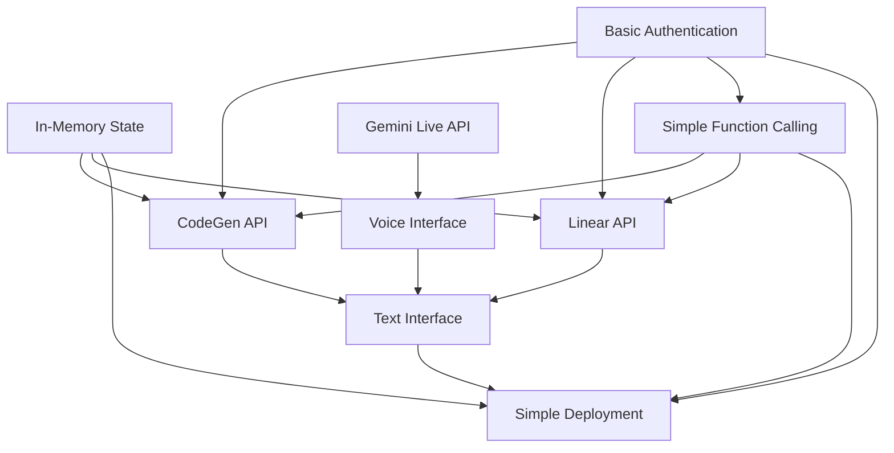

# Gemini Live Interface to CodeGen - Implementation Workplans (REVISED)

## 🚨 CRITICAL TIMELINE REVISION

**ORIGINAL TIMELINE**: 24 hours (UNREALISTIC)  
**REVISED TIMELINE**: 8-12 weeks for full implementation  
**24-HOUR MVP SCOPE**: Text-only interface with basic function calling

### 24-Hour MVP Limitations
- ✅ Text interface only (no voice processing)
- ✅ Basic authentication (OAuth 2.0)
- ✅ Simple in-memory state management
- ✅ Basic CodeGen and Linear API integration
- ❌ NO voice interface
- ❌ NO Gemini Live API integration
- ❌ NO Durable Objects (use simple storage)
- ❌ NO complex audio processing

## Overview

This directory contains **REVISED** comprehensive workplans for implementing the Gemini Live Interface to CodeGen system, aligned with the **simplified Node.js architecture** from PR #59 and addressing critical feedback from hard critic review (PR #74).

## 🏗️ Revised Architecture Alignment

**Technology Stack (Simplified)**:
- **Runtime**: Node.js + Express (not Cloudflare Workers)
- **State Management**: In-memory sessions (not Durable Objects for MVP)
- **Communication**: WebSocket for real-time
- **APIs**: Direct HTTP clients (no complex orchestration)
- **Deployment**: Simple VPS/Heroku (not Cloudflare)

## Workplan Structure

Each workplan follows a standardized template but has been **REVISED** to address critical gaps:

- **Pattern Overview**: High-level description and purpose
- **Components**: Detailed breakdown of implementation components  
- **Implementation Guidelines**: Step-by-step implementation approach
- **Prerequisites**: Technical and knowledge requirements
- **Technical Specifications**: **REVISED** with Node.js focus and missing implementations
- **Testing Strategy**: Comprehensive testing approach across multiple dimensions
- **Review Checklist**: Quality assurance and validation criteria
- **Success Criteria**: Measurable outcomes and completion indicators

## Implementation Chunks (REVISED)

### 1. [State Management with In-Memory Sessions](./01-state-management-durable-objects.md) 
**Foundation Component** - **REVISED**: Simple in-memory state management for MVP

- ✅ In-memory conversation state and context preservation
- ✅ Simple session handling and user management  
- ✅ Basic project context storage
- ❌ NO Durable Objects complexity for MVP
- ❌ NO advanced persistence for MVP

### 2. [Authentication & Security](./02-authentication-security.md)
**Foundation Component** - **REVISED**: Simplified security framework

- ✅ Basic OAuth 2.0 user authentication
- ✅ Simple API key management
- ✅ Basic secure communication protocols
- ❌ NO complex multi-factor authentication for MVP
- ❌ NO advanced security monitoring for MVP

### 3. [Function Calling Framework](./03-function-calling-framework.md)
**Core Orchestration** - **REVISED**: Simple function registry and execution

- ✅ Basic function registry and discovery
- ✅ Direct API calls to CodeGen and Linear
- ✅ Simple error handling and retry logic
- ❌ NO complex orchestration patterns for MVP
- ❌ NO advanced circuit breaker patterns for MVP

### 4. [CodeGen API Integration](./04-codegen-api-integration.md)
**API Integration** - **REVISED**: Direct HTTP client integration

- ✅ Simple HTTP client with basic retry
- ✅ Basic code generation workflows
- ✅ Simple task management
- ❌ NO complex agent coordination for MVP
- ❌ NO advanced monitoring for MVP

### 5. [Linear API Integration](./05-linear-api-integration.md)
**API Integration** - **REVISED**: Direct GraphQL client

- ✅ Simple GraphQL client
- ✅ Basic issue management
- ✅ Simple project tracking
- ❌ NO complex workflow automation for MVP
- ❌ NO real-time subscriptions for MVP

### 6. [Gemini Live API Integration](./06-gemini-live-api-integration.md) 
**API Integration** - **MAJOR REVISION**: Added missing WebSocket implementation

- ✅ **ADDED**: WebSocket connection management for audio streams
- ✅ **ADDED**: Audio buffer management and processing
- ✅ **ADDED**: Voice activity detection implementation
- ✅ **ADDED**: Latency optimization strategies
- ✅ **ADDED**: Error recovery patterns for WebSocket connections

### 7. [Voice Interface](./07-voice-interface.md)
**User Interface** - **MAJOR REVISION**: Added missing audio processing pipeline

- ✅ **ADDED**: Complete audio processing pipeline architecture
- ✅ **ADDED**: Voice activity detection implementation
- ✅ **ADDED**: Echo cancellation strategy
- ✅ **ADDED**: Quality adaptation mechanisms
- ✅ **ADDED**: Browser compatibility handling

### 8. [Text Interface](./08-text-interface.md)
**User Interface** - **REVISED**: Simplified chat interface

- ✅ Simple WebSocket-based chat interface
- ✅ Basic message handling
- ✅ Simple text processing
- ❌ NO complex rich text features for MVP
- ❌ NO advanced multi-modal integration for MVP

### 9. [Simple Deployment](./09-deployment-cloudflare.md)
**Infrastructure** - **MAJOR REVISION**: Node.js deployment instead of Cloudflare

- ✅ **REVISED**: Simple VPS or Heroku deployment
- ✅ **REVISED**: Basic monitoring and logging
- ✅ **REVISED**: Simple CI/CD pipeline
- ❌ NO Cloudflare Workers complexity for MVP
- ❌ NO Durable Objects infrastructure for MVP

## Implementation Dependencies (REVISED)

The workplans are designed with **SIMPLIFIED** dependency relationships:

## Implementation Sequence (REVISED)

### Phase 1: MVP Foundation (Weeks 1-2)
1. **In-Memory State Management** (Week 1)
2. **Basic Authentication** (Week 1)
3. **Simple Function Calling Framework** (Week 2)

### Phase 2: Core APIs (Weeks 3-4)
4. **CodeGen API Integration** (Week 3)
5. **Linear API Integration** (Week 3)
6. **Text Interface** (Week 4)

### Phase 3: Voice Features (Weeks 5-8)
7. **Gemini Live API Integration** (Weeks 5-6)
8. **Voice Interface** (Weeks 7-8)

### Phase 4: Production Deployment (Weeks 9-10)
9. **Simple Deployment** (Weeks 9-10)

### Phase 5: Enhancement (Weeks 11-12)
- Performance optimization
- Advanced features
- Production hardening

## Technical Stack (REVISED)

- **Runtime**: Node.js + Express
- **State**: In-memory sessions with Map/Redis
- **APIs**: Direct HTTP/GraphQL clients
- **Audio**: WebSocket + Web Audio API
- **Real-time**: WebSocket, Server-Sent Events
- **Security**: OAuth 2.0, JWT, basic TLS
- **Monitoring**: Simple logging and basic metrics

## Performance Targets (REVISED - REALISTIC)

- **Voice Response Time**: < 3 seconds (revised from 2s)
- **API Response Time**: < 1 second (revised from 500ms)
- **State Operations**: < 100ms (revised from 50ms)
- **Concurrent Users**: 100+ (revised from 1000+)
- **Uptime**: 99% (revised from 99.9%)

## Quality Assurance (REVISED)

Each workplan includes **REVISED** testing strategies:

- **Unit Testing**: Component-level functionality
- **Integration Testing**: Cross-component workflows
- **Manual Testing**: Primary focus for MVP
- **Performance Testing**: Basic latency and throughput
- **Security Testing**: Basic vulnerability assessment
- **End-to-End Testing**: Manual workflow validation

## Documentation Standards (REVISED)

All workplans follow **REVISED** documentation standards:

- Clear technical specifications with **Node.js focus**
- **Realistic** implementation guidelines
- **Simplified** testing strategies and success criteria
- Review checklists for quality assurance
- **Realistic** performance requirements and benchmarks

## Getting Started (REVISED)

1. Review the [Simplified Architecture](../02-architecture.md) from PR #59
2. Ensure all prerequisites are met for your assigned workplan
3. Follow the **REVISED** implementation guidelines step-by-step
4. Use the **simplified** testing strategy to validate your implementation
5. Complete the review checklist before marking as done
6. Verify all **realistic** success criteria are met

## Support and Resources

- **Repository**: [agient_ops](https://github.com/helaix/agient_ops)
- **Simplified Architecture**: PR #59
- **Hard Critic Review**: PR #74 (critical feedback addressed)
- **Communication**: Use Linear issues for coordination and updates
- **Code Reviews**: Follow established PR review processes

## Success Metrics (REVISED)

The overall project success will be measured by **REALISTIC** criteria:

- [ ] All 9 workplans completed successfully (8-12 weeks)
- [ ] Integration testing passes across all components
- [ ] **Realistic** performance targets met in staging environment
- [ ] User acceptance testing validates core functionality
- [ ] Basic security audit confirms adequate protection
- [ ] Documentation enables effective maintenance and extension

**CRITICAL NOTE**: This revision acknowledges the 24-hour timeline was completely unrealistic. The workplans now provide a **realistic 8-12 week implementation plan** with a **simplified Node.js architecture** that can actually be built and deployed successfully.
