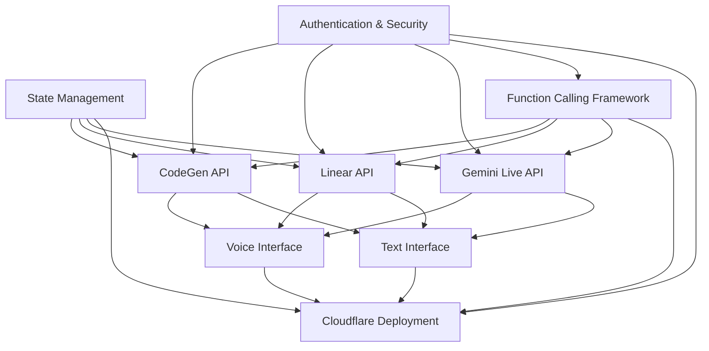

# Gemini Live Interface to CodeGen - Implementation Workplans

## Overview

This directory contains comprehensive workplans for implementing the Gemini Live Interface to CodeGen system. Each workplan provides detailed implementation guidance, technical specifications, testing strategies, and success criteria for the 8 core implementation chunks.

## Workplan Structure

Each workplan follows a standardized template based on the agient_ops repository patterns:

- **Pattern Overview**: High-level description and purpose
- **Components**: Detailed breakdown of implementation components
- **Implementation Guidelines**: Step-by-step implementation approach
- **Prerequisites**: Technical and knowledge requirements
- **Technical Specifications**: Detailed technical architecture and interfaces
- **Testing Strategy**: Comprehensive testing approach across multiple dimensions
- **Review Checklist**: Quality assurance and validation criteria
- **Success Criteria**: Measurable outcomes and completion indicators

## Implementation Chunks

### 1. [State Management with Durable Objects](./01-state-management-durable-objects.md)
**Foundation Component** - Centralized state management using Cloudflare Durable Objects

- Conversation state and context preservation
- Project context storage and management
- User session handling and authentication state
- API state coordination and synchronization
- Data persistence and recovery mechanisms

### 2. [Authentication & Security](./02-authentication-security.md)
**Foundation Component** - Comprehensive security framework

- Multi-factor user authentication system
- API key management and rotation
- Secure communication protocols
- Access control and authorization
- Security monitoring and auditing

### 3. [Function Calling Framework](./03-function-calling-framework.md)
**Core Orchestration** - API orchestration and routing engine

- Function registry and discovery system
- API orchestration between CodeGen, Linear, and Gemini
- Error handling and resilience patterns
- Response processing and formatting
- Performance monitoring and analytics

### 4. [CodeGen API Integration](./04-codegen-api-integration.md)
**API Integration** - Voice-driven code generation and agent coordination

- Robust API client with retry and timeout handling
- Natural language to code generation workflows
- Agent coordination and task management
- Progress monitoring and status tracking
- Voice-optimized response formatting

### 5. [Linear API Integration](./05-linear-api-integration.md)
**API Integration** - Voice-driven project management and issue tracking

- GraphQL client with query optimization
- Issue management and workflow automation
- Project tracking and team coordination
- Comment system with voice-to-text conversion
- Real-time updates and notifications

### 6. [Gemini Live API Integration](./06-gemini-live-api-integration.md)
**API Integration** - Real-time voice processing and AI coordination

- WebSocket connection for live audio streams
- Natural language understanding and intent recognition
- Function calling integration and orchestration
- Response generation and synthesis
- Conversation management and context preservation

### 7. [Voice Interface](./07-voice-interface.md)
**User Interface** - Natural voice interaction system

- Audio input/output management
- Voice user interface design and optimization
- Speech processing pipeline with quality enhancement
- Conversation handling and turn management
- Accessibility features and multi-language support

### 8. [Text Interface](./08-text-interface.md)
**User Interface** - Asynchronous text-based communication

- Chat interface framework with rich formatting
- Asynchronous messaging and notification system
- Text processing and command parsing
- Multi-modal integration with voice interface
- User experience enhancement and customization

### 9. [Cloudflare Deployment](./09-deployment-cloudflare.md)
**Infrastructure** - Production deployment and operations

- Cloudflare Workers configuration and optimization
- Durable Objects infrastructure setup
- Security implementation and monitoring
- CI/CD pipeline and DevOps integration
- Performance monitoring and observability

## Implementation Dependencies

The workplans are designed with clear dependency relationships:

## Implementation Sequence

### Phase 1: Foundation (Parallel Implementation)
1. **State Management with Durable Objects**
2. **Authentication & Security**

### Phase 2: Core Framework
3. **Function Calling Framework** (depends on Phase 1)

### Phase 3: API Integrations (Parallel Implementation)
4. **CodeGen API Integration**
5. **Linear API Integration**
6. **Gemini Live API Integration**

### Phase 4: User Interfaces (Parallel Implementation)
7. **Voice Interface**
8. **Text Interface**

### Phase 5: Production Deployment
9. **Cloudflare Deployment** (integrates all components)

## Technical Stack

- **Runtime**: Cloudflare Workers with Durable Objects
- **Language**: TypeScript with Effect TS
- **APIs**: CodeGen, Linear GraphQL, Gemini Live
- **Audio**: Web Audio API, WebRTC
- **Real-time**: WebSockets, Server-Sent Events
- **Security**: OAuth 2.0, JWT, TLS 1.3
- **Monitoring**: Cloudflare Analytics, Custom metrics

## Performance Targets

- **Voice Response Time**: < 2 seconds end-to-end
- **API Response Time**: < 500ms for simple operations
- **State Operations**: < 50ms for read/write
- **Concurrent Users**: 1000+ simultaneous sessions
- **Uptime**: 99.9% availability target
- **Global Latency**: < 200ms from edge locations

## Quality Assurance

Each workplan includes comprehensive testing strategies:

- **Unit Testing**: Component-level functionality
- **Integration Testing**: Cross-component workflows
- **Performance Testing**: Latency and throughput benchmarks
- **Security Testing**: Vulnerability assessment and penetration testing
- **Usability Testing**: User experience validation
- **End-to-End Testing**: Complete workflow validation

## Documentation Standards

All workplans follow consistent documentation standards:

- Clear technical specifications with TypeScript interfaces
- Comprehensive implementation guidelines
- Detailed testing strategies and success criteria
- Review checklists for quality assurance
- Performance requirements and benchmarks

## Getting Started

1. Review the [Agent Operations Guidelines](../../../.cursor/rules/__START_HERE.mdc)
2. Ensure all prerequisites are met for your assigned workplan
3. Follow the implementation guidelines step-by-step
4. Use the testing strategy to validate your implementation
5. Complete the review checklist before marking as done
6. Verify all success criteria are met

## Support and Resources

- **Repository**: [agient_ops](https://github.com/helaix/agient_ops)
- **Documentation**: [Agent Collaboration Workflow](../../../docs/src/content/docs/reference/agent_collaboration_workflow.md)
- **Communication**: Use Linear issues for coordination and updates
- **Code Reviews**: Follow established PR review processes

## Success Metrics

The overall project success will be measured by:

- [ ] All 9 workplans completed successfully
- [ ] Integration testing passes across all components
- [ ] Performance targets met in production environment
- [ ] User acceptance testing validates voice and text interfaces
- [ ] Security audit confirms robust protection
- [ ] Documentation enables effective maintenance and extension

