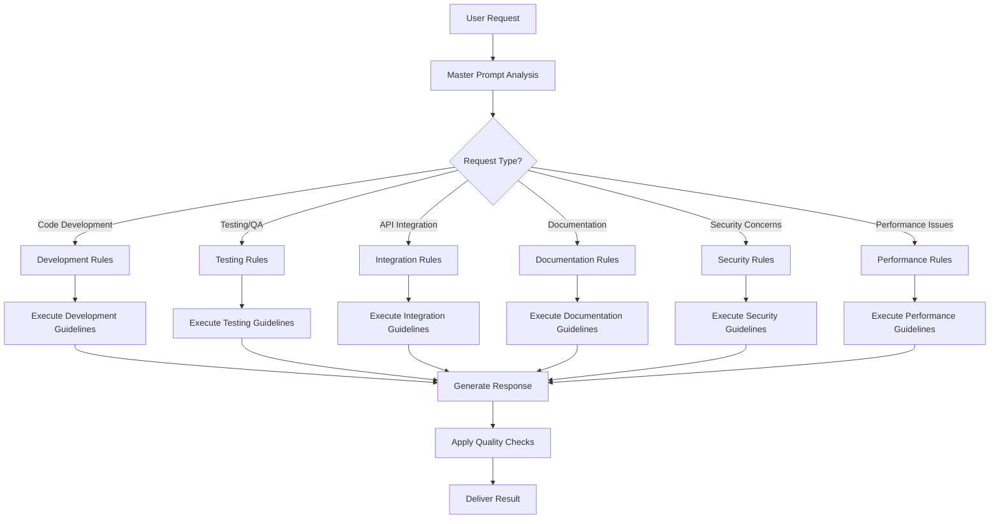

# Gemini Live Interface to CodeGen - AI Assistant Rules

## Overview

This directory contains the comprehensive rule system for the Gemini Live Interface to CodeGen project. These rules define how the AI assistant should behave, make decisions, and route requests to ensure optimal performance, security, and user experience.

## Rule Structure

### Master Prompt
- **File**: `master-prompt.md`
- **Purpose**: Central coordination point that provides application overview and routes to specialized rules
- **Key Features**:
  - High-level application description
  - Core functionality overview
  - Integration requirements
  - Conditional routing logic to specialized rules

### Specialized Rule Categories

#### 1. Development Rules (`development-rules.md`)
- **Activation**: Code generation, modification, or refactoring requests
- **Coverage**:
  - Code generation standards
  - Architecture guidelines
  - Implementation patterns
  - Quality assurance processes
  - Git workflow integration

#### 2. Testing Rules (`testing-rules.md`)
- **Activation**: Testing strategies, test case generation, or QA processes
- **Coverage**:
  - Multi-layer testing strategy (unit, integration, E2E)
  - Voice processing testing
  - Code generation validation
  - Performance testing
  - Test automation and CI/CD integration

#### 3. Integration Rules (`integration-rules.md`)
- **Activation**: API integrations, external service connections, or data exchange
- **Coverage**:
  - Gemini API integration
  - CodeGen platform integration
  - Authentication and authorization
  - Data exchange protocols
  - Error handling and resilience

#### 4. Documentation Rules (`documentation-rules.md`)
- **Activation**: Documentation creation, updates, or knowledge management
- **Coverage**:
  - Code documentation standards
  - API documentation
  - User guides and tutorials
  - Technical documentation
  - Knowledge management processes

#### 5. Security Rules (`security-rules.md`)
- **Activation**: Security considerations, authentication, or data protection
- **Coverage**:
  - Authentication and authorization
  - Data protection and privacy
  - Voice data security
  - Code generation security
  - API security
  - Security monitoring and incident response

#### 6. Performance Rules (`performance-rules.md`)
- **Activation**: Performance optimization, scalability, or resource management
- **Coverage**:
  - Response time optimization
  - Resource management
  - Scalability optimization
  - Performance monitoring
  - Caching strategies

### Rule Evaluation and Metrics

#### Rule Evaluation Metrics (`rule-evaluation-metrics.md`)
- **Purpose**: Comprehensive framework for measuring and improving rule effectiveness
- **Coverage**:
  - Rule activation accuracy
  - Performance benchmarks
  - Quality indicators
  - Compliance criteria
  - Continuous improvement framework

## Rule Activation Flow



## Multi-Rule Scenarios

When a request spans multiple categories, rules are applied in this priority order:

1. **Security Rules** (always highest priority)
2. **Performance Rules** (for optimization concerns)
3. **Integration Rules** (for external dependencies)
4. **Development Rules** (for core implementation)
5. **Testing Rules** (for validation)
6. **Documentation Rules** (for knowledge capture)

## Implementation Guidelines

### For AI Assistants

1. **Rule Selection**: Always start with the master prompt to determine which specialized rules to apply
2. **Context Awareness**: Consider the current project state, user preferences, and conversation history
3. **Quality Assurance**: Apply relevant quality checks from multiple rule categories
4. **Error Handling**: Follow security and performance guidelines even when primary rules fail
5. **Continuous Learning**: Use evaluation metrics to improve rule effectiveness

### For Developers

1. **Rule Updates**: Regularly review and update rules based on system evolution and user feedback
2. **Testing**: Validate rule changes against the evaluation metrics framework
3. **Documentation**: Keep rule documentation synchronized with implementation
4. **Monitoring**: Implement metrics collection to track rule effectiveness
5. **Compliance**: Ensure all rules meet security, privacy, and performance requirements

## Quality Assurance

### Rule Validation Checklist

- [ ] Rule conditions are clearly defined
- [ ] Activation triggers are unambiguous
- [ ] Implementation guidelines are actionable
- [ ] Examples and templates are provided
- [ ] Quality criteria are measurable
- [ ] Security implications are addressed
- [ ] Performance impact is considered
- [ ] Integration points are documented

### Continuous Improvement Process

1. **Metrics Collection**: Continuously gather data on rule effectiveness
2. **Regular Review**: Monthly review of rule performance and user feedback
3. **Optimization**: Implement improvements based on evaluation metrics
4. **Testing**: Validate rule changes in staging environment
5. **Deployment**: Gradual rollout of rule updates with monitoring
6. **Documentation**: Update documentation to reflect rule changes

## Usage Examples

### Example 1: Code Generation Request
```
User: "Create a TypeScript function that validates email addresses"

Rule Activation:
1. Master Prompt → Routes to Development Rules
2. Development Rules → Apply code generation standards
3. Security Rules → Ensure no security vulnerabilities
4. Testing Rules → Include validation tests
5. Documentation Rules → Add proper JSDoc comments
```

### Example 2: Performance Optimization Request
```
User: "Optimize the voice processing pipeline for better response times"

Rule Activation:
1. Master Prompt → Routes to Performance Rules
2. Performance Rules → Apply optimization strategies
3. Integration Rules → Consider API call optimization
4. Testing Rules → Validate performance improvements
5. Documentation Rules → Document optimization decisions
```

### Example 3: Security Review Request
```
User: "Review the authentication flow for security vulnerabilities"

Rule Activation:
1. Master Prompt → Routes to Security Rules (highest priority)
2. Security Rules → Apply comprehensive security analysis
3. Development Rules → Consider code quality implications
4. Documentation Rules → Document security findings
5. Testing Rules → Recommend security testing
```

## Maintenance and Updates

### Regular Maintenance Tasks

- **Weekly**: Review rule activation metrics and user feedback
- **Monthly**: Analyze rule performance and identify optimization opportunities
- **Quarterly**: Comprehensive review of all rules and evaluation metrics
- **Annually**: Major rule framework updates based on system evolution

### Update Process

1. **Identify Need**: Based on metrics, feedback, or system changes
2. **Design Update**: Create updated rule content following guidelines
3. **Review**: Peer review of rule changes
4. **Test**: Validate changes against evaluation framework
5. **Deploy**: Gradual rollout with monitoring
6. **Monitor**: Track impact of changes using evaluation metrics

---

*This rule system is designed to be comprehensive, maintainable, and continuously improving. Regular updates and monitoring ensure optimal performance and user satisfaction.*

