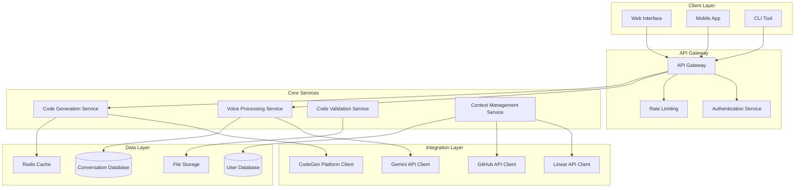

# Documentation Rules for Gemini Live Interface to CodeGen

## Rule Activation Triggers

This rule set is activated when:
- Documentation needs to be created or updated
- User guides and tutorials are being developed
- API documentation is being generated
- Knowledge management processes are being implemented
- Code comments and inline documentation are being written

## Documentation Standards and Guidelines

### 1. Code Documentation

#### Inline Code Comments
```typescript
/**
 * Processes voice commands and converts them to executable code operations.
 * 
 * This class handles the complete pipeline from voice input to code generation,
 * including transcription, intent recognition, parameter extraction, and
 * code generation with validation.
 * 
 * @example
 * ```typescript
 * const processor = new VoiceCommandProcessor({
 *   geminiClient: new GeminiAPIClient(config),
 *   codeGenerator: new CodeGenerator(),
 *   validator: new CodeValidator()
 * });
 * 
 * const result = await processor.process("Create a function called validateEmail");
 * console.log(result.generatedCode);
 * ```
 * 
 * @since 1.0.0
 * @author Gemini Live Interface Team
 */
class VoiceCommandProcessor {
  /**
   * The Gemini API client for voice processing and AI interactions.
   * @private
   */
  private geminiClient: GeminiAPIClient;
  
  /**
   * Code generator instance for creating code from voice commands.
   * @private
   */
  private codeGenerator: CodeGenerator;
  
  /**
   * Validator for ensuring generated code quality and correctness.
   * @private
   */
  private validator: CodeValidator;
  
  /**
   * Creates a new VoiceCommandProcessor instance.
   * 
   * @param config - Configuration object containing required dependencies
   * @param config.geminiClient - Gemini API client for voice processing
   * @param config.codeGenerator - Code generator for creating code
   * @param config.validator - Validator for code quality assurance
   * 
   * @throws {ConfigurationError} When required dependencies are missing
   */
  constructor(config: VoiceCommandProcessorConfig) {
    if (!config.geminiClient) {
      throw new ConfigurationError('Gemini client is required');
    }
    if (!config.codeGenerator) {
      throw new ConfigurationError('Code generator is required');
    }
    if (!config.validator) {
      throw new ConfigurationError('Code validator is required');
    }
    
    this.geminiClient = config.geminiClient;
    this.codeGenerator = config.codeGenerator;
    this.validator = config.validator;
  }
  
  /**
   * Processes a voice command and generates corresponding code.
   * 
   * The processing pipeline includes:
   * 1. Voice transcription using Gemini API
   * 2. Intent recognition and parameter extraction
   * 3. Code generation based on recognized intent
   * 4. Code validation and quality checks
   * 5. Response formatting and delivery
   * 
   * @param voiceInput - Raw voice input as audio buffer or transcribed text
   * @param context - Optional context for better code generation
   * @returns Promise resolving to processed command result
   * 
   * @throws {VoiceProcessingError} When voice transcription fails
   * @throws {IntentRecognitionError} When intent cannot be determined
   * @throws {CodeGenerationError} When code generation fails
   * @throws {ValidationError} When generated code fails validation
   * 
   * @example
   * ```typescript
   * // Process voice command with audio input
   * const audioBuffer = await getAudioFromMicrophone();
   * const result = await processor.process(audioBuffer, {
   *   currentFile: 'src/utils/validation.ts',
   *   projectContext: { language: 'typescript', framework: 'react' }
   * });
   * 
   * if (result.success) {
   *   console.log('Generated code:', result.generatedCode);
   * } else {
   *   console.error('Processing failed:', result.error);
   * }
   * ```
   */
  async process(
    voiceInput: ArrayBuffer | string,
    context?: ProcessingContext
  ): Promise<VoiceCommandResult> {
    // Implementation details...
  }
}
```

#### Function Documentation Standards
```typescript
/**
 * Validates email addresses using RFC 5322 compliant regex pattern.
 * 
 * This function performs comprehensive email validation including:
 * - Basic format validation (local@domain structure)
 * - Character set validation for local and domain parts
 * - Length restrictions according to RFC standards
 * - Special character handling in quoted strings
 * 
 * @param email - The email address to validate
 * @param options - Optional validation configuration
 * @param options.allowInternational - Whether to allow international domain names (default: true)
 * @param options.strictMode - Whether to apply strict RFC compliance (default: false)
 * @param options.maxLength - Maximum allowed email length (default: 254)
 * 
 * @returns Validation result object containing success status and details
 * 
 * @throws {ValidationError} When email parameter is null or undefined
 * 
 * @example
 * ```typescript
 * // Basic email validation
 * const result = validateEmail('user@example.com');
 * if (result.isValid) {
 *   console.log('Email is valid');
 * }
 * 
 * // Strict validation with custom options
 * const strictResult = validateEmail('user+tag@example.com', {
 *   strictMode: true,
 *   allowInternational: false
 * });
 * ```
 * 
 * @see {@link https://tools.ietf.org/html/rfc5322} RFC 5322 Email Specification
 * @since 1.0.0
 */
function validateEmail(
  email: string,
  options: EmailValidationOptions = {}
): EmailValidationResult {
  // Implementation...
}
```

### 2. API Documentation

#### OpenAPI/Swagger Documentation
```yaml
# api-documentation.yaml
openapi: 3.0.3
info:
  title: Gemini Live Interface to CodeGen API
  description: |
    REST API for the Gemini Live Interface to CodeGen system.
    
    This API provides endpoints for:
    - Voice command processing
    - Code generation and validation
    - Project management integration
    - Real-time conversation management
    
    ## Authentication
    
    All API endpoints require authentication using Bearer tokens:
    ```
    Authorization: Bearer <your-api-token>
    ```
    
    ## Rate Limiting
    
    API requests are rate limited to:
    - 100 requests per minute for voice processing
    - 1000 requests per minute for other endpoints
    
    ## Error Handling
    
    The API uses standard HTTP status codes and returns detailed error information:
    ```json
    {
      "error": {
        "code": "VOICE_PROCESSING_FAILED",
        "message": "Unable to process voice input",
        "details": {
          "reason": "Audio quality too low",
          "suggestions": ["Improve microphone quality", "Reduce background noise"]
        }
      }
    }
    ```
    
  version: 1.0.0
  contact:
    name: Gemini Live Interface Team
    email: support@geminilive.dev
  license:
    name: MIT
    url: https://opensource.org/licenses/MIT

servers:
  - url: https://api.geminilive.dev/v1
    description: Production server
  - url: https://staging-api.geminilive.dev/v1
    description: Staging server

paths:
  /voice/process:
    post:
      summary: Process voice command
      description: |
        Processes a voice command and returns generated code or actions.
        
        This endpoint handles the complete voice-to-code pipeline:
        1. Audio transcription (if audio provided)
        2. Intent recognition and parameter extraction
        3. Code generation or action execution
        4. Validation and quality checks
        
        ## Usage Examples
        
        ### Text Input
        ```bash
        curl -X POST https://api.geminilive.dev/v1/voice/process \
          -H "Authorization: Bearer <token>" \
          -H "Content-Type: application/json" \
          -d '{
            "input": {
              "type": "text",
              "content": "Create a function that validates email addresses"
            },
            "context": {
              "currentFile": "src/utils/validation.ts",
              "language": "typescript"
            }
          }'
        ```
        
        ### Audio Input
        ```bash
        curl -X POST https://api.geminilive.dev/v1/voice/process \
          -H "Authorization: Bearer <token>" \
          -H "Content-Type: multipart/form-data" \
          -F "audio=@voice_command.wav" \
          -F "context={\"language\":\"typescript\"}"
        ```
        
      tags:
        - Voice Processing
      security:
        - BearerAuth: []
      requestBody:
        required: true
        content:
          application/json:
            schema:
              $ref: '#/components/schemas/VoiceProcessRequest'
          multipart/form-data:
            schema:
              type: object
              properties:
                audio:
                  type: string
                  format: binary
                  description: Audio file containing voice command
                context:
                  type: string
                  description: JSON string containing processing context
      responses:
        '200':
          description: Voice command processed successfully
          content:
            application/json:
              schema:
                $ref: '#/components/schemas/VoiceProcessResponse'
        '400':
          description: Invalid request format or parameters
          content:
            application/json:
              schema:
                $ref: '#/components/schemas/ErrorResponse'
        '401':
          description: Authentication required
        '429':
          description: Rate limit exceeded
        '500':
          description: Internal server error

components:
  schemas:
    VoiceProcessRequest:
      type: object
      required:
        - input
      properties:
        input:
          oneOf:
            - $ref: '#/components/schemas/TextInput'
            - $ref: '#/components/schemas/AudioInput'
        context:
          $ref: '#/components/schemas/ProcessingContext'
        options:
          $ref: '#/components/schemas/ProcessingOptions'
    
    TextInput:
      type: object
      required:
        - type
        - content
      properties:
        type:
          type: string
          enum: [text]
        content:
          type: string
          description: Text representation of the voice command
          example: "Create a function that validates email addresses"
    
    ProcessingContext:
      type: object
      properties:
        currentFile:
          type: string
          description: Path to the currently active file
          example: "src/utils/validation.ts"
        language:
          type: string
          description: Programming language for code generation
          enum: [typescript, javascript, python, java, go, rust]
          example: "typescript"
        projectType:
          type: string
          description: Type of project (affects code generation patterns)
          enum: [web, mobile, api, cli, library]
          example: "web"
        framework:
          type: string
          description: Framework being used (if applicable)
          example: "react"
```

### 3. User Documentation

#### User Guide Structure
```markdown
# Gemini Live Interface to CodeGen - User Guide

## Table of Contents

1. [Getting Started](#getting-started)
2. [Voice Commands](#voice-commands)
3. [Code Generation](#code-generation)
4. [Project Integration](#project-integration)
5. [Troubleshooting](#troubleshooting)
6. [Advanced Features](#advanced-features)
7. [FAQ](#faq)

## Getting Started

### Prerequisites

Before using the Gemini Live Interface to CodeGen, ensure you have:

- A compatible microphone for voice input
- Modern web browser with WebRTC support
- Active CodeGen account with appropriate permissions
- Project repository access through GitHub integration

### Initial Setup

1. **Authentication Setup**
   ```bash
   # Set up your API credentials
   export GEMINI_API_KEY="your-gemini-api-key"
   export CODEGEN_TOKEN="your-codegen-token"
   export LINEAR_API_KEY="your-linear-api-key"
   ```

2. **Microphone Configuration**
   - Grant microphone permissions when prompted
   - Test audio quality using the built-in audio test
   - Adjust microphone sensitivity if needed

3. **Project Context Setup**
   - Connect your GitHub repositories
   - Configure default programming language preferences
   - Set up Linear workspace integration

### First Voice Command

Try your first voice command:

> "Create a function called greetUser that takes a name parameter and returns a greeting message"

The system will:
1. Transcribe your voice input
2. Recognize the intent to create a function
3. Generate TypeScript/JavaScript code
4. Validate the generated code
5. Present the result for review

## Voice Commands

### Command Categories

#### Code Creation Commands
- **Function Creation**: "Create a function called [name] that [description]"
- **Class Creation**: "Create a class called [name] with [properties/methods]"
- **Component Creation**: "Create a React component called [name] that [description]"
- **Interface Definition**: "Define an interface called [name] with [properties]"

#### Code Modification Commands
- **Add Functionality**: "Add error handling to the [function/method name]"
- **Refactor Code**: "Refactor the [code element] to use [pattern/approach]"
- **Optimize Performance**: "Optimize the [code element] for better performance"
- **Add Documentation**: "Add JSDoc comments to the [function/class name]"

#### Project Management Commands
- **Issue Creation**: "Create a Linear issue for [description]"
- **Branch Management**: "Create a new branch for [feature name]"
- **Pull Request**: "Create a pull request for the current changes"
- **Code Review**: "Review the code in [file/function name]"

### Command Best Practices

#### Clear and Specific Commands
✅ **Good**: "Create a TypeScript function called validateEmail that takes a string parameter and returns a boolean indicating if the email format is valid"

❌ **Avoid**: "Make an email thing"

#### Provide Context
✅ **Good**: "Add error handling to the fetchUserData function in the user service"

❌ **Avoid**: "Add error handling"

#### Use Standard Terminology
✅ **Good**: "Create a React functional component with useState hook"

❌ **Avoid**: "Make a React thingy with state stuff"

## Code Generation

### Supported Languages and Frameworks

#### Programming Languages
- **TypeScript/JavaScript**: Full support with modern ES6+ features
- **Python**: Support for Python 3.8+ with type hints
- **Java**: Support for Java 11+ with modern language features
- **Go**: Support for Go 1.18+ with generics
- **Rust**: Support for Rust 2021 edition

#### Frameworks and Libraries
- **Frontend**: React, Vue.js, Angular, Svelte
- **Backend**: Node.js, Express, FastAPI, Spring Boot
- **Mobile**: React Native, Flutter (Dart)
- **Testing**: Jest, Vitest, PyTest, JUnit

### Code Quality Standards

All generated code follows these quality standards:

#### TypeScript Example
```typescript
/**
 * Validates email addresses using RFC 5322 compliant pattern.
 * @param email - The email address to validate
 * @returns True if email is valid, false otherwise
 */
export function validateEmail(email: string): boolean {
  if (!email || typeof email !== 'string') {
    return false;
  }
  
  const emailRegex = /^[^\s@]+@[^\s@]+\.[^\s@]+$/;
  return emailRegex.test(email.trim());
}
```

#### Error Handling
```typescript
export async function fetchUserData(userId: string): Promise<User> {
  try {
    const response = await fetch(`/api/users/${userId}`);
    
    if (!response.ok) {
      throw new Error(`Failed to fetch user: ${response.statusText}`);
    }
    
    const userData = await response.json();
    return userData as User;
  } catch (error) {
    console.error('Error fetching user data:', error);
    throw new UserFetchError('Unable to retrieve user information', error);
  }
}
```

### Customization Options

#### Code Style Preferences
```json
{
  "codeStyle": {
    "indentation": "2spaces",
    "quotes": "single",
    "semicolons": true,
    "trailingCommas": true
  },
  "naming": {
    "functions": "camelCase",
    "classes": "PascalCase",
    "constants": "UPPER_SNAKE_CASE"
  },
  "documentation": {
    "includeJSDoc": true,
    "includeExamples": true,
    "includeTypeAnnotations": true
  }
}
```

## Troubleshooting

### Common Issues and Solutions

#### Voice Recognition Problems

**Issue**: Voice commands are not being recognized accurately

**Solutions**:
1. **Improve Audio Quality**
   - Use a high-quality microphone
   - Reduce background noise
   - Speak clearly and at moderate pace
   - Ensure proper microphone positioning

2. **Check Browser Permissions**
   - Verify microphone permissions are granted
   - Test microphone in browser settings
   - Try refreshing the page and re-granting permissions

3. **Network Connectivity**
   - Ensure stable internet connection
   - Check if Gemini API is accessible
   - Verify firewall settings allow WebRTC

#### Code Generation Issues

**Issue**: Generated code doesn't match expectations

**Solutions**:
1. **Provide More Context**
   - Specify programming language explicitly
   - Include framework or library preferences
   - Mention coding style requirements

2. **Use Clearer Commands**
   - Break complex requests into smaller parts
   - Use standard programming terminology
   - Provide examples of desired output

3. **Review and Iterate**
   - Use the "modify" command to refine results
   - Provide feedback on generated code
   - Build up complex functionality incrementally

### Error Messages and Meanings

| Error Code | Meaning | Solution |
|------------|---------|----------|
| `VOICE_PROCESSING_FAILED` | Voice input could not be processed | Check microphone and try again |
| `INTENT_RECOGNITION_FAILED` | Command intent unclear | Rephrase command more clearly |
| `CODE_GENERATION_FAILED` | Unable to generate valid code | Simplify request or provide more context |
| `VALIDATION_FAILED` | Generated code failed quality checks | Review and manually fix issues |
| `INTEGRATION_ERROR` | External service unavailable | Check service status and retry |

### Getting Help

#### Support Channels
- **Documentation**: [docs.geminilive.dev](https://docs.geminilive.dev)
- **Community Forum**: [community.geminilive.dev](https://community.geminilive.dev)
- **GitHub Issues**: [github.com/geminilive/issues](https://github.com/geminilive/issues)
- **Email Support**: support@geminilive.dev

#### Reporting Bugs
When reporting bugs, please include:
- Voice command that caused the issue
- Expected vs. actual behavior
- Browser and operating system information
- Console error messages (if any)
- Steps to reproduce the issue

---

*This user guide is continuously updated based on user feedback and new features.*
```

### 4. Technical Documentation

#### Architecture Documentation
```markdown
# System Architecture Documentation

## Overview

The Gemini Live Interface to CodeGen system follows a microservices architecture with clear separation of concerns and well-defined interfaces between components.

## High-Level Architecture



## Component Details

### Voice Processing Service

**Responsibilities:**
- Audio transcription using Gemini API
- Intent recognition and parameter extraction
- Natural language understanding
- Context-aware command interpretation

**Key Interfaces:**
```typescript
interface VoiceProcessingService {
  transcribeAudio(audio: ArrayBuffer): Promise<TranscriptionResult>;
  recognizeIntent(text: string, context: Context): Promise<IntentResult>;
  extractParameters(intent: IntentResult): Promise<ParameterSet>;
}
```

**Dependencies:**
- Gemini API for transcription and NLU
- Context Management Service for conversation state
- Conversation Database for history storage

### Code Generation Service

**Responsibilities:**
- Generate code based on recognized intents
- Apply code quality standards and best practices
- Handle multiple programming languages and frameworks
- Integrate with existing codebases

**Key Interfaces:**
```typescript
interface CodeGenerationService {
  generateCode(intent: IntentResult, context: GenerationContext): Promise<GeneratedCode>;
  validateCode(code: string, language: string): Promise<ValidationResult>;
  optimizeCode(code: string, optimizations: OptimizationType[]): Promise<OptimizedCode>;
}
```

**Dependencies:**
- Code Validation Service for quality checks
- CodeGen Platform for tool integration
- Cache Layer for performance optimization
```

### 5. Knowledge Management

#### Documentation Maintenance Process
```markdown
# Documentation Maintenance Process

## Regular Review Cycle

### Weekly Reviews
- Update API documentation for any interface changes
- Review and update code examples for accuracy
- Check external links for validity
- Update troubleshooting guides based on support tickets

### Monthly Reviews
- Comprehensive review of user guides
- Update architecture documentation for system changes
- Review and update best practices based on usage patterns
- Analyze documentation usage metrics and user feedback

### Quarterly Reviews
- Major documentation restructuring if needed
- Update getting started guides for new users
- Review and update video tutorials
- Conduct documentation usability testing

## Documentation Standards Checklist

### For All Documentation
- [ ] Clear, concise writing style
- [ ] Proper grammar and spelling
- [ ] Consistent terminology throughout
- [ ] Up-to-date information
- [ ] Working code examples
- [ ] Valid external links
- [ ] Proper formatting and structure
- [ ] Accessibility considerations

### For Code Documentation
- [ ] JSDoc comments for all public APIs
- [ ] Type annotations where applicable
- [ ] Usage examples for complex functions
- [ ] Error handling documentation
- [ ] Performance considerations noted
- [ ] Security implications documented

### For User Guides
- [ ] Step-by-step instructions
- [ ] Screenshots or diagrams where helpful
- [ ] Common pitfalls and solutions
- [ ] Prerequisites clearly stated
- [ ] Expected outcomes described
- [ ] Troubleshooting section included

## Documentation Tools and Automation

### Automated Documentation Generation
```typescript
/**
 * Automated documentation generator for API endpoints
 */
class DocumentationGenerator {
  async generateAPIDocumentation(): Promise<void> {
    const endpoints = await this.discoverEndpoints();
    const documentation = await this.generateOpenAPISpec(endpoints);
    await this.publishDocumentation(documentation);
  }
  
  async validateDocumentation(): Promise<ValidationReport> {
    const issues = [];
    
    // Check for broken links
    const brokenLinks = await this.checkLinks();
    issues.push(...brokenLinks);
    
    // Validate code examples
    const codeIssues = await this.validateCodeExamples();
    issues.push(...codeIssues);
    
    // Check for outdated information
    const outdatedContent = await this.checkForOutdatedContent();
    issues.push(...outdatedContent);
    
    return { issues, summary: this.generateSummary(issues) };
  }
}
```

---

*These documentation rules ensure comprehensive, accurate, and maintainable documentation across all aspects of the Gemini Live Interface to CodeGen system.*
```

