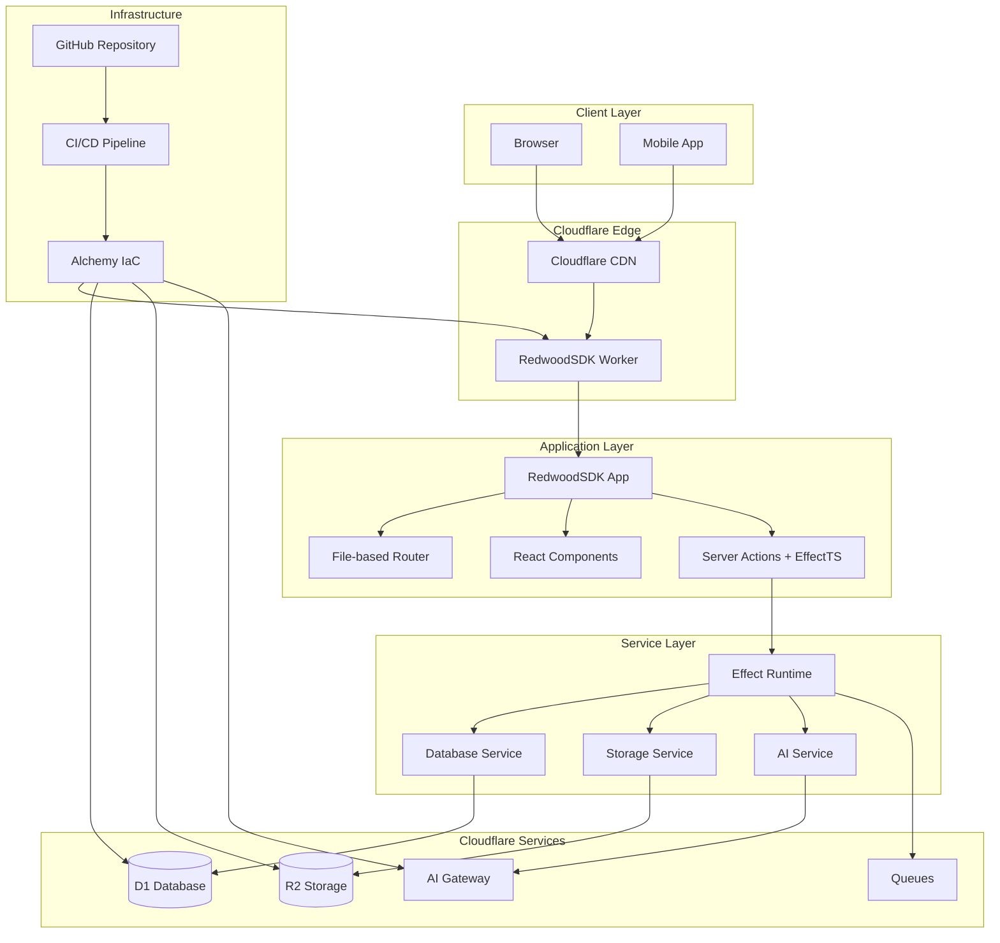
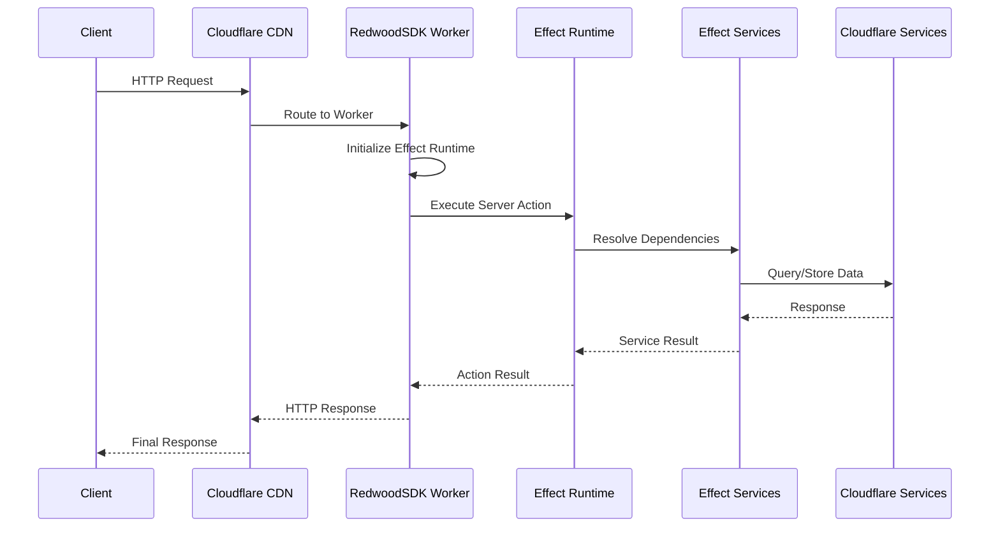
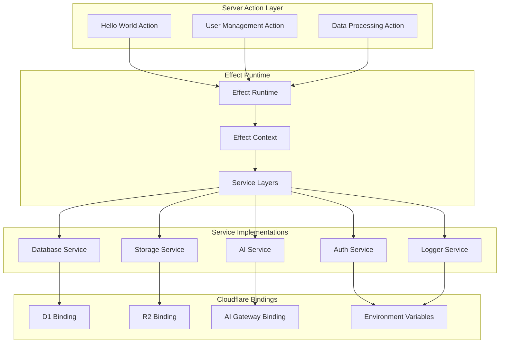
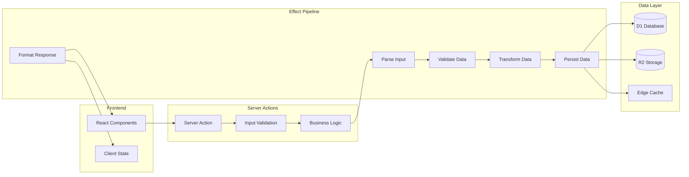
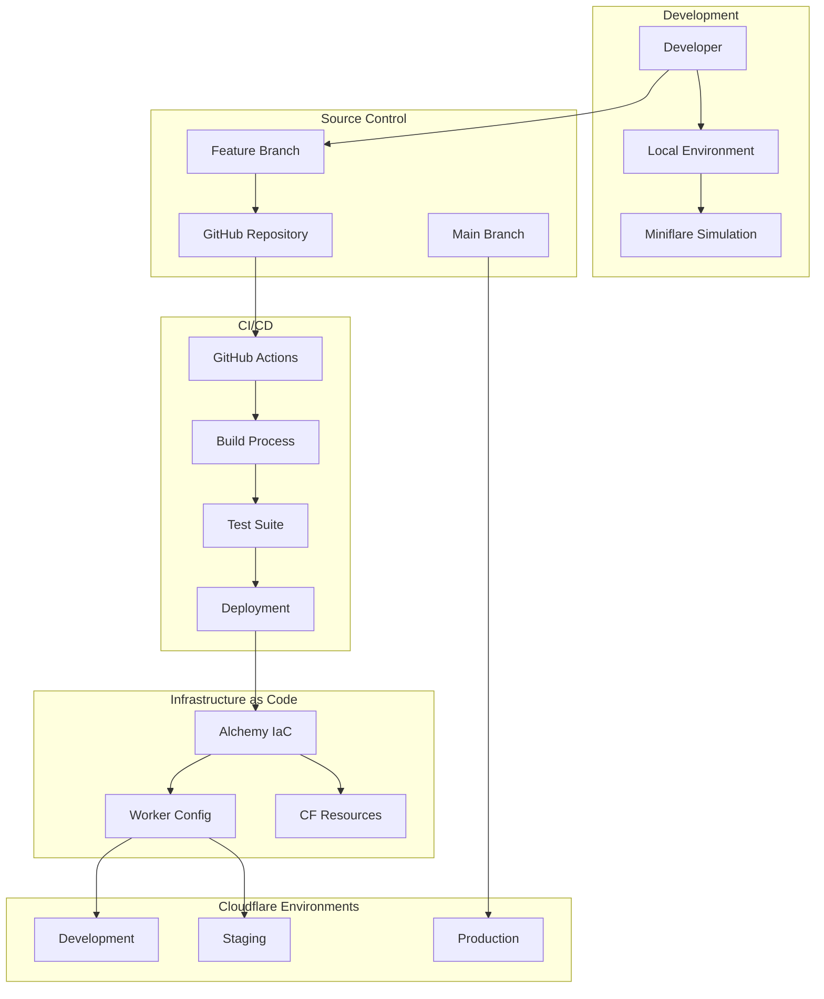
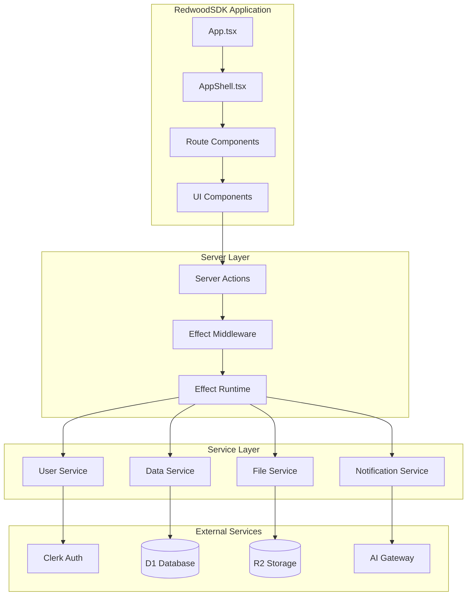
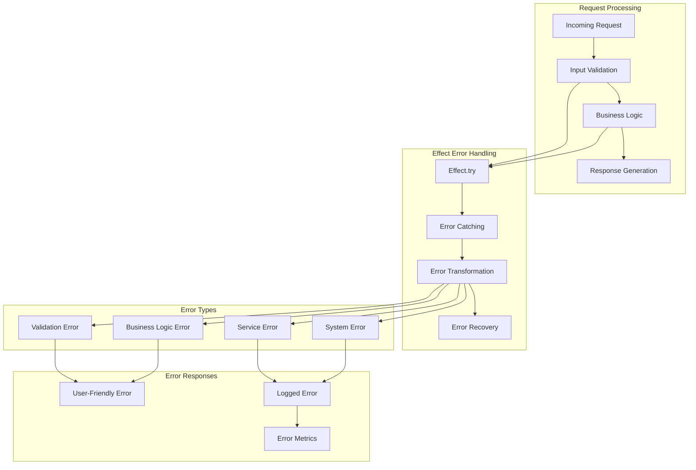
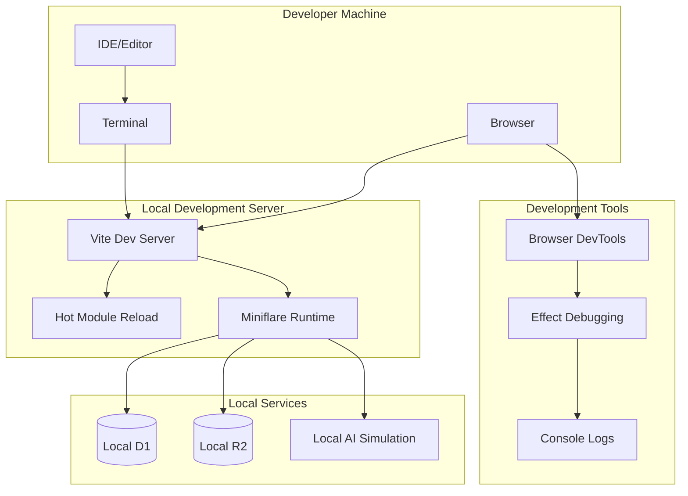
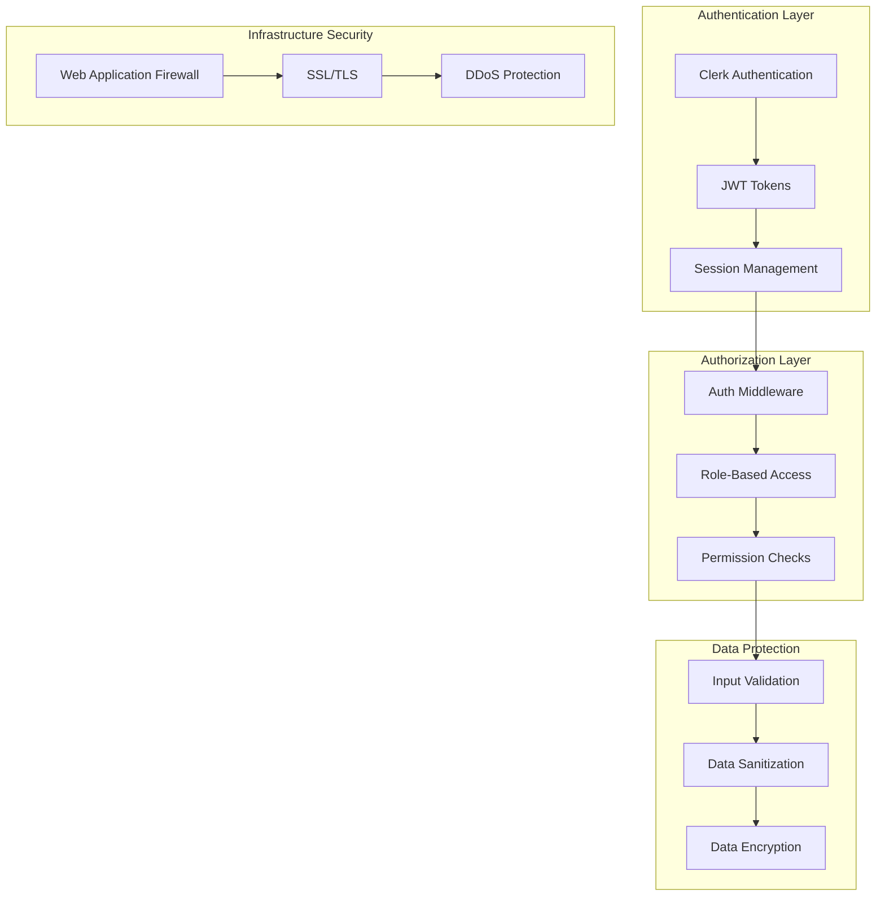
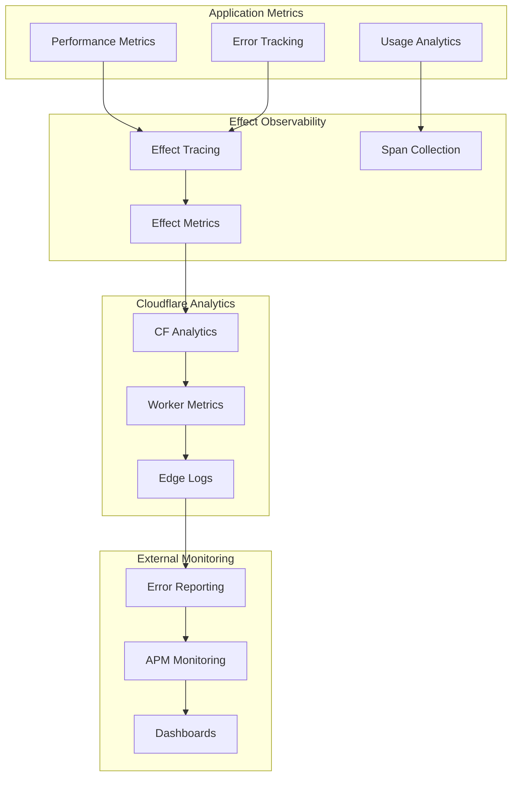

# P0-CORE-002 Architecture Diagrams

## System Architecture Overview

## Request Flow Architecture

## EffectTS Integration Architecture

## Data Flow Architecture

## Deployment Architecture

## Component Interaction Diagram

## Error Handling Flow

## Local Development Architecture

## Security Architecture

## Monitoring and Observability

