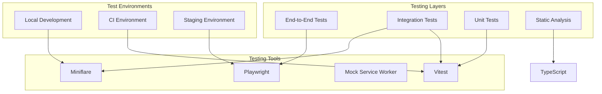

# P0-CORE-002 Testing Strategy

## Overview

This document outlines the comprehensive testing strategy for P0-CORE-002, covering the integration of RedwoodSDK, Cloudflare Workers, and EffectTS. The strategy ensures reliability, performance, and maintainability of the application across all layers of the stack.

## Testing Philosophy

### Core Principles
1. **Test Pyramid Approach**: Emphasize unit tests, with fewer integration and E2E tests
2. **Effect-First Testing**: Leverage EffectTS testing utilities for type-safe, composable tests
3. **Environment Parity**: Ensure test environments closely mirror production
4. **Continuous Validation**: Integrate testing into CI/CD pipeline
5. **Performance-Aware**: Include performance testing at all levels

### Testing Goals
- **Reliability**: Catch bugs before they reach production
- **Confidence**: Enable safe refactoring and feature development
- **Documentation**: Tests serve as living documentation
- **Performance**: Validate performance requirements are met
- **Security**: Ensure authentication and authorization work correctly

## Testing Architecture



## Unit Testing Strategy

### EffectTS Service Testing

#### Service Interface Testing
```typescript
// src/server/services/__tests__/database.test.ts
import { Effect, Layer, TestContext } from "effect"
import { describe, it, expect } from "vitest"
import { DatabaseService, DatabaseServiceLive } from "../database"

describe("DatabaseService", () => {
  const TestDatabaseLayer = Layer.succeed(
    DatabaseService,
    DatabaseService.of({
      query: (sql, params) => 
        Effect.succeed([{ id: 1, name: "test" }])
    })
  )

  it("should execute queries successfully", async () => {
    const program = Effect.gen(function* () {
      const db = yield* DatabaseService
      const result = yield* db.query("SELECT * FROM users")
      return result
    })

    const result = await Effect.runPromise(
      program.pipe(Effect.provide(TestDatabaseLayer))
    )

    expect(result).toEqual([{ id: 1, name: "test" }])
  })

  it("should handle database errors", async () => {
    const ErrorDatabaseLayer = Layer.succeed(
      DatabaseService,
      DatabaseService.of({
        query: () => Effect.fail(new DatabaseError({ cause: "Connection failed" }))
      })
    )

    const program = Effect.gen(function* () {
      const db = yield* DatabaseService
      return yield* db.query("SELECT * FROM users")
    })

    const result = await Effect.runPromise(
      program.pipe(
        Effect.provide(ErrorDatabaseLayer),
        Effect.either
      )
    )

    expect(result._tag).toBe("Left")
  })
})
```

#### Server Action Testing
```typescript
// src/server/actions/__tests__/hello-world.test.ts
import { Effect, Layer } from "effect"
import { describe, it, expect, vi } from "vitest"
import { helloWorldAction } from "../hello-world"
import { DatabaseService } from "../../services/database"

describe("helloWorldAction", () => {
  const mockQuery = vi.fn()
  
  const MockDatabaseLayer = Layer.succeed(
    DatabaseService,
    DatabaseService.of({
      query: mockQuery
    })
  )

  beforeEach(() => {
    mockQuery.mockClear()
  })

  it("should return greeting with timestamp", async () => {
    mockQuery.mockResolvedValue([])
    
    const result = await Effect.runPromise(
      helloWorldAction({ name: "World" }).pipe(
        Effect.provide(MockDatabaseLayer)
      )
    )

    expect(result.message).toBe("Hello, World!")
    expect(result.timestamp).toBeDefined()
    expect(mockQuery).toHaveBeenCalledWith(
      'INSERT INTO greetings (name, timestamp) VALUES (?, ?)',
      ["World", expect.any(String)]
    )
  })

  it("should handle empty name input", async () => {
    const result = await Effect.runPromise(
      helloWorldAction({ name: "" }).pipe(
        Effect.provide(MockDatabaseLayer),
        Effect.either
      )
    )

    expect(result._tag).toBe("Left")
  })
})
```

### React Component Testing

#### AppShell Component Testing
```typescript
// src/components/__tests__/AppShell.test.tsx
import { render, screen, fireEvent, waitFor } from "@testing-library/react"
import { describe, it, expect, vi } from "vitest"
import { AppShell } from "../AppShell"

// Mock server action
vi.mock("../../server/actions/hello-world", () => ({
  helloWorldAction: vi.fn()
}))

describe("AppShell", () => {
  it("should render form elements", () => {
    render(<AppShell />)
    
    expect(screen.getByPlaceholderText("Enter your name")).toBeInTheDocument()
    expect(screen.getByRole("button", { name: "Say Hello" })).toBeInTheDocument()
  })

  it("should call server action on form submission", async () => {
    const mockAction = vi.mocked(helloWorldAction)
    mockAction.mockResolvedValue({ message: "Hello, Test!", timestamp: "2024-01-01" })

    render(<AppShell />)
    
    const input = screen.getByPlaceholderText("Enter your name")
    const button = screen.getByRole("button", { name: "Say Hello" })

    fireEvent.change(input, { target: { value: "Test" } })
    fireEvent.click(button)

    await waitFor(() => {
      expect(mockAction).toHaveBeenCalledWith({ name: "Test" })
      expect(screen.getByText("Hello, Test!")).toBeInTheDocument()
    })
  })
})
```

### Utility Function Testing

```typescript
// src/lib/__tests__/validation.test.ts
import { describe, it, expect } from "vitest"
import { validateInput, ValidationError } from "../validation"

describe("validateInput", () => {
  it("should validate correct input", () => {
    const result = validateInput({ name: "John Doe" })
    expect(result.success).toBe(true)
  })

  it("should reject empty name", () => {
    const result = validateInput({ name: "" })
    expect(result.success).toBe(false)
    expect(result.error).toBeInstanceOf(ValidationError)
  })
})
```

## Integration Testing Strategy

### Server Action Integration Tests

```typescript
// src/server/__tests__/integration/server-actions.test.ts
import { Effect, Layer } from "effect"
import { describe, it, expect, beforeAll, afterAll } from "vitest"
import { helloWorldAction } from "../../actions/hello-world"
import { DatabaseServiceLive } from "../../services/database"

describe("Server Actions Integration", () => {
  let testDb: D1Database

  beforeAll(async () => {
    // Set up test database with Miniflare
    testDb = await setupTestDatabase()
  })

  afterAll(async () => {
    await cleanupTestDatabase(testDb)
  })

  it("should persist and retrieve data", async () => {
    const TestLayer = Layer.succeed(DatabaseService, {
      query: (sql, params) => Effect.tryPromise({
        try: () => testDb.prepare(sql).bind(...params).all(),
        catch: (error) => new DatabaseError({ cause: error })
      })
    })

    const result = await Effect.runPromise(
      helloWorldAction({ name: "Integration Test" }).pipe(
        Effect.provide(TestLayer)
      )
    )

    expect(result.message).toBe("Hello, Integration Test!")

    // Verify data was persisted
    const rows = await testDb.prepare("SELECT * FROM greetings WHERE name = ?")
      .bind("Integration Test")
      .all()
    
    expect(rows.results).toHaveLength(1)
  })
})
```

### Cloudflare Workers Integration Tests

```typescript
// src/__tests__/integration/worker.test.ts
import { describe, it, expect } from "vitest"
import { unstable_dev } from "wrangler"

describe("Worker Integration", () => {
  let worker: Awaited<ReturnType<typeof unstable_dev>>

  beforeAll(async () => {
    worker = await unstable_dev("src/worker.ts", {
      experimental: { disableExperimentalWarning: true }
    })
  })

  afterAll(async () => {
    await worker.stop()
  })

  it("should serve static assets", async () => {
    const response = await worker.fetch("/")
    expect(response.status).toBe(200)
    expect(response.headers.get("content-type")).toContain("text/html")
  })

  it("should handle server actions", async () => {
    const response = await worker.fetch("/api/hello-world", {
      method: "POST",
      headers: { "Content-Type": "application/json" },
      body: JSON.stringify({ name: "Worker Test" })
    })

    expect(response.status).toBe(200)
    const data = await response.json()
    expect(data.message).toBe("Hello, Worker Test!")
  })
})
```

### Database Integration Tests

```typescript
// src/server/__tests__/integration/database.test.ts
import { describe, it, expect, beforeEach } from "vitest"
import { Effect } from "effect"
import { DatabaseServiceLive } from "../../services/database"

describe("Database Integration", () => {
  let testEnv: { DB: D1Database }

  beforeEach(async () => {
    testEnv = await getMiniflareBindings()
    await runMigrations(testEnv.DB)
  })

  it("should execute queries with proper bindings", async () => {
    const program = Effect.gen(function* () {
      const db = yield* DatabaseService
      yield* db.query("INSERT INTO greetings (name, timestamp) VALUES (?, ?)", 
        ["Test User", new Date().toISOString()])
      return yield* db.query("SELECT * FROM greetings WHERE name = ?", ["Test User"])
    })

    const result = await Effect.runPromise(
      program.pipe(
        Effect.provide(DatabaseServiceLive.pipe(
          Layer.provide(Layer.succeed(D1Database, testEnv.DB))
        ))
      )
    )

    expect(result).toHaveLength(1)
    expect(result[0].name).toBe("Test User")
  })
})
```

## End-to-End Testing Strategy

### Playwright E2E Tests

```typescript
// tests/e2e/app.spec.ts
import { test, expect } from "@playwright/test"

test.describe("Sparkflow App", () => {
  test("should complete hello world flow", async ({ page }) => {
    await page.goto("/")
    
    // Verify page loads
    await expect(page.locator("h1")).toContainText("Sparkflow App")
    
    // Fill form and submit
    await page.fill('input[placeholder="Enter your name"]', "E2E Test")
    await page.click('button[type="submit"]')
    
    // Verify response
    await expect(page.locator("text=Hello, E2E Test!")).toBeVisible()
  })

  test("should handle form validation", async ({ page }) => {
    await page.goto("/")
    
    // Submit empty form
    await page.click('button[type="submit"]')
    
    // Verify validation message
    await expect(page.locator("text=Name is required")).toBeVisible()
  })

  test("should handle server errors gracefully", async ({ page }) => {
    // Mock server error
    await page.route("/api/hello-world", route => {
      route.fulfill({ status: 500, body: "Server Error" })
    })

    await page.goto("/")
    await page.fill('input[placeholder="Enter your name"]', "Error Test")
    await page.click('button[type="submit"]')
    
    // Verify error handling
    await expect(page.locator("text=Something went wrong")).toBeVisible()
  })
})
```

### Performance E2E Tests

```typescript
// tests/e2e/performance.spec.ts
import { test, expect } from "@playwright/test"

test.describe("Performance Tests", () => {
  test("should meet performance benchmarks", async ({ page }) => {
    const startTime = Date.now()
    
    await page.goto("/")
    
    // Measure page load time
    const loadTime = Date.now() - startTime
    expect(loadTime).toBeLessThan(2000) // 2 second max load time
    
    // Measure server action response time
    const actionStart = Date.now()
    await page.fill('input[placeholder="Enter your name"]', "Performance Test")
    await page.click('button[type="submit"]')
    await page.waitForSelector("text=Hello, Performance Test!")
    const actionTime = Date.now() - actionStart
    
    expect(actionTime).toBeLessThan(500) // 500ms max action time
  })

  test("should handle concurrent requests", async ({ browser }) => {
    const contexts = await Promise.all(
      Array.from({ length: 10 }, () => browser.newContext())
    )
    
    const pages = await Promise.all(
      contexts.map(context => context.newPage())
    )
    
    // Simulate concurrent requests
    const promises = pages.map(async (page, index) => {
      await page.goto("/")
      await page.fill('input[placeholder="Enter your name"]', `User ${index}`)
      await page.click('button[type="submit"]')
      return page.waitForSelector(`text=Hello, User ${index}!`)
    })
    
    const results = await Promise.allSettled(promises)
    const successful = results.filter(r => r.status === "fulfilled").length
    
    expect(successful).toBe(10) // All requests should succeed
    
    // Cleanup
    await Promise.all(contexts.map(context => context.close()))
  })
})
```

## Test Configuration

### Vitest Configuration

```typescript
// vitest.config.ts
import { defineConfig } from "vitest/config"
import { resolve } from "path"

export default defineConfig({
  test: {
    globals: true,
    environment: "miniflare",
    environmentOptions: {
      miniflareOptions: {
        modules: true,
        scriptPath: "./dist/worker.js",
        d1Databases: ["DB"],
        r2Buckets: ["R2"]
      }
    },
    setupFiles: ["./src/test/setup.ts"],
    coverage: {
      provider: "v8",
      reporter: ["text", "json", "html"],
      exclude: [
        "node_modules/",
        "src/test/",
        "**/*.d.ts",
        "**/*.config.*"
      ],
      thresholds: {
        global: {
          branches: 80,
          functions: 80,
          lines: 80,
          statements: 80
        }
      }
    }
  },
  resolve: {
    alias: {
      "@": resolve(__dirname, "./src")
    }
  }
})
```

### Playwright Configuration

```typescript
// playwright.config.ts
import { defineConfig, devices } from "@playwright/test"

export default defineConfig({
  testDir: "./tests/e2e",
  fullyParallel: true,
  forbidOnly: !!process.env.CI,
  retries: process.env.CI ? 2 : 0,
  workers: process.env.CI ? 1 : undefined,
  reporter: "html",
  use: {
    baseURL: "http://localhost:8787",
    trace: "on-first-retry"
  },
  projects: [
    {
      name: "chromium",
      use: { ...devices["Desktop Chrome"] }
    },
    {
      name: "firefox",
      use: { ...devices["Desktop Firefox"] }
    },
    {
      name: "webkit",
      use: { ...devices["Desktop Safari"] }
    }
  ],
  webServer: {
    command: "pnpm dev",
    url: "http://localhost:8787",
    reuseExistingServer: !process.env.CI
  }
})
```

### Test Setup

```typescript
// src/test/setup.ts
import { beforeAll, afterAll, beforeEach } from "vitest"
import { getMiniflareBindings, runMigrations } from "./utils"

let testEnv: Env

beforeAll(async () => {
  testEnv = await getMiniflareBindings()
})

beforeEach(async () => {
  // Reset database state
  await runMigrations(testEnv.DB)
  await testEnv.DB.exec("DELETE FROM greetings")
})

afterAll(async () => {
  // Cleanup resources
})

// Make test environment available globally
globalThis.testEnv = testEnv
```

## Test Data Management

### Test Fixtures

```typescript
// src/test/fixtures/index.ts
export const testUsers = [
  { id: 1, name: "John Doe", email: "john@example.com" },
  { id: 2, name: "Jane Smith", email: "jane@example.com" }
]

export const testGreetings = [
  { id: 1, name: "Test User", timestamp: "2024-01-01T00:00:00Z" }
]

export function createTestUser(overrides = {}) {
  return {
    name: "Test User",
    email: "test@example.com",
    ...overrides
  }
}
```

### Database Seeding

```typescript
// src/test/utils/database.ts
import { Effect } from "effect"
import { DatabaseService } from "../../server/services/database"

export const seedTestData = Effect.gen(function* () {
  const db = yield* DatabaseService
  
  // Seed test users
  for (const user of testUsers) {
    yield* db.query(
      "INSERT INTO users (id, name, email) VALUES (?, ?, ?)",
      [user.id, user.name, user.email]
    )
  }
  
  // Seed test greetings
  for (const greeting of testGreetings) {
    yield* db.query(
      "INSERT INTO greetings (id, name, timestamp) VALUES (?, ?, ?)",
      [greeting.id, greeting.name, greeting.timestamp]
    )
  }
})
```

## Continuous Integration Testing

### GitHub Actions Workflow

```yaml
# .github/workflows/test.yml
name: Test Suite

on:
  push:
    branches: [main, develop]
  pull_request:
    branches: [main]

jobs:
  unit-tests:
    runs-on: ubuntu-latest
    steps:
      - uses: actions/checkout@v4
      - uses: actions/setup-node@v4
        with:
          node-version: 18
          cache: 'pnpm'
      
      - name: Install dependencies
        run: pnpm install
      
      - name: Run unit tests
        run: pnpm test:unit
      
      - name: Upload coverage
        uses: codecov/codecov-action@v3

  integration-tests:
    runs-on: ubuntu-latest
    steps:
      - uses: actions/checkout@v4
      - uses: actions/setup-node@v4
        with:
          node-version: 18
          cache: 'pnpm'
      
      - name: Install dependencies
        run: pnpm install
      
      - name: Build application
        run: pnpm build
      
      - name: Run integration tests
        run: pnpm test:integration

  e2e-tests:
    runs-on: ubuntu-latest
    steps:
      - uses: actions/checkout@v4
      - uses: actions/setup-node@v4
        with:
          node-version: 18
          cache: 'pnpm'
      
      - name: Install dependencies
        run: pnpm install
      
      - name: Install Playwright
        run: pnpm exec playwright install
      
      - name: Build application
        run: pnpm build
      
      - name: Run E2E tests
        run: pnpm test:e2e
      
      - name: Upload test results
        uses: actions/upload-artifact@v3
        if: failure()
        with:
          name: playwright-report
          path: playwright-report/
```

## Test Metrics and Reporting

### Coverage Requirements
- **Unit Tests**: >90% line coverage
- **Integration Tests**: >80% feature coverage
- **E2E Tests**: >95% user journey coverage

### Performance Benchmarks
- **Unit Test Execution**: <30 seconds total
- **Integration Test Execution**: <2 minutes total
- **E2E Test Execution**: <5 minutes total

### Quality Gates
- All tests must pass before merge
- Coverage thresholds must be met
- Performance benchmarks must be satisfied
- No critical security vulnerabilities

## Test Maintenance Strategy

### Regular Maintenance Tasks
1. **Weekly**: Review test failures and flaky tests
2. **Monthly**: Update test dependencies and tools
3. **Quarterly**: Review test coverage and effectiveness
4. **Annually**: Evaluate testing strategy and tools

### Test Debt Management
- Identify and fix flaky tests immediately
- Refactor tests when code changes significantly
- Remove obsolete tests when features are deprecated
- Update test documentation regularly

## Conclusion

This comprehensive testing strategy ensures the reliability, performance, and maintainability of the P0-CORE-002 implementation. By leveraging EffectTS testing utilities, Miniflare for local development, and Playwright for E2E testing, we can maintain high confidence in the application's quality while supporting rapid development cycles.

The strategy emphasizes:
- **Type Safety**: Using EffectTS patterns for robust, type-safe tests
- **Environment Parity**: Testing in conditions that mirror production
- **Performance Awareness**: Validating performance requirements at all levels
- **Continuous Validation**: Integrating testing into the development workflow
- **Maintainability**: Keeping tests clean, focused, and up-to-date

