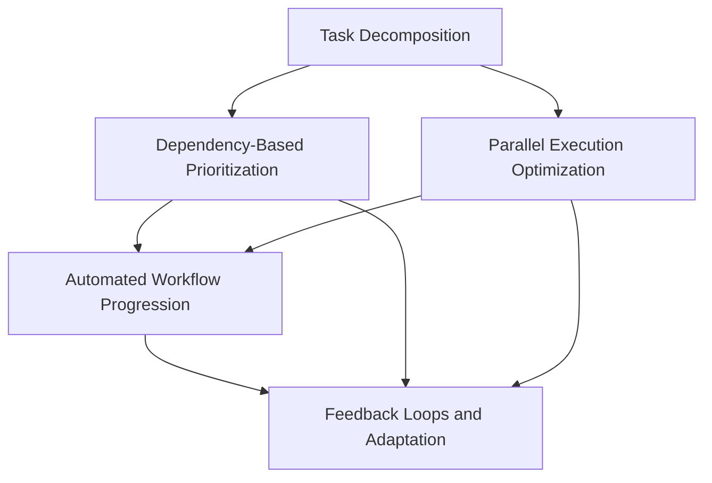

# Effective Uses of Blocking Dependencies in Autonomous Coding

## Overview

This research explores the effective uses of blocking dependencies and relationship management in autonomous coding engines. The goal is to develop a comprehensive framework for using Linear's dependency features to optimize autonomous coding workflows.

## Research Structure

This research is organized into five interconnected areas, each focusing on a specific aspect of dependency management:

### 1. Task Decomposition and Dependency Mapping (HLX-1435)
**Focus**: Automatically breaking down complex coding tasks into manageable sub-issues with appropriate dependency relationships.

**Key Research Questions**:
- How can we algorithmically identify logical components within complex coding tasks?
- What patterns exist for establishing blocking dependencies between different types of work?
- How can we visualize and validate dependency relationships?

**Deliverables**:
- Task decomposition algorithm
- Dependency mapping system
- Visualization tools
- Real-world implementation examples

### 2. Automated Workflow Progression System (HLX-1436)
**Focus**: Automatically progressing workflows based on the completion of blocking dependencies.

**Key Research Questions**:
- How can we efficiently monitor dependency status changes?
- What mechanisms enable automatic workflow progression?
- How do we handle edge cases and failure scenarios?

**Deliverables**:
- Webhook-based monitoring system
- Automated notification mechanisms
- Ready queue implementation
- State transition automation

### 3. Dependency-Based Prioritization Algorithm (HLX-1437)
**Focus**: Prioritizing issues based on their position in the dependency graph.

**Key Research Questions**:
- How do we identify critical path bottlenecks in dependency graphs?
- What factors should influence dependency-based prioritization?
- How can we balance dependency relationships with other priority factors?

**Deliverables**:
- Graph analysis algorithms
- Critical path identification
- Multi-factor scoring system
- Priority adjustment mechanisms

### 4. Parallel Execution Optimization (HLX-1438)
**Focus**: Optimizing parallel execution by identifying independent branches in dependency graphs.

**Key Research Questions**:
- How can we identify truly independent work streams?
- What strategies maximize parallel execution efficiency?
- How do we handle resource allocation across parallel streams?

**Deliverables**:
- Independent branch detection algorithms
- Resource allocation strategies
- Parallel execution monitoring
- Throughput optimization techniques

### 5. Feedback Loops and Adaptation System (HLX-1439)
**Focus**: Implementing feedback loops and adaptation mechanisms based on dependency status changes.

**Key Research Questions**:
- How do we handle dependency chain disruptions gracefully?
- What adaptation strategies work best for different failure scenarios?
- How can we learn from dependency failures to improve future planning?

**Deliverables**:
- Failure detection and notification systems
- Adaptive reprioritization mechanisms
- Rollback and recovery procedures
- Learning and improvement frameworks

## Research Methodology

### Phase 1: Foundation and Scaffolding
1. Create standardized research templates and documentation structure
2. Establish common terminology and evaluation criteria
3. Set up development environment with Linear API integration
4. Create base implementations for each research area

### Phase 2: Individual Component Development
1. Develop proof-of-concept implementations for each area
2. Create concrete examples using real Linear issues
3. Test implementations with various scenarios
4. Document findings and recommendations

### Phase 3: Integration and Synthesis
1. Identify synergies and interactions between components
2. Create integrated workflow examples
3. Develop comprehensive framework documentation
4. Provide implementation roadmap and recommendations

## Success Criteria

- **Practical Implementations**: Each research area produces working code examples
- **Real-world Validation**: Implementations tested with actual Linear issues and dependencies
- **Comprehensive Documentation**: Clear guidelines for implementing each approach
- **Integration Framework**: Cohesive system that combines all research areas
- **Actionable Recommendations**: Specific guidance for autonomous coding engine optimization

## Dependencies Between Research Areas

## Implementation Timeline

1. **Week 1**: Task Decomposition and Dependency Mapping (Foundation)
2. **Week 2**: Dependency-Based Prioritization Algorithm (Core Logic)
3. **Week 3**: Parallel Execution Optimization (Efficiency)
4. **Week 4**: Automated Workflow Progression (Automation)
5. **Week 5**: Feedback Loops and Adaptation System (Resilience)
6. **Week 6**: Integration and Comprehensive Framework

## Resources and Tools

- **Linear API**: For creating and managing actual dependencies
- **Graph Analysis Libraries**: For dependency graph algorithms
- **Webhook Infrastructure**: For real-time status monitoring
- **Visualization Tools**: For dependency graph representation
- **Testing Framework**: For validating implementations

## Expected Outcomes

This research will produce a comprehensive framework that enables autonomous coding engines to:

1. **Intelligently decompose** complex tasks into manageable components
2. **Automatically prioritize** work based on dependency relationships
3. **Maximize parallel execution** through independent branch identification
4. **Seamlessly progress** workflows as dependencies are completed
5. **Gracefully adapt** to changes and failures in dependency chains

The framework will be validated through real-world implementations using Linear's dependency features, providing concrete examples and actionable recommendations for optimization.

