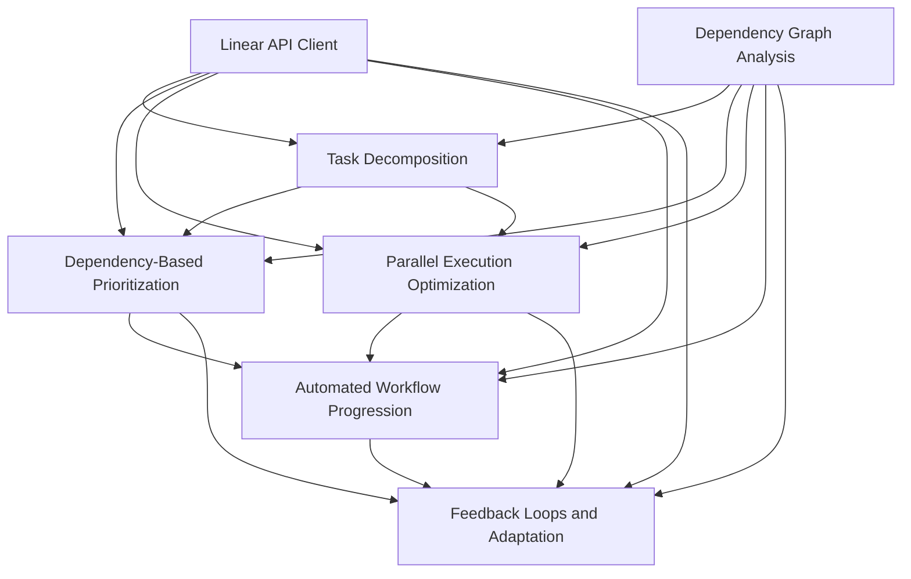

# Blocking Dependencies Research - Progress Summary

## Overview

This document summarizes the current progress on exploring effective uses of blocking dependencies in autonomous coding workflows. The research is structured around five interconnected components, each addressing a specific aspect of dependency management.

## Current Status

### ✅ Completed Components

#### 1. Research Framework and Scaffolding
- **Status**: Complete
- **Location**: `research/blocking-dependencies-framework/`
- **Deliverables**:
  - Comprehensive research structure with clear methodology
  - Common utilities and patterns for all research areas
  - Integration framework for combining components

#### 2. Linear API Integration
- **Status**: Complete
- **Location**: `research/blocking-dependencies-framework/common/linear_api_client.py`
- **Deliverables**:
  - Full Linear GraphQL API client with dependency management
  - Issue creation and relationship management
  - Dependency retrieval and analysis capabilities

#### 3. Dependency Graph Analysis
- **Status**: Complete
- **Location**: `research/blocking-dependencies-framework/common/dependency_graph.py`
- **Deliverables**:
  - NetworkX-based dependency graph implementation
  - Critical path calculation algorithms
  - Bottleneck identification and parallel branch detection
  - Graph metrics and analysis tools

#### 4. Practical Demonstration
- **Status**: Complete
- **Location**: `research/blocking-dependencies-framework/demo_dependency_creation.py`
- **Deliverables**:
  - Real Linear issues demonstrating dependency patterns
  - Sequential dependency chain (Database → API → Frontend → Testing)
  - Parallel execution scenario (Infrastructure → iOS + Android + Backend → Integration)
  - 9 demonstration issues created in Linear workspace

### 🔄 In Progress Components

#### 1. Task Decomposition and Dependency Mapping (HLX-1435)
- **Status**: In Progress (Child Agent #22425)
- **Location**: `research/blocking-dependencies-framework/task-decomposition/`
- **Current State**:
  - Comprehensive research plan and methodology complete
  - NLP-based task analyzer scaffolding implemented
  - Child agent working on full implementation
- **Expected Deliverables**:
  - Automatic task decomposition algorithms
  - Dependency inference and mapping
  - Visualization tools for dependency graphs

### 📋 Planned Components

#### 2. Dependency-Based Prioritization Algorithm (HLX-1437)
- **Status**: Scaffolded, Ready for Implementation
- **Location**: `research/blocking-dependencies-framework/prioritization-algorithm/`
- **Scaffolding Complete**:
  - Detailed research plan and algorithms
  - Component architecture defined
  - Integration points identified
- **To Implement**:
  - Critical path analysis algorithms
  - Multi-factor scoring system
  - Dynamic priority adjustment mechanisms

#### 3. Parallel Execution Optimization (HLX-1438)
- **Status**: Planned
- **Dependencies**: Task Decomposition, Prioritization Algorithm
- **Focus**: Optimizing parallel execution by identifying independent branches

#### 4. Automated Workflow Progression System (HLX-1436)
- **Status**: Planned
- **Dependencies**: Task Decomposition, Prioritization Algorithm
- **Focus**: Automatically progressing workflows based on dependency completion

#### 5. Feedback Loops and Adaptation System (HLX-1439)
- **Status**: Planned
- **Dependencies**: All other components
- **Focus**: Implementing feedback loops and adaptation mechanisms

## Key Achievements

### 1. Real Linear Dependency Demonstrations
Successfully created 9 demonstration issues in Linear workspace showcasing:

**Feature Implementation Scenario** (HLX-1708 to HLX-1711):
- Database Schema for Notification System
- Notification API Endpoints  
- Notification UI Components
- Notification System Testing

**Parallel Execution Scenario** (HLX-1712 to HLX-1716):
- Mobile App Infrastructure Setup
- iOS App Development
- Android App Development  
- Mobile Backend API
- Mobile App Integration Testing

### 2. Dependency Analysis Insights
The demonstration revealed key patterns:
- **Sequential Dependencies**: Clear blocking chains for feature development
- **Parallel Opportunities**: Independent work streams that can run simultaneously
- **Bottleneck Identification**: Infrastructure and API components that block multiple streams
- **Critical Path Analysis**: Longest dependency chains determining project timelines

### 3. Technical Infrastructure
Built robust technical foundation:
- **Linear API Client**: Full GraphQL integration with dependency management
- **Dependency Graph Analysis**: NetworkX-based graph algorithms
- **Visualization Tools**: Mermaid diagram generation and analysis
- **Pattern Recognition**: Common dependency patterns and workflows

## Research Methodology Validation

The research follows the **Research Coordination Workflow** pattern from the agent operations guidelines:

### ✅ Initial Scaffold Creation
- Standardized directory structure established
- Common terminology and evaluation criteria defined
- Central repository for findings created
- Templates for documentation and code examples

### ✅ Sub-task Definition
- 5 discrete, focused research components identified
- Detailed guidelines and deliverables specified
- Clear boundaries and integration points established
- Relevant resources and starting points provided

### 🔄 Progress Monitoring
- Regular check-ins with child agents
- Completion tracking for research milestones
- Integration planning between components

### 📋 Planned: Findings Synthesis
- Cross-component integration and analysis
- Unified documentation structure
- Comprehensive framework development

## Integration Architecture

The research components are designed with clear integration points:

## Next Steps

### Immediate (Week 1)
1. **Monitor Child Agent Progress**: Track HLX-1435 implementation
2. **Assign Prioritization Algorithm**: Start HLX-1437 implementation
3. **Create Dependency Relationships**: Establish blocking dependencies between sub-issues

### Short Term (Weeks 2-3)
1. **Parallel Execution Implementation**: Begin HLX-1438 after prioritization foundation
2. **Workflow Progression System**: Start HLX-1436 implementation
3. **Integration Testing**: Test component interactions

### Medium Term (Weeks 4-5)
1. **Feedback Loops Implementation**: Complete HLX-1439
2. **Comprehensive Integration**: Combine all components
3. **Real-world Validation**: Test with actual autonomous coding scenarios

### Long Term (Week 6+)
1. **Framework Documentation**: Create comprehensive implementation guide
2. **Performance Optimization**: Optimize for production use
3. **Deployment Recommendations**: Provide integration guidance

## Success Metrics

### Technical Metrics
- **Component Completion**: 5/5 research components implemented
- **Integration Success**: All components working together
- **Performance**: Real-time dependency analysis and prioritization
- **Accuracy**: >80% accuracy in task decomposition and prioritization

### Practical Metrics
- **Linear Integration**: Seamless integration with Linear API
- **Workflow Optimization**: Measurable improvement in autonomous coding efficiency
- **Dependency Management**: Effective handling of complex dependency chains
- **Adaptation**: Successful handling of changing requirements and failures

## Research Impact

This research will enable autonomous coding engines to:

1. **Intelligently Decompose** complex tasks into manageable components
2. **Automatically Prioritize** work based on dependency relationships
3. **Maximize Parallel Execution** through independent branch identification
4. **Seamlessly Progress** workflows as dependencies are completed
5. **Gracefully Adapt** to changes and failures in dependency chains

The framework provides concrete, actionable improvements for autonomous coding workflows using Linear's dependency features as the foundation for optimization.

