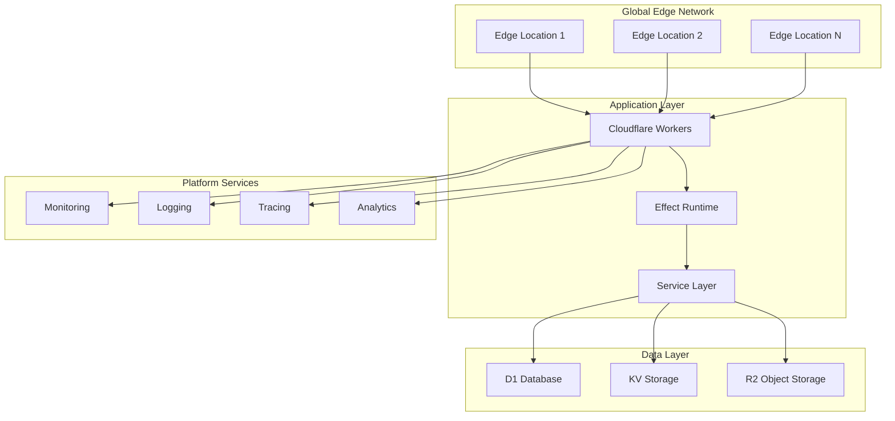

# Comprehensive Product Requirements Document: D1, Cloudflare Workers, and EffectTS Integration Platform

## Executive Summary

This Product Requirements Document (PRD) presents a comprehensive vision for leveraging Cloudflare D1, Cloudflare Workers, and EffectTS as an integrated technology stack for building next-generation distributed applications. Based on extensive research and analysis, this document outlines the product vision, technical requirements, architecture recommendations, and implementation roadmap for organizations seeking to adopt this powerful combination of technologies.

### Product Vision

To create a globally distributed, type-safe, and highly performant application development platform that combines the edge computing capabilities of Cloudflare Workers, the distributed database features of D1, and the functional programming robustness of EffectTS, enabling developers to build reliable, scalable applications with unprecedented performance and developer experience.

### Key Value Propositions

1. **Global Edge Performance**: Sub-millisecond cold starts with worldwide distribution
2. **End-to-End Type Safety**: Comprehensive TypeScript integration from database to API
3. **Functional Reliability**: Robust error handling and composable application logic
4. **Cost Efficiency**: Pay-per-use pricing model with automatic scaling
5. **Developer Experience**: Modern tooling and development workflows

## Product Objectives and Success Metrics

### Primary Objectives

#### Performance Excellence
- **Target**: 99th percentile response times under 50ms globally
- **Metric**: Average cold start times under 1ms
- **Goal**: Support 100,000+ concurrent requests per application

#### Developer Productivity
- **Target**: Reduce development time by 40% compared to traditional stacks
- **Metric**: Time from project initialization to production deployment
- **Goal**: Enable developers to ship features 2x faster

#### Reliability and Robustness
- **Target**: 99.99% uptime with automatic failover
- **Metric**: Mean Time To Recovery (MTTR) under 30 seconds
- **Goal**: Zero data loss with comprehensive error handling

#### Cost Optimization
- **Target**: 60-80% cost reduction compared to traditional cloud solutions
- **Metric**: Total Cost of Ownership (TCO) per request
- **Goal**: Predictable, usage-based pricing model

### Success Metrics

#### Technical Metrics
- **Response Time**: P95 < 25ms, P99 < 50ms globally
- **Throughput**: 1M+ requests per minute per application
- **Availability**: 99.99% uptime SLA
- **Error Rate**: < 0.01% application errors

#### Business Metrics
- **Developer Adoption**: 1000+ active developers within 12 months
- **Application Deployment**: 500+ production applications
- **Customer Satisfaction**: Net Promoter Score (NPS) > 70
- **Revenue Growth**: 200% year-over-year growth in platform usage

## Functional Requirements

### Core Platform Capabilities

#### 1. Global Edge Computing Platform
```typescript
// Requirement: Global deployment with automatic scaling
interface EdgePlatform {
  // Deploy applications to 300+ global edge locations
  deployGlobally: (application: Application) => Effect<DeploymentResult, DeploymentError>;
  
  // Automatic scaling based on demand
  autoScale: (metrics: PerformanceMetrics) => Effect<ScalingResult, ScalingError>;
  
  // Intelligent request routing
  routeRequest: (request: Request) => Effect<Response, RoutingError>;
}
```

**Acceptance Criteria:**
- Applications automatically deploy to all available edge locations
- Scaling occurs within 100ms of demand changes
- Requests are routed to the nearest healthy edge location
- Support for blue-green deployments and canary releases

#### 2. Distributed Database Management
```typescript
// Requirement: Globally distributed SQLite database with edge optimization
interface DatabasePlatform {
  // Create and manage distributed databases
  createDatabase: (config: DatabaseConfig) => Effect<Database, DatabaseCreationError>;
  
  // Execute queries with automatic optimization
  executeQuery: (query: SQLQuery) => Effect<QueryResult, QueryError>;
  
  // Manage database sharding and replication
  manageSharding: (strategy: ShardingStrategy) => Effect<ShardingResult, ShardingError>;
}
```

**Acceptance Criteria:**
- Support for multiple database instances with automatic sharding
- Query optimization for edge execution
- Automatic backup and recovery mechanisms
- Real-time replication across edge locations

#### 3. Type-Safe Application Framework
```typescript
// Requirement: End-to-end type safety with functional programming patterns
interface TypeSafeFramework {
  // Define application services with full type inference
  defineService: <T>(service: ServiceDefinition<T>) => Effect<Service<T>, ServiceError>;
  
  // Compose applications with type-safe dependency injection
  composeApplication: (services: ServiceLayer) => Effect<Application, CompositionError>;
  
  // Validate data with compile-time type checking
  validateData: <T>(schema: Schema<T>, data: unknown) => Effect<T, ValidationError>;
}
```

**Acceptance Criteria:**
- Full TypeScript integration with compile-time type checking
- Automatic type inference for complex operations
- Runtime type validation with detailed error messages
- Comprehensive error type tracking

### Application Development Features

#### 4. Service Orchestration and Communication
```typescript
// Requirement: Microservices orchestration with resilience patterns
interface ServiceOrchestration {
  // Service discovery and registration
  discoverServices: (criteria: ServiceCriteria) => Effect<ServiceInstance[], DiscoveryError>;
  
  // Circuit breaker and retry mechanisms
  callServiceWithResilience: (call: ServiceCall) => Effect<ServiceResponse, ServiceError>;
  
  // Event-driven communication
  publishEvent: (event: DomainEvent) => Effect<PublishResult, PublishError>;
}
```

**Acceptance Criteria:**
- Automatic service discovery and health checking
- Built-in circuit breaker and retry mechanisms
- Event-driven architecture support
- Distributed tracing and monitoring

#### 5. Real-Time Data Processing
```typescript
// Requirement: High-throughput event processing with sub-second latency
interface DataProcessing {
  // Stream processing with backpressure handling
  processStream: (stream: EventStream) => Effect<ProcessingResult, ProcessingError>;
  
  // Real-time aggregations and analytics
  calculateMetrics: (events: Event[]) => Effect<Metrics, CalculationError>;
  
  // Batch processing for large datasets
  processBatch: (batch: DataBatch) => Effect<BatchResult, BatchError>;
}
```

**Acceptance Criteria:**
- Process 1M+ events per hour with sub-second latency
- Real-time aggregations and metrics calculation
- Automatic backpressure handling and flow control
- Support for both streaming and batch processing

### Developer Experience Features

#### 6. Development Tooling and Workflow
```typescript
// Requirement: Comprehensive development tools and CI/CD integration
interface DeveloperTools {
  // Local development environment
  createLocalEnvironment: (config: DevConfig) => Effect<DevEnvironment, SetupError>;
  
  // Testing framework with mocking capabilities
  runTests: (testSuite: TestSuite) => Effect<TestResults, TestError>;
  
  // Deployment pipeline integration
  deployToProduction: (application: Application) => Effect<DeploymentResult, DeploymentError>;
}
```

**Acceptance Criteria:**
- One-command local development setup
- Comprehensive testing framework with mocking
- Automated CI/CD pipeline integration
- Hot reloading and instant feedback during development

#### 7. Monitoring and Observability
```typescript
// Requirement: Comprehensive monitoring, logging, and alerting
interface ObservabilityPlatform {
  // Real-time metrics and monitoring
  collectMetrics: (application: Application) => Effect<MetricsCollection, MetricsError>;
  
  // Distributed tracing across services
  traceRequest: (request: Request) => Effect<TraceResult, TracingError>;
  
  // Alerting and notification system
  configureAlerts: (rules: AlertRules) => Effect<AlertConfiguration, AlertError>;
}
```

**Acceptance Criteria:**
- Real-time performance metrics and dashboards
- Distributed tracing across all services
- Customizable alerting and notification rules
- Log aggregation and search capabilities

## Non-Functional Requirements

### Performance Requirements

#### Response Time and Latency
- **API Response Time**: P95 < 25ms, P99 < 50ms globally
- **Database Query Time**: P95 < 5ms for simple queries
- **Cold Start Time**: < 1ms for JavaScript/TypeScript applications
- **Global Propagation**: Configuration changes propagated within 30 seconds

#### Throughput and Scalability
- **Request Throughput**: 100,000+ requests per second per application
- **Database Operations**: 10,000+ queries per second per database
- **Concurrent Users**: Unlimited with automatic scaling
- **Data Volume**: Support for 10GB+ databases with sharding

#### Resource Utilization
- **Memory Efficiency**: < 128MB memory usage per request
- **CPU Optimization**: < 30 seconds CPU time per request (configurable to 5 minutes)
- **Network Optimization**: < 100MB request/response size
- **Storage Efficiency**: Automatic compression and optimization

### Reliability and Availability

#### Uptime and Availability
- **Service Availability**: 99.99% uptime SLA
- **Data Availability**: 99.999% data availability guarantee
- **Recovery Time**: RTO < 1 minute, RPO < 5 minutes
- **Failover**: Automatic failover within 30 seconds

#### Error Handling and Recovery
- **Error Rate**: < 0.01% application error rate
- **Error Recovery**: Automatic retry with exponential backoff
- **Circuit Breaking**: Automatic circuit breaker activation
- **Graceful Degradation**: Fallback mechanisms for service failures

#### Data Integrity and Consistency
- **ACID Compliance**: Full ACID compliance for database operations
- **Eventual Consistency**: Configurable consistency levels
- **Backup and Recovery**: Automated backup with point-in-time recovery
- **Data Validation**: Comprehensive input validation and sanitization

### Security Requirements

#### Authentication and Authorization
- **Multi-Factor Authentication**: Support for MFA and SSO
- **Role-Based Access Control**: Granular permission management
- **API Security**: OAuth 2.0, JWT, and API key authentication
- **Audit Logging**: Comprehensive audit trail for all operations

#### Data Protection and Privacy
- **Encryption**: End-to-end encryption for data in transit and at rest
- **Data Isolation**: Multi-tenant data isolation and security
- **Privacy Compliance**: GDPR, CCPA, and other privacy regulation compliance
- **Data Residency**: Configurable data residency and sovereignty

#### Network and Infrastructure Security
- **DDoS Protection**: Automatic DDoS detection and mitigation
- **WAF Integration**: Web Application Firewall protection
- **SSL/TLS**: Automatic SSL certificate management
- **Security Headers**: Comprehensive security header implementation

### Compliance and Governance

#### Regulatory Compliance
- **SOC 2 Type II**: Enterprise-grade security certifications
- **ISO 27001**: Information security management compliance
- **HIPAA**: Healthcare data protection compliance (where applicable)
- **PCI DSS**: Payment card industry compliance (where applicable)

#### Data Governance
- **Data Lineage**: Complete data lineage tracking
- **Data Classification**: Automatic data classification and tagging
- **Retention Policies**: Configurable data retention and deletion
- **Access Controls**: Fine-grained data access controls

## Technical Architecture

### High-Level Architecture



### Component Architecture

#### 1. Edge Computing Layer
```typescript
// Cloudflare Workers runtime with Effect integration
interface EdgeRuntime {
  // V8 isolate management
  isolateManager: IsolateManager;
  
  // Request routing and load balancing
  requestRouter: RequestRouter;
  
  // Global state synchronization
  stateSync: StateSynchronizer;
  
  // Performance monitoring
  performanceMonitor: PerformanceMonitor;
}
```

#### 2. Application Framework Layer
```typescript
// Effect-based application framework
interface ApplicationFramework {
  // Service definition and composition
  serviceContainer: ServiceContainer;
  
  // Dependency injection system
  dependencyInjector: DependencyInjector;
  
  // Error handling and recovery
  errorHandler: ErrorHandler;
  
  // Type system integration
  typeSystem: TypeSystem;
}
```

#### 3. Data Management Layer
```typescript
// D1 database with advanced features
interface DataManagement {
  // Database connection pooling
  connectionPool: ConnectionPool;
  
  // Query optimization engine
  queryOptimizer: QueryOptimizer;
  
  // Sharding and replication
  shardingManager: ShardingManager;
  
  // Backup and recovery
  backupManager: BackupManager;
}
```

### Integration Patterns

#### Service Communication Pattern
```typescript
// Type-safe service communication with resilience
const serviceCall = <T>(
  serviceName: string,
  operation: string,
  payload: unknown
): Effect<T, ServiceError, ServiceRegistry | CircuitBreaker> =>
  Effect.gen(function* () {
    const registry = yield* ServiceRegistry;
    const circuitBreaker = yield* CircuitBreaker;
    
    const instance = yield* registry.getHealthyInstance(serviceName);
    const result = yield* circuitBreaker.execute(
      () => callService(instance, operation, payload)
    );
    
    return result as T;
  });
```

#### Data Access Pattern
```typescript
// Type-safe database operations with caching
const dataAccess = <T>(
  query: SQLQuery,
  params: QueryParams
): Effect<T, DatabaseError, D1Service | CacheService> =>
  Effect.gen(function* () {
    const cache = yield* CacheService;
    const db = yield* D1Service;
    
    // Try cache first
    const cached = yield* cache.get(query.cacheKey);
    if (cached) return cached as T;
    
    // Execute query
    const result = yield* db.execute(query, params);
    
    // Cache result
    yield* cache.set(query.cacheKey, result, query.ttl);
    
    return result as T;
  });
```

#### Event Processing Pattern
```typescript
// Event-driven architecture with Effect
const eventProcessor = (
  event: DomainEvent
): Effect<ProcessingResult, ProcessingError, EventStore | ServiceLayer> =>
  Effect.gen(function* () {
    const eventStore = yield* EventStore;
    const services = yield* ServiceLayer;
    
    // Store event
    yield* eventStore.append(event);
    
    // Process event through handlers
    const handlers = getEventHandlers(event.type);
    const results = yield* Effect.all(
      handlers.map(handler => handler.process(event)),
      { concurrency: 5 }
    );
    
    return { event, results };
  });
```

## Implementation Roadmap

### Phase 1: Foundation (Months 1-3)

#### Core Platform Development
- **Week 1-4**: Basic Workers + D1 integration
- **Week 5-8**: Effect framework integration and service layer
- **Week 9-12**: Development tooling and local environment

#### Deliverables
- Basic application framework with Workers, D1, and Effect
- Local development environment and tooling
- Core service patterns and examples
- Basic monitoring and logging

#### Success Criteria
- Deploy simple applications to edge locations
- Execute basic database operations with type safety
- Local development workflow functional
- Basic performance metrics collection

### Phase 2: Core Features (Months 4-6)

#### Advanced Platform Capabilities
- **Week 13-16**: Service orchestration and communication
- **Week 17-20**: Real-time data processing and analytics
- **Week 21-24**: Advanced error handling and resilience

#### Deliverables
- Service discovery and communication framework
- Event processing and streaming capabilities
- Circuit breaker and retry mechanisms
- Comprehensive error handling patterns

#### Success Criteria
- Multi-service applications with automatic discovery
- Real-time event processing with sub-second latency
- Automatic failover and recovery mechanisms
- Production-ready error handling

### Phase 3: Production Readiness (Months 7-9)

#### Enterprise Features
- **Week 25-28**: Security and compliance features
- **Week 29-32**: Monitoring and observability platform
- **Week 33-36**: Performance optimization and scaling

#### Deliverables
- Comprehensive security and authentication system
- Full observability platform with metrics, logs, and traces
- Performance optimization tools and techniques
- Scaling and capacity management

#### Success Criteria
- Enterprise-grade security and compliance
- Complete observability and monitoring
- Optimized performance for production workloads
- Automatic scaling and capacity management

### Phase 4: Ecosystem and Growth (Months 10-12)

#### Platform Ecosystem
- **Week 37-40**: Third-party integrations and marketplace
- **Week 41-44**: Advanced developer tools and IDE support
- **Week 45-48**: Community building and documentation

#### Deliverables
- Integration marketplace and ecosystem
- Advanced IDE support and developer tools
- Comprehensive documentation and tutorials
- Community platform and support

#### Success Criteria
- Active developer community and ecosystem
- Rich set of integrations and tools
- Comprehensive learning resources
- Strong community engagement

## Risk Assessment and Mitigation

### Technical Risks

#### Performance and Scalability Risks
**Risk**: Platform may not meet performance targets under high load
**Probability**: Medium
**Impact**: High
**Mitigation**: 
- Comprehensive performance testing and benchmarking
- Gradual rollout with performance monitoring
- Fallback mechanisms and graceful degradation

#### Integration Complexity Risks
**Risk**: Complex integration between D1, Workers, and Effect may cause issues
**Probability**: Medium
**Impact**: Medium
**Mitigation**:
- Extensive integration testing and validation
- Modular architecture with clear boundaries
- Comprehensive error handling and recovery

#### Technology Maturity Risks
**Risk**: EffectTS ecosystem may not be mature enough for enterprise use
**Probability**: Low
**Impact**: Medium
**Mitigation**:
- Gradual adoption with fallback options
- Active contribution to EffectTS ecosystem
- Alternative functional programming libraries as backup

### Business Risks

#### Market Adoption Risks
**Risk**: Developers may be slow to adopt functional programming patterns
**Probability**: Medium
**Impact**: High
**Mitigation**:
- Comprehensive training and education programs
- Gradual migration paths from traditional approaches
- Strong developer experience and tooling

#### Competitive Risks
**Risk**: Established cloud providers may offer competing solutions
**Probability**: High
**Impact**: Medium
**Mitigation**:
- Focus on unique value propositions (performance, type safety)
- Rapid innovation and feature development
- Strong community and ecosystem building

#### Vendor Lock-in Risks
**Risk**: Heavy dependence on Cloudflare platform may concern customers
**Probability**: Medium
**Impact**: Medium
**Mitigation**:
- Portable application patterns and abstractions
- Multi-cloud deployment options where possible
- Clear migration paths and data portability

### Operational Risks

#### Security and Compliance Risks
**Risk**: Security vulnerabilities or compliance failures
**Probability**: Low
**Impact**: High
**Mitigation**:
- Comprehensive security testing and auditing
- Regular compliance assessments and certifications
- Security-first development practices

#### Reliability and Availability Risks
**Risk**: Platform outages or reliability issues
**Probability**: Low
**Impact**: High
**Mitigation**:
- Redundant infrastructure and failover mechanisms
- Comprehensive monitoring and alerting
- Incident response and recovery procedures

## Success Metrics and KPIs

### Technical Performance Metrics

#### Response Time and Latency
- **P50 Response Time**: < 10ms globally
- **P95 Response Time**: < 25ms globally
- **P99 Response Time**: < 50ms globally
- **Cold Start Time**: < 1ms for JavaScript/TypeScript

#### Throughput and Scalability
- **Requests per Second**: 100,000+ per application
- **Database Operations**: 10,000+ per second per database
- **Event Processing**: 1M+ events per hour
- **Concurrent Users**: Unlimited with auto-scaling

#### Reliability and Availability
- **Uptime**: 99.99% availability SLA
- **Error Rate**: < 0.01% application errors
- **Recovery Time**: < 30 seconds for automatic failover
- **Data Durability**: 99.999% data durability guarantee

### Business and Adoption Metrics

#### Developer Adoption
- **Active Developers**: 1,000+ within 12 months
- **Applications Deployed**: 500+ production applications
- **Community Growth**: 10,000+ community members
- **Documentation Usage**: 100,000+ monthly page views

#### Customer Satisfaction
- **Net Promoter Score**: > 70
- **Customer Retention**: > 90% annual retention
- **Support Satisfaction**: > 95% satisfaction rating
- **Feature Adoption**: > 80% adoption of core features

#### Financial Performance
- **Revenue Growth**: 200% year-over-year growth
- **Cost Efficiency**: 60-80% cost reduction vs. alternatives
- **Time to Market**: 40% reduction in development time
- **ROI**: > 300% return on investment for customers

### Quality and Compliance Metrics

#### Code Quality
- **Test Coverage**: > 90% code coverage
- **Bug Density**: < 1 bug per 1,000 lines of code
- **Security Vulnerabilities**: Zero critical vulnerabilities
- **Performance Regressions**: < 5% performance degradation

#### Compliance and Security
- **Security Audits**: Quarterly security assessments
- **Compliance Certifications**: SOC 2, ISO 27001, etc.
- **Data Protection**: 100% GDPR compliance
- **Incident Response**: < 1 hour mean response time

## Conclusion

This comprehensive PRD outlines a vision for a next-generation application development platform that combines the strengths of Cloudflare D1, Workers, and EffectTS. The platform promises to deliver unprecedented performance, type safety, and developer experience while maintaining the reliability and scalability required for enterprise applications.

The key success factors for this platform include:

1. **Technical Excellence**: Delivering on performance, reliability, and scalability promises
2. **Developer Experience**: Providing exceptional tooling and development workflows
3. **Community Building**: Creating a vibrant ecosystem of developers and contributors
4. **Continuous Innovation**: Staying ahead of the competition with rapid feature development
5. **Enterprise Readiness**: Meeting the security, compliance, and support needs of enterprise customers

By following the outlined roadmap and maintaining focus on these success factors, this platform has the potential to become the preferred choice for building modern, distributed applications that require global performance, type safety, and functional programming robustness.

The combination of edge computing, distributed databases, and functional programming represents a significant advancement in application development technology, and this platform is positioned to lead that transformation.

