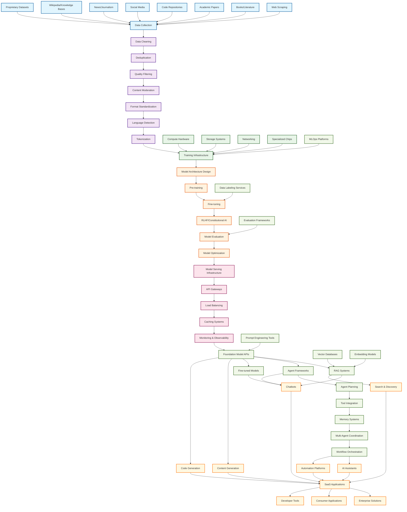

# LLM/ChatGPT/Agents Complete Supply Chain

## Executive Summary

The LLM supply chain represents a complex ecosystem spanning from raw data collection to end-user applications. Each stage presents unique business opportunities and technical challenges, with the entire chain valued at hundreds of billions of dollars.

## Complete Supply Chain Diagram

## Supply Chain Layers Breakdown

### 1. Raw Data Layer (Foundation)
**Components**: Web scraping, books, academic papers, code repositories, social media, news, knowledge bases, proprietary datasets

**Key Players**: 
- Common Crawl, Internet Archive
- Academic publishers (Elsevier, Springer)
- GitHub, GitLab
- Social platforms (Twitter, Reddit)
- News organizations
- Wikipedia Foundation

**Business Opportunities**:
- High-quality dataset curation services
- Specialized domain data collection
- Real-time data streaming platforms

### 2. Data Processing Layer (Critical Bottleneck)
**Components**: Cleaning, deduplication, quality filtering, content moderation, format standardization, language detection, tokenization

**Key Insight**: This is where the tokenizer article's insights become critical - poor tokenization affects everything downstream.

**Business Opportunities**:
- Advanced tokenization services
- Automated data quality assessment
- Specialized cleaning for domain-specific data

### 3. Infrastructure Layer (Capital Intensive)
**Components**: Compute hardware, storage systems, networking, specialized chips

**Key Players**:
- NVIDIA (GPUs), Google (TPUs), Cerebras (WSE)
- AWS, Azure, GCP
- Specialized AI infrastructure companies

### 4. Model Development Layer (Core IP)
**Components**: Architecture design, pre-training, fine-tuning, RLHF, evaluation, optimization

**Key Players**:
- OpenAI, Anthropic, Google, Meta
- Hugging Face, Weights & Biases
- Research institutions

### 5. Deployment Layer (Scalability)
**Components**: Model serving, API gateways, load balancing, caching, monitoring

**Key Players**:
- Inference providers (Replicate, RunPod, Together AI)
- Cloud providers
- Specialized serving platforms

### 6. Application Layer (Innovation Hub)
**Components**: Foundation APIs, RAG systems, agent frameworks, fine-tuned models

**Key Players**:
- OpenAI API, Anthropic Claude
- LangChain, LlamaIndex
- Vector databases (Pinecone, Weaviate, Chroma)

### 7. Agent Orchestration Layer (Emerging)
**Components**: Agent planning, tool integration, memory systems, multi-agent coordination, workflow orchestration

**Key Players**:
- AutoGPT, LangGraph, CrewAI
- Microsoft Semantic Kernel
- Emerging startups

### 8. End-User Applications (Value Realization)
**Components**: Chatbots, AI assistants, content generation, search & discovery, automation platforms, code generation

**Key Players**:
- ChatGPT, Claude, Gemini
- GitHub Copilot, Cursor
- Jasper, Copy.ai, Notion AI

### 9. Supporting Services (Enablers)
**Components**: Vector databases, embedding models, prompt engineering tools, evaluation frameworks, MLOps platforms, data labeling

**Key Players**:
- Pinecone, Weaviate, Chroma
- Weights & Biases, MLflow
- Scale AI, Labelbox

### 10. Business Layer (Monetization)
**Components**: SaaS applications, enterprise solutions, consumer applications, developer tools

**Market Size**: $200B+ projected by 2030

