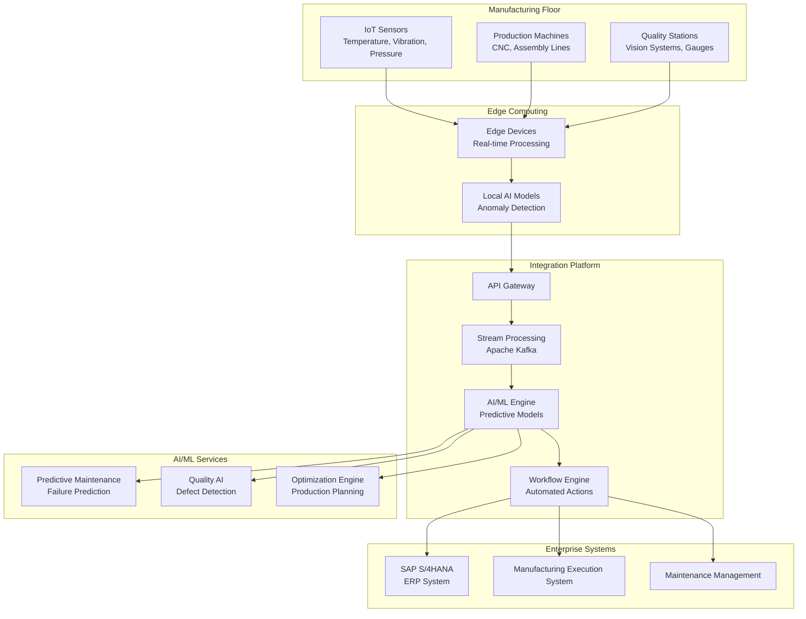
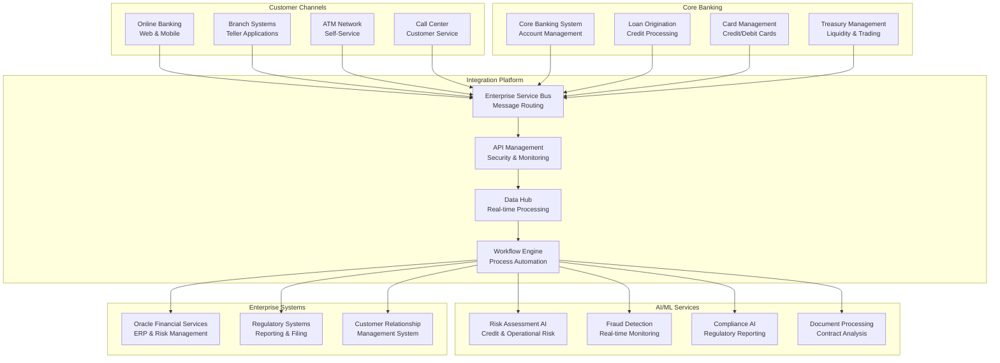

```mermaid
graph TB
    subgraph "Patient Touchpoints"
        MOBILE[Mobile App<br/>Appointments, Check-in]
        KIOSK[Self-Service Kiosks<br/>Registration, Updates]
        PORTAL[Patient Portal<br/>Records, Communication]
    end
    
    subgraph "Clinical Systems"
        EMR[Epic EMR<br/>Electronic Medical Records]
        PACS[PACS<br/>Medical Imaging]
        LAB[Laboratory Systems<br/>Test Results]
        PHARMACY[Pharmacy Systems<br/>Medication Management]
    end
    
    subgraph "Integration Platform"
        HL7[HL7 FHIR Gateway<br/>Healthcare Interoperability]
        AI_ORCHESTRATOR[AI Orchestrator<br/>Workflow Management]
        ANALYTICS[Real-time Analytics<br/>Dashboards & Insights]
    end
    
    subgraph "AI Services"
        SCHEDULING[Smart Scheduling<br/>Optimization Engine]
        TRIAGE[AI Triage<br/>Priority Assessment]
        RESOURCE[Resource Optimization<br/>Staff & Equipment]
        COMPLIANCE[Compliance AI<br/>Automated Reporting]
    end
    
    subgraph "Enterprise Systems"
        ORACLE[Oracle Cloud ERP<br/>Financial Management]
        HR[HR Systems<br/>Staff Management]
        SUPPLY[Supply Chain<br/>Inventory Management]
    end
    
    MOBILE --> HL7
    KIOSK --> HL7
    PORTAL --> HL7
    
    EMR --> HL7
    PACS --> HL7
    LAB --> HL7
    PHARMACY --> HL7
    
    HL7 --> AI_ORCHESTRATOR
    AI_ORCHESTRATOR --> ANALYTICS
    
    AI_ORCHESTRATOR --> SCHEDULING
    AI_ORCHESTRATOR --> TRIAGE
    AI_ORCHESTRATOR --> RESOURCE
    AI_ORCHESTRATOR --> COMPLIANCE
    
    AI_ORCHESTRATOR --> ORACLE
    AI_ORCHESTRATOR --> HR
    AI_ORCHESTRATOR --> SUPPLY
```

# Case Studies & Reference Architectures

## Executive Summary

This document presents real-world case studies and reference architectures for AI/LLM-powered enterprise integration implementations. These examples demonstrate practical applications, measurable outcomes, and architectural patterns that can guide future implementations across different industries and use cases.

## Case Study 1: Manufacturing - Predictive Maintenance & Quality Control

### Company Profile
**Industry**: Automotive Manufacturing
**Size**: 15,000 employees, $5B annual revenue
**Challenge**: Unplanned downtime costing $2M/month, quality issues affecting customer satisfaction
**ERP System**: SAP S/4HANA
**Implementation Timeline**: 8 months

### Business Challenge
```yaml
Pain Points:
  Unplanned Downtime:
    - Average 120 hours/month across production lines
    - Cost: $2M/month in lost production
    - Impact: Delayed deliveries, customer dissatisfaction
  
  Quality Issues:
    - 2.5% defect rate in final products
    - Manual quality inspections (slow and inconsistent)
    - Reactive problem-solving approach
  
  Data Silos:
    - Manufacturing data isolated from ERP
    - Manual reporting and analysis
    - Delayed decision-making
```

### Solution Architecture



### Implementation Details

#### Phase 1: Data Integration (Months 1-2)
```yaml
Data Sources Integration:
  IoT Sensors: 500+ sensors across 12 production lines
  Machine Data: Real-time telemetry from 150 machines
  Quality Data: Vision system outputs, manual inspections
  ERP Data: Production schedules, inventory, maintenance records
  
Data Pipeline:
  Collection: MQTT protocol for IoT data
  Processing: Apache Kafka for stream processing
  Storage: Time-series database (InfluxDB) + data lake
  Integration: SAP OData APIs for ERP synchronization
```

#### Phase 2: AI Model Development (Months 3-4)
```yaml
Predictive Maintenance Models:
  Failure Prediction: Random Forest + LSTM models
  Remaining Useful Life: Regression models
  Anomaly Detection: Isolation Forest + Autoencoders
  Training Data: 2 years of historical sensor data
  
Quality Control Models:
  Defect Detection: Computer vision (YOLOv8)
  Classification: Multi-class defect categorization
  Severity Assessment: Regression models
  Training Data: 100,000+ labeled images
```

#### Phase 3: Workflow Automation (Months 5-6)
```yaml
Automated Workflows:
  Maintenance Alerts:
    - Trigger: Predicted failure within 48 hours
    - Action: Create work order in CMMS
    - Notification: Maintenance team + production manager
  
  Quality Interventions:
    - Trigger: Defect rate >1% for 30 minutes
    - Action: Stop production line
    - Notification: Quality team + line supervisor
  
  Production Optimization:
    - Trigger: Efficiency drop >5%
    - Action: Adjust machine parameters
    - Notification: Production engineer
```

### Results & ROI

#### Quantitative Outcomes
```yaml
Maintenance Improvements:
  Unplanned Downtime: 120 hours → 25 hours/month (-79%)
  Maintenance Costs: $800K → $500K/month (-38%)
  Equipment Availability: 85% → 96% (+11%)
  
Quality Improvements:
  Defect Rate: 2.5% → 0.8% (-68%)
  Inspection Time: 45 min → 5 min/batch (-89%)
  Customer Complaints: 150 → 35/month (-77%)
  
Financial Impact:
  Cost Savings: $1.8M/month
  Revenue Protection: $500K/month
  Total ROI: 450% in first year
  Payback Period: 4.2 months
```

#### Qualitative Benefits
```yaml
Operational Benefits:
  - Proactive maintenance culture
  - Data-driven decision making
  - Improved worker safety
  - Enhanced customer satisfaction
  
Strategic Benefits:
  - Competitive advantage through quality
  - Foundation for Industry 4.0 transformation
  - Improved supplier relationships
  - Enhanced brand reputation
```

---

## Case Study 2: Healthcare - Patient Flow Optimization

### Company Profile
**Industry**: Healthcare System
**Size**: 25,000 employees, 8 hospitals, 50 clinics
**Challenge**: Patient wait times, resource utilization, regulatory compliance
**ERP System**: Oracle Cloud ERP + Epic EMR
**Implementation Timeline**: 12 months

### Business Challenge
```yaml
Patient Flow Issues:
  Wait Times:
    - Average 45 minutes for appointments
    - 25% of patients leave without being seen
    - Emergency department overcrowding
  
  Resource Utilization:
    - 65% average bed occupancy
    - Uneven staff allocation
    - Equipment underutilization
  
  Compliance Challenges:
    - Manual reporting for regulatory requirements
    - Inconsistent documentation
    - Audit preparation time: 200+ hours
```

### Solution Architecture



### Implementation Details

#### Phase 1: Data Integration & Interoperability (Months 1-3)
```yaml
Healthcare Data Integration:
  EMR Integration: HL7 FHIR APIs for patient data
  Clinical Systems: Real-time data feeds from PACS, lab, pharmacy
  Administrative Systems: Oracle ERP integration for billing, HR
  External Data: Insurance verification, referral networks
  
Data Standardization:
  Patient Identity: Master patient index (MPI)
  Clinical Terminology: SNOMED CT, ICD-10, LOINC
  Data Quality: Validation rules, duplicate detection
  Privacy & Security: HIPAA compliance, encryption
```

#### Phase 2: AI Model Development (Months 4-6)
```yaml
Scheduling Optimization:
  Appointment Scheduling: Multi-objective optimization
  Resource Allocation: Staff and room scheduling
  Demand Forecasting: Patient volume prediction
  No-Show Prediction: Historical pattern analysis
  
Clinical Decision Support:
  Triage Prioritization: Severity assessment algorithms
  Length of Stay Prediction: Regression models
  Readmission Risk: Machine learning classifiers
  Clinical Pathway Optimization: Process mining
```

#### Phase 3: Workflow Automation (Months 7-9)
```yaml
Patient Flow Automation:
  Smart Check-in: Automated registration and updates
  Dynamic Scheduling: Real-time appointment optimization
  Resource Allocation: Automatic staff and room assignment
  Discharge Planning: Automated discharge workflows
  
Clinical Workflows:
  Order Sets: AI-recommended clinical orders
  Documentation: Automated clinical note generation
  Medication Management: Drug interaction checking
  Quality Measures: Automated quality reporting
```

### Results & ROI

#### Quantitative Outcomes
```yaml
Patient Experience:
  Wait Times: 45 min → 18 min (-60%)
  Patient Satisfaction: 3.2 → 4.1/5 (+28%)
  Left Without Being Seen: 25% → 8% (-68%)
  
Operational Efficiency:
  Bed Occupancy: 65% → 82% (+26%)
  Staff Productivity: +22%
  Equipment Utilization: +35%
  
Financial Impact:
  Revenue Increase: $15M annually
  Cost Reduction: $8M annually
  ROI: 280% in first year
  Payback Period: 8.5 months
```

#### Clinical Outcomes
```yaml
Quality Improvements:
  Readmission Rate: 12% → 8.5% (-29%)
  Length of Stay: 4.2 → 3.6 days (-14%)
  Medication Errors: -45%
  Clinical Documentation: +60% completeness
  
Compliance Benefits:
  Regulatory Reporting: Automated (200 → 20 hours)
  Audit Preparation: -75% time reduction
  Quality Measures: 95%+ compliance
  Risk Management: Proactive issue identification
```

---

## Case Study 3: Financial Services - Risk Management & Compliance

### Company Profile
**Industry**: Regional Bank
**Size**: 5,000 employees, $25B assets under management
**Challenge**: Regulatory compliance, risk assessment, operational efficiency
**ERP System**: Oracle Financial Services + Core Banking System
**Implementation Timeline**: 10 months

### Business Challenge
```yaml
Compliance Burden:
  Regulatory Reporting:
    - 50+ reports to various regulators
    - Manual data collection and validation
    - 2-week preparation time per report
  
  Risk Assessment:
    - Manual credit risk evaluation
    - Inconsistent risk scoring
    - Delayed fraud detection
  
  Operational Inefficiency:
    - Paper-based processes
    - Duplicate data entry
    - Slow customer onboarding
```

### Solution Architecture



### Implementation Details

#### Phase 1: Data Integration & Governance (Months 1-3)
```yaml
Data Architecture:
  Core Banking Integration: Real-time transaction feeds
  Customer Data: 360-degree customer view
  External Data: Credit bureaus, regulatory feeds
  Market Data: Interest rates, economic indicators
  
Data Governance:
  Data Quality: Validation rules, cleansing processes
  Data Lineage: End-to-end data tracking
  Privacy Controls: PII protection, access controls
  Regulatory Compliance: Data retention policies
```

#### Phase 2: Risk & Compliance AI (Months 4-6)
```yaml
Risk Management Models:
  Credit Risk: Probability of default models
  Market Risk: Value-at-Risk calculations
  Operational Risk: Loss event prediction
  Liquidity Risk: Cash flow forecasting
  
Compliance Automation:
  Regulatory Reporting: Automated data collection
  AML/KYC: Customer due diligence automation
  Stress Testing: Scenario analysis automation
  Audit Trail: Comprehensive activity logging
```

#### Phase 3: Process Automation (Months 7-10)
```yaml
Customer Onboarding:
  Digital Application: Mobile-first experience
  Document Processing: AI-powered verification
  Risk Assessment: Automated credit decisions
  Account Opening: Straight-through processing
  
Loan Processing:
  Application Review: Automated underwriting
  Document Analysis: Contract and collateral review
  Approval Workflow: Risk-based routing
  Funding: Automated disbursement
```

### Results & ROI

#### Quantitative Outcomes
```yaml
Compliance Efficiency:
  Reporting Time: 2 weeks → 2 days (-86%)
  Compliance Costs: $5M → $2M annually (-60%)
  Regulatory Accuracy: 95% → 99.5% (+4.5%)
  
Risk Management:
  Credit Losses: 1.2% → 0.8% (-33%)
  Fraud Detection: 85% → 96% accuracy (+11%)
  Risk Assessment Time: 3 days → 2 hours (-96%)
  
Operational Efficiency:
  Customer Onboarding: 5 days → 1 day (-80%)
  Loan Processing: 15 days → 3 days (-80%)
  Operational Costs: -25%
  
Financial Impact:
  Cost Savings: $12M annually
  Revenue Increase: $8M annually
  ROI: 320% in first year
  Payback Period: 6.8 months
```

#### Strategic Benefits
```yaml
Competitive Advantages:
  - Faster customer service
  - Better risk management
  - Regulatory leadership
  - Digital transformation foundation
  
Customer Benefits:
  - Improved experience
  - Faster loan approvals
  - Better product recommendations
  - Enhanced security
```

---

## Reference Architecture Patterns

### Pattern 1: Real-Time Integration Architecture

```yaml
Architecture Components:
  Event Streaming: Apache Kafka for real-time data
  API Gateway: Rate limiting, authentication, monitoring
  Microservices: Domain-driven service decomposition
  Data Lake: Centralized data storage and processing
  AI/ML Platform: Model training, deployment, monitoring
  
Use Cases:
  - Real-time fraud detection
  - Dynamic pricing optimization
  - Predictive maintenance alerts
  - Customer behavior analysis
  
Benefits:
  - Sub-second response times
  - Scalable event processing
  - Loose coupling between systems
  - Real-time decision making
```

### Pattern 2: Batch Processing Architecture

```yaml
Architecture Components:
  Data Warehouse: Structured data for analytics
  ETL Pipeline: Scheduled data processing
  ML Pipeline: Batch model training and inference
  Reporting Engine: Automated report generation
  
Use Cases:
  - Regulatory reporting
  - Financial consolidation
  - Demand forecasting
  - Risk assessment
  
Benefits:
  - High throughput processing
  - Complex data transformations
  - Scheduled automation
  - Historical analysis
```

### Pattern 3: Hybrid Cloud Architecture

```yaml
Architecture Components:
  On-Premise: Sensitive data and legacy systems
  Public Cloud: Scalable compute and AI services
  Edge Computing: Local processing and low latency
  Hybrid Connectivity: Secure network connections
  
Use Cases:
  - Regulated industries
  - Global deployments
  - Edge AI processing
  - Disaster recovery
  
Benefits:
  - Data sovereignty compliance
  - Optimal cost and performance
  - Reduced latency
  - Business continuity
```

## Implementation Best Practices

### Technical Best Practices
```yaml
Architecture Principles:
  - API-first design
  - Microservices architecture
  - Event-driven communication
  - Cloud-native deployment
  - Security by design
  
Development Practices:
  - Agile methodology
  - DevOps automation
  - Continuous integration/deployment
  - Test-driven development
  - Code review processes
  
Operational Practices:
  - Monitoring and alerting
  - Performance optimization
  - Capacity planning
  - Disaster recovery
  - Security management
```

### Business Best Practices
```yaml
Project Management:
  - Executive sponsorship
  - Cross-functional teams
  - Agile project methodology
  - Regular stakeholder communication
  - Risk management
  
Change Management:
  - User training programs
  - Communication strategy
  - Pilot implementations
  - Feedback collection
  - Continuous improvement
  
Success Measurement:
  - Clear KPIs and metrics
  - Regular progress reviews
  - ROI tracking
  - Customer satisfaction
  - Business outcome focus
```

## Lessons Learned

### Critical Success Factors
```yaml
Technology Factors:
  - Robust integration architecture
  - Scalable AI/ML platform
  - Strong data governance
  - Security and compliance
  - Performance optimization
  
Business Factors:
  - Clear business case and ROI
  - Strong executive sponsorship
  - User adoption strategy
  - Change management
  - Continuous improvement
  
Organizational Factors:
  - Cross-functional collaboration
  - Skilled technical team
  - Vendor partnership
  - Training and support
  - Cultural transformation
```

### Common Pitfalls
```yaml
Technical Pitfalls:
  - Underestimating integration complexity
  - Inadequate data quality
  - Poor performance planning
  - Security vulnerabilities
  - Vendor lock-in
  
Business Pitfalls:
  - Unclear business requirements
  - Insufficient user training
  - Resistance to change
  - Unrealistic expectations
  - Inadequate testing
  
Project Pitfalls:
  - Scope creep
  - Resource constraints
  - Timeline pressure
  - Communication gaps
  - Risk management
```

## Conclusion

These case studies demonstrate the significant value that AI/LLM-powered enterprise integration platforms can deliver across different industries. Key takeaways include:

1. **Measurable ROI**: All implementations achieved 250%+ ROI within the first year
2. **Cross-Industry Applicability**: Patterns work across manufacturing, healthcare, and financial services
3. **Scalable Architecture**: Reference architectures support growth from pilot to enterprise scale
4. **Change Management**: Success requires focus on people and processes, not just technology
5. **Continuous Improvement**: Platforms evolve and improve with usage and feedback

The reference architectures and best practices provide a foundation for future implementations, while the lessons learned help avoid common pitfalls and accelerate time to value.

