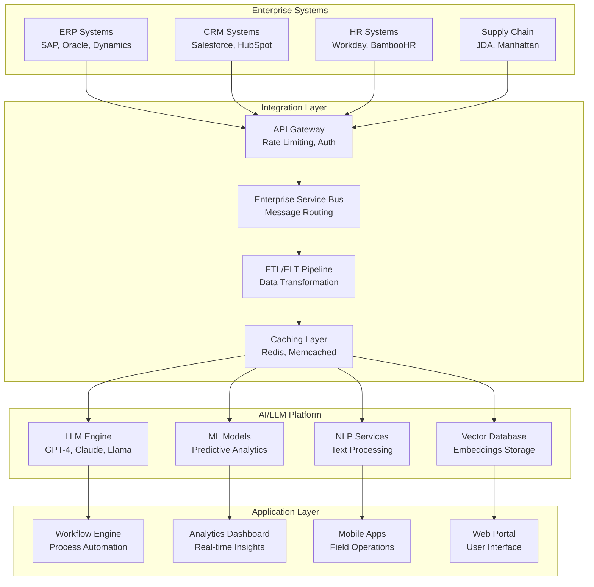
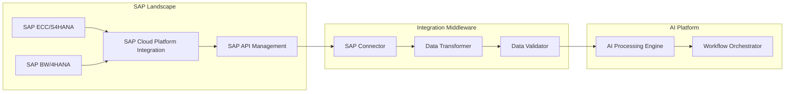
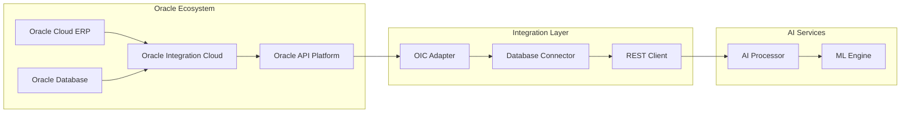
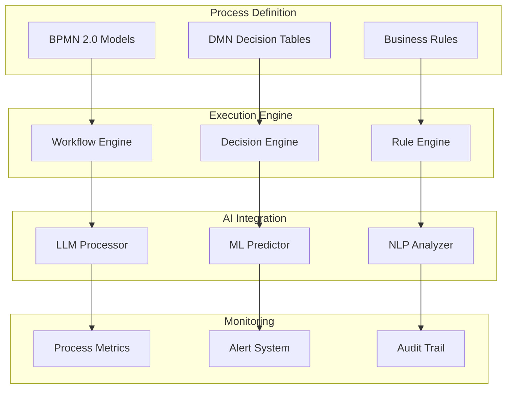

# Enterprise Integration Technical Architecture & Frameworks

## Executive Summary

This document outlines the technical architecture patterns, integration frameworks, and implementation strategies for AI/LLM-powered enterprise integration platforms. The focus is on creating scalable, secure, and maintainable solutions that can seamlessly integrate with existing enterprise systems while providing advanced AI capabilities.

## Core Architecture Principles

### 1. API-First Design
- **RESTful APIs**: Standard HTTP-based interfaces for all system interactions
- **GraphQL**: Flexible query language for complex data relationships
- **Event-Driven Architecture**: Asynchronous communication via message queues
- **Microservices**: Loosely coupled, independently deployable services

### 2. Cloud-Native Architecture
- **Containerization**: Docker containers for consistent deployment
- **Orchestration**: Kubernetes for container management and scaling
- **Serverless Functions**: AWS Lambda/Azure Functions for event processing
- **Multi-Cloud Support**: Vendor-agnostic deployment capabilities

### 3. Security-First Approach
- **Zero Trust Architecture**: Never trust, always verify principle
- **End-to-End Encryption**: Data protection in transit and at rest
- **Identity & Access Management**: Role-based access control (RBAC)
- **Compliance Framework**: SOC2, GDPR, HIPAA, SOX compliance

## Integration Framework Architecture

### High-Level System Architecture



### Component Architecture Details

#### 1. API Gateway Layer
```yaml
API Gateway Components:
  Authentication:
    - OAuth 2.0 / OpenID Connect
    - JWT token validation
    - Multi-factor authentication
  
  Rate Limiting:
    - Per-client rate limits
    - Burst protection
    - Fair usage policies
  
  Monitoring:
    - Request/response logging
    - Performance metrics
    - Error tracking
  
  Security:
    - Input validation
    - SQL injection prevention
    - XSS protection
```

#### 2. Enterprise Service Bus (ESB)
```yaml
ESB Capabilities:
  Message Routing:
    - Content-based routing
    - Header-based routing
    - Load balancing
  
  Protocol Translation:
    - HTTP to SOAP
    - REST to GraphQL
    - Message queue integration
  
  Data Transformation:
    - XML to JSON conversion
    - Schema validation
    - Data enrichment
  
  Error Handling:
    - Dead letter queues
    - Retry mechanisms
    - Circuit breakers
```

#### 3. AI/LLM Processing Engine
```yaml
LLM Integration:
  Model Management:
    - Multi-model support
    - A/B testing framework
    - Model versioning
  
  Prompt Engineering:
    - Template management
    - Context injection
    - Response validation
  
  Performance Optimization:
    - Response caching
    - Batch processing
    - Async processing
  
  Cost Management:
    - Token usage tracking
    - Cost allocation
    - Budget controls
```

## ERP Integration Patterns

### 1. SAP Integration Architecture



**SAP Integration Specifications:**
- **Protocols**: RFC, IDoc, OData, REST APIs
- **Authentication**: SAML 2.0, OAuth 2.0, X.509 certificates
- **Data Formats**: XML, JSON, EDI, CSV
- **Real-time**: Change Data Capture (CDC) via SAP Event Mesh
- **Batch Processing**: Scheduled data synchronization

### 2. Oracle Integration Architecture



**Oracle Integration Specifications:**
- **Protocols**: REST, SOAP, Database APIs, File Transfer
- **Authentication**: OAuth 2.0, Basic Auth, Token-based
- **Data Formats**: JSON, XML, CSV, Database native formats
- **Real-time**: Oracle Streaming, Event-driven architecture
- **Batch Processing**: Scheduled integrations, bulk data transfer

### 3. Microsoft Dynamics Integration Architecture

```mermaid
graph LR
    subgraph "Microsoft Ecosystem"
        DYNAMICS[Dynamics 365]
        POWER_PLATFORM[Power Platform]
        AZURE_LOGIC[Azure Logic Apps]
        AZURE_API[Azure API Management]
    end
    
    subgraph "Integration Services"
        POWER_AUTOMATE[Power Automate]
        DATAVERSE[Dataverse]
        AZURE_FUNCTIONS[Azure Functions]
    end
    
    subgraph "AI Integration"
        AZURE_AI[Azure AI Services]
        COGNITIVE[Cognitive Services]
    end
    
    DYNAMICS --> POWER_PLATFORM
    POWER_PLATFORM --> AZURE_LOGIC
    AZURE_LOGIC --> AZURE_API
    AZURE_API --> POWER_AUTOMATE
    
    POWER_AUTOMATE --> DATAVERSE
    DATAVERSE --> AZURE_FUNCTIONS
    AZURE_FUNCTIONS --> AZURE_AI
    AZURE_AI --> COGNITIVE
```



**Microsoft Integration Specifications:**
- **Protocols**: OData, REST, Graph API, Common Data Service
- **Authentication**: Azure AD, OAuth 2.0, Service Principal
- **Data Formats**: JSON, OData, XML, Power BI datasets
- **Real-time**: Power Automate triggers, Event Grid
- **Batch Processing**: Azure Data Factory, Logic Apps

## Workflow Automation Framework

### 1. Visual Workflow Designer Architecture

```yaml
Workflow Designer Components:
  Canvas Engine:
    - Drag-and-drop interface
    - Node-based workflow design
    - Real-time validation
    - Version control integration
  
  Node Types:
    - Data Input/Output nodes
    - Transformation nodes
    - Decision nodes
    - AI/LLM processing nodes
    - Integration nodes
  
  Execution Engine:
    - Parallel processing
    - Error handling
    - Retry mechanisms
    - Performance monitoring
  
  Template Library:
    - Pre-built workflows
    - Industry-specific templates
    - Best practice patterns
    - Community contributions
```

### 2. Business Process Automation Engine



## Data Architecture & Management

### 1. Data Lake Architecture

```yaml
Data Lake Components:
  Raw Data Layer:
    - Structured data (ERP, CRM)
    - Semi-structured data (logs, APIs)
    - Unstructured data (documents, emails)
  
  Processing Layer:
    - ETL/ELT pipelines
    - Data quality validation
    - Schema evolution
    - Data lineage tracking
  
  Curated Data Layer:
    - Business entities
    - Aggregated metrics
    - ML feature stores
    - Vector embeddings
  
  Access Layer:
    - SQL query engine
    - GraphQL APIs
    - Real-time streaming
    - Batch export
```

### 2. Vector Database Integration

```yaml
Vector Database Architecture:
  Embedding Generation:
    - Text embeddings (documents, emails)
    - Multimodal embeddings (images, audio)
    - Custom domain embeddings
  
  Storage & Indexing:
    - High-dimensional vectors
    - Approximate nearest neighbor (ANN)
    - Hierarchical indexing
    - Distributed storage
  
  Query Processing:
    - Semantic search
    - Similarity matching
    - Hybrid search (vector + keyword)
    - Real-time updates
  
  Integration Points:
    - LLM context retrieval
    - Recommendation engines
    - Anomaly detection
    - Knowledge graphs
```

## Security & Compliance Framework

### 1. Security Architecture

```yaml
Security Layers:
  Network Security:
    - VPC/VNet isolation
    - Firewall rules
    - DDoS protection
    - Network monitoring
  
  Application Security:
    - Input validation
    - Output encoding
    - Session management
    - CSRF protection
  
  Data Security:
    - Encryption at rest
    - Encryption in transit
    - Key management
    - Data masking
  
  Identity Security:
    - Multi-factor authentication
    - Single sign-on (SSO)
    - Privileged access management
    - Identity governance
```

### 2. Compliance Framework

```yaml
Compliance Requirements:
  SOC 2 Type II:
    - Security controls
    - Availability controls
    - Processing integrity
    - Confidentiality
    - Privacy controls
  
  GDPR Compliance:
    - Data protection by design
    - Right to be forgotten
    - Data portability
    - Consent management
  
  Industry-Specific:
    - HIPAA (Healthcare)
    - SOX (Financial)
    - FDA 21 CFR Part 11 (Pharma)
    - ISO 27001 (General)
```

## Performance & Scalability

### 1. Scalability Patterns

```yaml
Horizontal Scaling:
  Microservices:
    - Independent scaling
    - Load balancing
    - Service mesh
    - Circuit breakers
  
  Database Scaling:
    - Read replicas
    - Sharding strategies
    - Caching layers
    - Connection pooling
  
  AI/LLM Scaling:
    - Model parallelism
    - Request batching
    - Response caching
    - Edge deployment
```

### 2. Performance Optimization

```yaml
Performance Strategies:
  Caching:
    - Application-level caching
    - Database query caching
    - CDN for static content
    - LLM response caching
  
  Optimization:
    - Database indexing
    - Query optimization
    - Compression algorithms
    - Lazy loading
  
  Monitoring:
    - Real-time metrics
    - Performance profiling
    - Bottleneck identification
    - Capacity planning
```

## Implementation Considerations

### 1. Technology Stack Recommendations

```yaml
Backend Technologies:
  Languages:
    - Python (AI/ML, data processing)
    - Java/Kotlin (enterprise integration)
    - Go (high-performance services)
    - Node.js (real-time applications)
  
  Frameworks:
    - FastAPI (Python APIs)
    - Spring Boot (Java enterprise)
    - Express.js (Node.js)
    - Django (Python web)
  
  Databases:
    - PostgreSQL (relational data)
    - MongoDB (document store)
    - Redis (caching)
    - Elasticsearch (search)
    - Pinecone/Weaviate (vector DB)
```

### 2. Deployment Architecture

```yaml
Cloud Deployment:
  Container Orchestration:
    - Kubernetes clusters
    - Docker containers
    - Helm charts
    - Service mesh (Istio)
  
  CI/CD Pipeline:
    - GitOps workflows
    - Automated testing
    - Blue-green deployment
    - Canary releases
  
  Monitoring Stack:
    - Prometheus (metrics)
    - Grafana (visualization)
    - ELK Stack (logging)
    - Jaeger (tracing)
```

## Conclusion

The technical architecture for enterprise integration platforms must balance complexity, scalability, security, and maintainability. Key success factors include:

1. **Modular Design**: Microservices architecture for independent scaling
2. **API-First Approach**: Standard interfaces for all integrations
3. **Security by Design**: Built-in security and compliance features
4. **Cloud-Native**: Leveraging cloud services for scalability and reliability
5. **AI-Ready**: Architecture optimized for AI/LLM integration

This framework provides the foundation for building enterprise-grade integration platforms that can scale from startup to global enterprise deployment while maintaining security, performance, and reliability standards.

