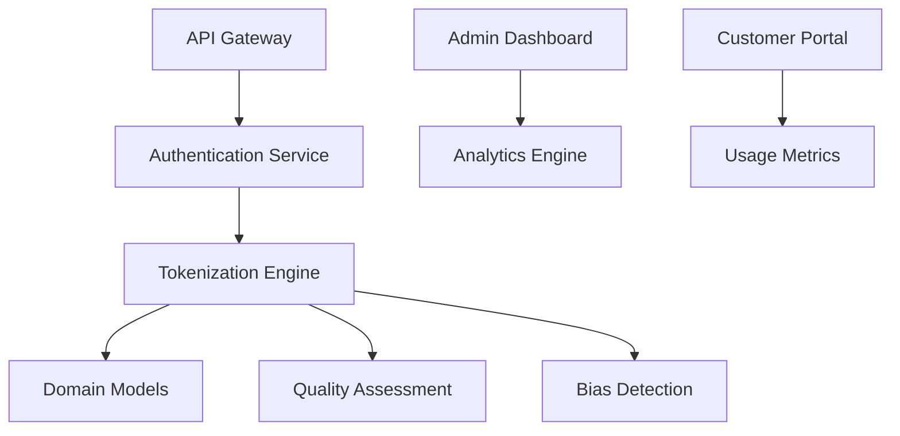

# Tokenization Innovation Implementation Roadmap

## Executive Summary

This roadmap outlines a 36-month implementation plan for building a comprehensive tokenization platform, from initial prototype to market-leading solution. The plan balances technical innovation with market validation and business development.

## Implementation Overview

### Strategic Phases
1. **Foundation Phase** (Months 1-6): Core technology and proof of concept
2. **Product Phase** (Months 6-18): Full product development and beta testing
3. **Scale Phase** (Months 18-36): Market expansion and platform optimization

### Investment Timeline
- **Phase 1**: $2-3M (Seed funding)
- **Phase 2**: $8-12M (Series A)
- **Phase 3**: $20-30M (Series B)
- **Total**: $30-45M over 36 months

## Phase 1: Foundation (Months 1-6)

### Objectives
- Validate core semantic tokenization approach
- Build minimum viable product (MVP)
- Establish technical team and infrastructure
- Secure initial funding and partnerships

### Technical Milestones

#### Month 1-2: Research and Prototyping
**Deliverables**:
- Semantic tokenization algorithm prototype
- Benchmark evaluation framework
- Initial domain vocabulary (medical)
- Technical architecture design

**Team Requirements**:
- 2 Senior NLP Engineers
- 1 ML Research Scientist
- 1 Backend Engineer
- 1 DevOps Engineer

**Key Activities**:
```python
# Core semantic tokenizer implementation
class SemanticTokenizer:
    def __init__(self, domain='general'):
        self.domain = domain
        self.semantic_model = self._load_semantic_model()
        self.vocabulary = self._load_domain_vocabulary()
    
    def tokenize(self, text, preserve_semantics=True):
        if preserve_semantics:
            return self._semantic_tokenize(text)
        else:
            return self._standard_tokenize(text)
```

#### Month 3-4: MVP Development
**Deliverables**:
- Working semantic tokenizer API
- Basic quality assessment metrics
- Medical domain specialization
- Performance benchmarking results

**Technical Stack**:
- **Backend**: Python/FastAPI, PostgreSQL
- **ML**: PyTorch, Transformers, spaCy
- **Infrastructure**: AWS/GCP, Docker, Kubernetes
- **Monitoring**: Prometheus, Grafana

**Performance Targets**:
- 15% improvement over BPE on medical texts
- <100ms latency for 1K token processing
- 99% uptime for API services

#### Month 5-6: Beta Platform
**Deliverables**:
- Beta API with authentication
- Developer documentation and SDKs
- Quality assessment dashboard
- Initial customer pilots

**Features**:
- RESTful API with rate limiting
- Multiple tokenization strategies
- Real-time quality metrics
- Basic bias detection

### Business Milestones

#### Month 1-2: Team and Funding
- Hire core technical team (5 engineers)
- Secure seed funding ($2-3M)
- Establish legal entity and IP strategy
- Define go-to-market strategy

#### Month 3-4: Market Validation
- 20+ customer interviews
- 3-5 pilot customer agreements
- Competitive analysis completion
- Pricing strategy development

#### Month 5-6: Partnership Development
- Cloud provider partnership discussions
- Academic collaboration agreements
- Open source community engagement
- Industry conference presentations

### Success Metrics
- **Technical**: 15% performance improvement demonstrated
- **Business**: 5 pilot customers signed
- **Funding**: $2-3M seed round closed
- **Team**: 8-10 team members hired

## Phase 2: Product Development (Months 6-18)

### Objectives
- Build comprehensive tokenization platform
- Expand to multiple domains and languages
- Establish market presence and customer base
- Secure Series A funding

### Technical Roadmap

#### Months 6-9: Platform Foundation
**Core Platform Features**:
- Multi-domain tokenizer support (medical, legal, financial)
- Real-time streaming tokenization
- Advanced quality assessment and bias detection
- Enterprise authentication and security

**Architecture Evolution**:


**Technical Deliverables**:
- Microservices architecture
- Multi-tenant platform
- Real-time processing pipeline
- Comprehensive monitoring and logging

#### Months 9-12: Advanced Features
**Advanced Capabilities**:
- Multi-lingual tokenization support
- Custom domain vocabulary builder
- A/B testing framework for tokenization strategies
- Advanced analytics and reporting

**ML Innovations**:
- Self-improving tokenization algorithms
- Automated domain adaptation
- Cross-lingual semantic alignment
- Contextual tokenization optimization

**Enterprise Features**:
- SSO integration (SAML, OAuth)
- Audit logging and compliance
- Custom deployment options
- SLA monitoring and reporting

#### Months 12-18: Scale and Optimization
**Scalability Improvements**:
- Global deployment infrastructure
- Edge computing support
- Caching and optimization
- Auto-scaling capabilities

**Product Expansion**:
- Tokenization marketplace
- Third-party integrations
- Mobile and edge SDKs
- Advanced visualization tools

### Business Development

#### Months 6-9: Customer Acquisition
**Sales Strategy**:
- Direct enterprise sales team (3-5 people)
- Inbound marketing and content strategy
- Conference speaking and thought leadership
- Partner channel development

**Customer Targets**:
- 10 enterprise pilot customers
- 100+ developer signups
- 3-5 reference customers
- 1-2 major partnership deals

#### Months 9-12: Market Expansion
**Go-to-Market Acceleration**:
- Series A funding ($8-12M)
- International market entry
- Vertical-specific solutions
- Channel partner program

**Revenue Targets**:
- $500K ARR by month 12
- 25+ paying customers
- 80%+ gross margins
- 150%+ net revenue retention

#### Months 12-18: Platform Growth
**Business Scaling**:
- Marketplace launch
- Professional services team
- Customer success organization
- Global sales expansion

**Strategic Initiatives**:
- Acquisition opportunities
- Strategic partnerships
- Industry standards participation
- Thought leadership establishment

### Success Metrics
- **Revenue**: $2M ARR by month 18
- **Customers**: 50+ enterprise customers
- **Performance**: 25% improvement over baseline
- **Market**: 5% market share in target segments

## Phase 3: Scale and Market Leadership (Months 18-36)

### Objectives
- Achieve market leadership in semantic tokenization
- Expand to adjacent markets and use cases
- Build sustainable competitive advantages
- Prepare for potential exit opportunities

### Technical Innovation

#### Months 18-24: AI-Powered Platform
**Next-Generation Features**:
- AI-powered tokenization optimization
- Automated domain discovery and adaptation
- Predictive quality assessment
- Self-healing and auto-optimization

**Research Initiatives**:
- Novel tokenization algorithms
- Cross-modal tokenization (text, image, audio)
- Quantum-inspired optimization
- Neuromorphic computing exploration

#### Months 24-30: Ecosystem Platform
**Platform Evolution**:
- Comprehensive tokenization ecosystem
- Third-party developer platform
- AI-powered recommendations
- Automated integration tools

**Advanced Capabilities**:
- Real-time model adaptation
- Federated learning support
- Privacy-preserving tokenization
- Blockchain-based verification

#### Months 30-36: Market Leadership
**Innovation Leadership**:
- Industry standard development
- Open source contributions
- Academic research partnerships
- Patent portfolio expansion

**Technology Moats**:
- Proprietary algorithms and models
- Extensive training data
- Network effects from ecosystem
- Continuous learning capabilities

### Business Expansion

#### Months 18-24: Market Dominance
**Market Strategy**:
- Series B funding ($20-30M)
- Aggressive customer acquisition
- Competitive displacement campaigns
- International expansion

**Product Expansion**:
- Adjacent market entry (data processing, ML ops)
- Vertical-specific complete solutions
- Acquisition integration
- Platform ecosystem development

#### Months 24-30: Global Leadership
**Global Expansion**:
- Regional offices and teams
- Local partnerships and integrations
- Regulatory compliance (GDPR, etc.)
- Cultural and linguistic adaptation

**Strategic Positioning**:
- Industry thought leadership
- Standards body participation
- Analyst recognition and awards
- Customer advisory boards

#### Months 30-36: Exit Preparation
**Strategic Options**:
- IPO preparation
- Strategic acquisition discussions
- Private equity partnerships
- Continued independence and growth

**Value Maximization**:
- Financial optimization
- Strategic asset development
- Market position strengthening
- Team and culture preservation

### Success Metrics
- **Revenue**: $50M ARR by month 36
- **Market Share**: 15-20% of addressable market
- **Valuation**: $500M-1B company valuation
- **Team**: 200+ employees globally

## Resource Requirements

### Team Growth Plan

#### Phase 1 (Months 1-6): 8-10 people
- Engineering: 5 people
- Product: 1 person
- Business: 2 people
- Operations: 1 person

#### Phase 2 (Months 6-18): 25-35 people
- Engineering: 15 people
- Product: 3 people
- Sales & Marketing: 8 people
- Operations: 5 people
- Customer Success: 4 people

#### Phase 3 (Months 18-36): 100-200 people
- Engineering: 60 people
- Product: 15 people
- Sales & Marketing: 40 people
- Operations: 25 people
- Customer Success: 20 people
- International: 40 people

### Technology Infrastructure

#### Phase 1: Basic Cloud Infrastructure
- **Compute**: 10-20 instances
- **Storage**: 1-5 TB
- **Bandwidth**: 100 Mbps
- **Cost**: $5-10K/month

#### Phase 2: Scalable Platform
- **Compute**: 100-500 instances
- **Storage**: 10-50 TB
- **Bandwidth**: 1-10 Gbps
- **Cost**: $50-100K/month

#### Phase 3: Global Infrastructure
- **Compute**: 1000+ instances
- **Storage**: 100+ TB
- **Bandwidth**: 10+ Gbps
- **Cost**: $200-500K/month

### Funding Requirements

#### Seed Round (Month 2): $2-3M
- **Use of Funds**: Team, technology, initial market validation
- **Investors**: Angel investors, early-stage VCs
- **Valuation**: $10-15M pre-money

#### Series A (Month 9): $8-12M
- **Use of Funds**: Product development, market expansion
- **Investors**: Tier 1 VCs, strategic investors
- **Valuation**: $40-60M pre-money

#### Series B (Month 18): $20-30M
- **Use of Funds**: Global expansion, market leadership
- **Investors**: Growth VCs, strategic partners
- **Valuation**: $150-250M pre-money

## Risk Mitigation

### Technical Risks
- **Algorithm Performance**: Extensive benchmarking and validation
- **Scalability**: Cloud-native architecture and load testing
- **Integration**: Standard APIs and comprehensive documentation

### Market Risks
- **Competition**: Continuous innovation and customer focus
- **Adoption**: Strong ROI demonstration and change management
- **Technology Shifts**: R&D investment and technology monitoring

### Business Risks
- **Funding**: Multiple funding sources and revenue generation
- **Talent**: Competitive compensation and strong culture
- **Execution**: Experienced leadership and proven processes

## Conclusion

This implementation roadmap provides a comprehensive path to building a market-leading tokenization platform. Success requires:

1. **Technical Excellence**: Delivering measurable improvements over existing solutions
2. **Market Focus**: Targeting high-value use cases and customers
3. **Execution Discipline**: Meeting milestones and managing resources effectively
4. **Strategic Vision**: Building sustainable competitive advantages

The 36-month timeline balances speed to market with thorough development, positioning the company for long-term success in the rapidly growing LLM ecosystem.

