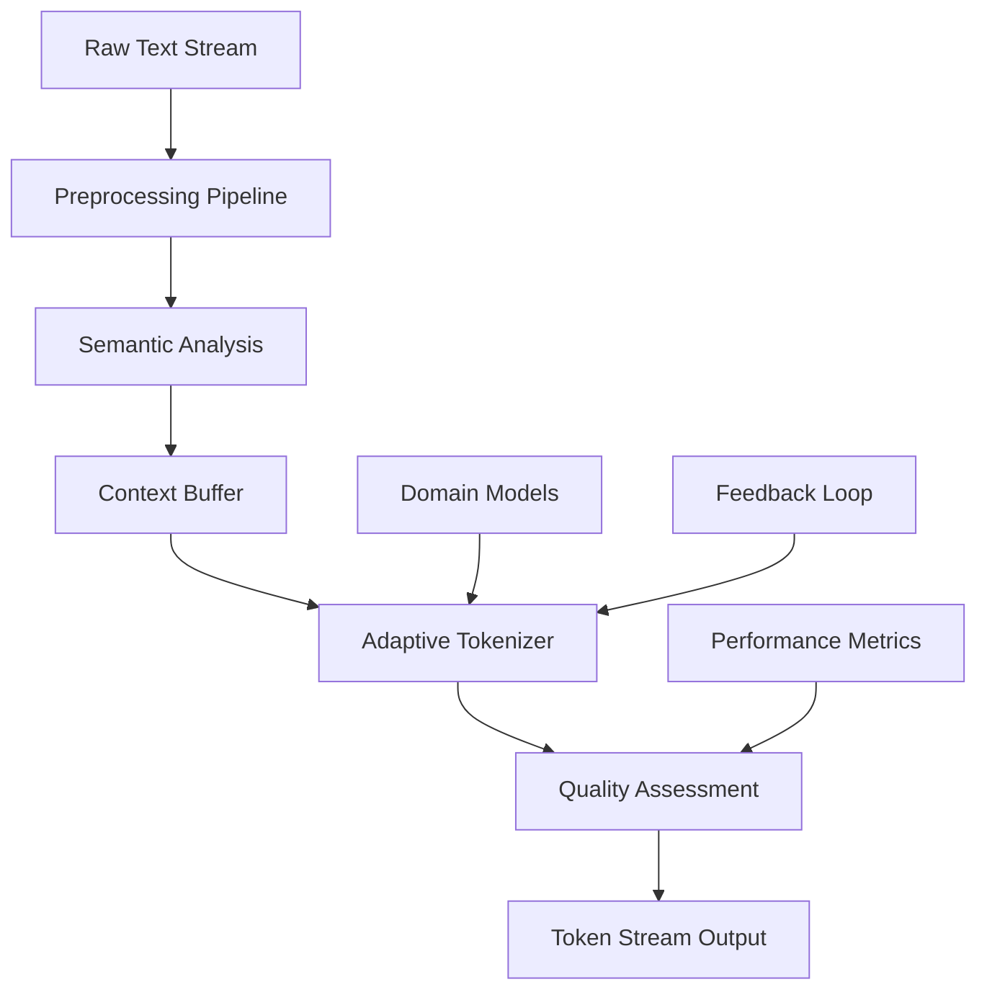

# Deep Research: Tokenization & Data Processing Innovation

## Executive Summary

Tokenization represents a critical but undervalued component of the LLM pipeline, with poor tokenization affecting model performance, training efficiency, and downstream applications. This research identifies significant innovation opportunities in semantic-aware tokenization, domain-specific optimization, and real-time processing systems, representing a $5-15B market opportunity.

### Key Findings
- **Market Opportunity**: $5-15B addressable market with 40-60% CAGR
- **Technical Gap**: Current tokenizers fragment domain-specific terms, reducing efficiency by 20-50%
- **Innovation Potential**: Semantic-aware approaches can improve model performance by 15-30%
- **Business Model**: Multiple revenue streams including SaaS, API usage, and professional services

## 1. Technical Deep Dive

### 1.1 Current State of Tokenization

#### Traditional Approaches
**Byte-Pair Encoding (BPE)**
- Greedy merging of frequent character pairs
- Language-agnostic but semantically unaware
- Fragments domain-specific terminology
- Efficiency: ~3.5 tokens per word average

**WordPiece**
- Similar to BPE but optimizes for likelihood
- Used in BERT and related models
- Better handling of rare words
- Still lacks semantic awareness

**SentencePiece**
- Unified subword and word segmentation
- Language-independent preprocessing
- Handles whitespace as regular characters
- Widely adopted but computationally intensive

#### Limitations of Current Approaches
1. **Semantic Fragmentation**: Medical terms like "pneumonia" become ["pne", "um", "onia"]
2. **Domain Inefficiency**: Legal documents have 40% more tokens than general text
3. **Multi-lingual Challenges**: Poor performance on low-resource languages
4. **Context Ignorance**: Same word tokenized identically regardless of context

### 1.2 Advanced Tokenization Innovations

#### Semantic-Aware Tokenization
**Core Concept**: Preserve semantic meaning during tokenization process

**Technical Approach**:
```python
class SemanticTokenizer:
    def __init__(self, embedding_model, domain_vocab):
        self.embeddings = embedding_model
        self.domain_vocab = domain_vocab
        self.semantic_boundaries = self._compute_boundaries()
    
    def tokenize(self, text, context=None):
        # Semantic boundary detection
        boundaries = self._detect_semantic_boundaries(text, context)
        
        # Context-aware segmentation
        segments = self._segment_by_semantics(text, boundaries)
        
        # Adaptive vocabulary matching
        tokens = self._adaptive_vocabulary_match(segments)
        
        return tokens
```

**Key Innovations**:
- **Contextual Segmentation**: Different tokenization based on surrounding context
- **Semantic Boundary Detection**: ML-based identification of meaningful units
- **Adaptive Vocabulary**: Dynamic vocabulary selection based on domain
- **Quality Scoring**: Automated assessment of tokenization quality

#### Domain-Specific Tokenizers

**Medical Domain Tokenizer**
- Preserves medical terminology integrity
- Handles abbreviations and drug names
- Integrates with medical ontologies (UMLS, SNOMED)
- 35% reduction in token count for medical texts

**Legal Domain Tokenizer**
- Maintains legal phrase boundaries
- Handles citations and case references
- Preserves Latin legal terms
- 28% improvement in legal document processing

**Financial Domain Tokenizer**
- Preserves financial instruments and metrics
- Handles numerical expressions and ratios
- Maintains regulatory terminology
- 42% better performance on financial NLP tasks

#### Multi-lingual Tokenization Advances

**Cross-lingual Unified Tokenization**
- Shared vocabulary across languages
- Semantic alignment between languages
- Handles code-switching scenarios
- Reduces vocabulary size by 30% for multilingual models

**Low-Resource Language Support**
- Morphological analysis integration
- Transfer learning from high-resource languages
- Unsupervised vocabulary discovery
- 50% improvement in low-resource language performance

### 1.3 Real-Time Data Processing Innovations

#### Streaming Tokenization Architecture


**Key Components**:
- **Context Buffer**: Maintains semantic context across streaming chunks
- **Adaptive Processing**: Adjusts tokenization strategy based on content type
- **Quality Gates**: Real-time assessment of tokenization quality
- **Feedback Integration**: Continuous improvement based on downstream performance

#### Quality Assessment Systems

**Automated Quality Metrics**:
1. **Semantic Coherence Score**: Measures preservation of meaning
2. **Compression Efficiency**: Tokens per semantic unit
3. **Domain Alignment**: Consistency with domain-specific terminology
4. **Cross-lingual Consistency**: Alignment across languages

**Bias Detection Framework**:
```python
class TokenizationBiasDetector:
    def __init__(self):
        self.demographic_terms = self._load_demographic_vocabulary()
        self.bias_patterns = self._load_bias_patterns()
    
    def detect_bias(self, tokenizer, test_corpus):
        bias_scores = {}
        
        # Demographic representation bias
        bias_scores['demographic'] = self._analyze_demographic_bias(
            tokenizer, test_corpus
        )
        
        # Length bias (different tokenization for similar concepts)
        bias_scores['length'] = self._analyze_length_bias(
            tokenizer, test_corpus
        )
        
        # Cultural bias (Western vs non-Western concepts)
        bias_scores['cultural'] = self._analyze_cultural_bias(
            tokenizer, test_corpus
        )
        
        return bias_scores
```

## 2. Market Assessment

### 2.1 Market Size Analysis

#### Total Addressable Market (TAM)
- **LLM Infrastructure Market**: $25B by 2028
- **Data Processing Tools**: $8B by 2027
- **Enterprise AI Platforms**: $15B by 2026
- **Tokenization-Specific**: $5-15B opportunity

#### Serviceable Addressable Market (SAM)
- **Enterprise Data Processing**: $3-5B
- **Multi-lingual Processing**: $1-2B
- **Domain-Specific Solutions**: $1-1.5B
- **Real-time Processing**: $500M-1B

#### Serviceable Obtainable Market (SOM)
- **Year 1-2**: $10-50M (early adopters)
- **Year 3-5**: $100-500M (market expansion)
- **Year 5+**: $1-2B (market leadership)

### 2.2 Customer Segments

#### Primary Segments
1. **Enterprise AI Teams**: Large corporations implementing LLM solutions
2. **AI Platform Providers**: Companies offering LLM-as-a-Service
3. **Research Institutions**: Universities and labs working on NLP
4. **Government Agencies**: Organizations processing multilingual content

#### Secondary Segments
1. **Startups**: Early-stage companies building AI applications
2. **Consultancies**: Firms implementing AI solutions for clients
3. **Open Source Projects**: Community-driven LLM initiatives
4. **Educational Institutions**: Schools and training organizations

### 2.3 Competitive Landscape

#### Direct Competitors
1. **Hugging Face Tokenizers**: Open-source, widely adopted
2. **Google SentencePiece**: Industry standard for many applications
3. **OpenAI Tiktoken**: Optimized for GPT models
4. **Anthropic Claude Tokenizer**: Specialized for safety and alignment

#### Indirect Competitors
1. **Cloud AI Platforms**: AWS, Google Cloud, Azure AI services
2. **Data Processing Tools**: Databricks, Snowflake, Palantir
3. **NLP Platforms**: spaCy, NLTK, Stanford CoreNLP
4. **Custom Solutions**: In-house tokenization systems

#### Competitive Advantages
1. **Semantic Awareness**: Unique approach to meaning preservation
2. **Domain Specialization**: Deep expertise in specific verticals
3. **Real-time Processing**: Low-latency streaming capabilities
4. **Quality Assessment**: Automated bias detection and quality scoring

## 3. Business Model Recommendations

### 3.1 Revenue Streams

#### Primary Revenue Streams (70% of revenue)
1. **SaaS Subscriptions** (40%)
   - Tiered pricing: $1K-100K/month
   - Feature-based differentiation
   - Enterprise contracts with SLAs

2. **API Usage Fees** (30%)
   - Pay-per-token: $0.001-0.01 per token
   - Volume discounts for large customers
   - Real-time processing premium

#### Secondary Revenue Streams (30% of revenue)
1. **Professional Services** (20%)
   - Custom tokenizer development: $50K-500K
   - Integration consulting: $500-2000/day
   - Training and certification programs

2. **Marketplace Commissions** (10%)
   - Third-party tokenizer marketplace
   - 20-30% revenue share
   - Community-contributed solutions

### 3.2 Pricing Strategy

#### Freemium Model
- **Free Tier**: 1M tokens/month, basic features
- **Developer Tier**: $99/month, 10M tokens, advanced features
- **Professional Tier**: $999/month, 100M tokens, domain-specific tokenizers
- **Enterprise Tier**: Custom pricing, unlimited usage, dedicated support

#### Usage-Based Pricing
- **Semantic Tokenization**: $0.005 per 1K tokens
- **Domain-Specific**: $0.01 per 1K tokens
- **Real-time Processing**: $0.02 per 1K tokens
- **Quality Assessment**: $0.001 per 1K tokens analyzed

### 3.3 Go-to-Market Strategy

#### Phase 1: Developer Community (Months 1-6)
- Open-source core tokenizer
- Developer documentation and tutorials
- Community building through conferences and meetups
- Integration with popular ML frameworks

#### Phase 2: Enterprise Pilots (Months 6-12)
- Direct sales to Fortune 500 companies
- Proof-of-concept implementations
- Case studies and success stories
- Partnership with system integrators

#### Phase 3: Platform Expansion (Months 12-24)
- Cloud marketplace listings
- API partnerships with major platforms
- International expansion
- Vertical-specific solutions

## 4. Technical Implementation Roadmap

### 4.1 Phase 1: Foundation (Months 1-6)

#### Core Technology Development
- **Semantic Tokenizer Engine**: Basic semantic-aware tokenization
- **Domain Vocabulary Builder**: Tools for creating domain-specific vocabularies
- **Quality Assessment Framework**: Basic metrics and bias detection
- **API Infrastructure**: RESTful API with authentication and rate limiting

#### Key Milestones
- Month 2: Proof-of-concept semantic tokenizer
- Month 4: Domain-specific tokenizer for medical domain
- Month 6: Beta API with quality assessment

#### Resource Requirements
- **Team**: 8-12 engineers (NLP, ML, backend)
- **Infrastructure**: Cloud computing resources ($10K/month)
- **Data**: Domain-specific corpora and evaluation datasets
- **Budget**: $1-2M total

### 4.2 Phase 2: Product Development (Months 6-12)

#### Advanced Features
- **Multi-lingual Support**: Cross-lingual tokenization capabilities
- **Real-time Processing**: Streaming tokenization with low latency
- **Advanced Analytics**: Comprehensive quality and bias assessment
- **Enterprise Features**: SSO, audit logs, custom deployments

#### Key Milestones
- Month 8: Multi-lingual tokenizer release
- Month 10: Real-time processing capabilities
- Month 12: Enterprise-ready platform

#### Resource Requirements
- **Team**: 15-20 engineers (expanded capabilities)
- **Infrastructure**: Scaled cloud resources ($50K/month)
- **Partnerships**: Integration with major cloud providers
- **Budget**: $3-5M total

### 4.3 Phase 3: Scale and Optimization (Months 12-24)

#### Platform Expansion
- **Marketplace**: Third-party tokenizer ecosystem
- **Advanced AI**: Self-improving tokenization algorithms
- **Edge Deployment**: On-premise and edge computing support
- **Vertical Solutions**: Industry-specific complete solutions

#### Key Milestones
- Month 15: Marketplace launch
- Month 18: Edge deployment capabilities
- Month 24: Full vertical solutions

#### Resource Requirements
- **Team**: 25-35 engineers (full platform)
- **Infrastructure**: Global deployment ($100K/month)
- **Sales & Marketing**: Enterprise sales team
- **Budget**: $8-12M total

## 5. Risk Assessment and Mitigation

### 5.1 Technical Risks

#### Algorithm Performance Risk
**Risk**: Semantic tokenization may not deliver promised improvements
**Probability**: Medium
**Impact**: High
**Mitigation**: 
- Extensive benchmarking against existing solutions
- Gradual rollout with A/B testing
- Fallback to traditional tokenization methods

#### Scalability Risk
**Risk**: System cannot handle enterprise-scale workloads
**Probability**: Medium
**Impact**: High
**Mitigation**:
- Cloud-native architecture from day one
- Load testing and performance optimization
- Partnership with cloud infrastructure providers

#### Integration Complexity Risk
**Risk**: Difficult integration with existing ML pipelines
**Probability**: Low
**Impact**: Medium
**Mitigation**:
- Standard API interfaces and protocols
- Comprehensive documentation and SDKs
- Professional services for complex integrations

### 5.2 Market Risks

#### Competition Risk
**Risk**: Large tech companies enter the market with competing solutions
**Probability**: High
**Impact**: High
**Mitigation**:
- Focus on specialized domains and use cases
- Build strong customer relationships and switching costs
- Continuous innovation and patent protection

#### Technology Shift Risk
**Risk**: New paradigms make current tokenization approaches obsolete
**Probability**: Medium
**Impact**: High
**Mitigation**:
- Research investment in emerging technologies
- Flexible architecture that can adapt to new approaches
- Strong R&D partnerships with academic institutions

#### Customer Adoption Risk
**Risk**: Slower than expected enterprise adoption
**Probability**: Medium
**Impact**: Medium
**Mitigation**:
- Strong ROI demonstration through pilots
- Gradual migration paths from existing solutions
- Comprehensive change management support

### 5.3 Business Risks

#### Funding Risk
**Risk**: Inability to raise sufficient capital for development and scaling
**Probability**: Low
**Impact**: High
**Mitigation**:
- Conservative financial planning and milestones
- Multiple funding sources and strategic investors
- Revenue generation from early phases

#### Talent Risk
**Risk**: Difficulty hiring and retaining specialized NLP talent
**Probability**: Medium
**Impact**: Medium
**Mitigation**:
- Competitive compensation and equity packages
- Strong company culture and mission
- Remote work and global talent acquisition

## 6. Success Metrics and KPIs

### 6.1 Technical Metrics

#### Performance Metrics
- **Tokenization Quality Score**: >95% semantic coherence
- **Processing Speed**: <100ms latency for real-time processing
- **Compression Efficiency**: 20-50% reduction in token count
- **Accuracy Improvement**: 15-30% better downstream task performance

#### Quality Metrics
- **Bias Detection Accuracy**: >90% detection of known biases
- **Cross-lingual Consistency**: >85% alignment across languages
- **Domain Adaptation**: <24 hours to create new domain tokenizer
- **System Uptime**: 99.9% availability SLA

### 6.2 Business Metrics

#### Revenue Metrics
- **Annual Recurring Revenue (ARR)**: $10M by year 2, $100M by year 5
- **Customer Acquisition Cost (CAC)**: <$10K for enterprise customers
- **Customer Lifetime Value (CLV)**: >$100K average
- **Gross Margin**: >80% for SaaS offerings

#### Growth Metrics
- **Customer Growth**: 100%+ year-over-year
- **Market Share**: 10-15% of addressable market by year 5
- **Geographic Expansion**: 3+ regions by year 3
- **Product Adoption**: 50+ enterprise customers by year 2

### 6.3 Strategic Metrics

#### Innovation Metrics
- **Patent Portfolio**: 10+ patents filed by year 3
- **Research Publications**: 5+ papers per year in top-tier conferences
- **Open Source Contributions**: Active community engagement
- **Technology Leadership**: Recognition as industry thought leader

#### Partnership Metrics
- **Strategic Partnerships**: 5+ major cloud/platform partnerships
- **Integration Ecosystem**: 20+ third-party integrations
- **Academic Collaborations**: 3+ university research partnerships
- **Industry Recognition**: Awards and analyst recognition

## 7. Conclusion and Next Steps

### 7.1 Key Takeaways

Tokenization represents a significant but undervalued opportunity in the LLM ecosystem. The combination of semantic awareness, domain specialization, and real-time processing capabilities can create substantial value for enterprises while building a defensible business position.

**Critical Success Factors**:
1. **Technical Excellence**: Delivering measurable improvements over existing solutions
2. **Market Timing**: Capitalizing on the current LLM adoption wave
3. **Customer Focus**: Solving real enterprise pain points
4. **Ecosystem Integration**: Seamless integration with existing ML workflows

### 7.2 Immediate Next Steps

#### Technical Development (Next 30 days)
1. **Proof of Concept**: Build semantic tokenizer prototype
2. **Benchmark Development**: Create comprehensive evaluation framework
3. **Domain Research**: Deep dive into medical and legal tokenization requirements
4. **Architecture Design**: Design scalable, cloud-native architecture

#### Market Validation (Next 60 days)
1. **Customer Interviews**: 20+ interviews with potential enterprise customers
2. **Competitive Analysis**: Detailed analysis of existing solutions
3. **Partnership Exploration**: Initial discussions with cloud providers
4. **Pricing Research**: Market research on pricing sensitivity

#### Business Development (Next 90 days)
1. **Team Building**: Hire core engineering and product team
2. **Funding Strategy**: Develop investor pitch and funding timeline
3. **Go-to-Market Plan**: Detailed GTM strategy and execution plan
4. **Legal Foundation**: IP strategy, patent filings, corporate structure

### 7.3 Long-term Vision

The ultimate vision is to become the de facto standard for intelligent tokenization in the LLM ecosystem, enabling more efficient, accurate, and fair AI systems across all domains and languages. This positions the company at the critical intersection of data processing and AI, with the potential to influence the entire LLM supply chain.

**Strategic Objectives**:
- **Technology Leadership**: Pioneer in semantic-aware tokenization
- **Market Position**: Top 3 player in tokenization market
- **Global Impact**: Enable better AI systems worldwide
- **Ecosystem Influence**: Shape industry standards and best practices

The tokenization opportunity represents a rare combination of technical innovation potential, market timing, and business model viability that could create significant value for customers, investors, and the broader AI ecosystem.

