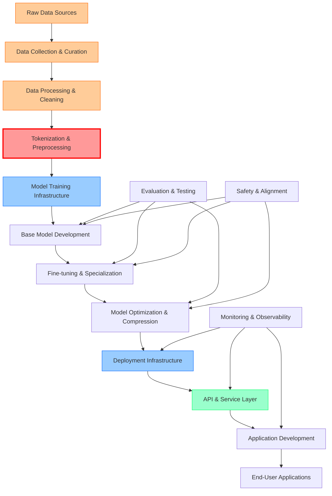

# LLM Supply Chain Analysis

## Executive Summary

The LLM/ChatGPT/Agents supply chain represents a complex ecosystem with multiple layers of technology, data, and services. This analysis maps the entire supply chain from raw data to end-user applications, identifying key components, dependencies, and innovation opportunities.

## Supply Chain Overview

## Supply Chain Components

### 1. Data Layer
- **Raw Data Sources**: Web scraping, datasets, proprietary content
- **Data Collection & Curation**: Automated and manual data gathering
- **Data Processing & Cleaning**: Quality control, deduplication, filtering
- **Tokenization & Preprocessing**: Text tokenization, data formatting

### 2. Model Development Layer
- **Training Infrastructure**: Compute clusters, distributed training
- **Base Model Development**: Foundation model training
- **Fine-tuning & Specialization**: Domain-specific adaptation
- **Model Optimization**: Quantization, pruning, distillation

### 3. Deployment Layer
- **Deployment Infrastructure**: Cloud platforms, edge deployment
- **API & Service Layer**: Model serving, API management
- **Application Development**: SDKs, frameworks, tools
- **End-User Applications**: Chat interfaces, agents, integrations

### 4. Cross-Cutting Services
- **Evaluation & Testing**: Benchmarking, quality assessment
- **Safety & Alignment**: Content filtering, bias detection
- **Monitoring & Observability**: Performance tracking, usage analytics

## Key Dependencies and Bottlenecks

### Critical Dependencies
1. **High-Quality Training Data**: Foundation of model performance
2. **Compute Infrastructure**: Massive computational requirements
3. **Tokenization Quality**: Affects entire downstream pipeline
4. **Model Serving Infrastructure**: Scalability and latency requirements

### Major Bottlenecks
1. **Data Quality and Curation**: Manual effort, inconsistent standards
2. **Tokenization Inefficiencies**: Poor tokenization affects model performance
3. **Training Costs**: Extremely expensive model training
4. **Inference Optimization**: Balancing quality and speed
5. **Safety and Alignment**: Ensuring responsible AI deployment

## Innovation Opportunities by Component

### Data Layer Innovations
- **Synthetic Data Generation**: Reducing dependence on real data
- **Automated Data Curation**: AI-powered quality assessment
- **Privacy-Preserving Data**: Federated learning, differential privacy
- **Real-time Data Integration**: Streaming data processing

### Tokenization Innovations (HIGHLIGHTED)
- **Semantic-Aware Tokenization**: Context-preserving tokenization
- **Domain-Specific Tokenizers**: Specialized for medical, legal, financial
- **Multi-modal Tokenization**: Unified text, image, audio tokenization
- **Adaptive Tokenization**: Dynamic tokenization based on content

### Model Development Innovations
- **Efficient Training Methods**: Reducing computational requirements
- **Automated Model Architecture**: Neural architecture search
- **Continuous Learning**: Online learning and adaptation
- **Multi-modal Foundation Models**: Unified cross-modal understanding

### Deployment Innovations
- **Edge AI Optimization**: Running LLMs on mobile devices
- **Serverless Model Serving**: Auto-scaling inference infrastructure
- **Model Compression**: Maintaining quality with smaller models
- **Distributed Inference**: Splitting models across devices

## Market Size Analysis

### Total Addressable Market (TAM)
- **LLM Infrastructure Market**: $15-25B by 2028
- **AI Training Infrastructure**: $8-12B by 2027
- **Model Serving & APIs**: $5-10B by 2026
- **AI Application Development**: $20-35B by 2028

### Tokenization Market Opportunity
- **Current Market**: $500M-1B (estimated)
- **Projected Growth**: 40-60% CAGR
- **Addressable Segments**:
  - Enterprise data processing: $2-3B
  - Multi-lingual processing: $1-2B
  - Domain-specific tokenization: $1-1.5B
  - Real-time processing: $500M-1B

## Strategic Recommendations

### High-Priority Opportunities
1. **Advanced Tokenization Platform**: Semantic-aware, domain-specific tokenization
2. **Automated Data Curation**: AI-powered data quality and bias detection
3. **Edge AI Optimization**: Efficient model deployment for mobile/edge
4. **Multi-modal Foundation Models**: Unified cross-modal understanding

### Investment Priorities
1. **Research & Development**: 40% - Core technology innovation
2. **Market Development**: 30% - Customer acquisition and partnerships
3. **Infrastructure**: 20% - Scalable platform development
4. **Talent Acquisition**: 10% - Key technical and business hires

### Partnership Strategies
- **Cloud Providers**: Infrastructure and distribution partnerships
- **Enterprise Software**: Integration with existing enterprise tools
- **Academic Institutions**: Research collaboration and talent pipeline
- **Open Source Communities**: Community building and adoption

## Next Steps

1. **Deep Dive Research**: Conduct detailed analysis of priority areas
2. **Market Validation**: Engage with potential customers and partners
3. **Technical Prototyping**: Build proof-of-concept implementations
4. **Business Model Development**: Detailed revenue and pricing strategies
5. **Go-to-Market Planning**: Customer acquisition and distribution strategies

