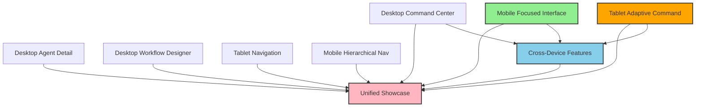

# Week 2: Task Decomposition Meta-Workflow → UI Mockup Project

**Pattern**: [Task Decomposition Meta-Workflow](../docs/src/content/docs/workflows/meta-patterns/task-decomposition-and-recomposition-meta-workflow.md)  
**Target Project**: Multi-Agent Management UI/UX Mockups  
**Timeline**: May 29 - June 5, 2025  
**Status**: 🔴 Scheduled

## Application Overview

Applying the Task Decomposition Meta-Workflow to the 8 parallel UI mockup sub-issues currently in progress. This will demonstrate effective component decomposition, parallel execution, and systematic recomposition strategies.

## Target Components

### Desktop Components
1. **HNTSMN-669**: Desktop Command Center View Implementation - **In Progress** 🟡
2. **HNTSMN-670**: Desktop Agent Detail View Implementation - **In Progress** 🟡  
3. **HNTSMN-671**: Desktop Workflow Designer Implementation - **In Progress** 🟡

### Tablet Components
4. **HNTSMN-672**: Tablet Adaptive Command Center Implementation - **In Review** 🟠
5. **HNTSMN-673**: Tablet Navigation Patterns Implementation - **In Progress** 🟡

### Mobile Components
6. **HNTSMN-674**: Mobile Focused Interface Implementation - **In Progress** 🟡 (May be completed)
7. **HNTSMN-675**: Mobile Hierarchical Navigation Implementation - **In Progress** 🟡

### Cross-Platform & Integration
8. **HNTSMN-676**: Cross-Device Features Implementation - **In Progress** 🟡
9. **HNTSMN-677**: Unified Showcase Page Implementation - **In Progress** 🟡

## Task Decomposition Meta-Workflow Implementation

### Task Analysis ✅
- [x] Identify the overall objective and success criteria
- [x] Map the problem space to understand scope and boundaries
- [x] Identify natural divisions and potential parallel work streams
- [x] Analyze dependencies between components
- [x] Create a high-level timeline with key milestones

### Decomposition Strategy 🟡
- [x] Define clear boundaries between components
- [x] Establish interfaces and communication protocols
- [x] Create consistent templates and documentation standards
- [ ] Develop clear success criteria for each component
- [ ] Document the decomposition rationale

### Component Distribution ✅
- [x] Assign components based on expertise and availability
- [x] Provide context and background for each component
- [x] Establish timelines and checkpoints
- [x] Create communication channels for cross-component issues
- [x] Ensure all agents understand their responsibilities

### Progress Synchronization 🟡
- [x] Implement regular status updates and check-ins
- [ ] Track dependencies and blockers
- [ ] Adjust timelines and priorities as needed
- [ ] Facilitate cross-component communication
- [ ] Address integration challenges proactively

### Recomposition Strategy 🔴
- [ ] Define the integration approach before completion
- [ ] Establish quality gates for component acceptance
- [ ] Create a unified structure for the final deliverable
- [ ] Identify gaps and overlaps between components
- [ ] Plan for sequential vs. parallel integration

### Synthesis and Validation 🔴
- [ ] Integrate components according to the recomposition strategy
- [ ] Resolve conflicts and inconsistencies
- [ ] Validate the integrated result against original objectives
- [ ] Refine and polish the final deliverable
- [ ] Document integration decisions and rationales

## Dependency Analysis

### Critical Path Analysis
1. **Mobile Focused Interface** (HNTSMN-674) → Cross-Device Features
2. **Cross-Device Features** (HNTSMN-676) → Unified Showcase
3. **All Components** → Unified Showcase (final integration)

### Parallel Work Streams
- **Desktop Components**: Can be developed in parallel
- **Tablet Components**: Can be developed in parallel
- **Mobile Components**: Can be developed in parallel
- **Integration Components**: Depend on completion of device-specific components

## Metrics Tracking

### Decomposition Quality Metrics
- **Component Boundary Clarity**: TBD (0-10 scale)
- **Interface Definition Completeness**: TBD (% of interfaces defined)
- **Dependency Mapping Accuracy**: TBD (0-10 scale)
- **Scope Definition Precision**: TBD (0-10 scale)

### Parallel Efficiency Metrics
- **Work Stream Utilization**: 8/8 active (100%)
- **Blocking Dependencies**: TBD (count)
- **Resource Contention**: TBD (0-10 scale)
- **Parallel Execution Effectiveness**: TBD (0-10 scale)

### Integration Success Metrics
- **Component Compatibility**: TBD (% compatible)
- **Integration Conflicts**: TBD (count)
- **Recomposition Smoothness**: TBD (0-10 scale)
- **Final Quality Score**: TBD (0-10 scale)

### Quality Consistency Metrics
- **Design System Adherence**: TBD (% compliance)
- **Code Quality Consistency**: TBD (0-10 scale)
- **Documentation Standardization**: TBD (% standardized)
- **Testing Coverage Uniformity**: TBD (% coverage variance)

## Integration Planning

### Phase 1: Component Completion (Week 2)
- **Target**: Complete all 8 component implementations
- **Success Criteria**: All components pass individual quality gates
- **Risk Mitigation**: Daily progress monitoring, blocker escalation

### Phase 2: Cross-Device Integration (Week 2-3)
- **Target**: Implement Cross-Device Features
- **Dependencies**: Mobile Focused Interface, Desktop Command Center, Tablet Adaptive Command
- **Success Criteria**: Seamless cross-device functionality

### Phase 3: Unified Showcase Integration (Week 3)
- **Target**: Integrate all components into Unified Showcase
- **Dependencies**: All components completed
- **Success Criteria**: Functional showcase with all components

## Daily Progress Tracking

### Current Status (2025-05-22)
- **In Progress**: 7 components
- **In Review**: 1 component (HNTSMN-672)
- **Completed**: 0 components (pending verification of HNTSMN-674)
- **Blocked**: 0 components

### Progress Velocity
- **Expected Completion Rate**: 1-2 components per day
- **Current Velocity**: TBD
- **Projected Completion**: End of Week 2

## Risk Management

### Identified Risks
1. **Integration Complexity**: Risk of complex integration challenges
   - **Mitigation**: Early integration testing, clear interface definitions
2. **Component Interdependencies**: Risk of unexpected dependencies
   - **Mitigation**: Regular dependency review, flexible scheduling
3. **Quality Inconsistency**: Risk of varying quality across components
   - **Mitigation**: Standardized quality gates, peer review process
4. **Resource Bottlenecks**: Risk of resource contention
   - **Mitigation**: Load balancing, priority management

### Mitigation Strategies
- Daily standup meetings for coordination
- Shared component library for consistency
- Automated testing for quality assurance
- Flexible resource allocation

## Success Criteria

### Component Level
- All 8 components completed and tested
- Quality gates passed for each component
- Documentation complete for each component
- Integration interfaces clearly defined

### Project Level
- Unified Showcase successfully integrates all components
- Cross-device functionality working as designed
- Overall project timeline met
- Stakeholder acceptance achieved

## Week 2 Review Preparation

### Review Checklist
- [ ] Task Decomposition Meta-Workflow applied to UI mockup project
- [ ] Component integration and quality consistency measured
- [ ] Decomposition strategy effectiveness evaluated
- [ ] Next week's Structured Feedback application prepared

### Expected Outcomes
- 8 completed UI components
- Functional Unified Showcase
- Proven decomposition and recomposition strategy
- Pattern effectiveness measurement baseline

